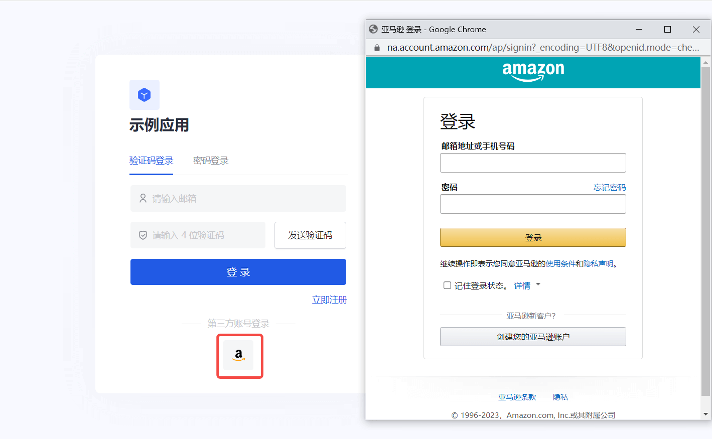
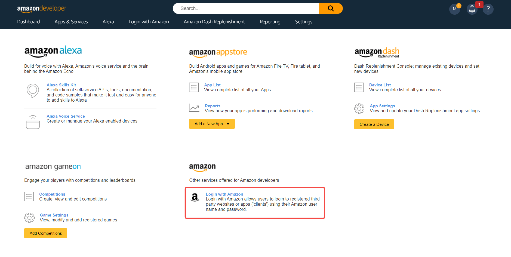
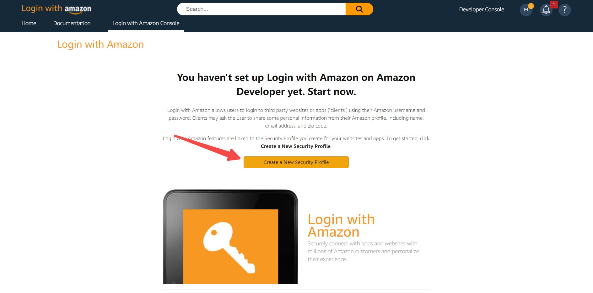
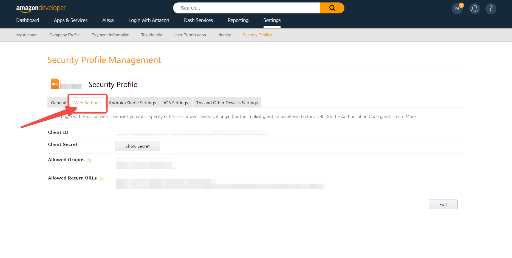
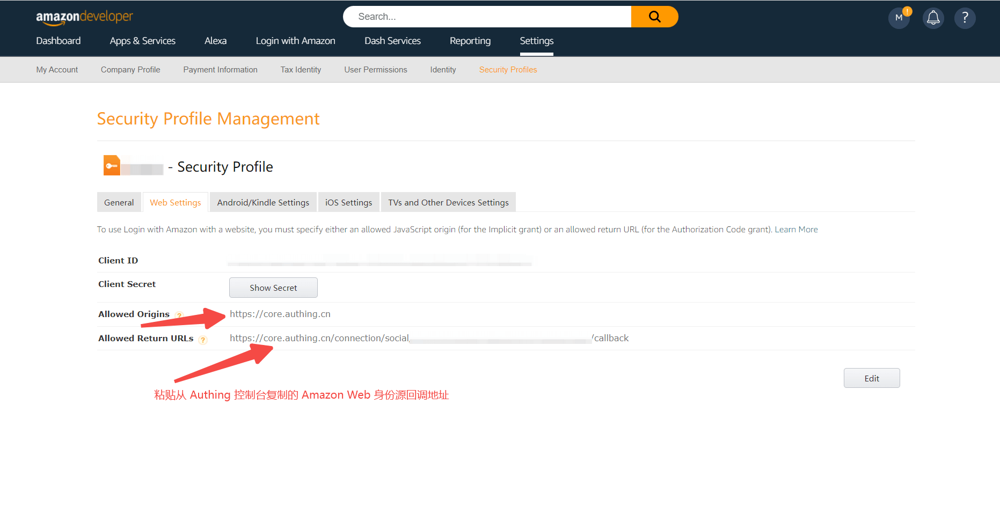
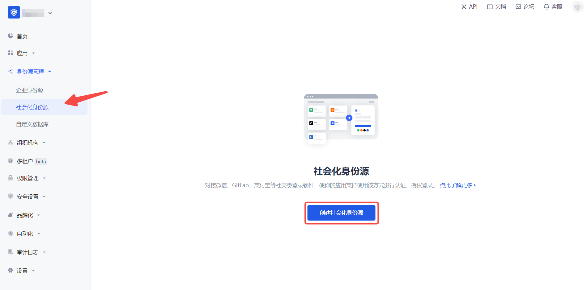
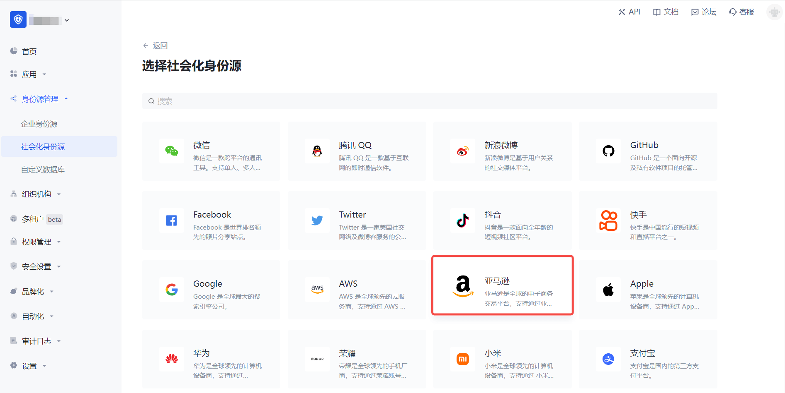
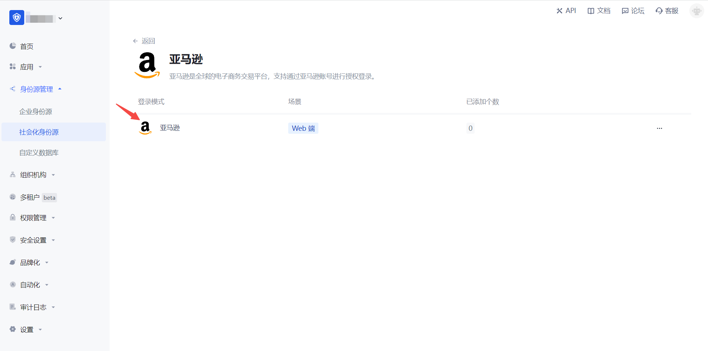
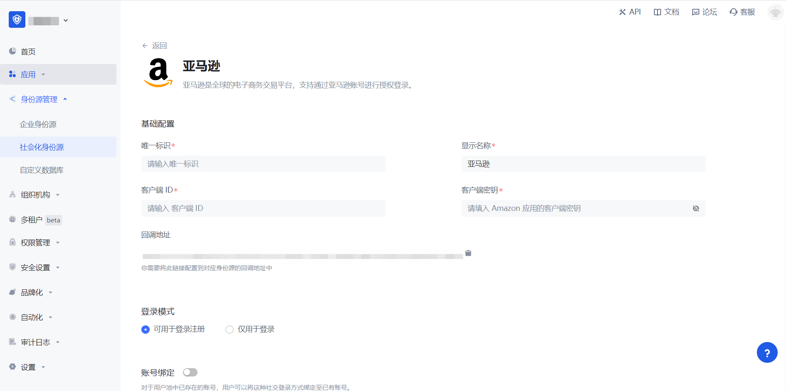
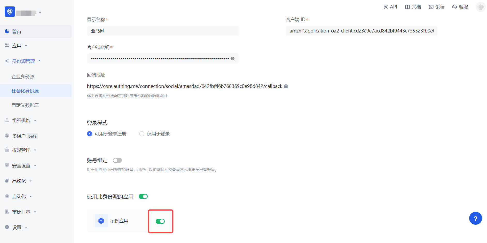

# 亚马逊

<LastUpdated/>

## 场景介绍

- **概述**：亚马逊 社会化登录是用户以 亚马逊 为身份源安全登录第三方应用或者网站。在 {{$localeConfig.brandName}} 中配置并开启 亚马逊 的社会化登录，即可实现通过 {{$localeConfig.brandName}} 快速获取 亚马逊 基本开放的信息和帮助用户实现免密登录功能。
- **应用场景**：PC 网站
- **终端用户预览图**：

## 注意事项

- 如果你未开通 亚马逊 开放平台 账号，请先前往 [亚马逊开放平台](https://developer.amazon.com/) 注册开发者账号。
- 如果你未开通 {{$localeConfig.brandName}} 控制台账号，请先前往 [{{$localeConfig.brandName}} 控制台](https://authing.cn/) 注册开发者账号。

## 第一步：在 亚马逊 开放平台 创建一个安全配置文件

1.1 前往 [亚马逊开放平台](https://developer.amazon.com/) 创建安全配置文件。

点击页面上方的「Developer Console」->「Login With Amazon」创建安全配置文件。过程中如遇到任何问题，请参考页面上方的亚马逊官方[文档资料 Login with Amazon](https://developer.amazon.com/zh/docs/login-with-amazon/authorization-code-grant.html)。

1.2 配置 Web 设置，记录 **Client ID** 和 **Client Secret**，下一步需要用到

- 允许的源: 填写 `https://core.authing.cn`
- 允许返回的 URL：填写`https://core.authing.cn/connection/social/{唯一标识}/{用户池ID}/callback`，你需要将其中的 `{唯一标识}` 替换为你正在 {{$localeConfig.brandName}} 创建的身份源所填写的`唯一标识`，`{用户池ID}` 替换成你的 [用户池 ID](/guides/faqs/get-userpool-id-and-secret.md)

## 第二步：在 {{$localeConfig.brandName}} 控制台配置 亚马逊

2.1 请在 {{$localeConfig.brandName}}  控制台 的「社会化身份源」页面，点击「创建社会化身份源」按钮，进入「选择社会化身份源」页面。

2.2 请在  {{$localeConfig.brandName}}  控制台 的「社会化身份源」-「选择社会化身份源」页面，点击「亚马逊」身份源按钮，进入「亚马逊登录模式」页面。

2.3 请在  {{$localeConfig.brandName}}  控制台 的「社会化身份源」-「亚马逊」页面，配置相关的字段信息。

| 字段/功能         | 描述                                                                            |
|---------------|-------------------------------------------------------------------------------|
| 唯一标识          | a.唯一标识由小写字母、数字、- 组成，且长度小于 32 位。b.这是此连接的唯一标识，设置之后不能修改。                         |
| 显示名称          | 这个名称会显示在终端用户的登录界面的按钮上。                                                        |
| 客户端 ID    | 亚马逊「安全配置文件」-「Web 设置」 的 客户端 ID，需要在 亚马逊 开放平台 上获取。                            |
| 客户端密钥 | 亚马逊「安全配置文件」-「Web 设置」 的 客户端密钥，需要在 亚马逊 开放平台 上获取。                       |
| 回调地址     | Github 有效跳转 URI。需要将此 URL 配置到 亚马逊 Web Settings 下的 Allowed Return URLs 上。       |
| 登录模式     | 开启「仅登录模式」后，只能登录既有账号，不能创建新账号，请谨慎选择。                                            |
| 账号身份关联 | 不开启「账号身份关联」时，用户通过身份源登录时默认创建新用户。开启「账号身份关联」后，可以允许用户通过「字段匹配」或「询问绑定」的方式直接登录到已有的账号。 |

配置完成后，点击「创建」或者「保存」按钮完成创建。

在 {{$localeConfig.brandName}} 控制台上创建完亚马逊身份源后，需要将回调地址配置到亚马逊开放平台上的 **Web Settings** 信息里面的 **Allowed Return URLs**。

## 第三步：开发接入

- **推荐开发接入方式**：使用托管登录页

- **优劣势描述**：运维简单，由 {{$localeConfig.brandName}} 负责运维。每个用户池有一个独立的二级域名;如果需要嵌入到你的应用，需要使用弹窗模式登录，即：点击登录按钮后，会弹出一个窗口，内容是 {{$localeConfig.brandName}} 托管的登录页面，或者将浏览器重定向到 {{$localeConfig.brandName}} 托管的登录页。

- **详细接入方法**：
  

3.1 在 {{$localeConfig.brandName}} 控制台创建一个应用，详情查看：[如何在 {{$localeConfig.brandName}} 创建一个应用](/guides/app-new/create-app/create-app.md)

3.2 在已创建好的「亚马逊」身份源连接详情页面，开启并关联一个在 {{$localeConfig.brandName}} 控制台创建的应用

3.3 点击 {{$localeConfig.brandName}} 控制台的应用「体验登录」按钮，在弹出的登录窗口体验「亚马逊」登录

