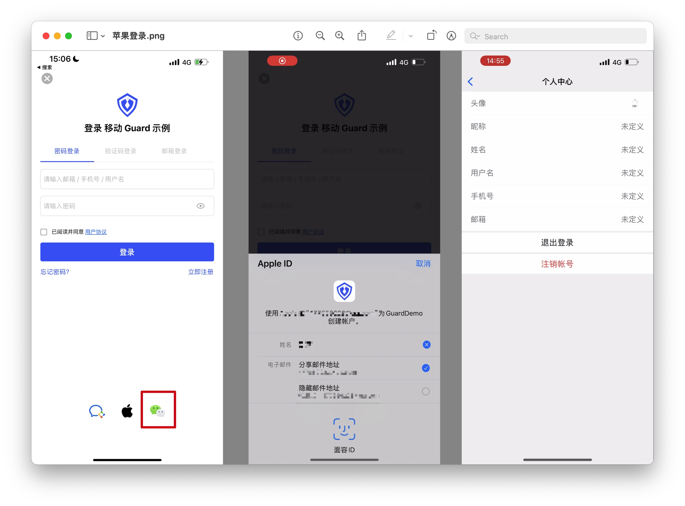
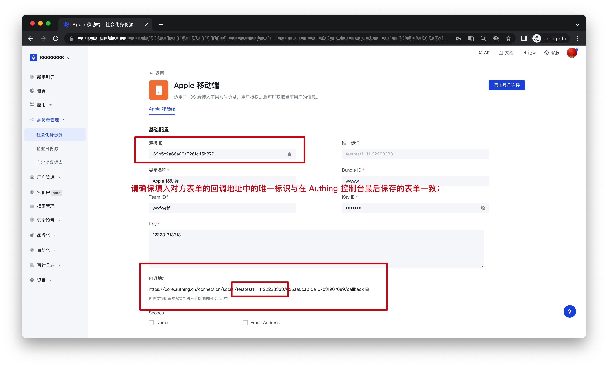
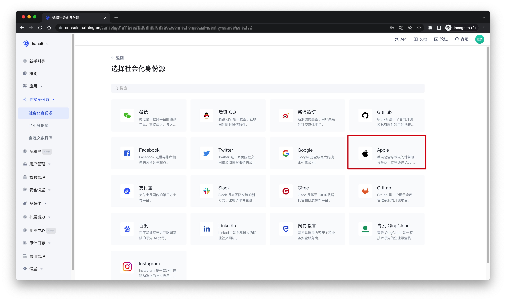
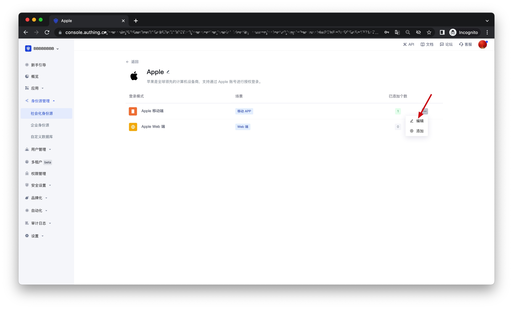
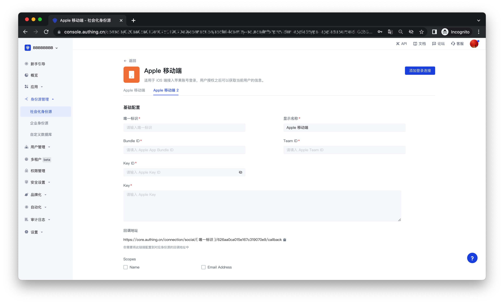
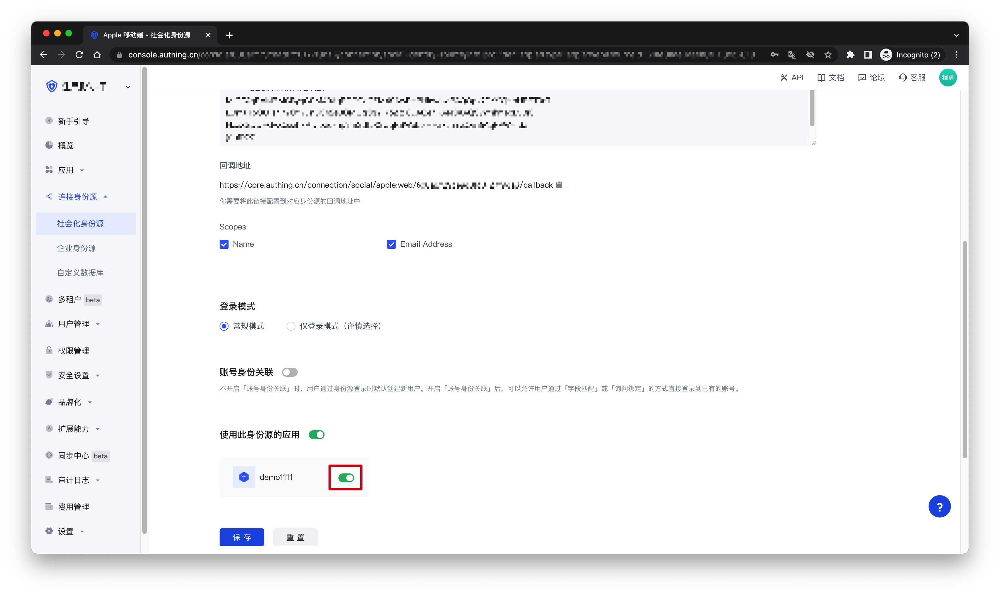

# Apple 移动端

<LastUpdated />

## 场景介绍

- **概述**：Apple 社会化登录是用户以 Apple 为身份源安全登录第三方应用或者网站。在 {{$localeConfig.brandName}} 中配置并开启 Apple 的社会化登录，即可实现通过 {{$localeConfig.brandName}} 快速获取 Apple 基本开放的信息和帮助用户实现免密登录功能。
- **应用场景**：iOS 移动端
- **终端用户预览图**：

## 注意事项

- 请确保你已经申请了苹果开发者账号，否则无法进行以下操作。[申请个人、公司账号地址](https://developer.apple.com/programs/) ，[ 申请企业账号地址](https://developer.apple.com/programs/enterprise/)；
- 如果你未开通 {{$localeConfig.brandName}} 控制台账号，请先前往 [{{$localeConfig.brandName}} 控制台](https://authing.cn/) 注册开发者账号；

## 步骤 1：在 Apple 开发者中心进行配置

### 1.1 获取 Team ID

前往 [Apple Developer Portal](https://developer.apple.com/account/#) 的 [Membership 页面](https://developer.apple.com/account/#/membership)，记录下`Team ID`：

### 1.2 创建一个 App ID

1. 在  **Apple Developer Portal**, **Certificates, Identifiers & Profiles** > **Identifiers** 页面，点击 ➕ 图标创建应用：

2. 选择 **App IDs** 然后点击 **Continue** 按钮继续：

3. 选择应用类型，然后点击 **Continue** 按钮继续：

4. 填写 **Description** 和 **Bundle ID**，并且在下面找到 **Sign in with Apple** 并勾选，请记录下此 **Bundle ID**：

5. 最后点击 **Continue** 按钮，在打开的页面中确认信息，点击 **Register** 按钮创建应用。

### 1.3 创建一个 Service ID

1. 回到 **Certificates, Identifiers & Profiles** > **Identifiers** 页面，点击 ➕ 图标，选择 **Services IDs** 然后点击 **Continue** 按钮继续：

2. 填写 **Description** 和 **Identifier**，然后点击 **Continue** 按钮，在打开的确认页面点击 **Register** 按钮创建 Service：

3. 找到刚刚创建的 Service，选中 **Sign In with Apple**，点击 **Configure**：

4. 填写 **Domains and Subdomains** 和 **Return URLs**:

- **Domains and Subdomains**：请填入`core.authing.cn`
- **Return URLs**：请填入在 [{{$localeConfig.brandName}} 控制台](https://authing.cn/) 上获取的**回调地址**字段信息：
 

5. 点击 **Save**，**Continue**，最后点击 **Register**，并记录下该 **Service ID**。

### 1.4 配置 Signing Key

1. 回到 **Certificates, Identifiers & Profiles** 页面，切换到 **Keys** Tab，点击 ➕ 图标：

2. 输入名称并勾选上 **Sign in with Apple**, 点击 **Configure**，确保选中的 **Primary App ID** 是你刚刚创建的那一个：

3. 点击 **Save**, **Continue**, 最后点击 **Register**.

4. 创建之后，记录下 **Key ID**，然后点击 **Download** 下载该密钥：

## 步骤 2：在 {{$localeConfig.brandName}} 控制台配置 Apple 应用

2.1 请在 {{$localeConfig.brandName}} 控制台的「社会化身份源」页面，点击「创建社会化身份源」按钮，进入「选择社会化身份源」页面。

2.2 在「选择社会化身份源」页面，点击「Apple」卡片。

2.3 继续点击「Apple 移动端」登录模式，或者点击「**… 添加**」打开「Apple 移动端」配置页面。

2.4 在「Apple 移动端」配置页面，填写相关的字段信息。

| 字段                | 描述  |
| ------------------- | ------------|
| 唯一标识            | a. 唯一标识由小写字母、数字、- 组成，且长度小于 32 位。 b. 这是此连接的唯一标识，设置之后不能修改。                                                     |
| 显示名称            | 这个名称会显示在终端用户的登录界面的按钮上。                                                                                                                 |
| Bundle ID | 请输入 Apple 的 Bundle ID。                                                                                                                                          |
| Team ID             | Apple 开发者团队 ID。                                                                                                                                          |
| Key ID              | Apple Signing Key 的 ID。                                                                                                                                   |
| Key                 | Apple Signing Key 的内容。                                                                                        
| 回调地址            | a.请在苹果开发者平台的创建应用页面，粘贴该回调地址； b.确认该回调地址中的唯一标识部分要与创建后的身份源中的唯一标识部分保持一致；                              |                                                         |
| Scopes              | 可以勾选 `Name` 和 `Email Address`。                                                                                                                               |
| 登录模式            | 开启「仅登录模式」后，只能登录既有账号，不能创建新账号，请谨慎选择。                                                                                         |
| 账号身份关联        | 不开启「账号身份关联」时，用户通过身份源登录时默认创建新用户。开启「账号身份关联」后，可以允许用户通过「字段匹配」或「询问绑定」的方式直接登录到已有的账号。 |

2.5 配置完成后，点击「创建」或者「保存」按钮完成创建。

## 步骤 3：开发接入

- **推荐开发接入方式**：SDK 
- **优劣势描述**：接入简单，只需要几行代码。可自定义程度最高。
- **详细接入方法**：

  3.1 请根据 [苹果登录 SDK 接入文档 ](https://docs.authing.cn/v2/reference/sdk-for-ios/social/apple.html)接入你的 iOS 应用；
 
  3.2 在 {{$localeConfig.brandName}} 控制台创建一个应用，详情查看：[如何在 {{$localeConfig.brandName}} 创建一个应用](/guides/app-new/create-app/create-app.md)

  3.3 在已创建好的「Apple」身份源连接详情页面，开启并关联一个在 {{$localeConfig.brandName}} 控制台创建的移动端应用；
  

  3.4 前往相关联的移动端 APP，体验 APP 登录功能。

  

  