# AWS

<LastUpdated />

## 场景介绍

- **概述**：AWS 社会化登录是用户以 AWS 为身份源安全登录第三方应用或者网站。在 {{$localeConfig.brandName}} 中配置并开启 AWS 的社会化登录，即可实现通过 {{$localeConfig.brandName}} 快速获取 AWS 基本开放的信息和帮助用户实现免密登录功能。
- **应用场景**：PC 网站
- **终端用户预览图**：

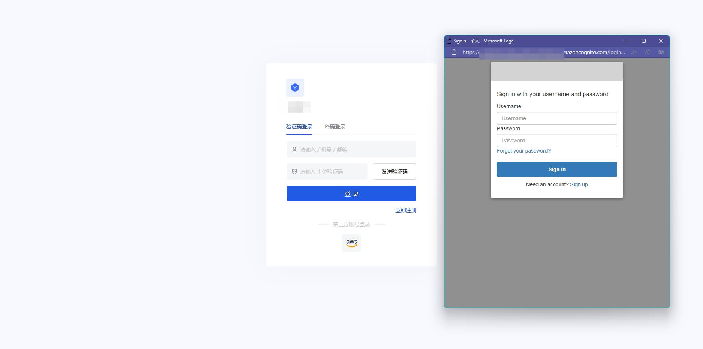

## 注意事项

- 如果你还没有 AWS 账号，请先前往 [AWS 控制台](https://console.aws.amazon.com/)上注册成为开发者。
- 如果你未开通 {{$localeConfig.brandName}} 控制台账号，请先前往 [{{$localeConfig.brandName}} 控制台](https://authing.cn/) 注册开发者账号

## 第一步：在 AWS 创建一个服务器应用

进入 [Amazon Cognito 控制台](https://console.aws.amazon.com/cognito/home)，点击 **创建用户池**：
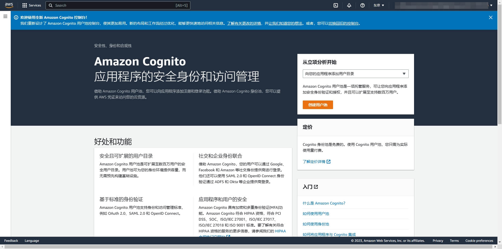

在**配置体验登录**页面，按照需要勾选 **用户登录选项**:
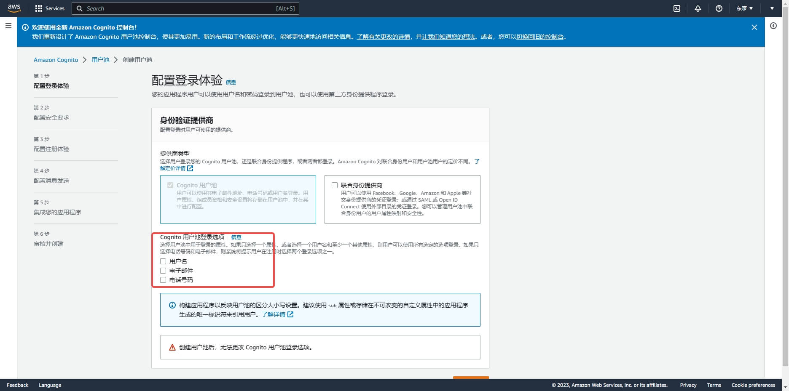

在**配置安全要求**页面，按需选择登录安全配置，并点击下一步:
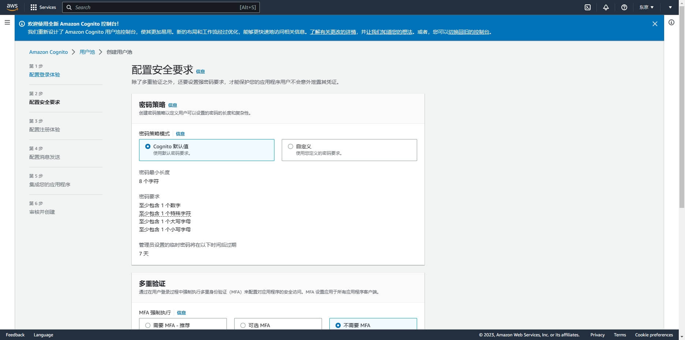

在**配置注册体验**页面，按需选择注册体验配置，并点击下一步:
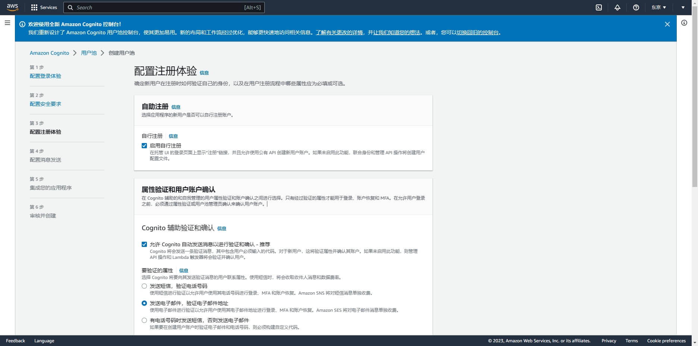

在**配置消息发送**页面，按需选择消息发送配置，并点击下一步:
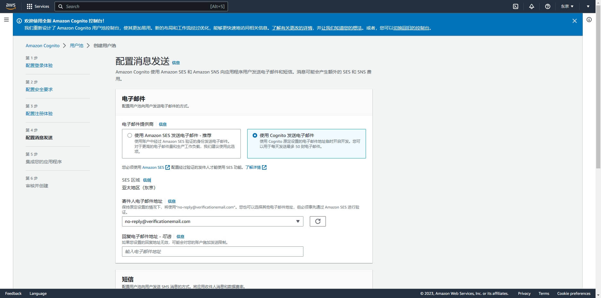

在**集成您的应用程序**页面，填写用户池名称

向下滚动，勾选 **使用 Cognito 托管 UI**，并填写一个自定义的 Cognito 域
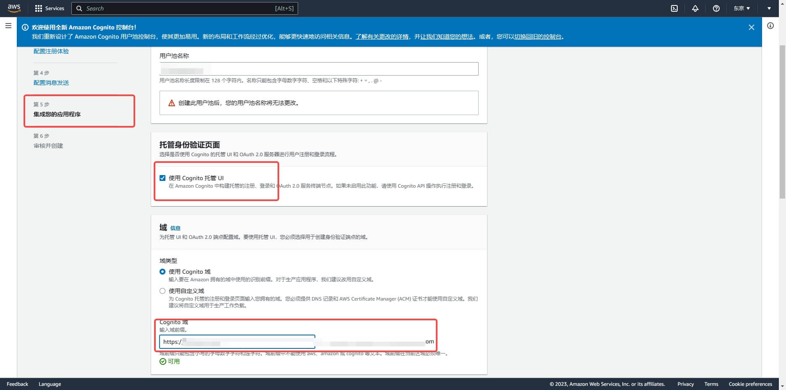

向下滚动，初始化应用程序客户端，选择 **机密客户端**，并定义应用程序客户端名称；

应用回调地址：填写`https://core.authing.cn/connection/social/{唯一标识}/{用户池ID}/callback`，你需要将其中的 `{唯一标识}` 替换为你正在 {{$localeConfig.brandName}} 创建的身份源所填写的`唯一标识`，`{用户池ID}` 替换成你的 [用户池 ID](/guides/faqs/get-userpool-id-and-secret.md)
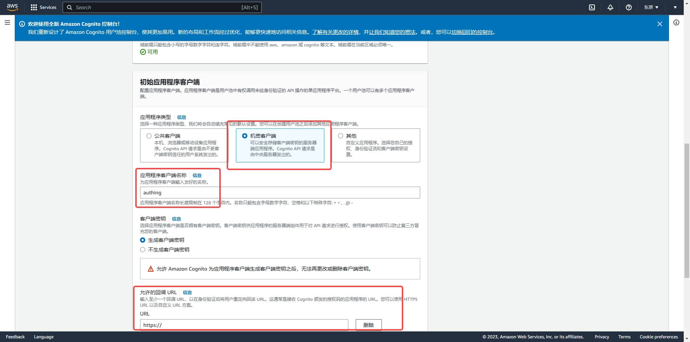

在**审核并创建**页面，确认配置并创建用户池:

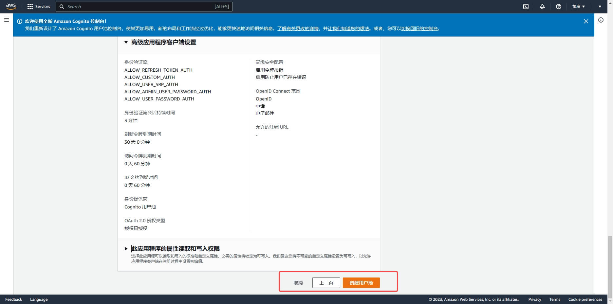

创建完成后，在**用户池**页面，获取到 Cognito 域

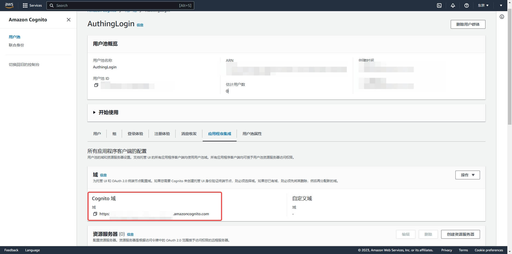

向下滑动，进入应用程序详情页面，记录下 `客户端 ID` 和 `客户端密钥`，下一步需要用到。

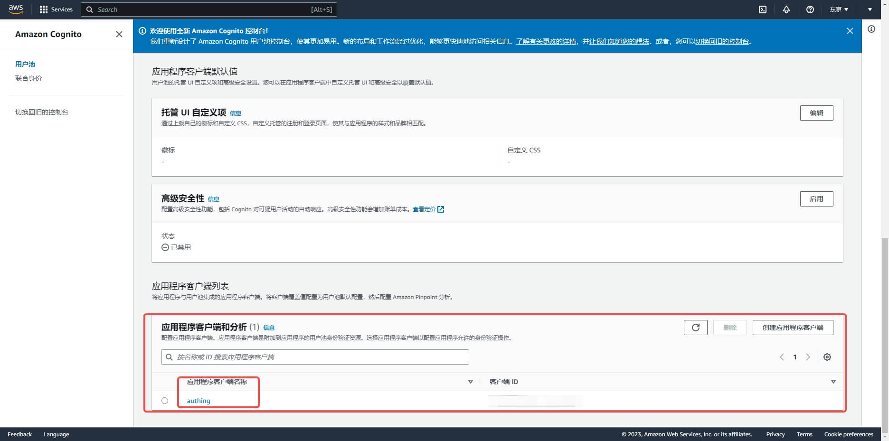

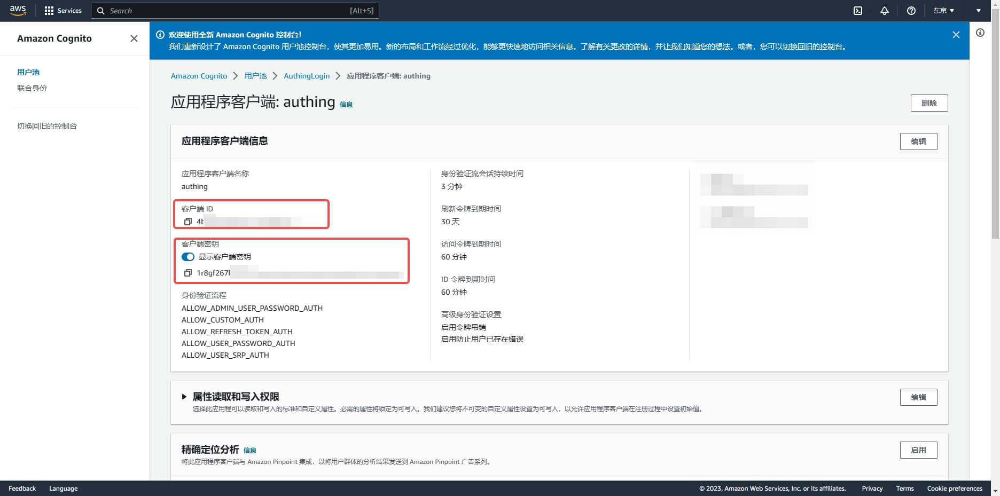

## 第二步：在 {{$localeConfig.brandName}} 控制台配置 AWS 应用配置

2.1 请在 {{$localeConfig.brandName}} 控制台的「社会化身份源」页面，点击「创建社会化身份源」按钮，进入「选择社会化身份源」页面。

2.2 在「选择社会化身份源」页面，点击「AWS」卡片。
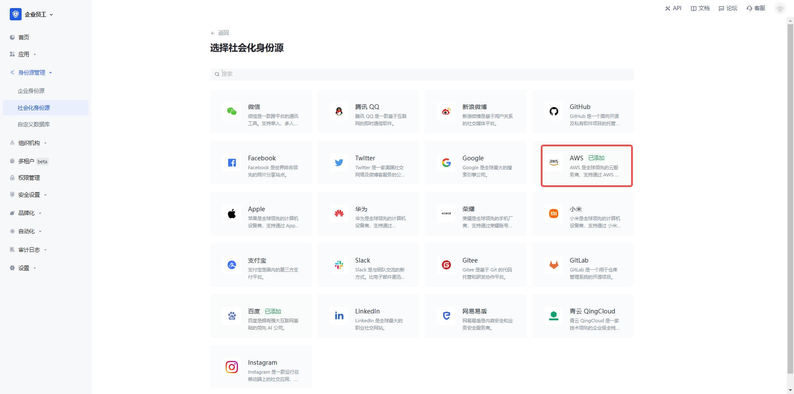

2.3 在「AWS」配置页面，填写相关的字段信息。
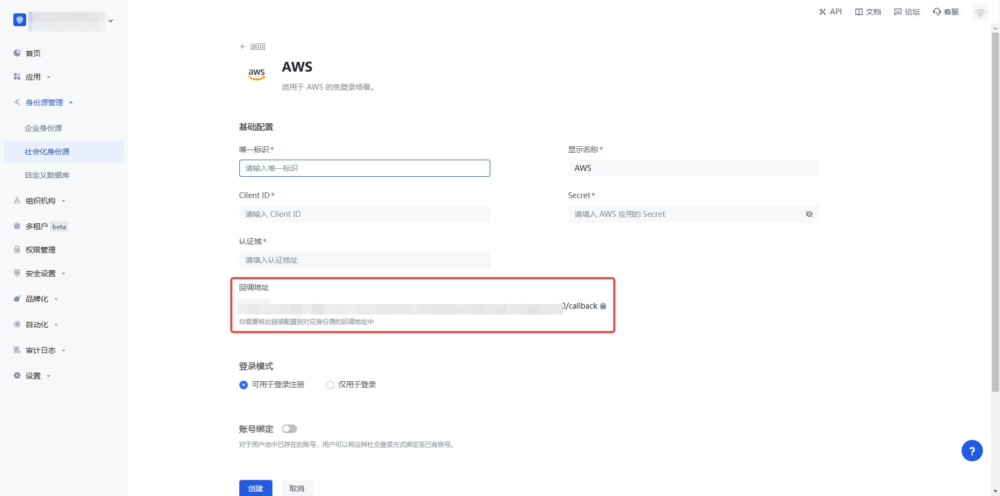

| 字段         | 描述                                                                                                                                                         |
| ------------ | ------------------------------------------------------------------------------------------------------------------------------------------------------------ |
| 唯一标识     | a. 唯一标识由小写字母、数字、- 组成，且长度小于 32 位。 b. 这是此连接的唯一标识，设置之后不能修改。                                                     |
| 显示名称     | 这个名称会显示在终端用户的登录界面的按钮上。                                                                                                                 |
| 认证域       | 在 AWS 用户池控制台配置的 Cognito 域名。                                                                                                                     |
| 客户端 ID    | 上一步获取的 AWS 客户端 ID。                                                                                                                                 |
| 客户端密钥   | 上一步获取的 AWS 客户端密钥。                                                                                                                                |
| 登录模式     | 开启「仅登录模式」后，只能登录既有账号，不能创建新账号，请谨慎选择。                                                                                         |
| 账号身份关联 | 不开启「账号身份关联」时，用户通过身份源登录时默认创建新用户。开启「账号身份关联」后，可以允许用户通过「字段匹配」或「询问绑定」的方式直接登录到已有的账号。 |

2.4 配置完成后，点击「创建」或者「保存」按钮完成创建。

## 第三步：开发接入

- **推荐开发接入方式**：使用托管登录页
- **优劣势描述**：运维简单，由 {{$localeConfig.brandName}} 负责运维。每个用户池有一个独立的二级域名；如果需要嵌入到你的应用，需要使用弹窗模式登录，即：点击登录按钮后，会弹出一个窗口，内容是 {{$localeConfig.brandName}} 托管的登录页面，或者将浏览器重定向到 {{$localeConfig.brandName}} 托管的登录页。
- **详细接入方法**：

  3.1 在 {{$localeConfig.brandName}} 控制台创建一个应用，详情查看：[如何在 {{$localeConfig.brandName}} 创建一个应用](/guides/app-new/create-app/create-app.md)

  3.2 在已创建好的「AWS」身份源连接详情页面，开启并关联一个在 {{$localeConfig.brandName}} 控制台创建的应用

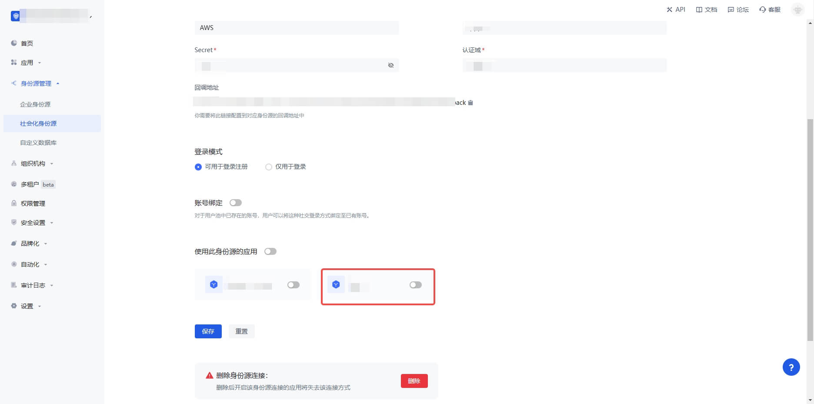

3.3 点击 {{$localeConfig.brandName}} 控制台的应用「体验登录」按钮，在弹出的登录窗口体验「AWS」登录

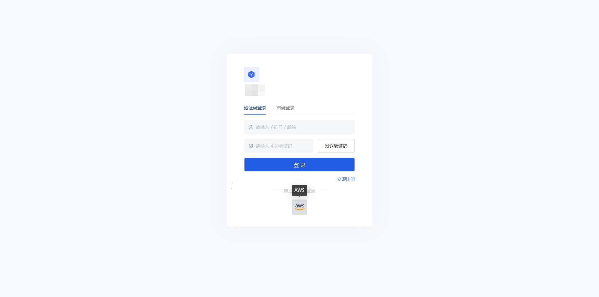
