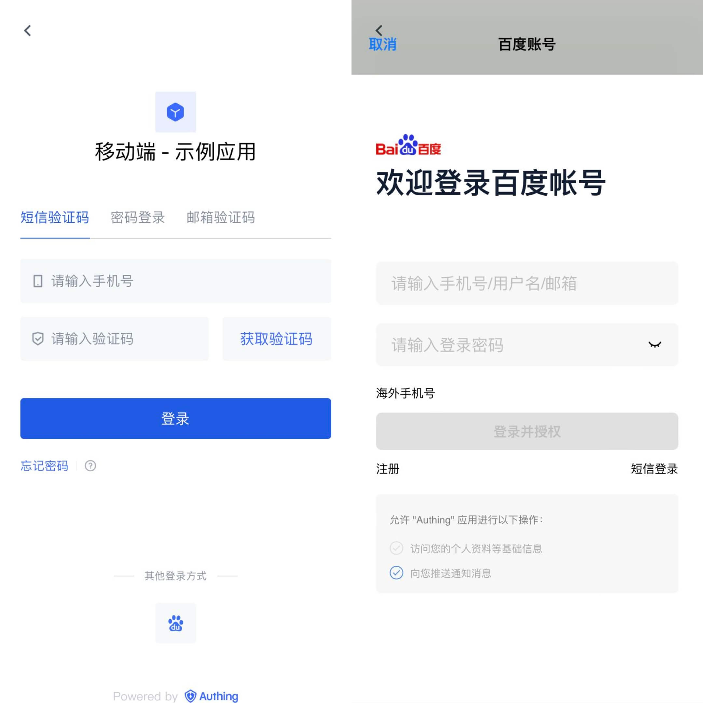
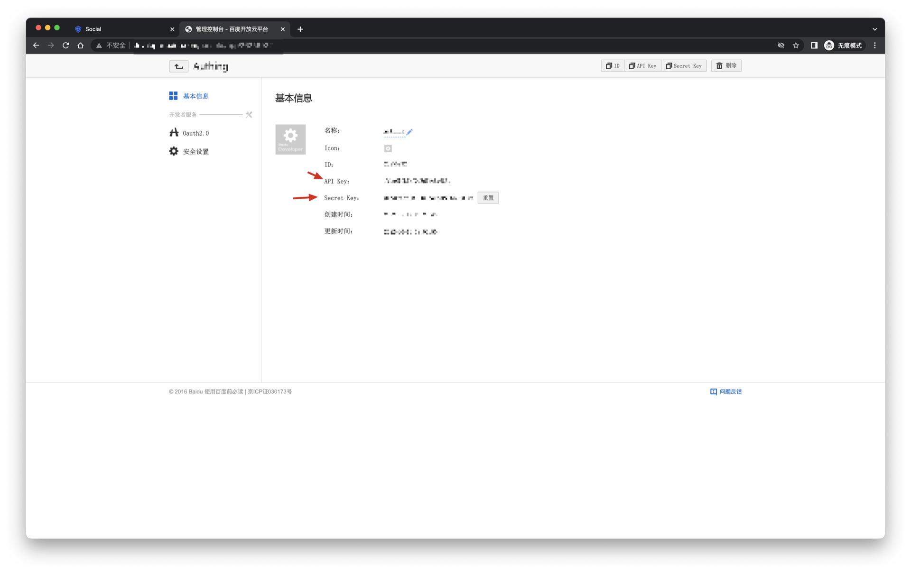
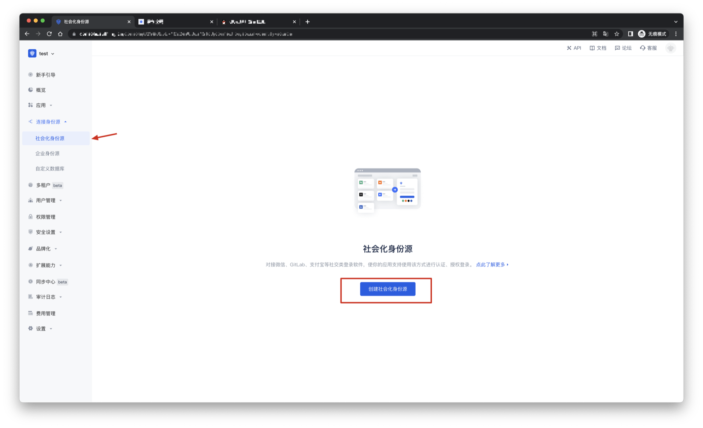
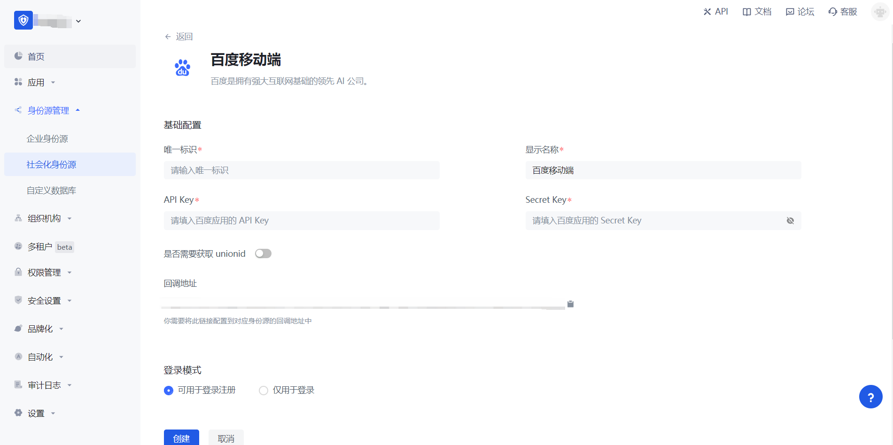
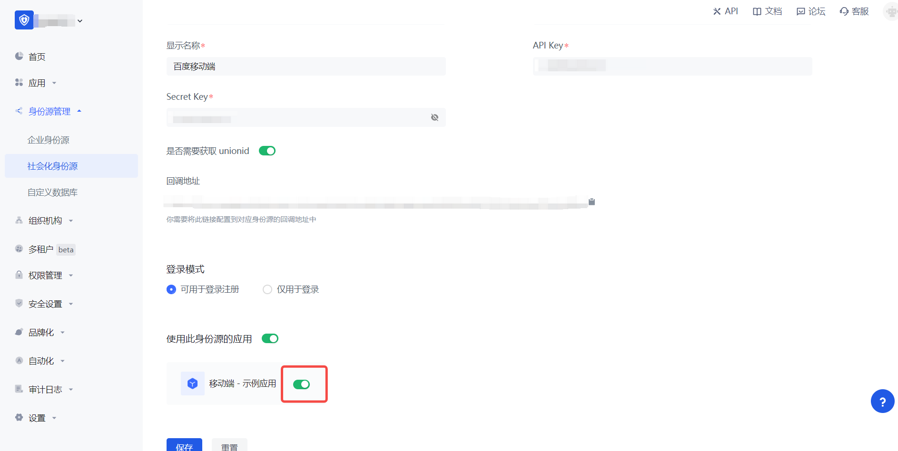

# 百度移动端

<LastUpdated/>

## 场景介绍

### 概述

百度社会化登录是用户以百度为身份源安全登录第三方应用或者网站。在 {{$localeConfig.brandName}} 中配置并开启百度的社会化登录，即可实现通过 {{$localeConfig.brandName}} 快速获取百度基本开放的信息和帮助用户实现免密登录功能。

### 应用场景

移动端

### 终端用户预览图

## 注意事项

- 如果你未注册百度开发者账号，请先前往 [百度开发者中心](https://developer.baidu.com/) 注册开发者账号。
- 百度开发者中心-[用户中心](http://developer.baidu.com/user/info)
- 如果你未开通 {{$localeConfig.brandName}} 控制台账号，请先前往 [{{$localeConfig.brandName}} 控制台](https://authing.cn/) 注册开发者账号。

## 第一步：在百度开放平台创建一个移动应用

- 注册[百度开发者中心](https://developer.baidu.com/)，登录后前往[百度开发者服务管理控制台](http://developer.baidu.com/console#app/project)，填写开发者信息，并创建一个工程（应用）：

- 创建完成后，你需要记录下该应用的 API Key（即 Client ID） 和 Secret Key（即 Client Secret），后面需要用到。 

在安全设置页面，设置授权回调页地址为：`https://core.authing.cn/connection/social/<Unique Identifier>/<USERPOOL_ID>/callback`，你需要将其中的 `<Unique Identifier>` 替换成你的`唯一标识`，`<USERPOOL_ID>` 替换成你的 [用户池 ID](/guides/faqs/get-userpool-id-and-secret.md)

## 第二步：在 {{$localeConfig.brandName}} 控制台配置百度

2.1 请在 {{$localeConfig.brandName}}  控制台 的「社会化身份源」页面，点击「创建社会化身份源」按钮，进入「选择社会化身份源」页面。

2.2 请在  {{$localeConfig.brandName}}  控制台 的「社会化身份源」-「选择社会化身份源」页面，点击「百度」身份源按钮，进入 「百度登录模式」页面。

2.3 请在  {{$localeConfig.brandName}}  控制台 的「社会化身份源」-「百度移动端」页面，配置相关的字段信息。

| 字段/功能           | 描述                                                    |
|-----------------|-------------------------------------------------------|
| 唯一标识            | a.唯一标识由小写字母、数字、- 组成，且长度小于 32 位。b.这是此连接的唯一标识，设置之后不能修改。 |
| 显示名称            | 这个名称会显示在终端用户的登录界面的按钮上。                                |
| API Key         | 百度应用 ID，需要在百度开发者中心上获取。                                |
| Secret Key      | 百度应用密钥，需要在百度开发者中心上获取。                                 |
| 是否需要获取 unionid  | 开启后，可以获取百度用户统一标识，对当前开发者帐号唯一。                          |
| 回调地址            | 百度开发者中心有效跳转 URI。需要将此 URL 配置到百度开发者中心上。                 |
| 登录模式            | 开启「仅登录模式」后，只能登录既有账号，不能创建新账号，请谨慎选择。                    |

配置完成后，点击「创建」或者「保存」按钮完成创建。

在 {{$localeConfig.brandName}} 控制台上创建完百度身份源后，需要将回调地址配置到 百度上的授权回调页。

## 第三步：开发接入

- **推荐开发接入方式**：SDK

- **优劣势描述**：运维简单，由 {{$localeConfig.brandName}} 负责运维。每个用户池有一个独立的二级域名;如果需要嵌入到你的应用，需要使用弹窗模式登录，即：点击登录按钮后，会弹出一个窗口，内容是 {{$localeConfig.brandName}} 托管的登录页面，或者将浏览器重定向到 {{$localeConfig.brandName}} 托管的登录页。

- **详细接入方法**：

3.1 在 {{$localeConfig.brandName}} 控制台创建一个应用，详情查看：[如何在 {{$localeConfig.brandName}} 创建一个应用](/guides/app-new/create-app/create-app.md)

3.2 在已创建好的百度身份源连接详情页面，开启并关联一个在 {{$localeConfig.brandName}} 控制台创建的应用

3.3 在登录页面体验百度第三方登录。（如 [终端用户预览图](#终端用户预览图) 所示）。