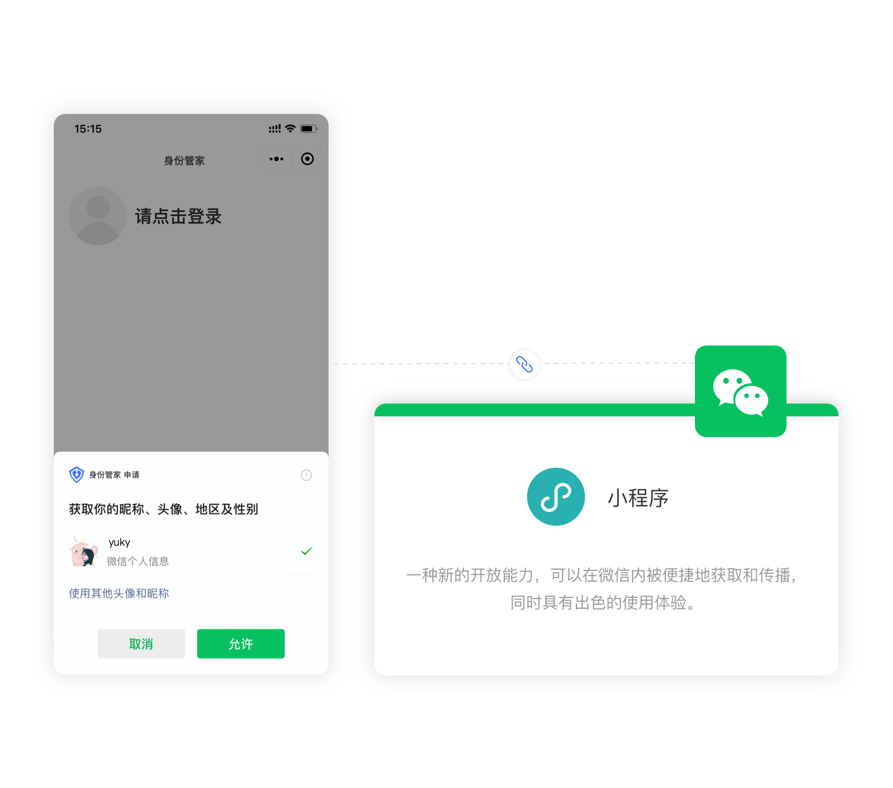

# 抖音小程序

<LastUpdated />

## 场景介绍

- **概述**：{{$localeConfig.brandName}} 通过 SDK 为开发者提供了一种快速在小程序中获取用户信息并完成登录的方法。通过 Authing 的 SDK 
  可以方便地获取抖音提供的用户身份标识，快速建立以手机号码为基础的账号体系。
- **应用场景**：小程序
- **终端用户预览图**：

## 注意事项

- 如果你未开通 {{$localeConfig.brandName}} 控制台账号，请先前往 [{{$localeConfig.brandName}} 控制台](https://authing.cn/) 注册开发者账号；

## 第一步：在抖音开放平台创建一个小程序

### 创建抖音小程序

前往 [抖音开放平台](https://developer.open-douyin.com/console/apply/microapp)创建一个 **抖音小程序**。

创建完成之后，你需要记录下该应用的 `AppID` 和 `AppSecret`，后面需要用到。

### 配置服务器域名

之后需在抖音小程序管理后台的 **开发 -> 开发配置 -> 域名管理** 页面中，设置 **服务器域名** 中的 **request 合法域名** 为`core.authing.cn`。

### 配置业务域名（可选）

:::hint-info
若你需要在抖音小程序中使用 webview 调用 {{$localeConfig.brandName}} 托管登录页，需要配置业务域名。
:::

在抖音小程序管理后台的 **开发 -> 开发配置 -> 域名管理** 页面中，找到「**web-view域名**」配置，下载校验文件备用

在 web-view 域名配置中，点击「**添加**」填入你的应用认证地址

## 第二步：在 {{$localeConfig.brandName}} 控制台配置抖音小程序应用

2.1 请在 {{$localeConfig.brandName}} 控制台的「社会化身份源」页面，点击「创建社会化身份源」按钮，进入「选择社会化身份源」页面。

2.2 在「选择社会化身份源」页面，点击「抖音」卡片，进入「抖音登录模式」页面。

2.3 继续点击「小程序」登录模式，或者点击 **… 添加** 打开「小程序」配置页面。

2.4 在「小程序」配置页面，填写相关的字段信息。

| 字段         | 描述                                                                      |
| ------------ |-------------------------------------------------------------------------|
| 唯一标识     | a. 唯一标识由小写字母、数字、- 组成，且长度小于 32 位。 b. 这是此连接的唯一标识，设置之后不能修改            |
| 显示名称     | 这个名称会显示在终端用户的登录界面的按钮上                                                   |
| 小程序 ID    | 步骤 1 中获得的 AppID                                                         |
| 小程序密码   | 步骤 1 中获得的 AppSecret                                                     |
| 域名校验文件 | 如果你需要在小程序中使用 webview 调用 Authing 的托管登录页，需要上传步骤 1 中下载的小程序提供的校验文件          |
| 登录模式     | 开启「仅登录模式」后，只能登录既有账号，不能创建新账号，请谨慎选择                                       |
| 账号身份关联 | 不开启「账号身份关联」时，用户通过身份源登录时默认创建新用户。开启「账号身份关联」后，可以允许用户通过「字段匹配」的方式直接登录到已有的账号。 |

2.5 配置完成后，点击「创建」或者「保存」按钮完成创建。

## 第三步：开发接入

_**TODO**_

### 接下来

!!!include(common/what-to-do-when-you-get-userinfo.md)!!!
