# Facebook 移动端

<LastUpdated />

## 场景介绍

### 概述

Authing 为开发者提供了一种在移动端（iOS 或安卓）应用中快速跳转 Facebook 登录获取用户信息的方式，通过简单地调用 Authing 移动端 SDK 可以完成 Facebook 账号接入。

### 应用场景

移动 APP

### 终端用户预览图

在移动应用中拉起 Facebook 页面进行登录。

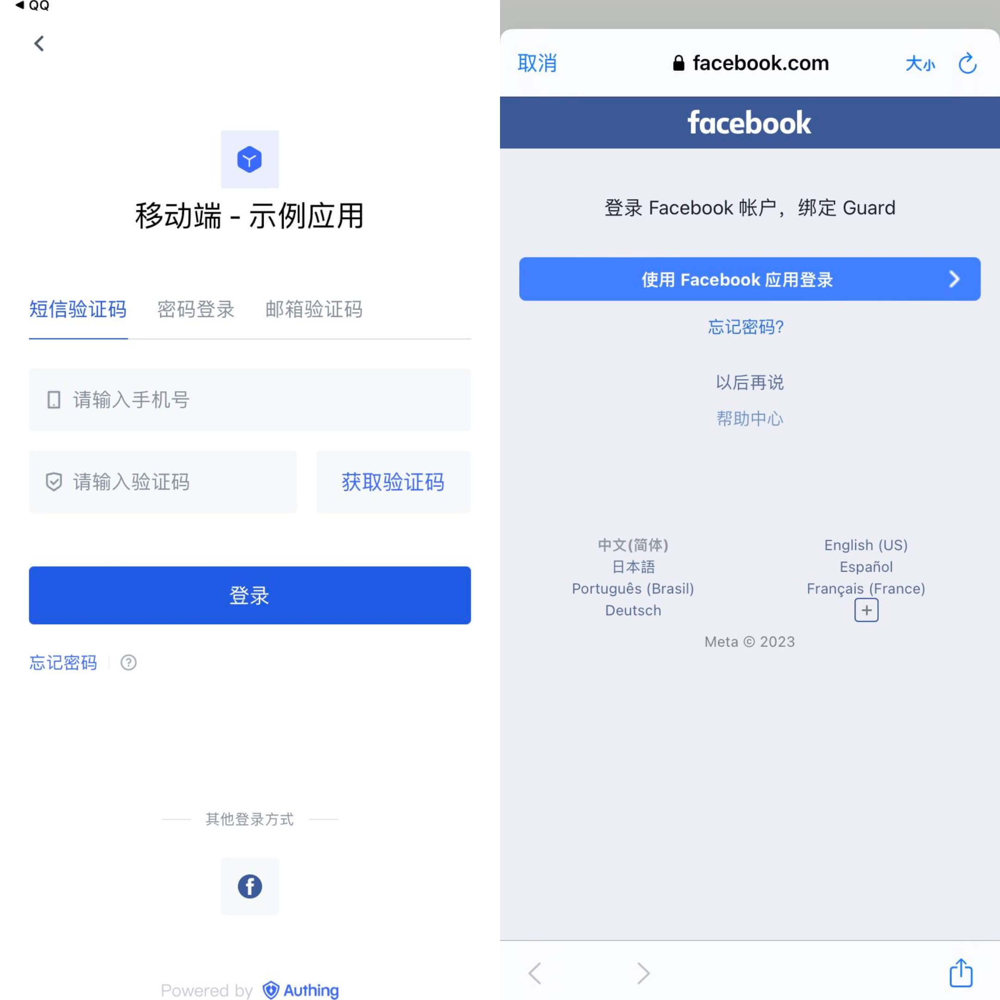

## 准备工作

* 如果你未开通 Facebook 账号，请先前往 [Facebook](https://www.facebook.com/) 注册。
  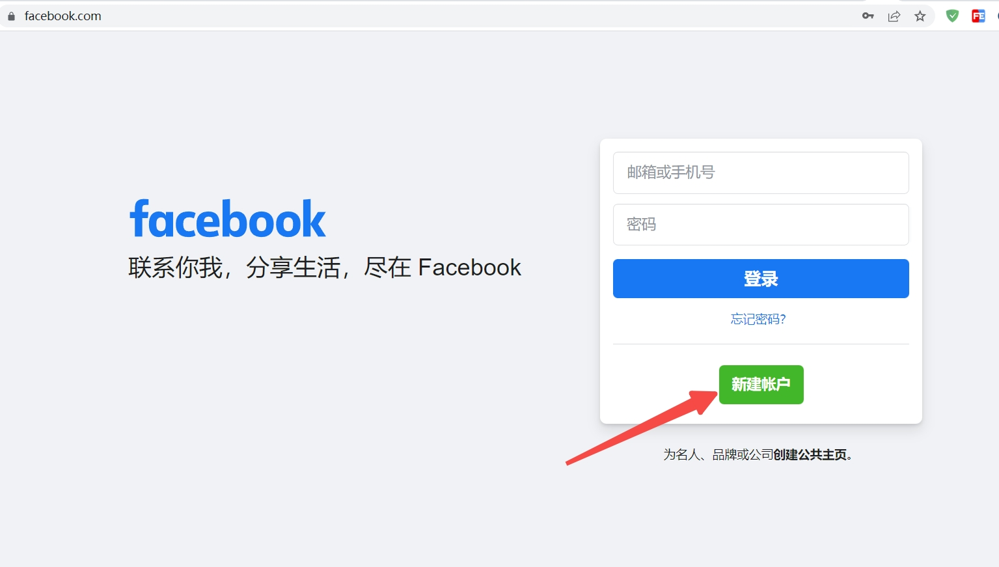

* 打开Facebook开发者平台，请先前往 [Facebook 开发者平台](https://developers.facebook.com/) 登录，根据页面提示完善账户信息，完成注册。

* 如果你未开通 Authing 控制台账号，请先前往 [{{$localeConfig.brandName}} Console 控制台](https://authing.cn/) 注册开发者账号。

## 配置步骤

### 第一步：在 Facebook 开发者平台创建应用

1. 创建 Facebook 应用，获取应用编号和应用密钥

* 完成[Facebook 开发者平台](https://developers.facebook.com/apps/?show_reminder=true)注册登录后，点击「创建应用」。

   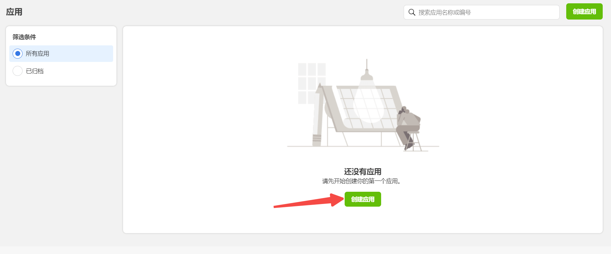

* 选择应用类型，点击「继续」。

   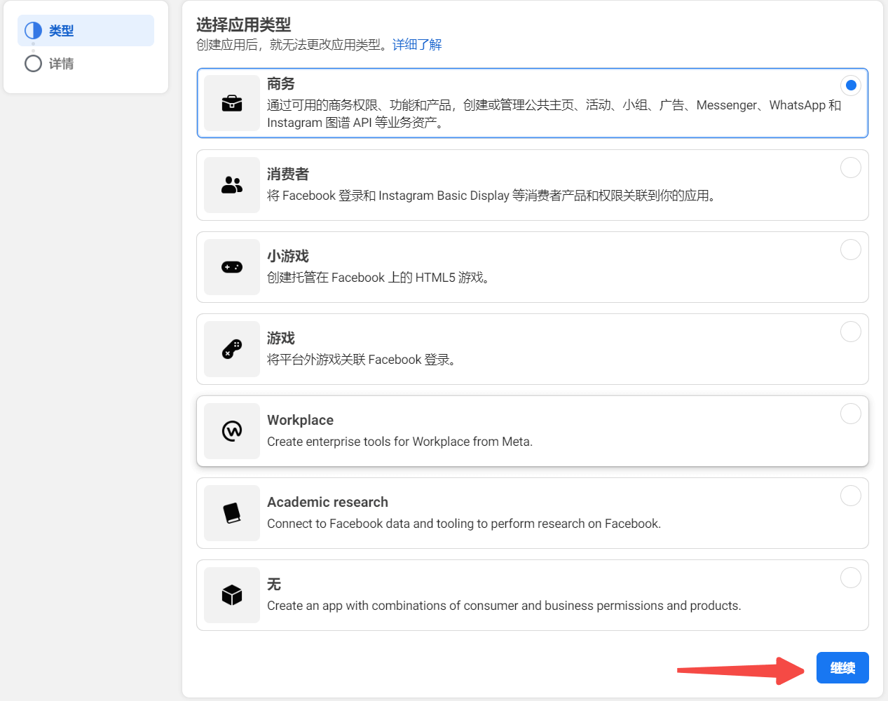

* 填写应用显示名、应用联系邮箱后，点击「创建应用」。
   
   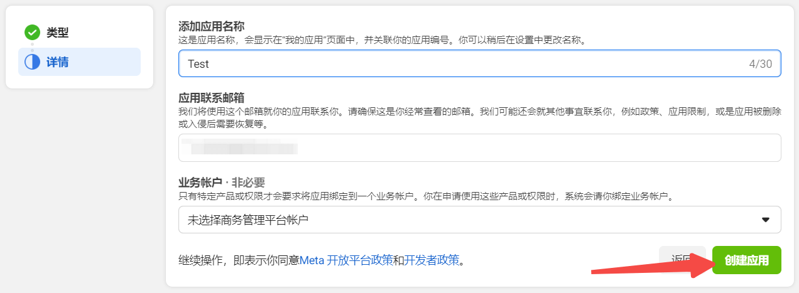

2. 在「设置」->「基本」中，点击「添加平台」
   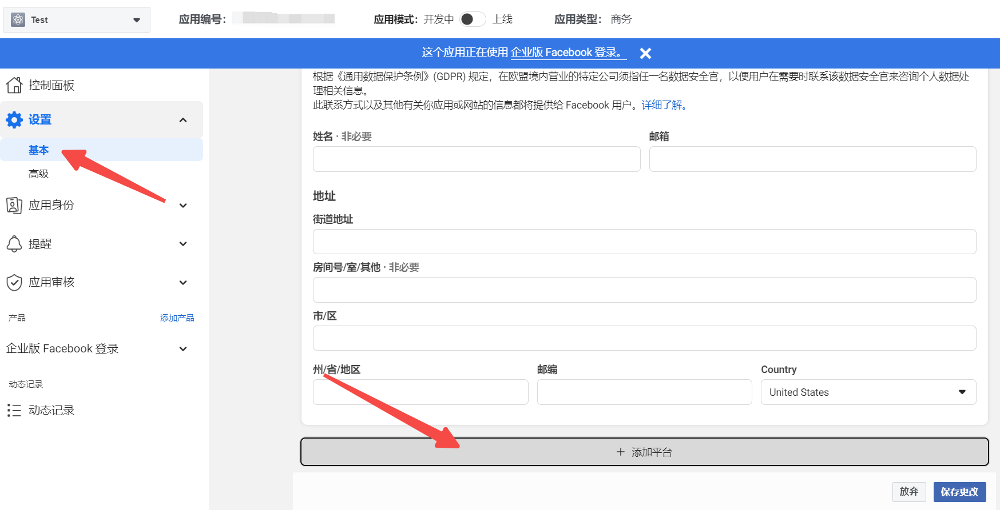
   
   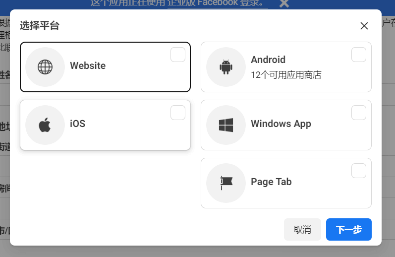

3. 在「设置」->「基本」中，查看「应用编号」和「应用密钥」

   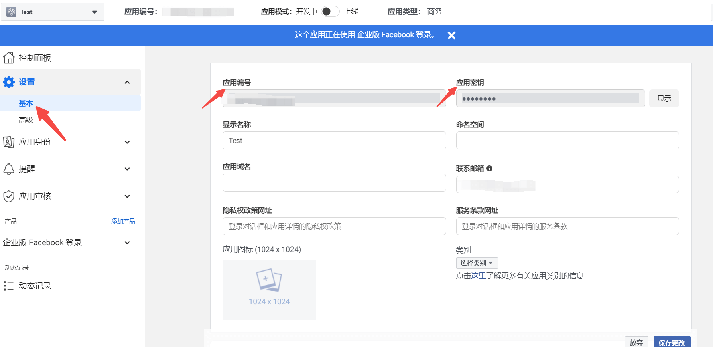

4. 在 「产品」 中，设置 **Facebook 登录**。

   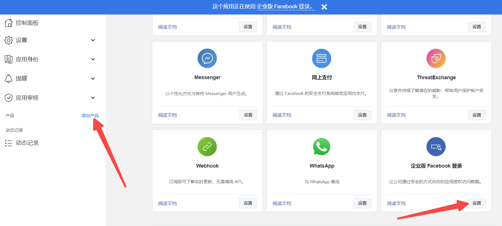

#### Android

请参阅 [Android 版 Facebook 登录 — 快速入门](https://developers.facebook.com/docs/facebook-login/android)

::: hint-info
* 需要登录你的移动端应用后台获取 **Package name**（安卓应用包名）和 **SHA-1 certificate fingerprint**（安卓应用的 SHA-1）。
* 设置保存后到生效需一段时间，请耐心等待。
:::

#### iOS

请参阅 [iOS 版 Facebook 登录 — 快速入门](https://developers.facebook.com/docs/facebook-login/ios)

::: hint-info
* 可以在 [Apple Store Connect](https://appstoreconnect.apple.com/apps) 获取 **Bundle ID**。
:::

### 第二步：在 Authing 控制台配置 Facebook 移动端登录

1. 在 Atuhing 控制台 的 **社会化身份源** 页面点击 **创建社会化身份源** 按钮，进入 **选择社会化身份源** 页面。

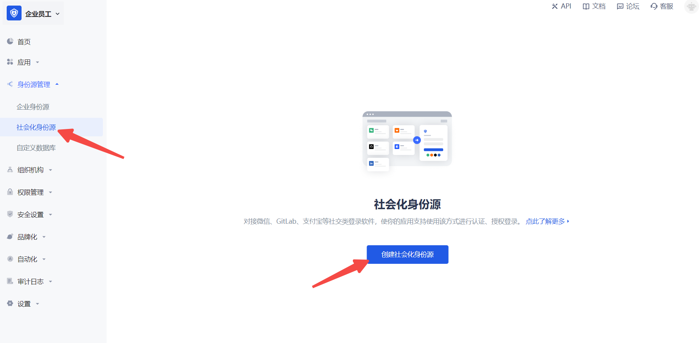

2. 在 Authing 控制台 的 **身份源管理->社会化身份源->选择社会化身份** 页面，点击 「Facebook」身份源卡片，进入 Facebook 登录模式选择页面。

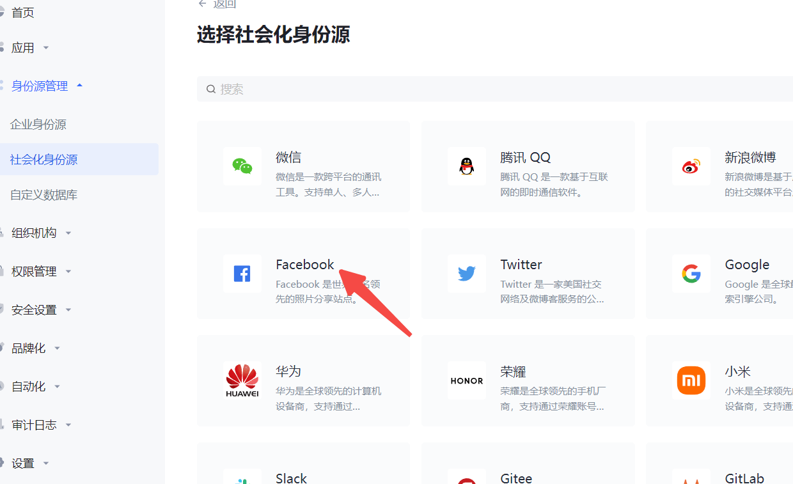

3. 选择 **Facebook 移动端** 进入。

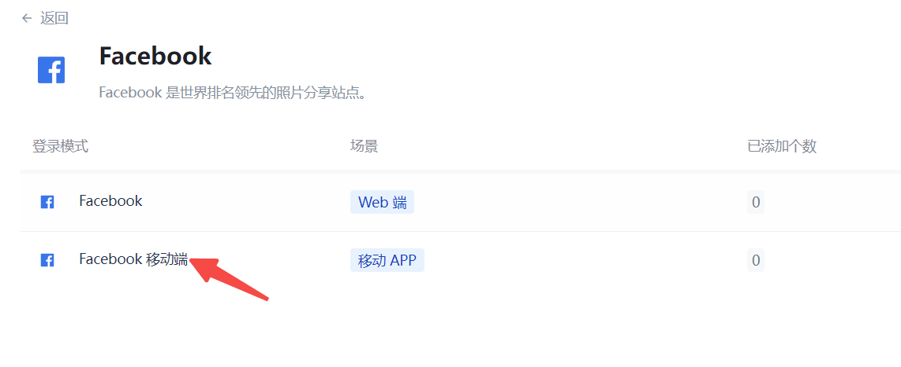

4. 请在  {{$localeConfig.brandName}}  控制台 的「社会化身份源」-「Facebook 移动端」页面，配置相关的字段信息。

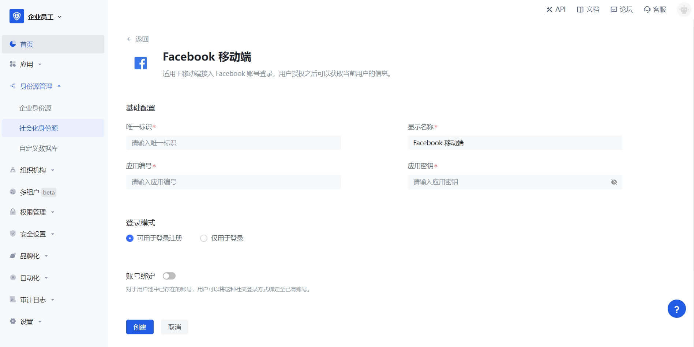

<table>
<tr>
<th>字段</th>
<th>说明</th>
</tr>

<tr>
<td>唯一标识</td>
<td>
<ul>
<li>唯一标识由小写字母、数字、- 组成，且长度小于 32 位。</li>
<li>这是此连接的唯一标识，设置之后不能修改。</li>
</ul></td>
</tr>

<tr>
<td>显示名称</td>
<td>这个名称会显示在终端用户的登录界面的按钮上。</td>
</tr>

<tr>
<td>应用编号</td>
<td>填入 Facebook 开发者平台上申请的应用编号。在「设置」->「基本」中，获取「应用编号」。</td>
</tr>

<tr>
<td>应用密钥</td>
<td>填入 Facebook 开发者平台上申请的应用的应用密钥。在「设置」->「基本」中，获取「应用密钥」。</td>
</tr>

<tr>
<td>登录模式</td>
<td>开启 <b>仅登录模式</b> 后，只能登录既有账号，不能创建新账号，请谨慎选择。</td>
</tr>

<tr>
<td>账号绑定</td>
<td>不开启 <b>账号绑定</b> 时，用户通过身份源登录时默认创建新用户；开启 <b>账号绑定</b> 后，可以允许用户通过 <b>字段匹配</b> 的方式直接登录到已有的账号。</td>
</tr>
</table>

### 第三步：开发接入

---

- **推荐开发接入方式**：SDK

- **优劣势描述**：运维简单，由 Authing 负责运维。每个用户池有一个独立的二级域名;如果需要嵌入到你的应用，需要使用弹窗模式登录，即：点击登录按钮后，会弹出一个窗口，内容是 Authing 托管的登录页面，或者将浏览器重定向到 Authing 托管的登录页。

- **详细接入方法**：

3.1 在 Authing 控制台创建一个应用，详情查看：[如何在 Authing 创建一个应用](/guides/app-new/create-app/create-app.md)。

3.2 在已创建好的 Facebook 身份源连接详情页面，开启并关联一个在 Authing 控制台创建的应用。

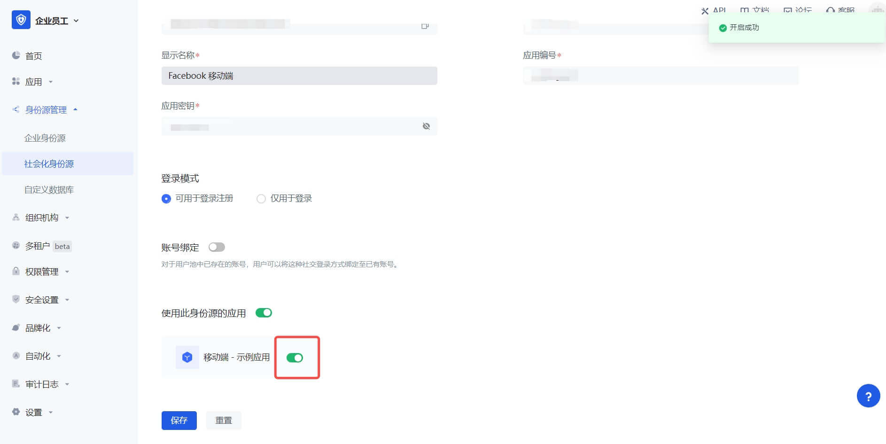

3.3 在登录页面体验 Facebook 第三方登录（如 [终端用户预览图](#终端用户预览图) 所示）。