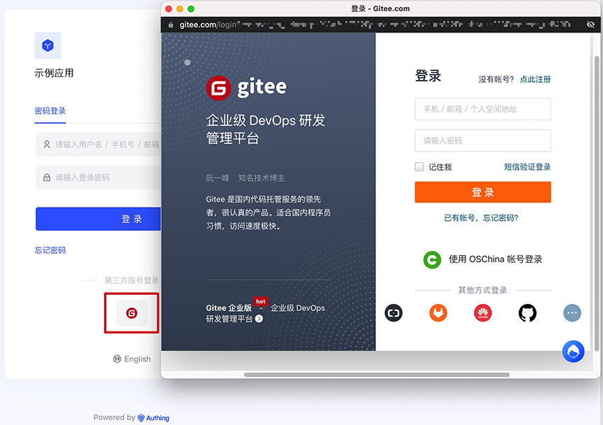
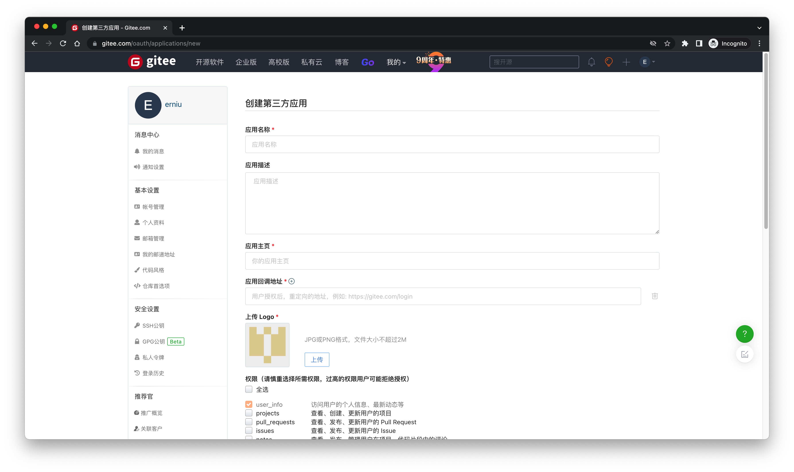
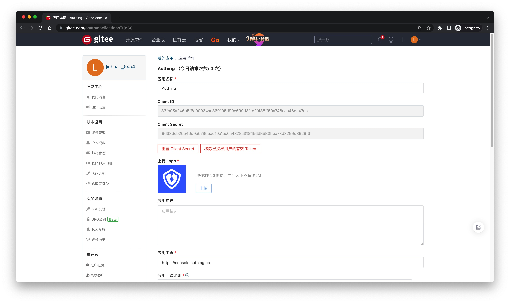
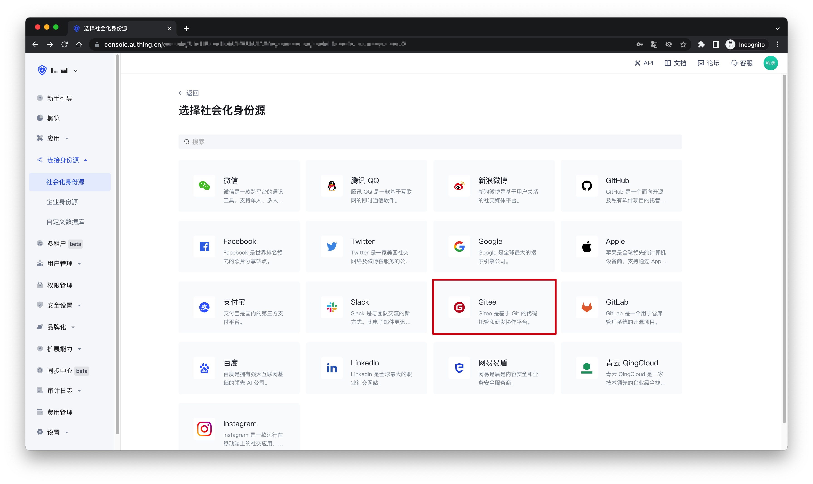
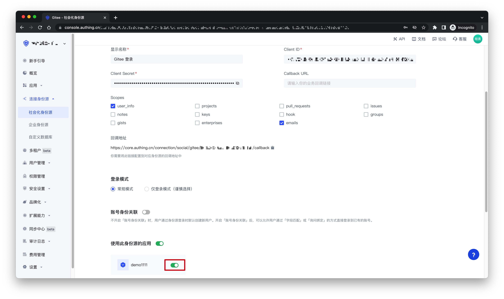
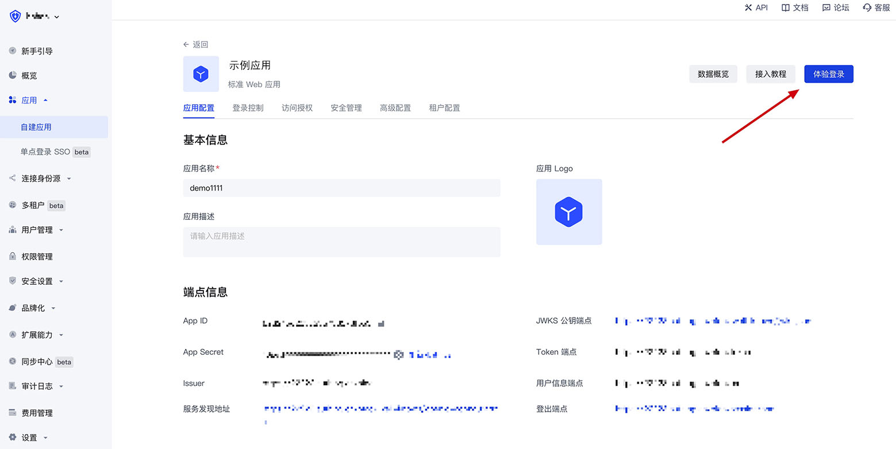
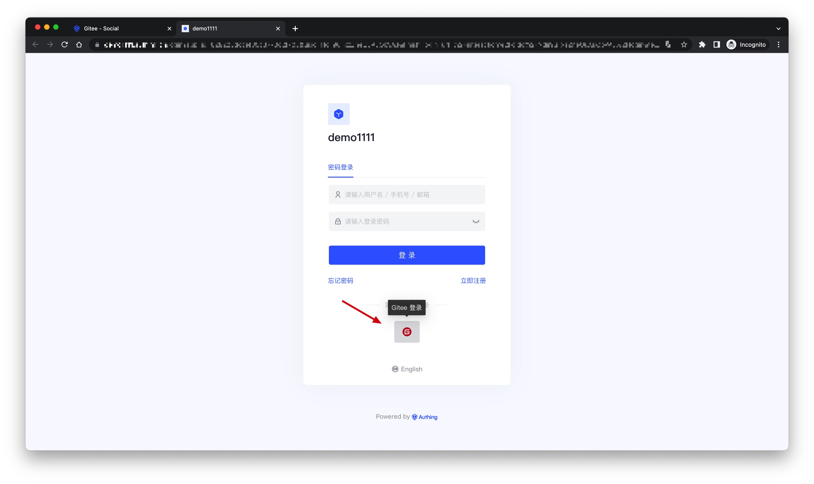

# Gitee 

<LastUpdated />

## 场景介绍

- **概述**：Gitee 社会化登录是用户以 Gitee 为身份源安全登录第三方应用或者网站。在 {{$localeConfig.brandName}} 中配置并开启 Gitee 的社会化登录，即可实现通过 {{$localeConfig.brandName}} 快速获取 Gitee 基本开放的信息和帮助用户实现免密登录功能。
- **应用场景**：PC 网站
- **终端用户预览图**：

## 注意事项

- 如果你还没有 Gitee 账号，请先前往 [gitee.com](https://gitee.com/signup)注册账号
- 如果你未开通 {{$localeConfig.brandName}} 控制台账号，请先前往 [{{$localeConfig.brandName}} 控制台](https://authing.cn/) 注册开发者账号

## 第一步：在 Gitee 创建一个 OAuth 应用

进入 Gitee 的应用管理页面，点击「**创建应用**」：

在创建应用页面，配置以下信息：

- 应用回调地址：填写`https://core.authing.cn/connection/social/{唯一标识}/{用户池ID}/callback`，你需要将其中的 `{唯一标识}` 替换为你正在 {{$localeConfig.brandName}} 创建的身份源所填写的`唯一标识`，`{用户池ID}` 替换成你的 [用户池 ID](/guides/faqs/get-userpool-id-and-secret.md)

最后点击「**创建应用**」，创建完成之后，你需要记录下`Client ID`和`Client Secret`，下一步需要用到。

## 第二步：在 {{$localeConfig.brandName}} 控制台配置 Gitee 应用配置

2.1 请在 {{$localeConfig.brandName}} 控制台的「社会化身份源」页面，点击「创建社会化身份源」按钮，进入「选择社会化身份源」页面。

2.2 在「选择社会化身份源」页面，点击「Gitee」卡片。

2.3 在「Gitee」配置页面，填写相关的字段信息。

| 字段          | 描述|
| ------------- | ------------------ |
| 唯一标识      | a. 唯一标识由小写字母、数字、- 组成，且长度小于 32 位。 b. 这是此连接的唯一标识，设置之后不能修改。|
| 显示名称      | 这个名称会显示在终端用户的登录界面的按钮上。  |
| Client ID     | 上一步获取的 Gitee 应用 ID。 |
| Client Secret | 上一步获取的 Gitee 应用 Secret。 |
| Callback URL  | 可以填写你的业务回调地址，用户完成登录后，浏览器将会跳转到该地址。|
| Scopes        | 默认情况下，{{$localeConfig.brandName}} 只会向用户申请基础用户信息（如头像、昵称等）的授权，如果你需要更多高级权限，可以勾选上对应的选项。                   |
| 登录模式      | 开启「仅登录模式」后，只能登录既有账号，不能创建新账号，请谨慎选择。 |
| 账号身份关联  | 不开启「账号身份关联」时，用户通过身份源登录时默认创建新用户。开启「账号身份关联」后，可以允许用户通过「字段匹配」或「询问绑定」的方式直接登录到已有的账号。 |

2.4 配置完成后，点击「创建」或者「保存」按钮完成创建。

## 第三步：开发接入

- **推荐开发接入方式**：使用托管登录页
- **优劣势描述**：运维简单，由 {{$localeConfig.brandName}} 负责运维。每个用户池有一个独立的二级域名；如果需要嵌入到你的应用，需要使用弹窗模式登录，即：点击登录按钮后，会弹出一个窗口，内容是 {{$localeConfig.brandName}} 托管的登录页面，或者将浏览器重定向到 {{$localeConfig.brandName}} 托管的登录页。
- **详细接入方法**：

  3.1 在 {{$localeConfig.brandName}} 控制台创建一个应用，详情查看：[如何在 {{$localeConfig.brandName}} 创建一个应用](/guides/app-new/create-app/create-app.md)

  3.2 在已创建好的「Gitee」身份源连接详情页面，开启并关联一个在 {{$localeConfig.brandName}} 控制台创建的应用

  3.3 点击 {{$localeConfig.brandName}} 控制台的应用「体验登录」按钮，在弹出的登录窗口体验「Gitee」登录

  
  
