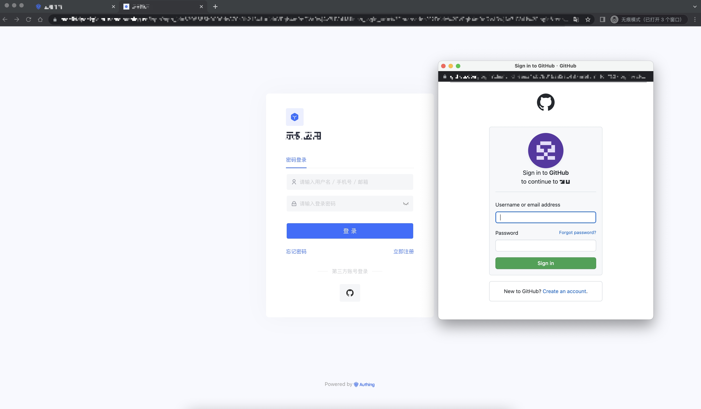
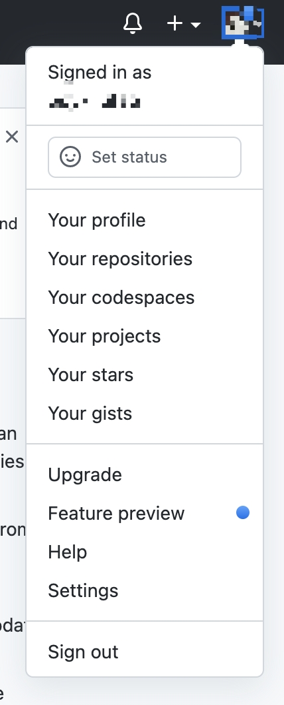
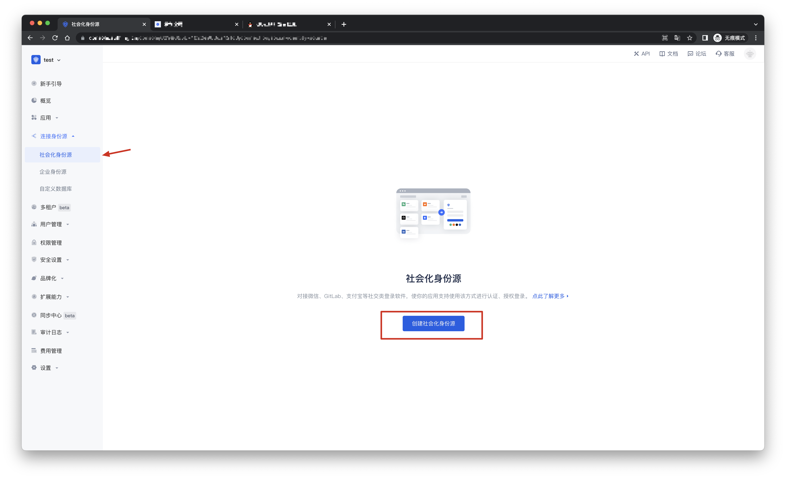
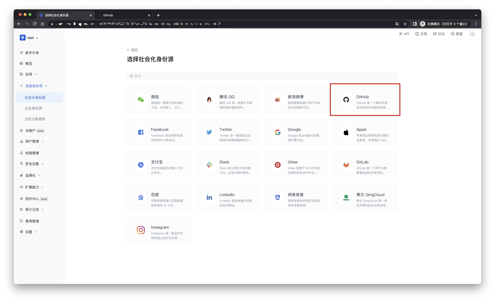
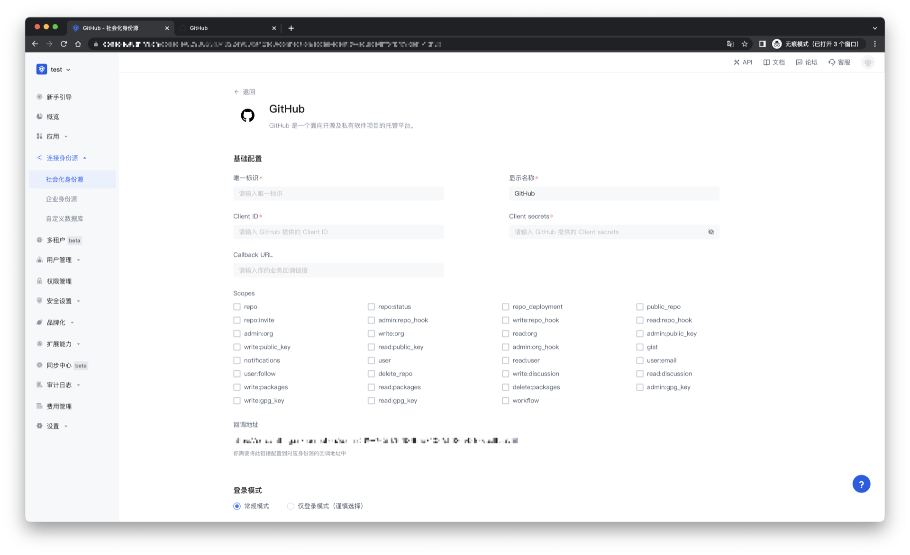
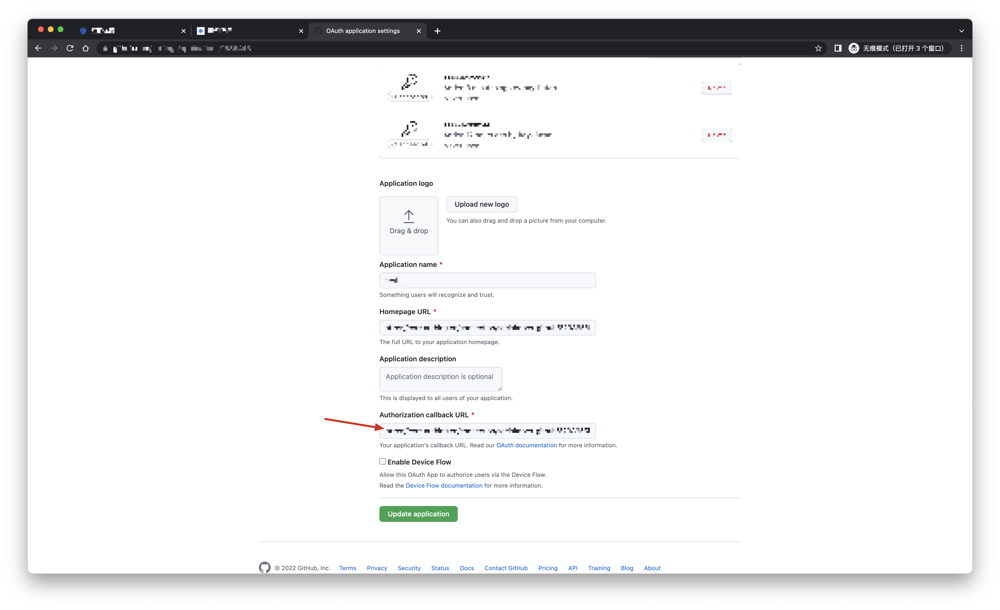
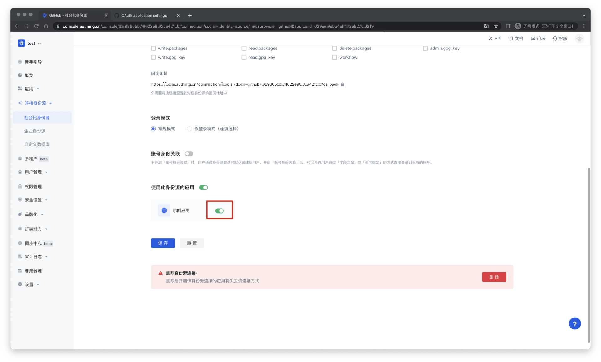
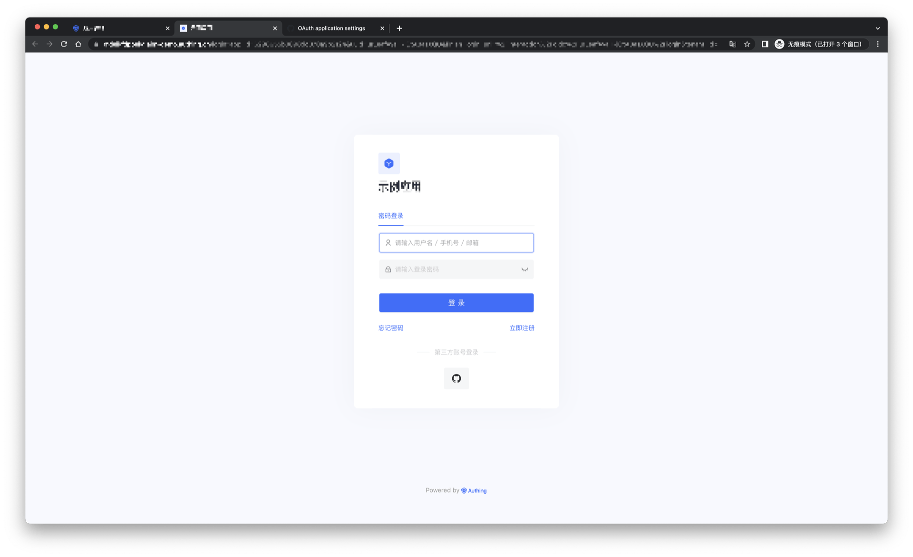

# Github 社会化登录

<LastUpdated/>

## 场景介绍

- **概述**：Github 社会化登录是用户以 Github 为身份源安全登录第三方应用或者网站。在 {{$localeConfig.brandName}} 中配置并开启 Github 的社会化登录，即可实现通过 {{$localeConfig.brandName}} 快速获取 Github 基本开放的信息和帮助用户实现免密登录功能。
- **应用场景**：创建 OAuth 应用程序
- **终端用户预览图**：

## 注意事项：

- 如果您未开通 Github 账号，请先前往 [GitHub](https://www.github.com) 注册开发者账号。
- 请按照 [GitHub 文档](https://docs.github.com/cn/developers/apps/building-oauth-apps/creating-an-oauth-app)指引创建一个 GitHub OAuth 应用，并记录应用的 Client ID 和 Client Secret。
- 如果您未开通 {{$localeConfig.brandName}} 控制台账号，请先前往 [{{$localeConfig.brandName}} 控制台](https://authing.cn/) 注册开发者账号。

## 步骤1：在 Github 创建一个 OAuth 应用程序

- 在 Github 任何页面的右上角，单击您的个人资料照片，然后单击 Settings（设置）。

- 在左侧栏中，单击 <> 开发者设置。

- 在左侧边栏中，单击 OAuth 应用程序。

- 单击 New OAuth App（新建 OAuth 应用程序）。

- 在“Application name（应用程序名称）”中，输入应用程序的名称。

- 在“Homepage URL（主页 URL）”中，输入应用程序网站的完整 URL。

- 在“Authorization callback URL（授权回调 URL）”中，输入应用程序的回调 URL。

创建应用过程中，需要配置允许的回调地址，请使用以下设置： https://core.authing.cn/connection/social/github/:userPoolId/callback

> 请将 :userPoolId 替换为你的 {{$localeConfig.brandName}}控制台的用户池 ID 

## 步骤2：在 {{$localeConfig.brandName}} 控制台配置 Github

2.1 请在 {{$localeConfig.brandName}}  控制台 的「社会化身份源」页面，点击「创建社会化身份源」按钮，进入「选择社会化身份源」页面。

2.2 请在  {{$localeConfig.brandName}}  控制台 的「社会化身份源」-「选择社会化身份也」页面，点击「Github」身份源按钮，进入 「Github 登录模式」页面。

2.3 请在  {{$localeConfig.brandName}}  控制台 的「社会化身份源」-「Github」页面，配置相关的字段信息。

| 字段/功能    | 描述                                                         |
| ----- | ------------ | ------------------------------------------------------------ |
| 唯一标识     | a.唯一标识由小写字母、数字、- 组成，且长度小于 32 位。b.这是此连接的唯一标识，设置之后不能修改。 |
| 显示名称     | 这个名称会显示在终端用户的登录界面的按钮上。                 |
| Client ID      | Github 编号，需要在  Github 上获取。                  |
| Client secrets     |  Github 密钥，需要在 Github 上获取。                   |
| Callback URL     | 可以填写你的业务回调地址，用户完成登录后，浏览器将会跳转到该地址。 |
| Scopes     | 默认情况下，{{$localeConfig.brandName}} 只会向用户申请基础用户信息（如头像、昵称等）的授权，如果你需要更多高级权限，可以勾选上对应的选项。 |
| 回调地址     |  Github 有效跳转 URI。需要将此 URL 配置到  Github上。 |
| 登录模式     | 开启「仅登录模式」后，只能登录既有账号，不能创建新账号，请谨慎选择。 |
| 账号身份关联 | 不开启「账号身份关联」时，用户通过身份源登录时默认创建新用户。开启「账号身份关联」后，可以允许用户通过「字段匹配」或「询问绑定」的方式直接登录到已有的账号。a.关联方式：选择 |

配置完成后，点击「创建」或者「保存」按钮完成创建。

在 {{$localeConfig.brandName}} 控制台上创建完 Github 身份源后，需要将回调地址配置到 Github 上的 Authorization callback URL。

## 步骤3：开发接入

- **推荐开发接入方式**：使用托管登录页

- **优劣势描述**：运维简单，由 {{$localeConfig.brandName}} 负责运维。每个用户池有一个独立的二级域名;如果需要嵌入到你的应用，需要使用弹窗模式登录，即：点击登录按钮后，会弹出一个窗口，内容是 {{$localeConfig.brandName}} 托管的登录页面，或者将浏览器重定向到 {{$localeConfig.brandName}} 托管的登录页。

- **详细接入方法**：

3.1 在 {{$localeConfig.brandName}} 控制台创建一个应用，详情查看：[如何在 {{$localeConfig.brandName}} 创建一个应用](https://docs.authing.cn/v2/guides/app/create-app.html)

3.2 在已创建好的 Github 源连接详情页面，开启并关联一个在 {{$localeConfig.brandName}} 控制台创建的应用

3.3 在登录页面体验 Github 第三方登录

