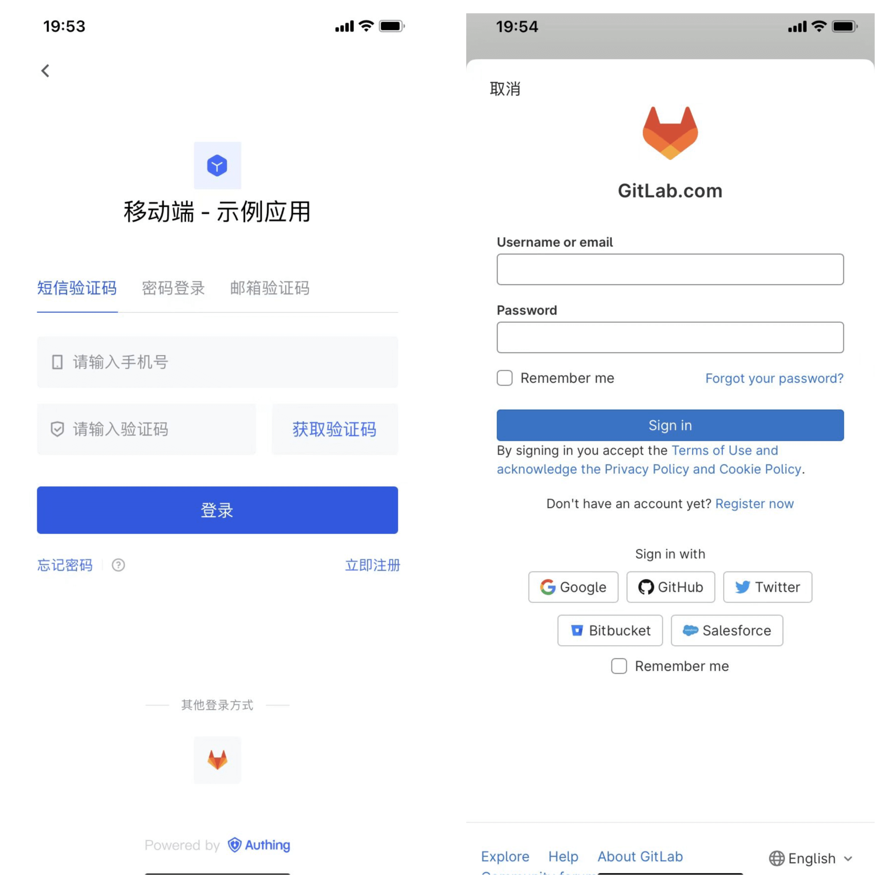
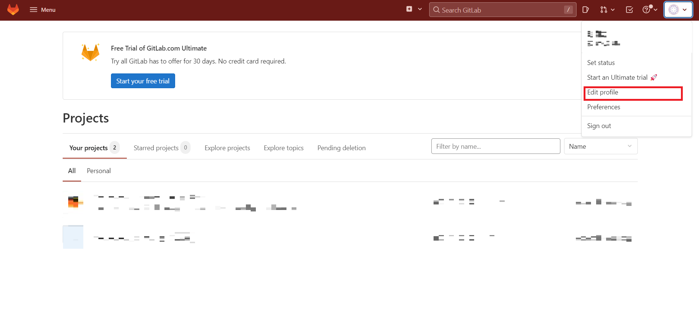
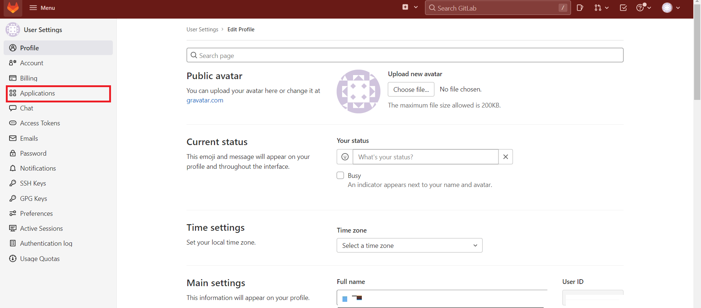
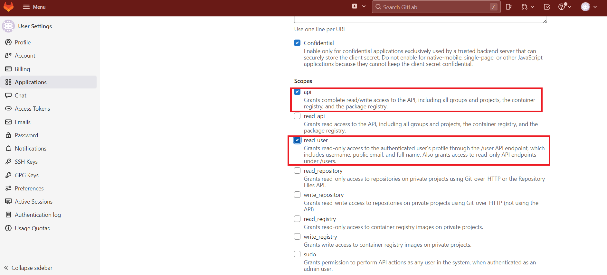
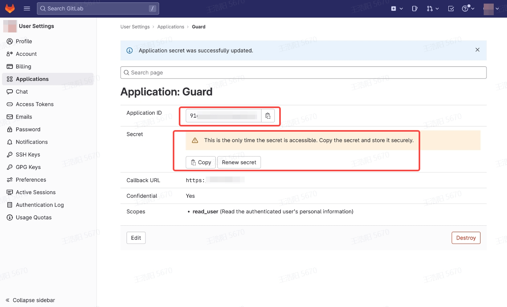
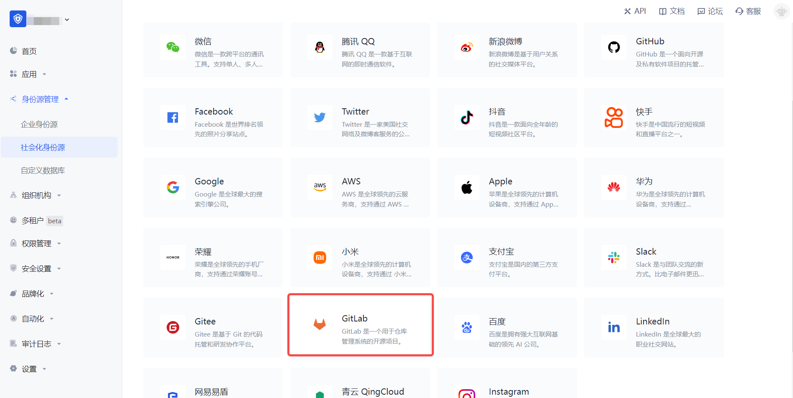
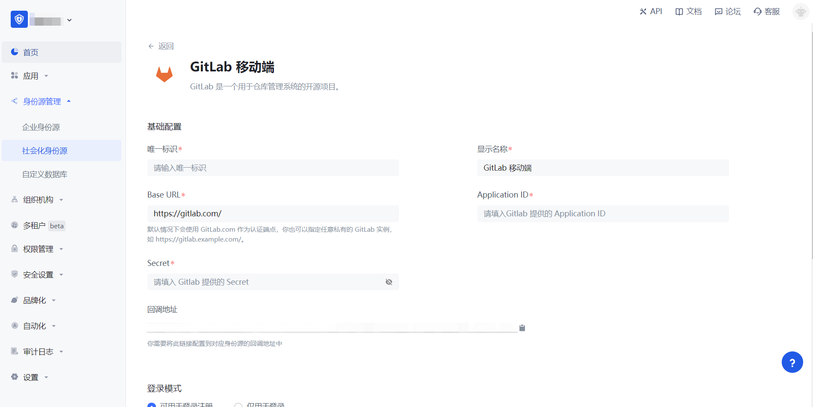
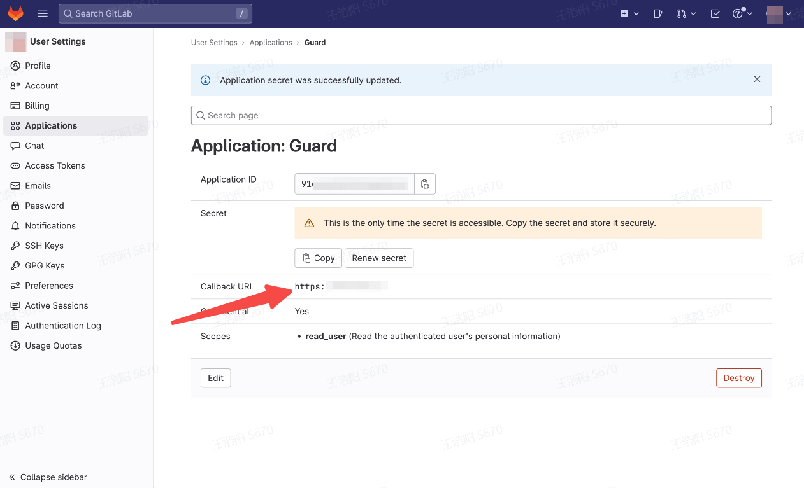
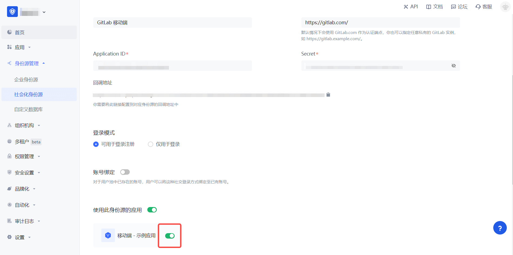

# GitLab 移动端

<LastUpdated/>

## 场景介绍

### 概述

GitLab 社会化登录是用户以 GitLab 为身份源安全登录第三方应用或者网站。在 {{$localeConfig.brandName}} 中配置并开启 GitLab 的社会化登录，即可实现通过 {{$localeConfig.brandName}} 快速获取 GitLab 基本开放的信息和帮助用户实现免密登录功能。

### 应用场景

移动端

### 终端用户预览图

## 注意事项

- 如果你还没有 GitLab 账号，请先前往 [GitLab.com](https://gitlab.com/users/sign_up/) 注册账号。
* 如果你未开通 {{$localeConfig.brandName}} 控制台账号，请先前往 [{{$localeConfig.brandName}} 控制台](https://authing.cn/) 注册开发者账号。

## 第一步：在 GitLab（或者你的 GitLab 实例）上创建一个应用

- 点击右上角个人头像然后点击 **Edit Profile**。

  

- 点击左侧导航栏中 **Applications**。

  

- 创建应用，编辑应用信息 **Name**，**Redirect URI**，添加 **Scopes**：勾选 `api` 、`read_user`。

  

- 点击 **Save Application**。

- 创建完成之后，记录下 **Application ID** 和 **Secret**，下一步需要用到。

  

创建应用过程中，需要配置允许的回调地址，请使用以下设置：`https://core.authing.cn/connection/social/<Unique Identifier>/<USERPOOL_ID>/callback`，你需要将其中的 `<Unique Identifier>` 替换成你的`唯一标识`，`<USERPOOL_ID>` 替换成你的 [用户池 ID](/guides/faqs/get-userpool-id-and-secret.md)

## 第二步：在 {{$localeConfig.brandName}} 控制台配置 GitLab 移动端

2.1 请在 {{$localeConfig.brandName}}  控制台 的「社会化身份源」页面，点击「创建社会化身份源」按钮，进入「选择社会化身份源」页面。

2.2 请在  {{$localeConfig.brandName}}  控制台 的「社会化身份源」-「选择社会化身份源」，点击 「GitLab」身份源卡片，进入 「GitLab 移动端登录模式」页面。

2.3 请在  {{$localeConfig.brandName}}  控制台 的「社会化身份源」-「GitLab 移动端」页面，配置相关的字段信息。

| 字段/功能    | 描述                                                         |
| ------------ | ------------------------------------------------------------ |
| 唯一标识     | a.唯一标识由小写字母、数字、- 组成，且长度小于 32 位。b.这是此连接的唯一标识，设置之后不能修改。 |
| 显示名称     | 这个名称会显示在终端用户的登录界面的按钮上。                 |
| Base URL | 默认情况下会使用 GitLab.com 作为认证端点，你也可以指定任意私有的 GitLab 实例，如 `https://gitlab.example.com/`。 |
| Application ID | 上一步获取的 GitLab 应用 ID。 |
| Secret |  上一步获取的 GitLab 应用密钥。  |
| 回调地址     | GitLab 有效跳转 URI。需要将此 URL 配置到  GitLab 应用的 `Redirect URI` 上。 |
| 登录模式     | 开启「仅登录模式」后，只能登录既有账号，不能创建新账号，请谨慎选择。 |
| 账号身份关联 | 不开启「账号身份关联」时，用户通过身份源登录时默认创建新用户。开启「账号身份关联」后，可以允许用户通过「字段匹配」的方式直接登录到已有的账号。 |

配置完成后，点击「创建」或者「保存」按钮完成创建。

在 {{$localeConfig.brandName}} 控制台上创建完「GitLab 移动端」身份源后，需要将回调地址配置到 GitLab 上的 Callback URL。

## 第三步：开发接入

- **推荐开发接入方式**：SDK

- **优劣势描述**：运维简单，由 {{$localeConfig.brandName}} 负责运维。每个用户池有一个独立的二级域名;如果需要嵌入到你的应用，需要使用弹窗模式登录，即：点击登录按钮后，会弹出一个窗口，内容是 {{$localeConfig.brandName}} 托管的登录页面，或者将浏览器重定向到 {{$localeConfig.brandName}} 托管的登录页。

- **详细接入方法**：

3.1 在 {{$localeConfig.brandName}} 控制台创建一个应用，详情查看：[如何在 {{$localeConfig.brandName}} 创建一个应用](/guides/app-new/create-app/create-app.md)

3.2 在已创建好的 GitLab 移动端身份源连接详情页面，开启并关联一个在 {{$localeConfig.brandName}} 控制台创建的应用

3.3 在登录页面体验 GitLab 第三方登录（如 [终端用户预览图](#终端用户预览图) 所示）。
