# GitLab

<LastUpdated />

## 场景介绍

### 概述

GitLab 社会化登录是用户以 GitLab 为身份源安全登录第三方应用或者网站。在 {{$localeConfig.brandName}} 中配置并开启 GitLab 的社会化登录，即可实现通过 {{$localeConfig.brandName}} 快速获取 GitLab 基本开放的信息和帮助用户实现免密登录功能。

### 应用场景

PC 网站

### 终端用户预览图

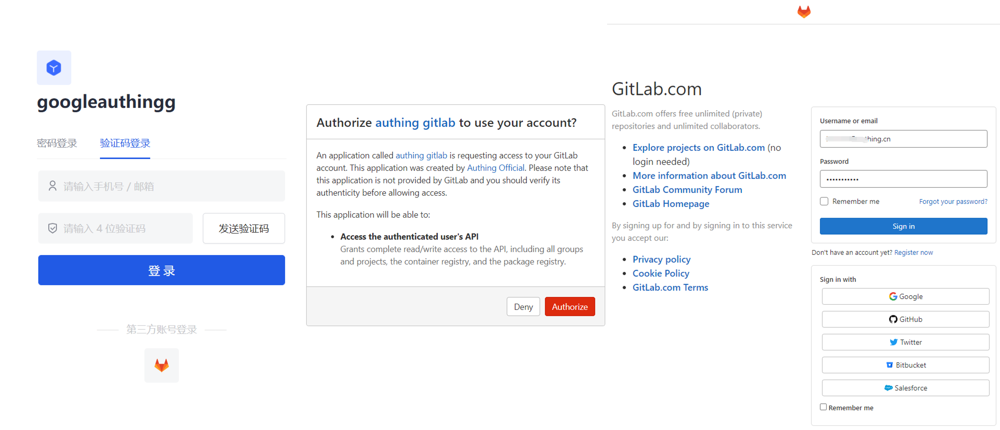

## 准备工作

* 如果你还没有 GitLab 账号，请先前往 [GitLab.com](https://gitlab.com/users/sign_up/) 注册账号。
* 如果你未开通 {{$localeConfig.brandName}} 控制台账号，请先前往 [{{$localeConfig.brandName}} 控制台](https://authing.cn/) 注册开发者账号。

## 配置步骤

### 第一步：在 {{$localeConfig.brandName}} 控制台配置 GitLab 的唯一标识

1. 在 {{$localeConfig.brandName}} 控制台的 **身份源管理->社会化身份源**，点击 **创建社会化身份源** 按钮，进入 **选择社会化身份源** 页面。

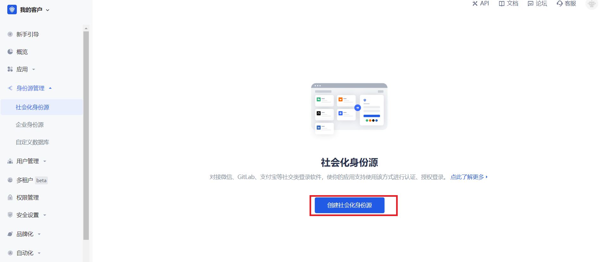

2. 点击「GitLab」卡片。

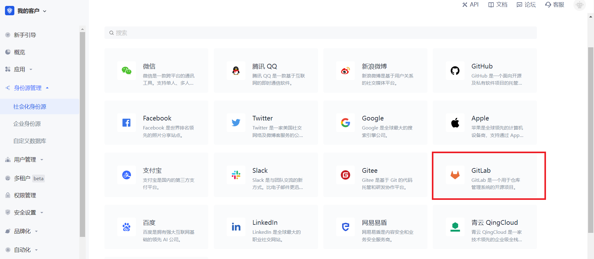

3. 在 **GitLab** 配置页面设置唯一标识。

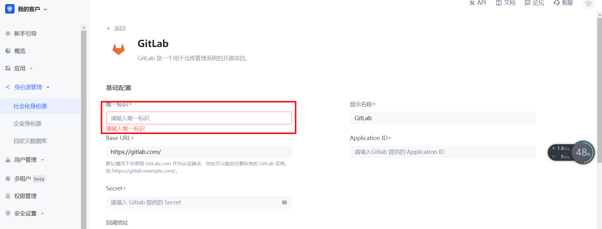

4. 记录下根据唯一标识自动生成的 **回调地址**，之后要用到。先将此页面搁置，之后再来配置其他信息。

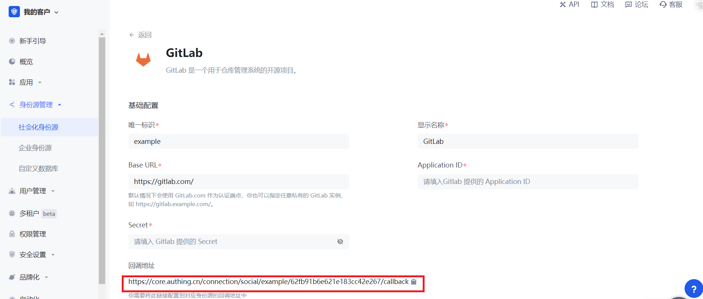

### 第二步：在 GitLab（或者你的 GitLab 实例）上创建一个应用

1. 点击右上角个人头像然后点击 **Edit Profile**。

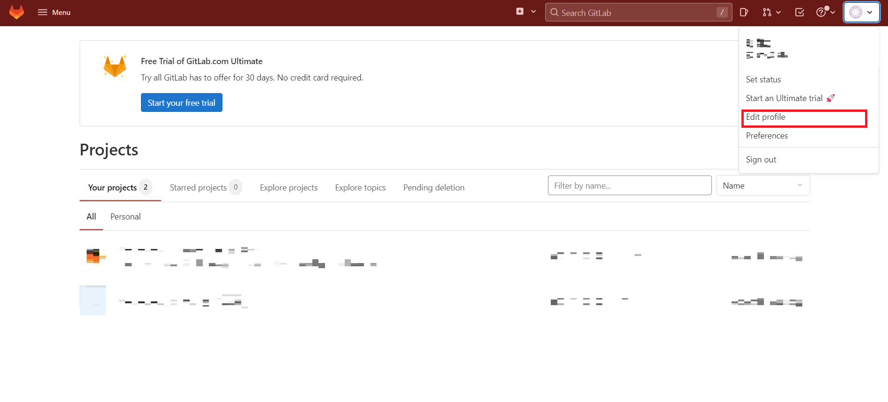

2. 点击左侧导航栏中 **Applications**。

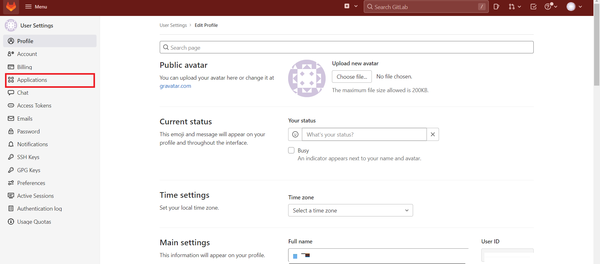

3. 配置应用名称。

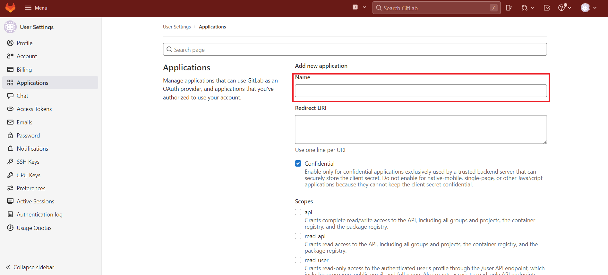

4. 配置 **Redirect URI** ，将刚才记录的回调地址填写上去。

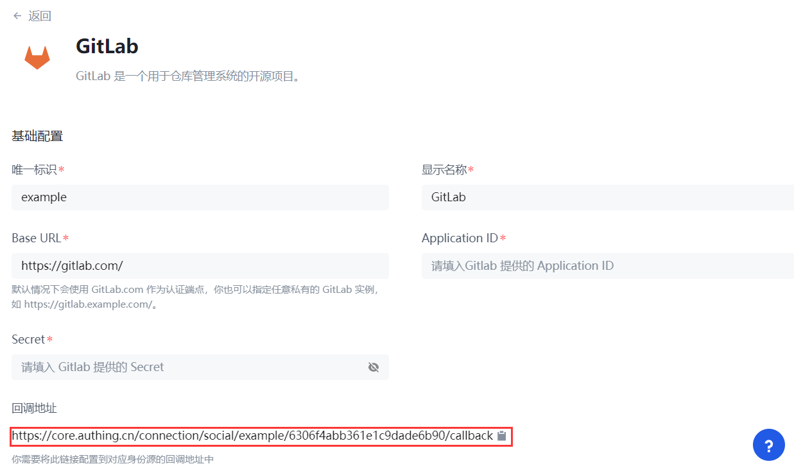

5. 添加 **Scopes**：勾选 `api` 和 `read_user`。

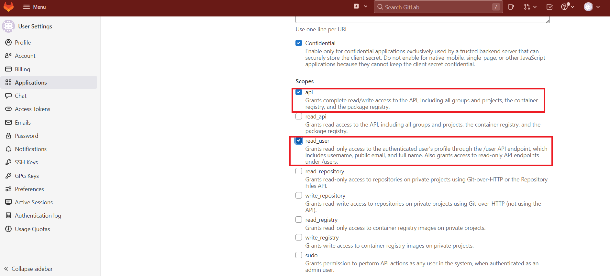

6. 点击 **Save Application**。

7. 创建完成之后，记录下 **Application ID** 和 **Secret**，下一步需要用到。

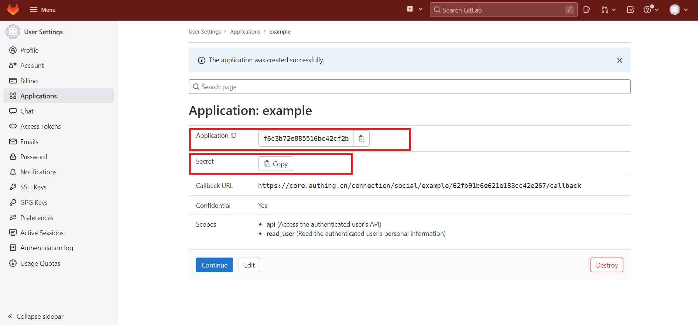

### 第三步：在控制台将 Gitlab 其他信息配置完成

1. 填写刚才记录的 **Application ID** 和 **Secret**。

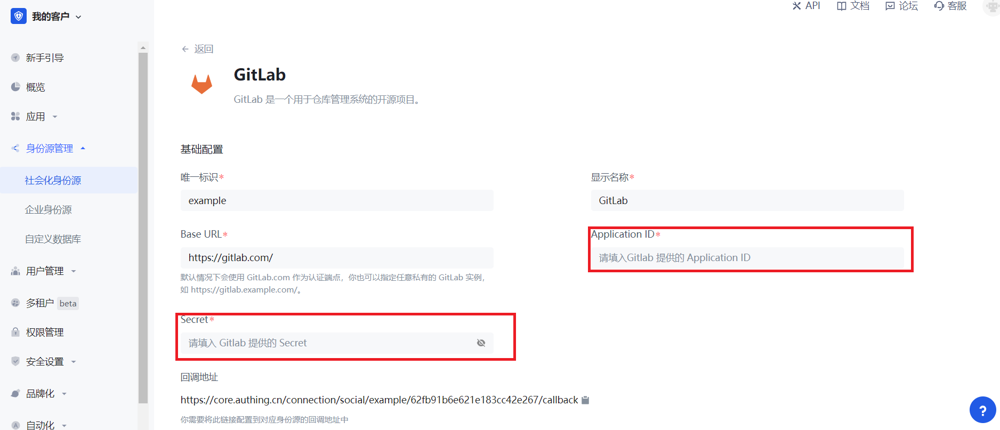

2. 选择修改其他信息。如不修改，则使用默认选项（本步可选）。

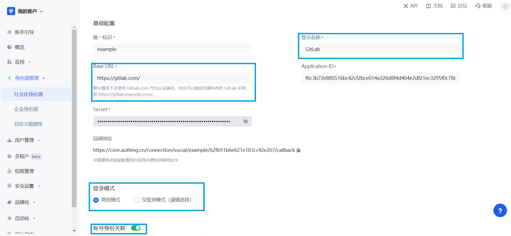

| 字段 | 描述 |
| ---- | ---- |
| 唯一标识 |* 唯一标识由小写字母、数字、`-` 组成，且长度小于 32 位。 * 这是此连接的唯一标识，设置之后不能修改。 |
| 显示名称 | 这个名称会显示在终端用户的登录界面的按钮上。  |
| Base URL | 默认情况下会使用 GitLab.com 作为认证端点，你也可以指定任意私有的 GitLab 实例，如 `https://gitlab.example.com/`。 |
| Application ID | 上一步获取的 GitLab 应用 ID。  |
| Secret  | 上一步获取的 GitLab 应用密钥。   |
| 登录模式 | 开启 **仅登录模式** 后，只能登录既有账号，不能创建新账号，请谨慎选择。 |
| 账号身份关联 | 不开启 **账号身份关联** 时，用户通过身份源登录时默认创建新用户；开启 **账号身份关联** 后，可以允许用户通过 **字段匹配** 或 **询问绑定** 的方式直接登录到已有的账号。|

3. 配置完成后，点击 **创建** 或者 **保存** 按钮完成创建。

### 第四步：开发接入

#### 推荐开发接入方式

使用托管登录页。

#### 优劣势描述

运维简单，由 {{$localeConfig.brandName}} 负责运维。每个用户池有一个独立的二级域名。如果需要嵌入到你的应用，需要使用弹窗模式登录，即：点击 **登录** 按钮后，会弹出一个窗口，内容是 {{$localeConfig.brandName}} 托管的登录页面，或者将浏览器重定向到 {{$localeConfig.brandName}} 托管的登录页。

#### 详细接入方法

1. 在 {{$localeConfig.brandName}} 控制台创建一个应用，详情查看：[如何在 {{$localeConfig.brandName}} 创建一个应用](/guides/app-new/create-app/create-app.md)。

2. 在已经创建好的「GitLab」身份源连接详情页面，开启并关联一个在 {{$localeConfig.brandName}} 控制台创建的应用。

3. 点击 {{$localeConfig.brandName}} 控制台的应用 **体验登录** 按钮，在弹出的登录窗口体验 GitLab 登录。

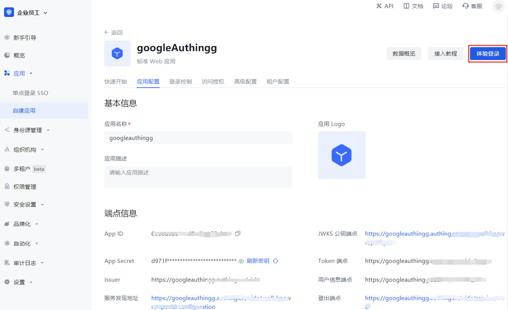
