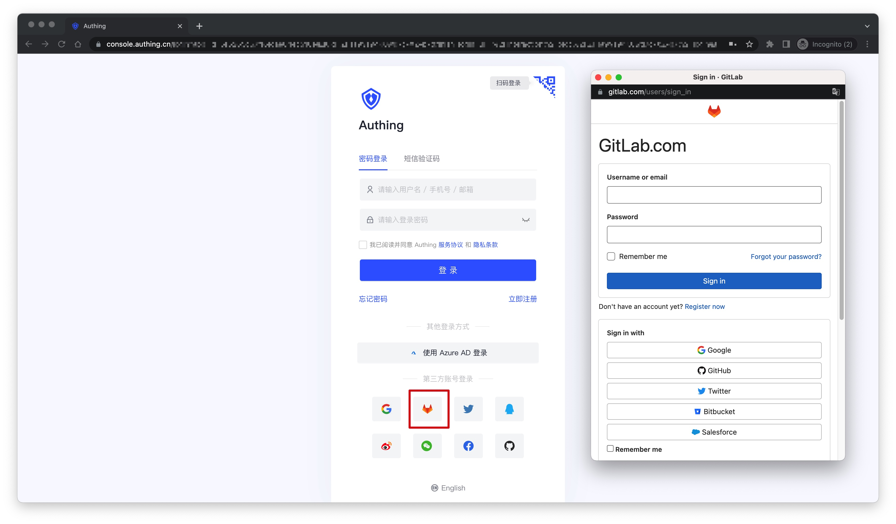
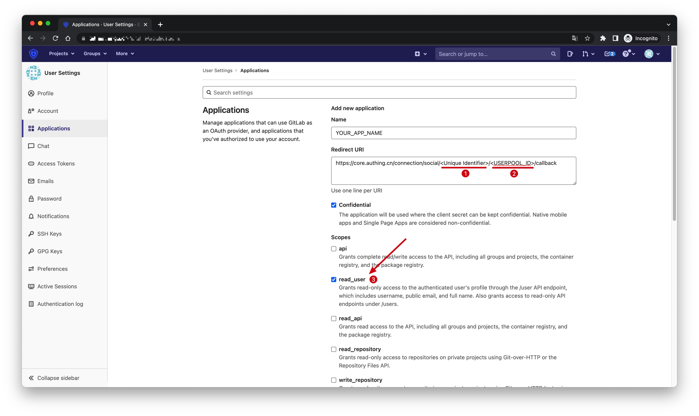
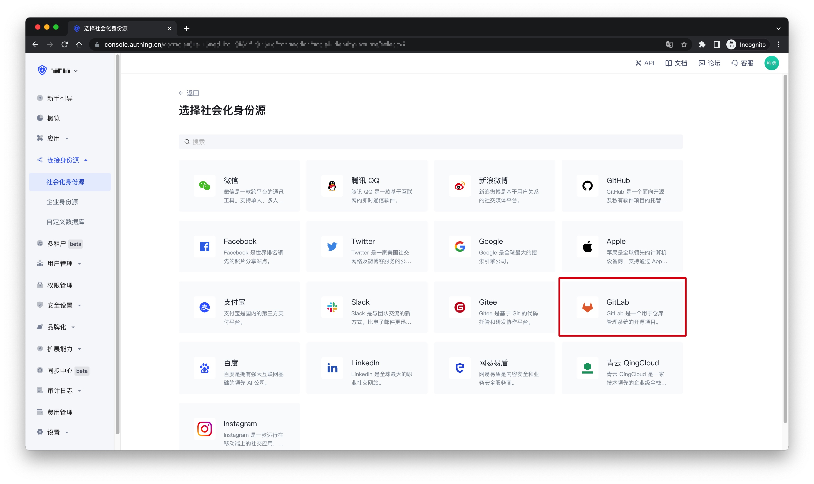
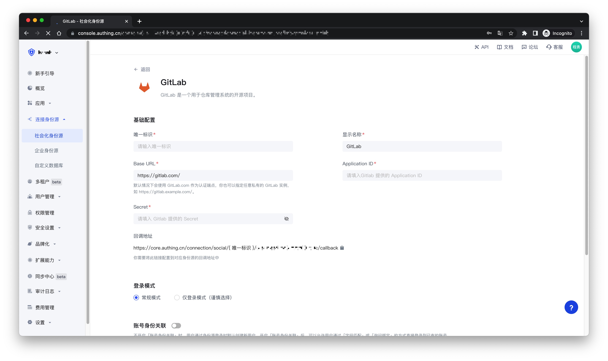
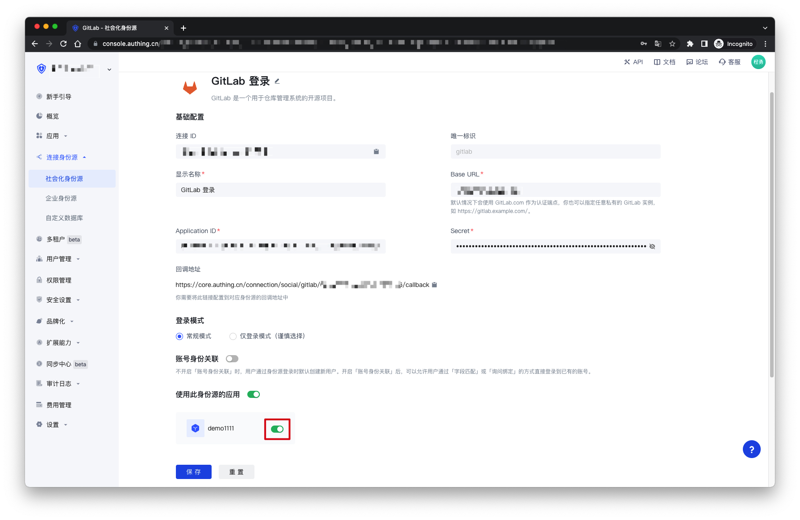
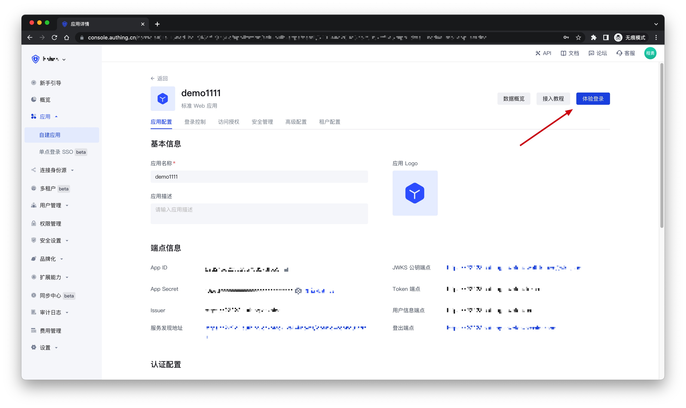
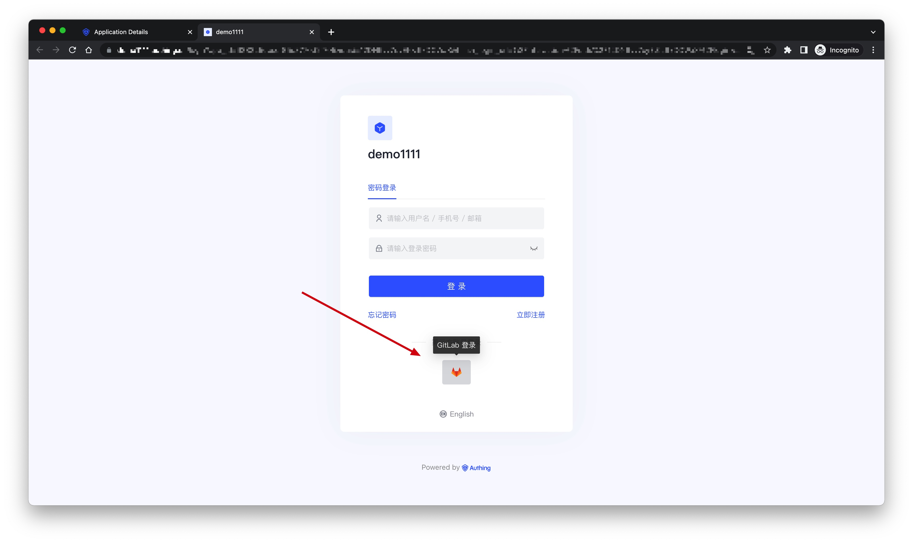

# GitLab

<LastUpdated />

## 场景介绍

- **概述**：GitLab 社会化登录是用户以 GitLab 为身份源安全登录第三方应用或者网站。在 {{$localeConfig.brandName}} 中配置并开启 GitLab 的社会化登录，即可实现通过 {{$localeConfig.brandName}} 快速获取 GitLab 基本开放的信息和帮助用户实现免密登录功能。
- **应用场景**：PC 网站
- **终端用户预览图**：

## 注意事项

- 如果您还没有 GitLab 账号，请先前往 [GitLab.com](https://gitlab.com/users/sign_up/)注册账号
- 如果您未开通 {{$localeConfig.brandName}} 控制台账号，请先前往 [{{$localeConfig.brandName}} 控制台](https://authing.cn/) 注册开发者账号

## 步骤 1：在 GitLab（或者你的 GitLab 实例）创建一个应用

进入 GitLab（或者你的 GitLab 实例）的应用管理页面，点击「**New Application**」：

在创建应用页面，配置以下信息：

- Redirect URI：填写`https://core.authing.cn/connection/social/<Unique Identifier>/<USERPOOL_ID>/callback`，你需要将其中的 `<Unique Identifier>` 替换成你的`唯一标识`，`<USERPOOL_ID>` 替换成你的 [用户池 ID](/guides/faqs/get-userpool-id-and-secret.md)
- Scopes：**请确保勾选了`read_user`**

最后点击「**Save Application**」，创建完成之后，你需要记录下`Application ID`和`Secret`，下一步需要用到。

## 步骤 2：在 {{$localeConfig.brandName}} 控制台配置 GitLab 应用配置

2.1 请在 {{$localeConfig.brandName}} 控制台的「社会化身份源」页面，点击「创建社会化身份源」按钮，进入「选择社会化身份源」页面。

2.2 在「选择社会化身份源」页面，点击「GitLab」卡片。

2.3 在「GitLab」配置页面，填写相关的字段信息。

| 字段           | 描述                                                                                                                                                         |
| -------------- | ------------------------------------------------------------------------------------------------------------------------------------------------------------ |
| 唯一标识       | a. 唯一标识由小写字母、数字、- 组成，且长度小于 32 位。 b. 这是此连接的唯一标识，设置之后不能修改。                                                     |
| 显示名称       | 这个名称会显示在终端用户的登录界面的按钮上。                                                                                                                 |
| Base URL       | 默认情况下会使用 GitLab.com 作为认证端点，你也可以指定任意私有的 GitLab 实例，如 https://gitlab.example.com/。                                               |
| Application ID | 上一步获取的 GitLab 应用 ID。                                                                                                                                |
| Secret         | 上一步获取的 GitLab 应用密钥。                                                                                                                               |
| 登录模式       | 开启「仅登录模式」后，只能登录既有账号，不能创建新账号，请谨慎选择。                                                                                         |
| 账号身份关联   | 不开启「账号身份关联」时，用户通过身份源登录时默认创建新用户。开启「账号身份关联」后，可以允许用户通过「字段匹配」或「询问绑定」的方式直接登录到已有的账号。 |

2.4 配置完成后，点击「创建」或者「保存」按钮完成创建。

## 步骤 3：开发接入

- **推荐开发接入方式**：使用托管登录页
- **优劣势描述**：运维简单，由 {{$localeConfig.brandName}} 负责运维。每个用户池有一个独立的二级域名；如果需要嵌入到你的应用，需要使用弹窗模式登录，即：点击登录按钮后，会弹出一个窗口，内容是 {{$localeConfig.brandName}} 托管的登录页面，或者将浏览器重定向到 {{$localeConfig.brandName}} 托管的登录页。
- **详细接入方法**：

  3.1 在 {{$localeConfig.brandName}} 控制台创建一个应用，详情查看：[如何在 {{$localeConfig.brandName}} 创建一个应用](/guides/app-new/create-app/create-app.md)

  3.2 在已创建好的「GitLab」身份源连接详情页面，开启并关联一个在 {{$localeConfig.brandName}} 控制台创建的应用
  

  3.3 点击 {{$localeConfig.brandName}} 控制台的应用「体验登录」按钮，在弹出的登录窗口体验「GitLab」登录
  

