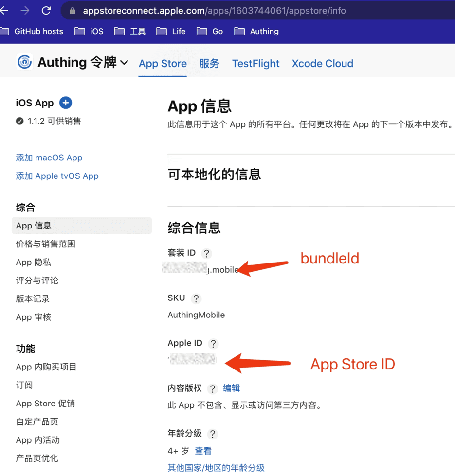
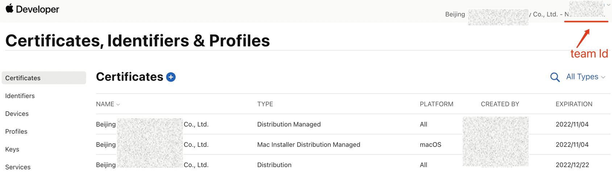
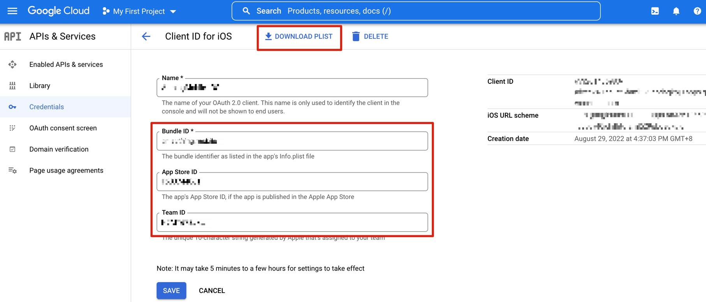

# Google 移动端

<LastUpdated />

## 场景介绍

### 概述

Authing 为开发者提供了一种在移动端（iOS 或安卓）应用中快速跳转谷歌登录获取用户信息的方式，通过简单地调用 Authing 移动端 SDK 可以完成谷歌账号接入。

### 应用场景

移动 APP

### 终端用户预览图

在移动应用中拉起谷歌页面进行登录。

## 准备工作

* 如果你未开通 Google 账号，请先前往 [Google](https://accounts.google.com/signin/v2/identifier?hl=zh-TW&continue=https%3A%2F%2Fwww.google.com%2F&ec=GAlAmgQ&flowName=GlifWebSignIn&flowEntry=AddSession) 注册。

* 如果你未开通 Authing 控制台账号，请先前往 [{{$localeConfig.brandName}} Console 控制台](https://authing.cn/) 注册开发者账号。

## 配置步骤

### 第一步：在谷歌开放平台分别创建三个 OAuth client ID

#### Web application

1. 打开 [Google API Console Credentials](https://console.cloud.google.com/apis/credentials) 控制台。

2. 在 **Credentials** 页面，选择顶部 **CREATE CREDENTIALS->OAuth client ID**。

3. 选择 **Application type** 为 **Web application**，填写 **Name** 及 **Authorized redirect URIs**（暂写一个合法的地址），点击 **CREATE** 按钮。

4. 创建成功后，在下一个页面你可以获取到此应用的 **Your Client ID** 和 **Your Client Secret**，记录下来。

#### Android

1. 打开 [Google API Console Credentials](https://console.cloud.google.com/apis/credentials) 控制台。

2. 在 **Credentials** 页面，选择顶部 **CREATE CREDENTIALS->OAuth client ID**。

3. 选择 **Application type** 为 **Android**，填写 **Name**、**Package name** 和 **SHA-1 certificate fingerprint**，点击 **CREATE** 按钮。

::: hint-info
* 需要登录你的移动端应用后台获取 **Package name**（安卓应用包名）和 **SHA-1 certificate fingerprint**（安卓应用的 SHA-1）。
* 设置保存后到生效需一段时间，请耐心等待。
:::

4. 在查看页面下载并保存 JSON 文件，交给安卓开发工程师（有关后续详细操作，请参阅 Google 移动端开发者文档 - Android）。

#### iOS

1. 打开 [Google API Console Credentials](https://console.cloud.google.com/apis/credentials) 控制台。

2. 在 **Credentials** 页面，选择顶部 **CREATE CREDENTIALS->OAuth client ID**。

3. 选择 **Application type** 为 **iOS**，填写 **Bundle ID**、**App Store ID** 和 **Team ID**，点击 **CREATE** 按钮。

::: img-description
Bundle ID 和 App Store ID
:::

::: img-description
Team ID
:::

::: hint-info
* 可以在 [Apple Store Connect](https://appstoreconnect.apple.com/apps) 获取 **Bundle ID** 和 **App Store ID**。
* 可以在 [Apple 开发者后台](https://developer.apple.com/account/resources/certificates/list) 获取 **Team ID**。
* 设置保存后到生效需一段时间，请耐心等待。
:::

4. 下载并保存相应的 PLIST 文件并交给 iOS 开发工程师（有关后续详细操作，请参阅 Google 移动端开发者文档 - iOS）。

### 第二步：在 Authing 控制台配置谷歌移动端登录

1. 在 Atuhing 控制台 的 **社会化身份源** 页面点击 **创建社会化身份源** 按钮，进入 **选择社会化身份源** 页面。

2. 在 Authing 控制台 的 **身份源管理->社会化身份源->选择社会化身份** 页面，点击 「Google」身份源卡片，进入 Google 登录模式选择页面。

3. 选择 **Google 移动端** 进入。

4. 在 Authing 控制台 的 **Google 移动端** 页面，配置相关字段信息。

<table>
<tr>
<th>字段</th>
<th>说明</th>
</tr>

<tr>
<td>唯一标识</td>
<td>
<ul>
<li>唯一标识由小写字母、数字、- 组成，且长度小于 32 位。</li>
<li>这是此连接的唯一标识，设置之后不能修改。</li>
</ul></td>
</tr>

<tr>
<td>显示名称</td>
<td>这个名称会显示在终端用户的登录界面的按钮上。</td>
</tr>

<tr>
<td>Client ID</td>
<td>填入 Google 开放平台上<b>Application type</b> 为 <b>Web application</b> 时获取的 <b>Your Client ID</b>。</td>
</tr>

<tr>
<td>Client Secret</td>
<td>填入 Google 开放平台上 <b>Application type</b> 为 <b>Web application</b> 时获取的 <b>Client Secret</b>。</td>
</tr>

<tr>
<td>Callback URL</td>
<td>可以填写你的业务回调地址，用户完成登录后，浏览器将会跳转到该地址。</td>
</tr>

<tr>
<td>回调地址</td>
<td>Google 有效跳转 URI。需要将此 URL 配置到 Google 开放平台上。</td>
</tr>

<tr>
<td>登录模式</td>
<td>开启 <b>仅登录模式</b> 后，只能登录既有账号，不能创建新账号，请谨慎选择。</td>
</tr>

<tr>
<td>账号身份关联</td>
<td>不开启 <b>账号身份关联</b> 时，用户通过身份源登录时默认创建新用户；开启 <b>账号身份关联</b> 后，可以允许用户通过 <b>字段匹配</b> 或 <b>询问绑定</b> 的方式直接登录到已有的账号。</td>
</tr>
</table>

5. 配置完成后，点击 **创建** 或者 **保存** 按钮完成创建。

::: hint-info
在 Authing 控制台上创建完 Google 身份源后，需要将回调地址配置到 Google 开放平台上的 **Authorized redirect URI**。
:::

### 第三步：开发接入

---

#### 推荐开发接入方式

SDK

#### 优劣势描述

运维简单，由 Authing 负责运维。每个用户池有一个独立的二级域名;如果需要嵌入到你的应用，需要使用弹窗模式登录，即：点击登录按钮后，会弹出一个窗口，内容是 Authing 托管的登录页面，或者将浏览器重定向到 Authing 托管的登录页。

#### 详细接入方法

1. 在 Authing 控制台创建一个应用，详情查看：[如何在 Authing 创建一个应用](/guides/app-new/create-app/create-app.md)。

2. 在已创建好的 Google 身份源连接详情页面，开启并关联一个在 Authing 控制台创建的应用。

3. 在登录页面体验 Google 第三方登录（如 [终端用户预览图](#终端用户预览图) 所示）。

