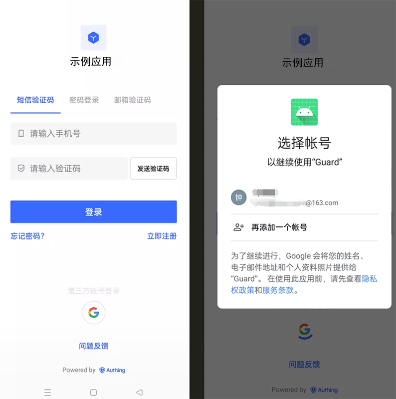
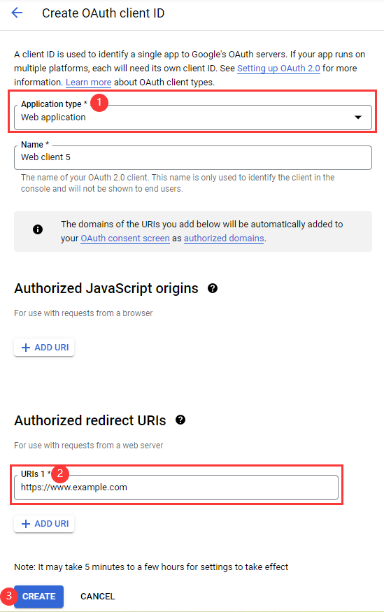
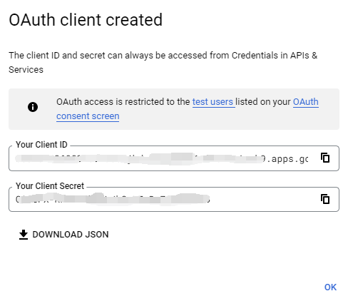
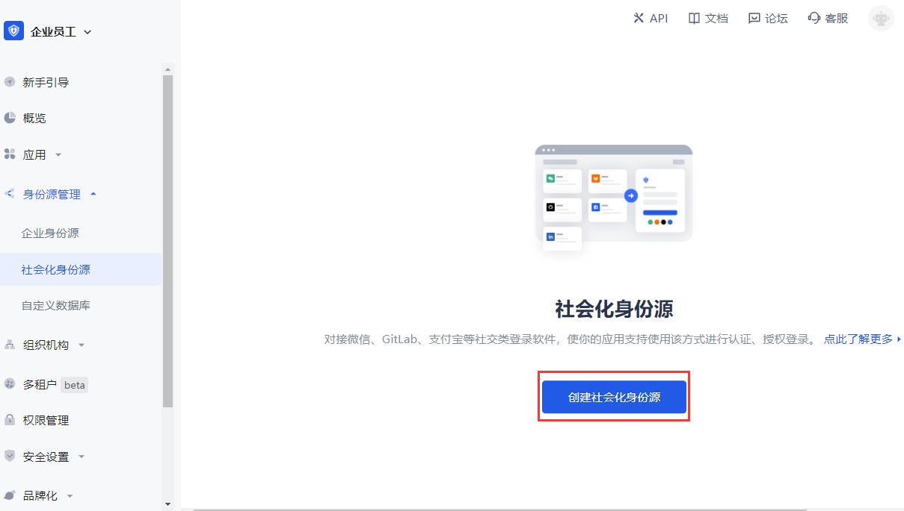
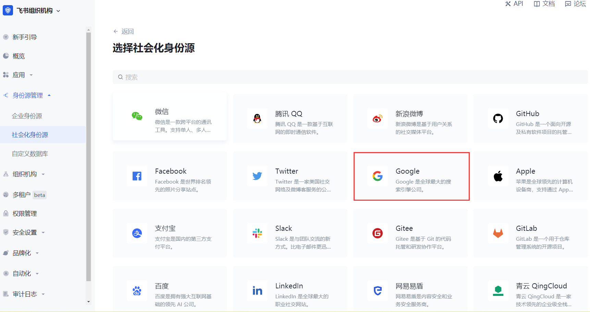
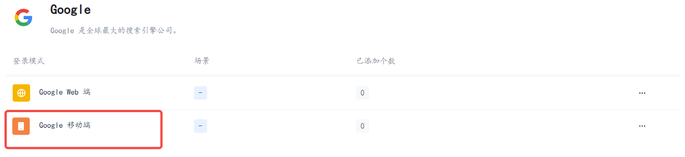
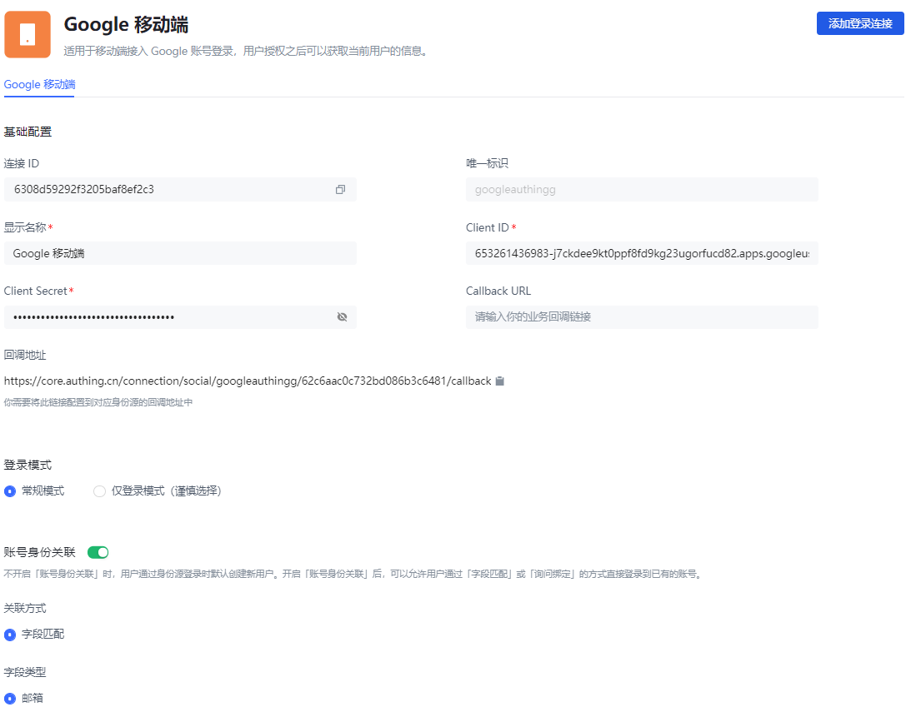
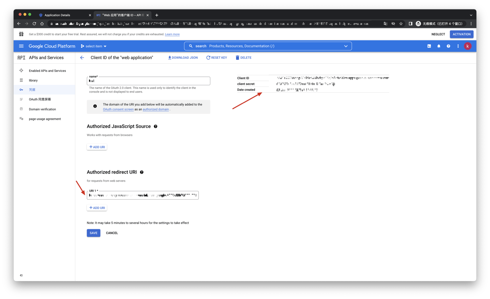
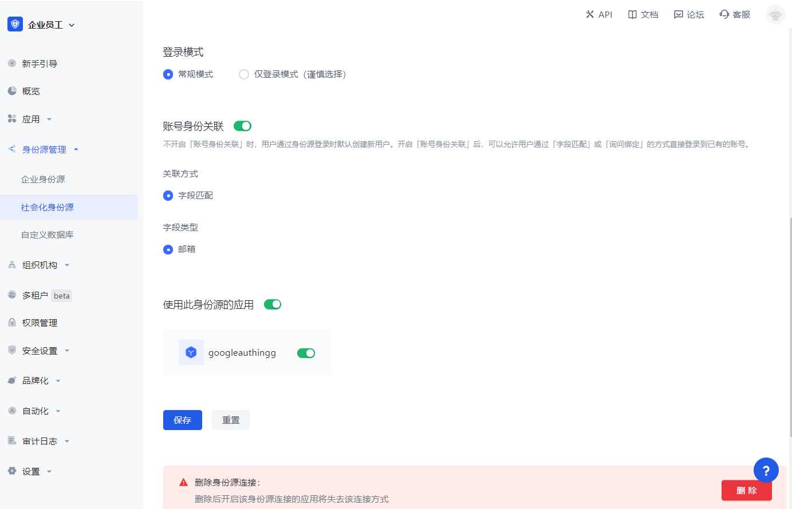
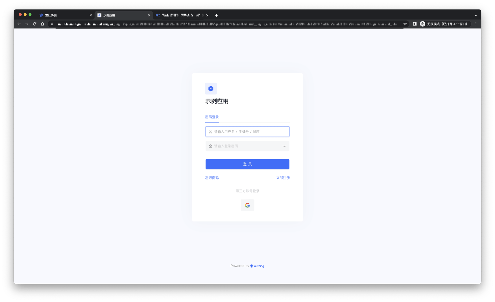

# Google 移动端

<LastUpdated />

## 场景介绍

### 概述

Authing 为开发者提供了一种在移动端（iOS 或安卓）应用中快速跳转谷歌登录获取用户信息的方式，通过简单地调用 Authing 移动端 SDK 可以完成谷歌账号接入。

### 应用场景

移动 APP

### 终端用户预览图

在移动应用中拉起谷歌页面进行登录。

## 准备工作

* 如果您未开通 Google 账号，请先前往 [Google 开发者控制台](https://accounts.google.com/signin/v2/identifier?hl=zh-TW&continue=https%3A%2F%2Fwww.google.com%2F&ec=GAlAmgQ&flowName=GlifWebSignIn&flowEntry=AddSession) 注册。

* 如果您未开通 Authing 控制台账号，请先前往 [{{$localeConfig.brandName}} Console 控制台](https://authing.cn/) 注册开发者账号。

## 配置步骤

### 步骤一：在谷歌开放平台创建一个谷歌移动应用

1. 打开 [Google API Console Credentials](https://console.cloud.google.com/apis/credentials) 控制台。

2. 在 **Credentials** 页面，选择顶部 **CREATE CREDENTIALS->OAuth client ID**。

3. 选择 **Application type** 为 **Web application**，填写 **Authorized redirect URIs**（先暂写一个合法的地址）。

4. 点击 **CREATE** 按钮。

5. 创建成功之后，在下一个页面您可以获取到此应用的 **Your Client ID** 和 **Your Client Secret**，记录下来。

### 步骤二：在 Authing 控制台配置谷歌移动端登录

1. 在 Atuhing 控制台 的 **社会化身份源** 页面点击 **创建社会化身份源** 按钮，进入 **选择社会化身份源** 页面。

2. 在 Authing 控制台 的 **身份源管理->社会化身份源->选择社会化身份** 页面，点击 「Google」身份源卡片，进入 Google 登录模式选择页面。

3. 选择 **Google 移动端** 进入。

4. 在 Authing 控制台 的 **Google 移动端** 页面，配置相关字段信息。

| 字段 | 描述 |
| ----| ---- |
| 唯一标识 | * 唯一标识由小写字母、数字、- 组成，且长度小于 32 位。 * 这是此连接的唯一标识，设置之后不能修改。|
| 显示名称 | 这个名称会显示在终端用户的登录界面的按钮上。|
| Client ID | 填入 Google 开放平台上获取的 **Your Client ID**。|
| Client Secret | 填入在 Google 开放平台上获取的 **Your Client Secret**。|
| Callback URL | 可以填写您的业务回调地址，用户完成登录后，浏览器将会跳转到该地址。 |
| 回调地址 | Google 有效跳转 URI。需要将此 URL 配置到 Google 开放平台上。 |
| 登录模式 | 开启 **仅登录模式** 后，只能登录既有账号，不能创建新账号，请谨慎选择。 |
| 账号身份关联 | 不开启 **账号身份关联** 时，用户通过身份源登录时默认创建新用户；开启 **账号身份关联** 后，可以允许用户通过 **字段匹配** 或 **询问绑定** 的方式直接登录到已有的账号。 |

5. 配置完成后，点击 **创建** 或者 **保存** 按钮完成创建。

::: hint-info
在 Authing 控制台上创建完 Google 身份源后，需要将回调地址配置到 Google 开放平台上的 **Authorized redirect URI**。
:::

### 步骤三：开发接入

---

#### 推荐开发接入方式

使用托管登录页。

#### 优劣势描述

运维简单，由 Authing 负责运维。每个用户池有一个独立的二级域名;如果需要嵌入到您的应用，需要使用弹窗模式登录，即：点击登录按钮后，会弹出一个窗口，内容是 Authing 托管的登录页面，或者将浏览器重定向到 Authing 托管的登录页。

#### 详细接入方法

1. 在 Authing 控制台创建一个应用，详情查看：[如何在 Authing 创建一个应用](/guides/app-new/create-app/create-app.md)。

2. 在已创建好的 Google 身份源连接详情页面，开启并关联一个在 Authing 控制台创建的应用。

3. 在登录页面体验 Google 第三方登录。

