# Google 

<LastUpdated/>

## 场景介绍

- **概述**：Google 社会化登录是用户以 Google 为身份源安全登录第三方应用或者网站。在 {{$localeConfig.brandName}} 中配置并开启 Google 的社会化登录，即可实现通过 {{$localeConfig.brandName}} 快速获取 Google 基本开放的信息和帮助用户实现免密登录功能。
- **应用场景**：Web 端
- **终端用户预览图**：

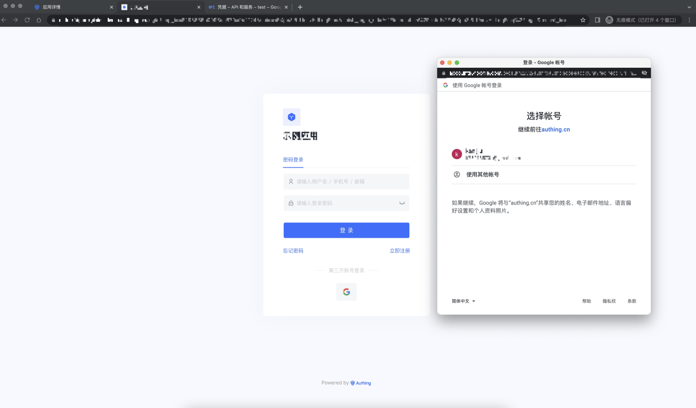

## 注意事项

- 如果你未开通 Google 账号，请先前往 [Google 开发者控制台](https://accounts.google.com/signin/v2/identifier?hl=zh-TW&continue=https%3A%2F%2Fwww.google.com%2F&ec=GAlAmgQ&flowName=GlifWebSignIn&flowEntry=AddSession) 注册电子邮箱。
- 如果你未开通 {{$localeConfig.brandName}} 控制台账号，请先前往 [{{$localeConfig.brandName}} 控制台](https://authing.cn/) 注册开发者账号。

## 第一步：在 Google 开发者控制台创建一个 OAuth 应用程序

- 打开 [Google API Console Credentials](https://console.cloud.google.com/apis/credentials)控制台。

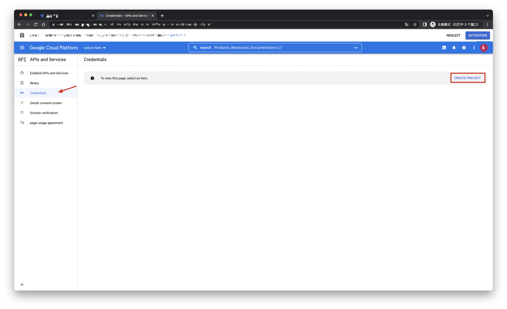
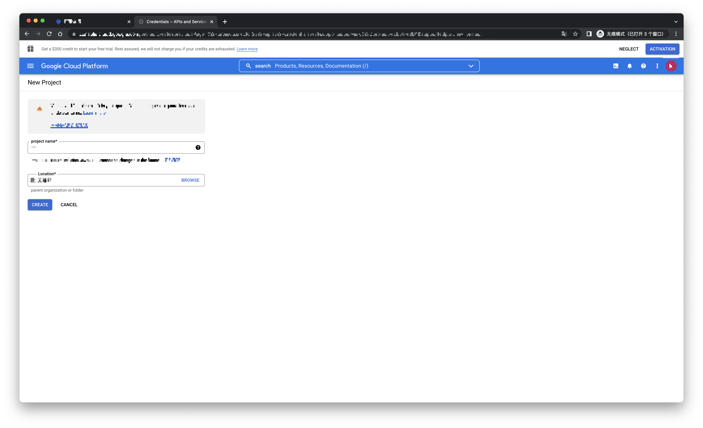

- 在 Credentials 页面，点击 Create credentials, 然后选择 OAuth client ID。

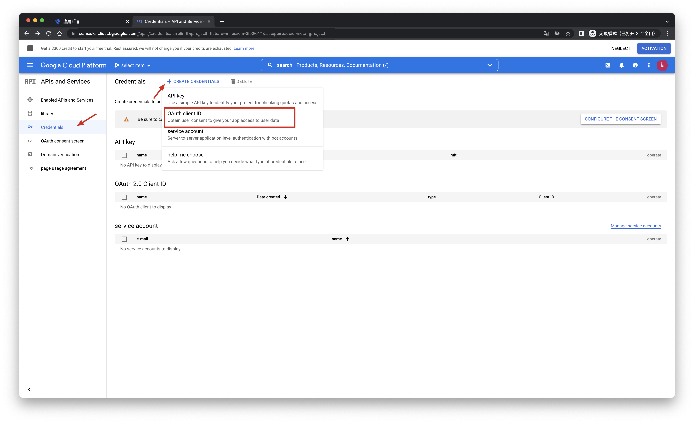

- 选择应用类型为 Web Application，填入 Authorized redirect URIs。

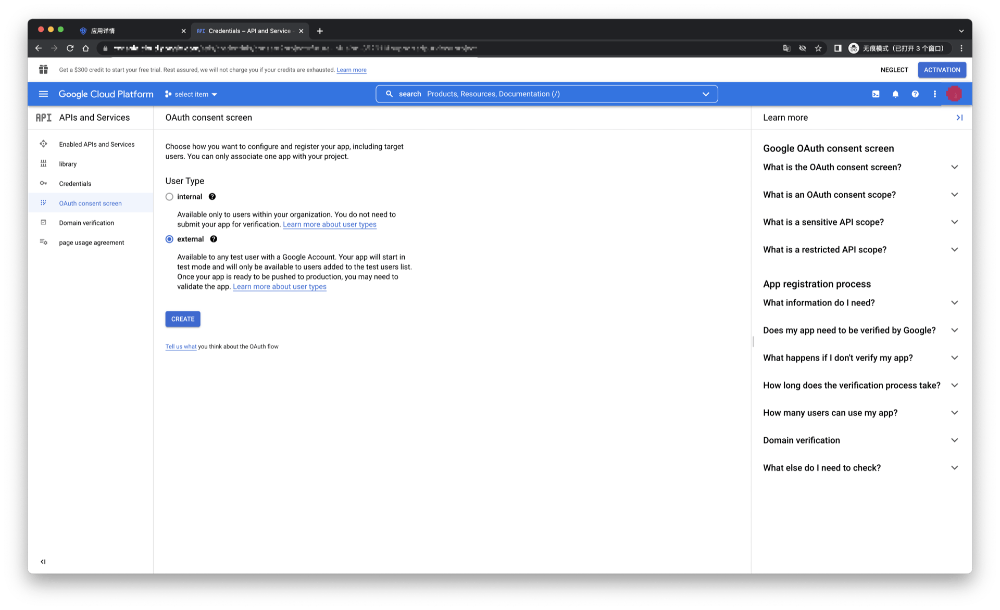

- 点击 [Create] 按钮；
- 创建成功之后，在下一个页面你可以获取到此应用的 Client ID 和 Client Secret，你需要记录下来。

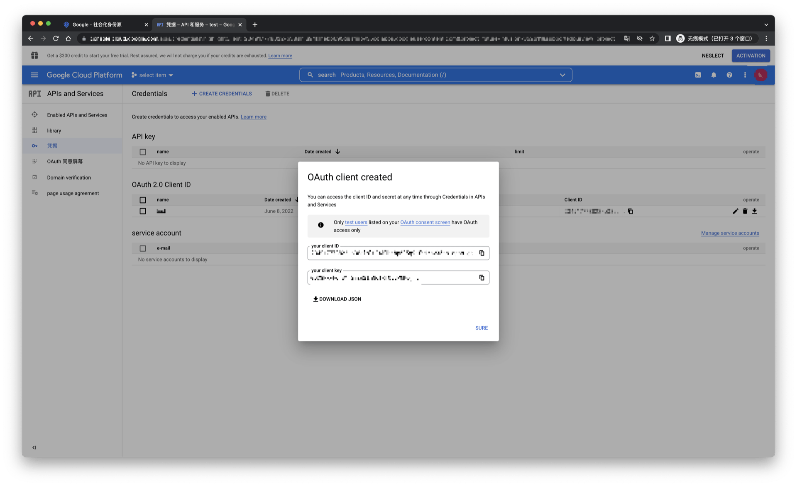

## 第二步：在 {{$localeConfig.brandName}} 控制台配置 Google

2.1 请在 {{$localeConfig.brandName}}  控制台 的「社会化身份源」页面，点击「创建社会化身份源」按钮，进入「选择社会化身份源」页面。

2.2 请在  {{$localeConfig.brandName}}  控制台 的「社会化身份源」-「选择社会化身份也」页面，点击「Google」身份源按钮，进入 「Google 登录模式」页面。

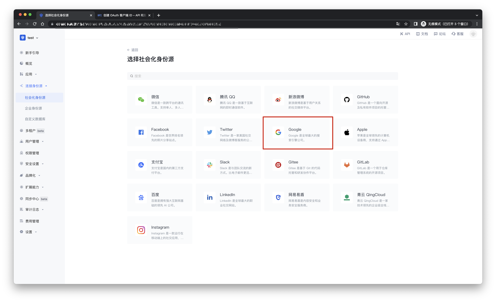

2.3 请在  {{$localeConfig.brandName}}  控制台 的「社会化身份源」-「Google」页面，配置相关的字段信息。

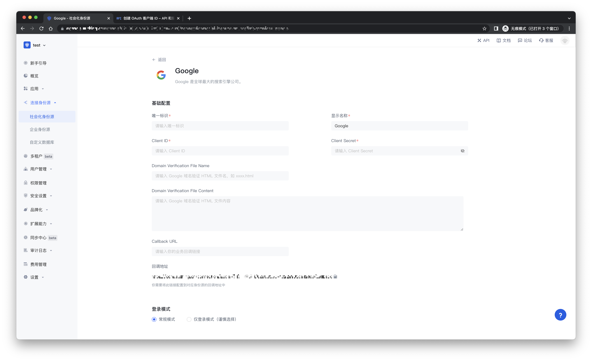

| 字段/功能    | 描述                                                         |
| ------------ | ------------------------------------------------------------ |
| 唯一标识     | a.唯一标识由小写字母、数字、- 组成，且长度小于 32 位。b.这是此连接的唯一标识，设置之后不能修改。 |
| 显示名称     | 这个名称会显示在终端用户的登录界面的按钮上。                 |
| Client ID      | Google 编号，需要在 Google 开放平台上获取。                  |
| Client secrets     |  Google 密钥，需要在 Google 开放平台上获取。                   |
|Domain Verification File Name| Google 域名验证 HTML 文件名，如 xxxx.html |
|Domain Verification File Content| Google 域名验证 HTML 文件内容 |
| Callback URL     | 可以填写你的业务回调地址，用户完成登录后，浏览器将会跳转到该地址。 |
| Scopes     | 默认情况下，{{$localeConfig.brandName}} 只会向用户申请基础用户信息（如头像、昵称等）的授权，如果你需要更多高级权限，可以勾选上对应的选项。 |
| 回调地址     |  Google 有效跳转 URI。需要将此 URL 配置到  Google 开放平台上。 |
| 登录模式     | 开启「仅登录模式」后，只能登录既有账号，不能创建新账号，请谨慎选择。 |
| 账号身份关联 | 不开启「账号身份关联」时，用户通过身份源登录时默认创建新用户。开启「账号身份关联」后，可以允许用户通过「字段匹配」或「询问绑定」的方式直接登录到已有的账号。|

配置完成后，点击「创建」或者「保存」按钮完成创建。

在 {{$localeConfig.brandName}} 控制台上创建完 Google 身份源后，需要将回调地址配置到 Google 开放平台上的 Authorized redirect URI。

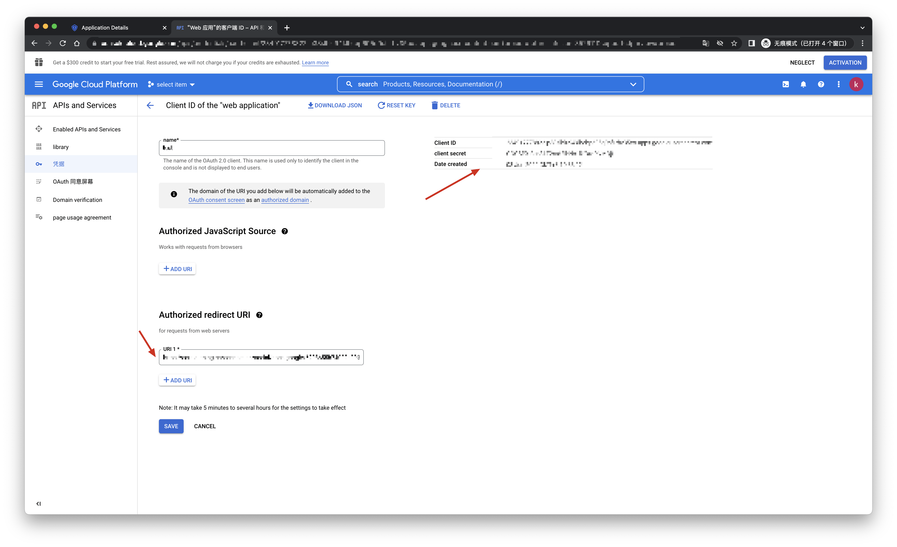

## 第三步：开发接入

- **推荐开发接入方式**：使用托管登录页

- **优劣势描述**：运维简单，由 {{$localeConfig.brandName}} 负责运维。每个用户池有一个独立的二级域名;如果需要嵌入到你的应用，需要使用弹窗模式登录，即：点击登录按钮后，会弹出一个窗口，内容是 {{$localeConfig.brandName}} 托管的登录页面，或者将浏览器重定向到 {{$localeConfig.brandName}} 托管的登录页。

- **详细接入方法**：

3.1 在 {{$localeConfig.brandName}} 控制台创建一个应用，详情查看：[如何在 {{$localeConfig.brandName}} 创建一个应用](/guides/app-new/create-app/create-app.md)

3.2 在已创建好的 Google 身份源连接详情页面，开启并关联一个在 {{$localeConfig.brandName}} 控制台创建的应用

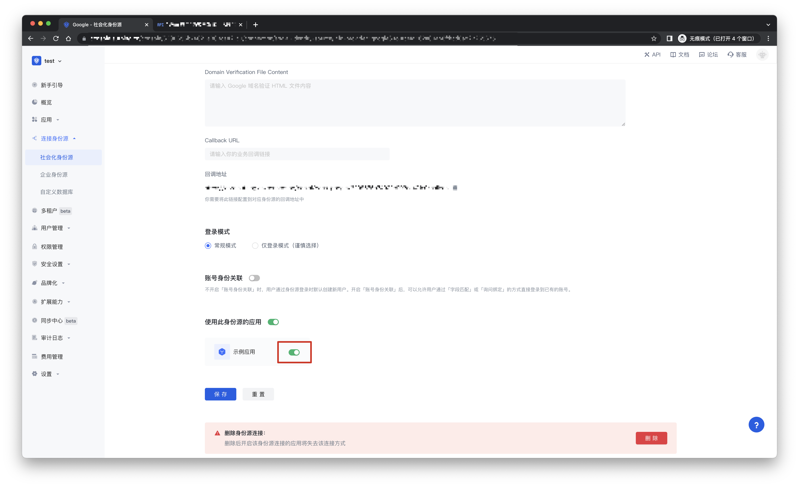

3.3 在登录页面体验 Google 第三方登录

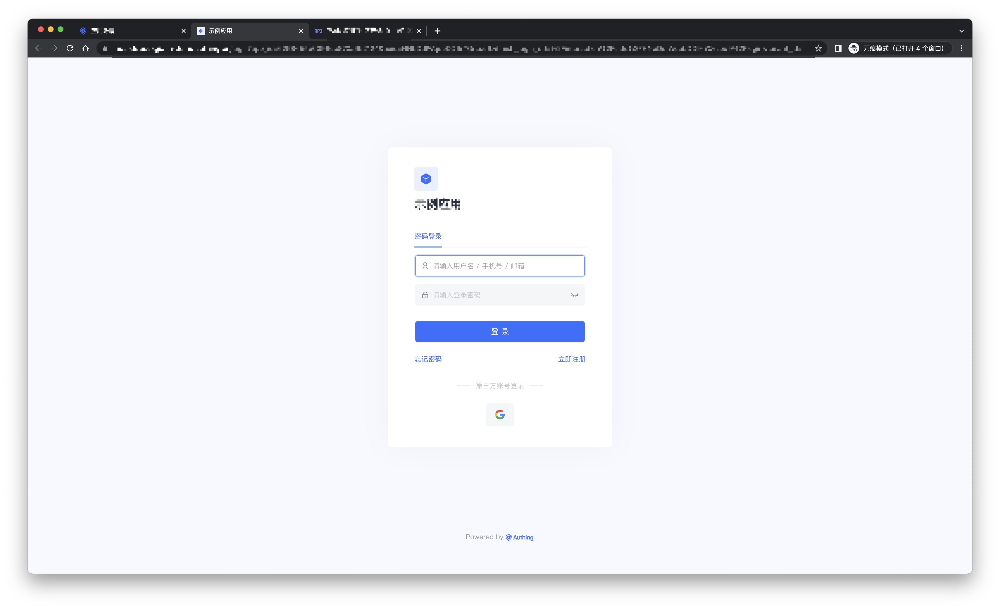

