# Instagram 

<LastUpdated/>

## 场景介绍

- **概述**：Instagram 社会化登录是用户以 Instagram 为身份源安全登录第三方应用或者网站。在 Authing 中配置并开启 Instagram 的社会化登录，即可实现通过 Authing 快速获取 Instagram 基本开放的信息和帮助用户实现免密登录功能。
- **应用场景**：PC 网站
- **终端用户预览图**：

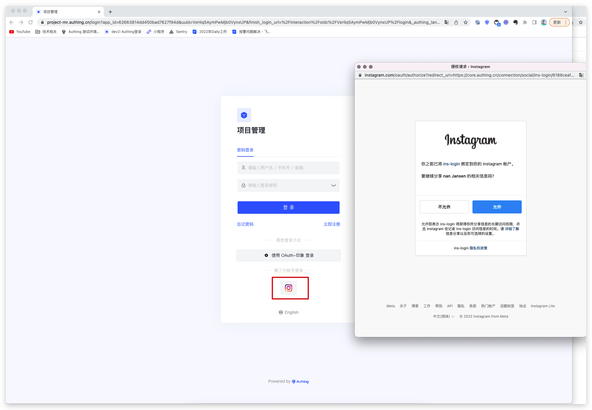

## 注意事项

- 如果您未开通 Instagram 开放平台账号，请先前往 [Instagram 开放平台](https://developers.facebook.com/) 注册开发者账号。因 Instagram 是属于 facebook 的，所以此处所说的 Instagram 开放平台就是 Facebook 的开放平台；
-  开通一个包含多媒体素材的 [Instagram 账户](https://www.instagram.com/)；
- 如果您未开通 Authing 控制台账号，请先前往 [Authing Console 控制台](https://authing.cn/) 注册开发者账号；

## 步骤 1：创建 Facebook 应用

前往 [developers.facebook.com](https://developers.facebook.com/)，点击**我的应用**，然后创建新应用并选择**消费者**或**无应用类型**，填写应用名称。

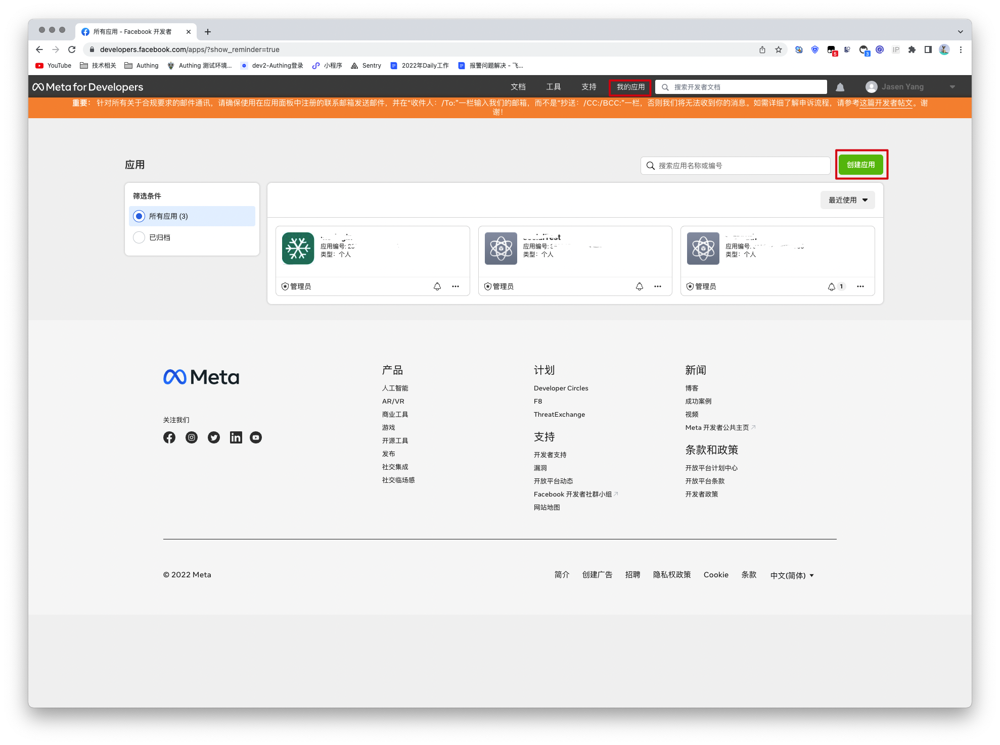

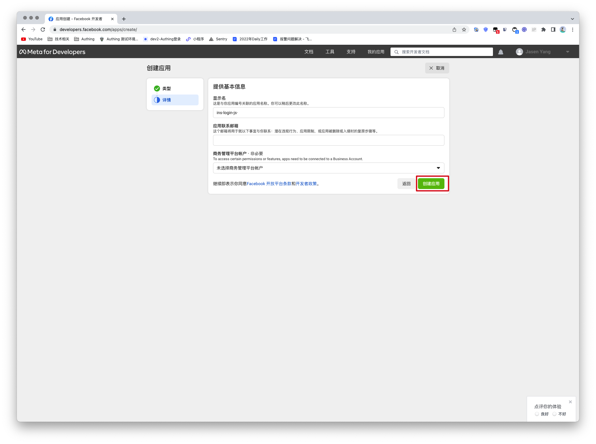

在控制面板中，找到 **Instagram Basic Display** 产品，然后点击设置，将其添加至您的应用。

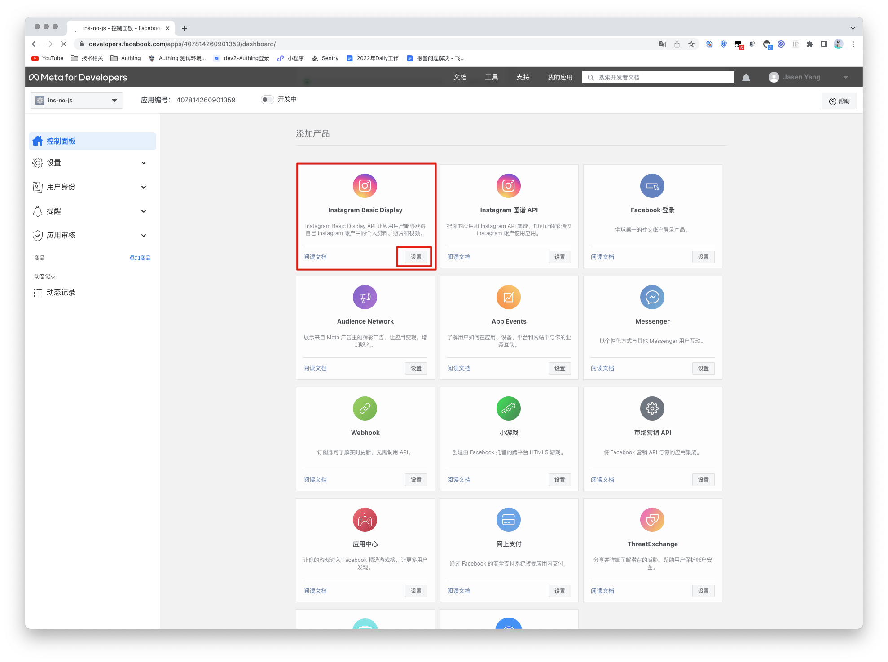

滚动到页面底部，然后点击**创建新应用**。

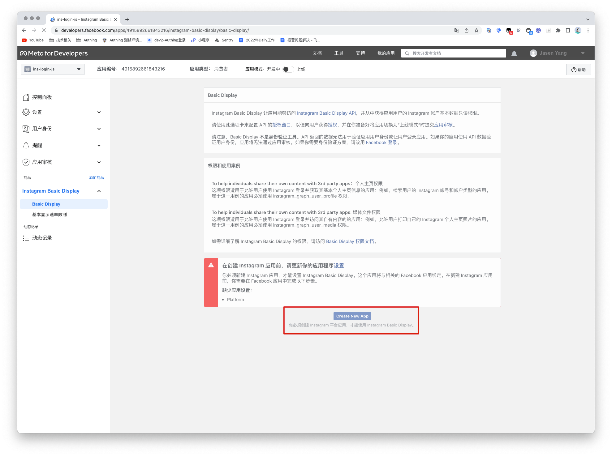

## 步骤 2：在 Authing 控制台配置 Instagram

2.1 请在 Authing Console 控制台 的「社会化身份源」页面，点击「创建社会化身份源」按钮，进入「选择社会化身份源」页面。

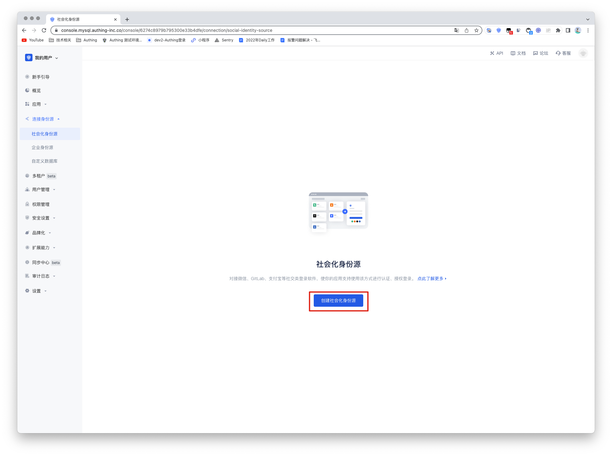

2.2 请在 Authing Console 控制台 的「社会化身份源」-「选择社会化身份也」页面，点击「Instagram」身份源按钮，进入 「Instagram 登录模式」页面。

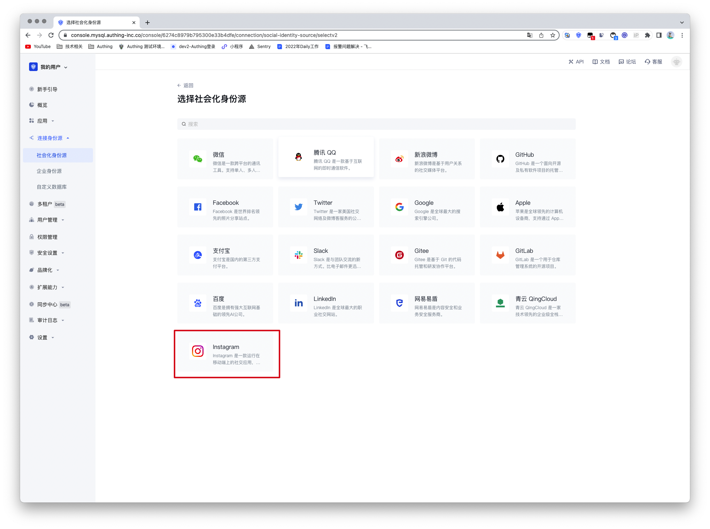

2.3 请在 Authing Console 控制台 的「社会化身份源」-「Instagram」页面，配置相关的字段信息。

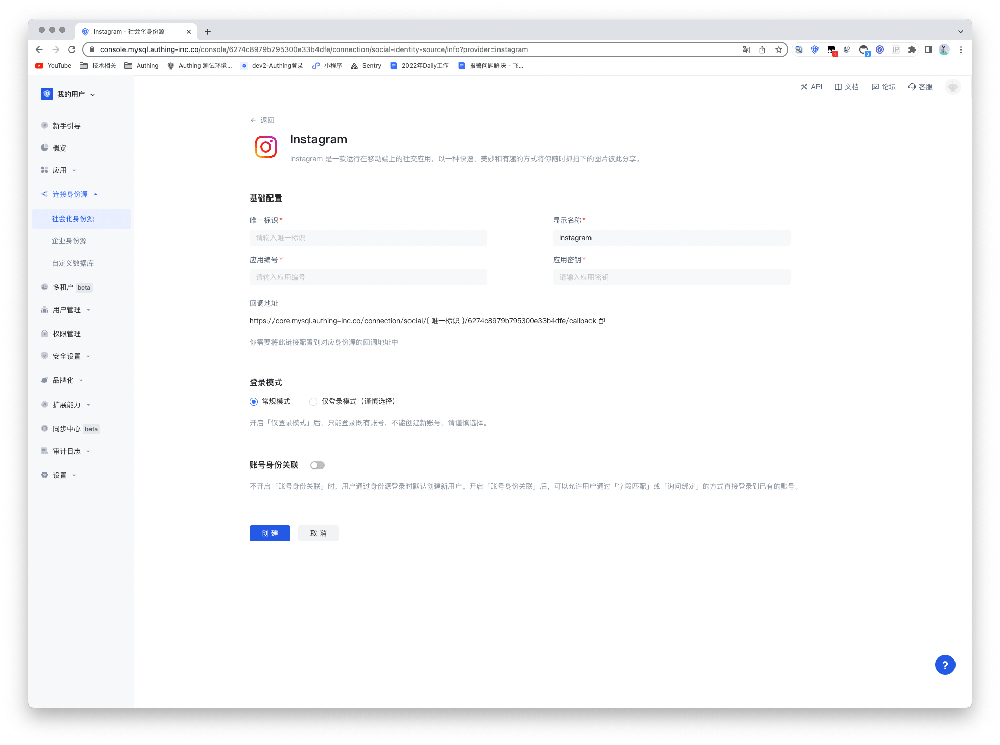

| 编号  | 字段/功能    | 描述                                                         |
| ----- | ------------ | ------------------------------------------------------------ |
| 2.3.1 | 唯一标识     | a.唯一标识由小写字母、数字、- 组成，且长度小于 32 位。b.这是此连接的唯一标识，设置之后不能修改。 |
| 2.3.2 | 显示名称     | 这个名称会显示在终端用户的登录界面的按钮上。                 |
| 2.3.3 | 应用编号     | 应用编号，需要在 Instagram 开放平台上获取。                  |
| 2.3.4 | 应用密钥     | 应用编号，需要在 Instagram 开放平台上获取                    |
| 2.3.5 | 回调地址     | Instagram 有效 OAuth 跳转 URI。需要将此 URL 配置到 Instagram 开放平台上。 |
| 2.3.6 | 登录模式     | 开启「仅登录模式」后，只能登录既有账号，不能创建新账号，请谨慎选择。 |
| 2.3.7 | 账号身份关联 | 不开启「账号身份关联」时，用户通过身份源登录时默认创建新用户。开启「账号身份关联」后，可以允许用户通过「字段匹配」或「询问绑定」的方式直接登录到已有的账号。a.关联方式：选择 |

配置完成后，点击「创建」或者「保存」按钮完成创建。 

在 Authing 控制台上创建完 Instagram 身份源后，需要将回调地址配置到 Instagram 的开放平台上的 Instagram 应用中**OAuth 客户端授权设置**。

最后一步，Instagram 需要获得访问 **instagram_graph_user_profile** 的权限，所以需要增加此权限。然后点击并保存更改，即创建 instagram 应用成功。

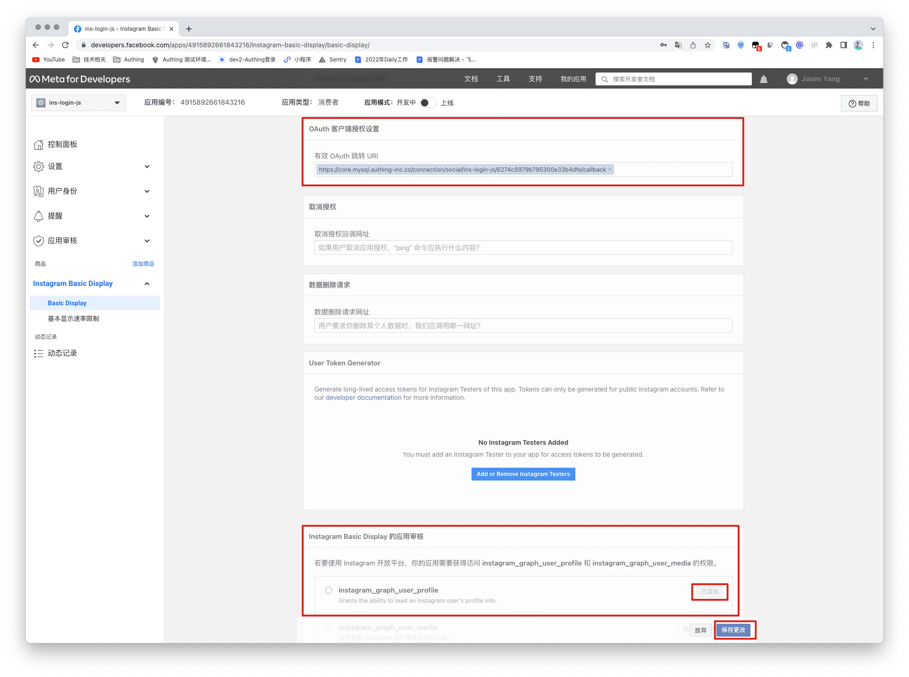

## 步骤 3：开发接入

- **推荐开发接入方式**：使用托管登录页

- **优劣势描述**：运维简单，由 Authing 负责运维。每个用户池有一个独立的二级域名;如果需要嵌入到你的应用，需要使用弹窗模式登录，即：点击登录按钮后，会弹出一个窗口，内容是 Authing 托管的登录页面，或者将浏览器重定向到 Authing 托管的登录页。

- **详细接入方法**：

3.1 在 Authing 控制台创建一个应用，详情查看：[如何在 Authing 创建一个应用](/guides/app-new/create-app/create-app.md)

3.2 在已创建好的 Instagram 身份源连接详情页面，开启并关联一个在 Authing 控制台创建的应用

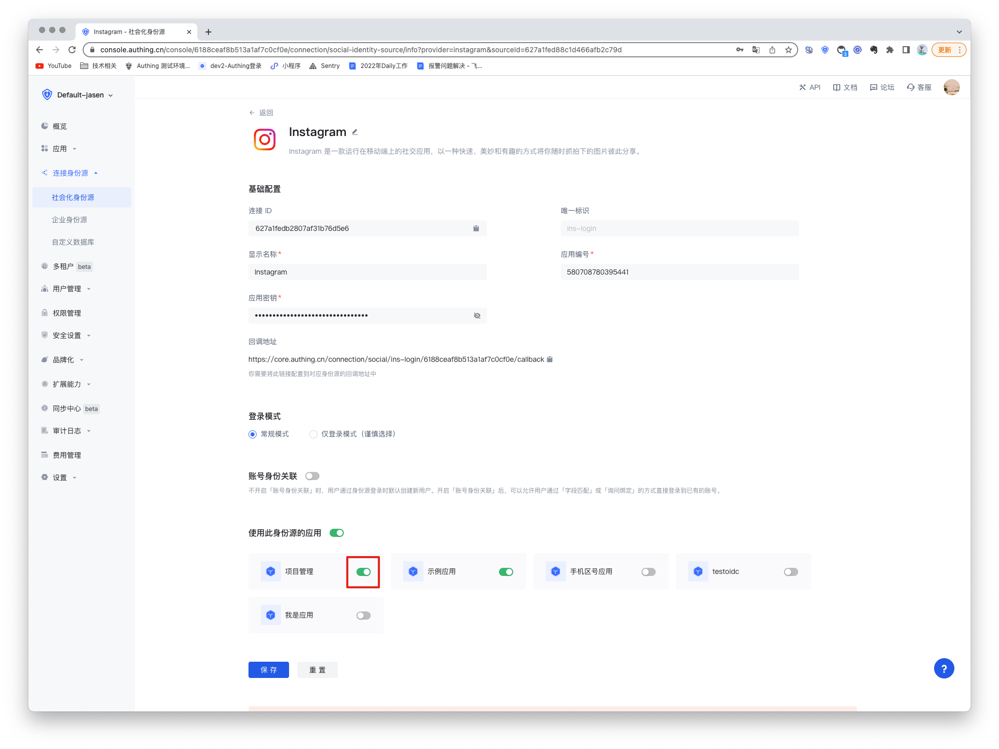

3.3 在登录页面体验 Instagram 第三方登录

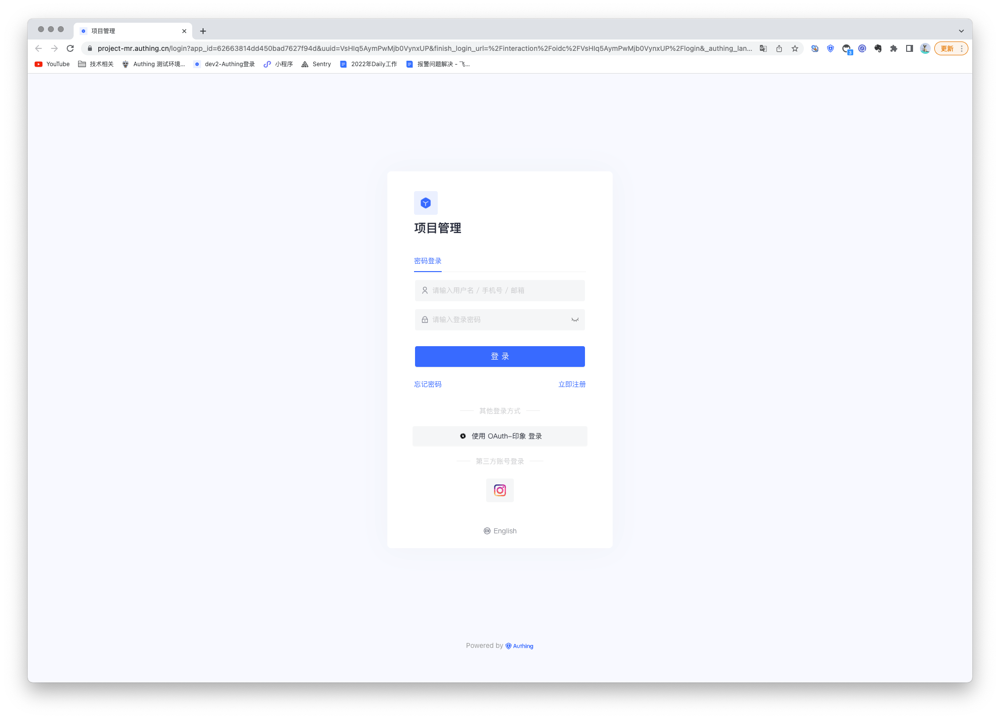

