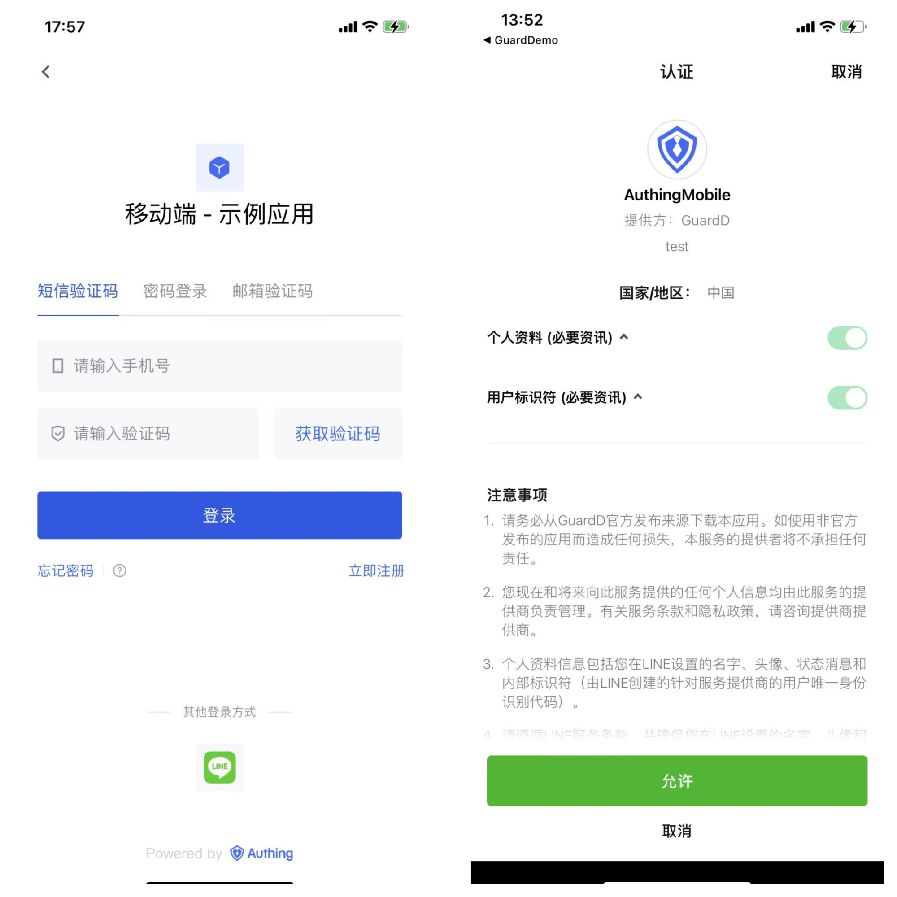
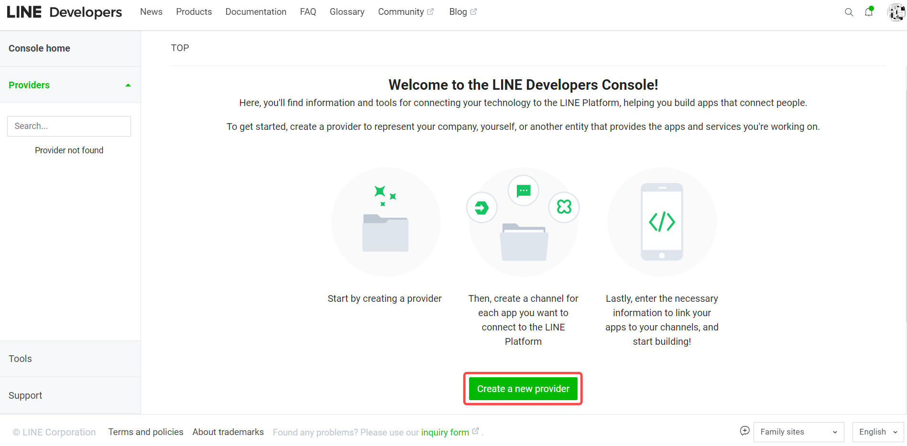
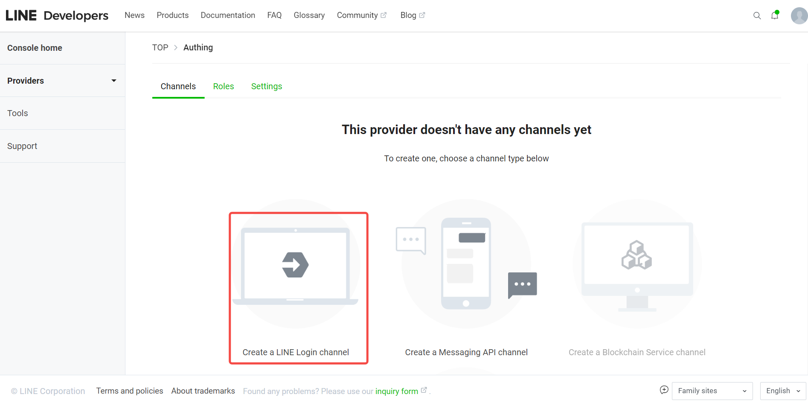
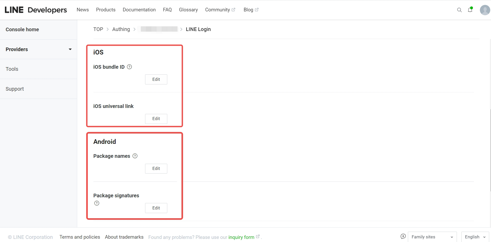
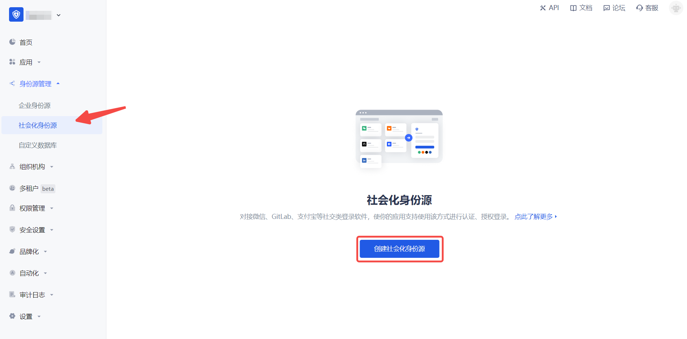
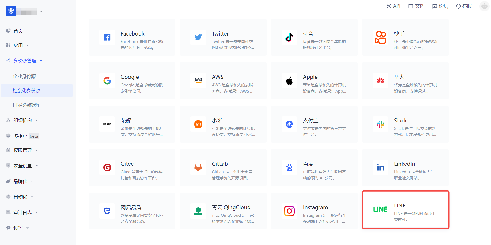
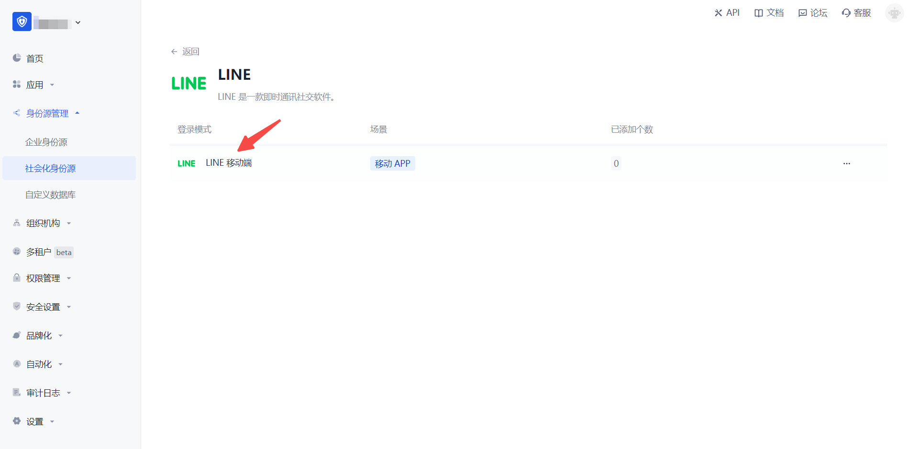
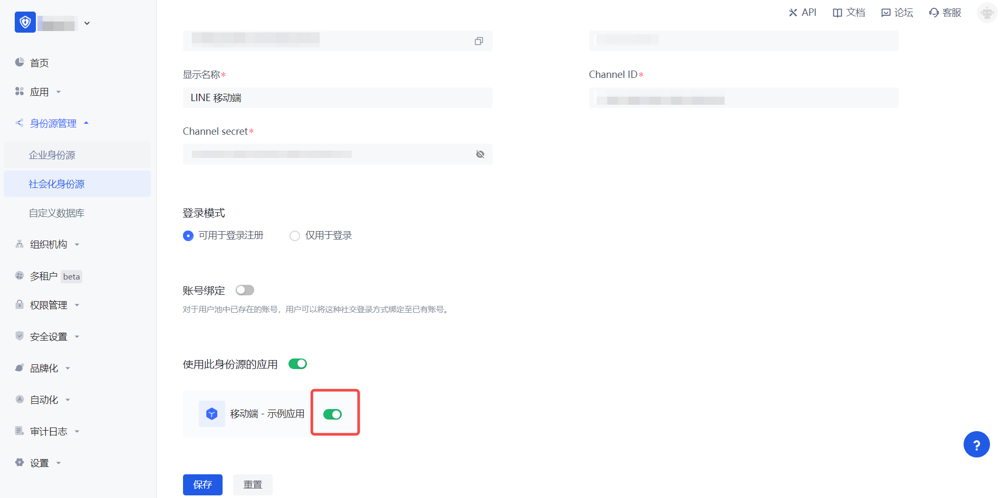

# LINE 移动端

<LastUpdated/>

## 场景介绍

### 概述

LINE 社会化登录是用户以 LINE 为身份源安全登录第三方应用或者网站。在 {{$localeConfig.brandName}} 中配置并开启 LINE 的社会化登录，即可实现通过 {{$localeConfig.brandName}} 快速获取 LINE 基本开放的信息和帮助用户实现免密登录功能。

### 应用场景

移动端

### 终端用户预览图

## 注意事项

- 如果你未开通 LINE Developers 账号，请先前往 [LINE Developers](https://developers.line.biz/console/profile) 注册开发者账号。
- 如果你未开通 {{$localeConfig.brandName}} 控制台账号，请先前往 [{{$localeConfig.brandName}} 控制台](https://authing.cn/) 注册开发者账号。

## 第一步：在 LINE Developers 创建一个 Mobile LINE Login Channel

前往 [LINE Developers](https://developers.line.biz/console/)，创建一个 Channel。

1.1 创建 Provider.

1.2 完成创建 LINE Login Channel, 填写 Channel 信息，**App types** 勾选 **Mobile APP**, 记录 `Channel ID` 和 `Channel secret`.

1.3 切换到「LINE Login」TAB 项，完成填写 iOS/Android APP 信息。

## 第二步：在 {{$localeConfig.brandName}} 控制台配置 LINE 移动端

2.1 请在 {{$localeConfig.brandName}}  控制台 的「社会化身份源」页面，点击「创建社会化身份源」按钮，进入「选择社会化身份源」页面。

2.2 请在  {{$localeConfig.brandName}}  控制台 的「社会化身份源」-「选择社会化身份源」页面，点击「LINE」身份源按钮，进入「LINE 移动端登录模式」页面。

2.3 请在  {{$localeConfig.brandName}}  控制台 的「社会化身份源」-「LINE 移动端」页面，配置相关的字段信息。

| 字段/功能         | 描述                                                                      |
|---------------|-------------------------------------------------------------------------|
| 唯一标识          | a.唯一标识由小写字母、数字、- 组成，且长度小于 32 位。b.这是此连接的唯一标识，设置之后不能修改。                   |
| 显示名称          | 这个名称会显示在终端用户的登录界面的按钮上。                                                  |
| Channel ID    | 上一步 LINE Developers - LINE Login Channel 的 Channel ID.                  |
| Channel secret | 上一步 LINE Developers - LINE Login Channel 的 Channel secret.                                 |
| 登录模式          | 开启「仅登录模式」后，只能登录既有账号，不能创建新账号，请谨慎选择。                                      |
| 账号身份关联 | 不开启「账号身份关联」时，用户通过身份源登录时默认创建新用户。开启「账号身份关联」后，可以允许用户通过「字段匹配」的方式直接登录到已有的账号。 |

配置完成后，点击「创建」或者「保存」按钮完成创建。

## 第三步：开发接入

- **推荐开发接入方式**：SDK

- **优劣势描述**：运维简单，由 {{$localeConfig.brandName}} 负责运维。每个用户池有一个独立的二级域名;如果需要嵌入到你的应用，需要使用弹窗模式登录，即：点击登录按钮后，会弹出一个窗口，内容是 {{$localeConfig.brandName}} 托管的登录页面，或者将浏览器重定向到 {{$localeConfig.brandName}} 托管的登录页。

- **详细接入方法**：
  

3.1 在 {{$localeConfig.brandName}} 控制台创建一个应用，详情查看：[如何在 {{$localeConfig.brandName}} 创建一个应用](/guides/app-new/create-app/create-app.md)

3.2 在已创建好的「LINE 移动端」身份源连接详情页面，开启并关联一个在 {{$localeConfig.brandName}} 控制台创建的应用

3.3 在登录页面体验 LINE 第三方登录（如 [终端用户预览图](#终端用户预览图) 所示）。
