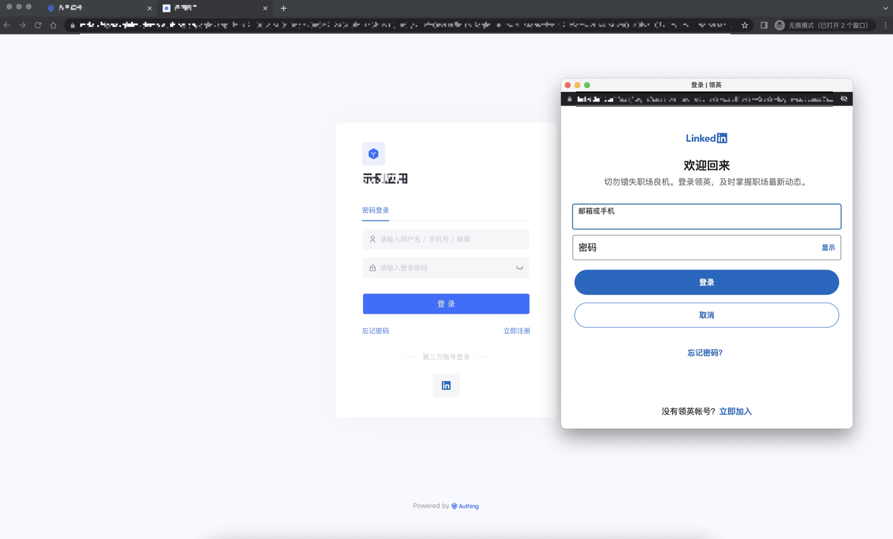
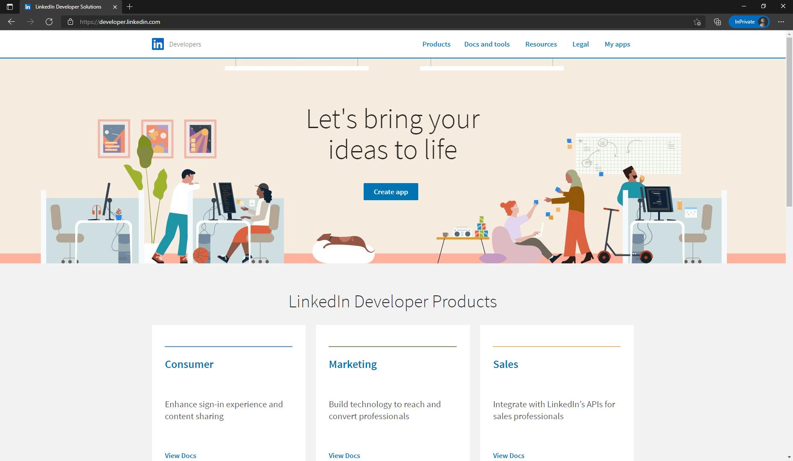
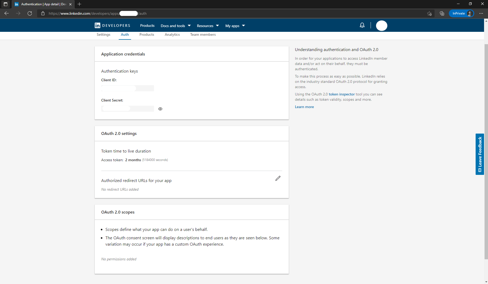
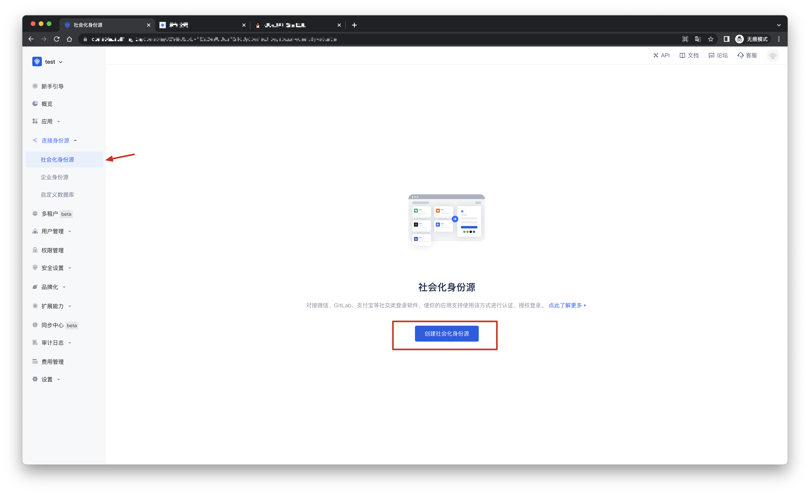
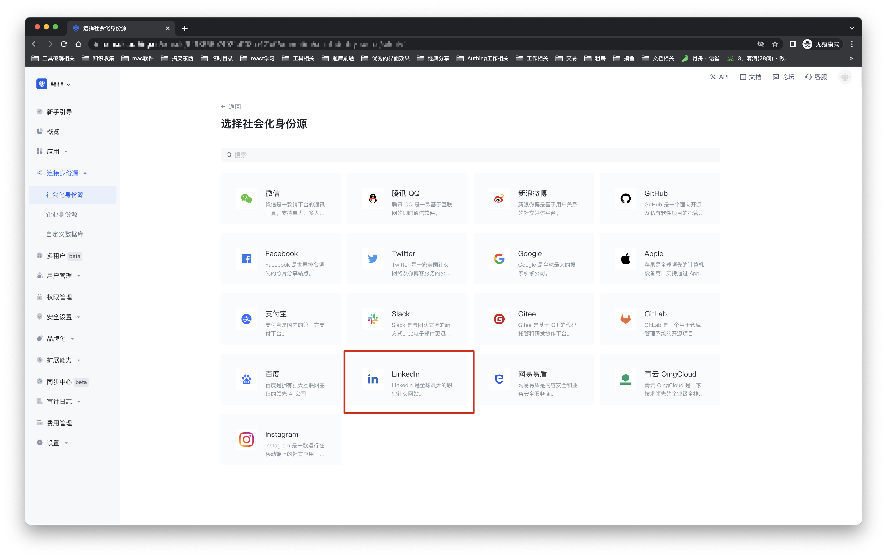
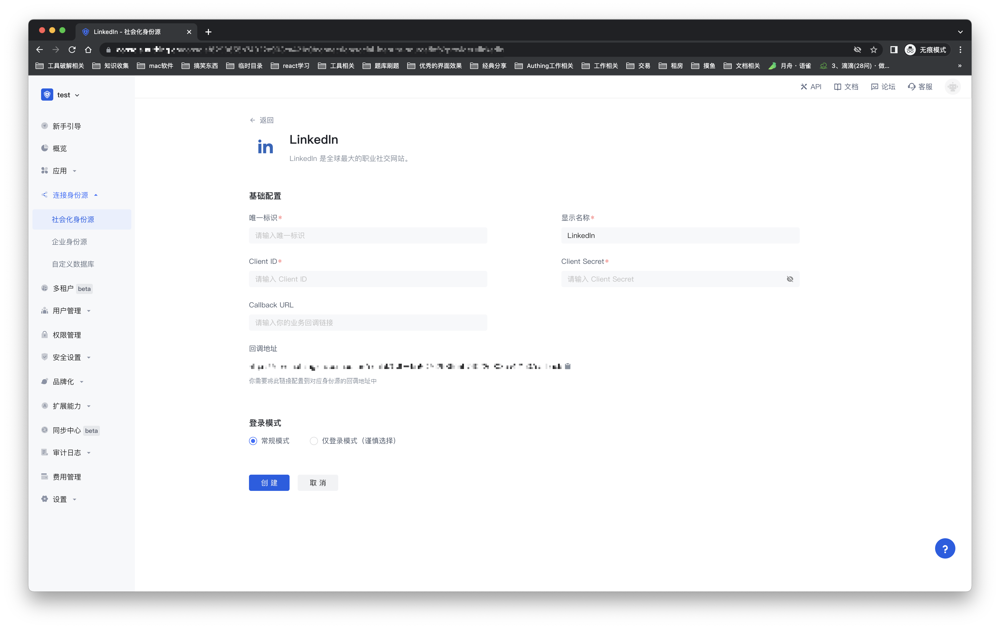
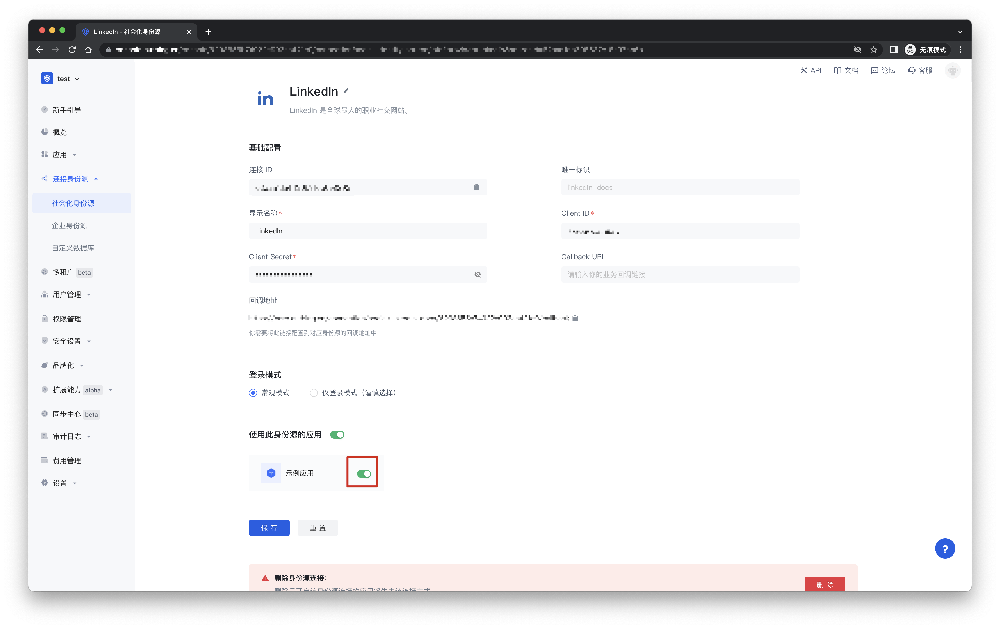
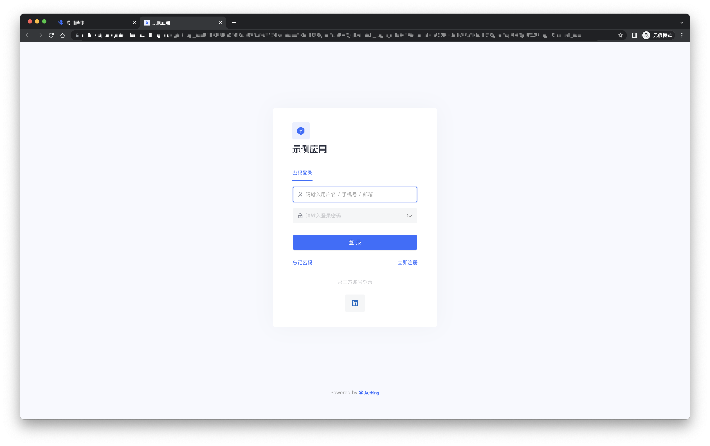

# LinkedIn 

<LastUpdated/>

## 场景介绍

- **概述**：LinkedIn 社会化登录是用户以 LinkedIn 为身份源安全登录第三方应用或者网站。在 {{$localeConfig.brandName}} 中配置并开启 LinkedIn 的社会化登录，即可实现通过 {{$localeConfig.brandName}} 快速获取 LinkedIn 基本开放的信息和帮助用户实现免密登录功能。
- **应用场景**：PC 网站
- **终端用户预览图**：

## 注意事项：

- 请按照 [Microsoft 文档](https://docs.microsoft.com/en-us/linkedin/consumer/integrations/self-serve/sign-in-with-linkedin#getting-started)指引创建一个应用。
- 如果您未开通 {{$localeConfig.brandName}} 控制台账号，请先前往 [{{$localeConfig.brandName}} 控制台](https://authing.cn/) 注册开发者账号。

## 步骤1：在 LinkedIn 创建应用

- 在 [LinkedIn Developers](https://developer.linkedin.com/) 上，点击 Create app 开始创建你的应用。

- 输入你的应用的相关信息，点击 Create app 完成创建。

- 完成创建后，查看 Settings，Auth，Products 等标签下的应用信息，并通过编辑 Authorized redirect URLs for your app 来设置回调地址。回调地址设置为：https://core.authing.cn/connection/social/{ 唯一标识 }/{YOUR_USERPOOL_ID}/callback。

- 如下图所示，在此页面的 Products 标签下，你会看到此 App 可用的所有产品。点击 Sign In with LinkedIn 右边的 Select 按钮以选择此功能，并按照后续的提示完成操作。通常情况下，LinkedIn 会在若干分钟后批准你的 App 使用 Sign In with LinkedIn 功能。

- 回调地址请使用以下设置：https://core.authing.cn/connection/social/{ 唯一标识 }/{YOUR_USERPOOL_ID}/callback

> 将其中的 { 唯一标识 } 替换为你正在 Authing 创建的身份源所填写的唯一标识， {YOUR_USERPOOL_ID} 替换为你的用户池 ID

## 步骤2：在 {{$localeConfig.brandName}} 控制台配置 LinkedIn

2.1 请在 {{$localeConfig.brandName}}  控制台 的「社会化身份源」页面，点击「创建社会化身份源」按钮，进入「选择社会化身份源」页面。

2.2 请在  {{$localeConfig.brandName}}  控制台 的「社会化身份源」-「选择社会化身份也」页面，点击「LinkedIn」身份源按钮，进入 「LinkedIn 登录模式」页面。

2.3 请在  {{$localeConfig.brandName}}  控制台 的「社会化身份源」-「LinkedIn」页面，配置相关的字段信息。

| 字段/功能    | 描述                                                         |
| ----- | ------------ | ------------------------------------------------------------ |
| 唯一标识     | a.唯一标识由小写字母、数字、- 组成，且长度小于 32 位。b.这是此连接的唯一标识，设置之后不能修改。 |
| 显示名称     | 这个名称会显示在终端用户的登录界面的按钮上。                 |
| Client ID      |  LinkedIn 应用 ID，需要在 linkedIn developers 上获取。                  |
| Client secrets     |   LinkedIn 应用密钥，需要在 linkedIn developers 上获取。                  |
| Callback URL     | 可以填写你的业务回调地址，用户完成登录后，浏览器将会跳转到该地址。 |
| 回调地址     |  LinkedIn 有效跳转 URI。需要将此 URL 配置到  linkedIn developers 上。 |
| 登录模式     | 开启「仅登录模式」后，只能登录既有账号，不能创建新账号，请谨慎选择。 |

配置完成后，点击「创建」或者「保存」按钮完成创建。

在 {{$localeConfig.brandName}} 控制台上创建完 LinkedIn 身份源后，需要将回调地址配置到 linkedIn developers 上的 Authorized redirect URLs for your app。

## 步骤3：开发接入

- **推荐开发接入方式**：使用托管登录页

- **优劣势描述**：运维简单，由 {{$localeConfig.brandName}} 负责运维。每个用户池有一个独立的二级域名;如果需要嵌入到你的应用，需要使用弹窗模式登录，即：点击登录按钮后，会弹出一个窗口，内容是 {{$localeConfig.brandName}} 托管的登录页面，或者将浏览器重定向到 {{$localeConfig.brandName}} 托管的登录页。

- **详细接入方法**：

3.1 在 {{$localeConfig.brandName}} 控制台创建一个应用，详情查看：[如何在 {{$localeConfig.brandName}} 创建一个应用](https://docs.authing.cn/v2/guides/app/create-app.html)

3.2 在已创建好的 LinkedIn 身份源连接详情页面，开启并关联一个在 {{$localeConfig.brandName}} 控制台创建的应用

3.3 在登录页面体验 LinkedIn 第三方登录

