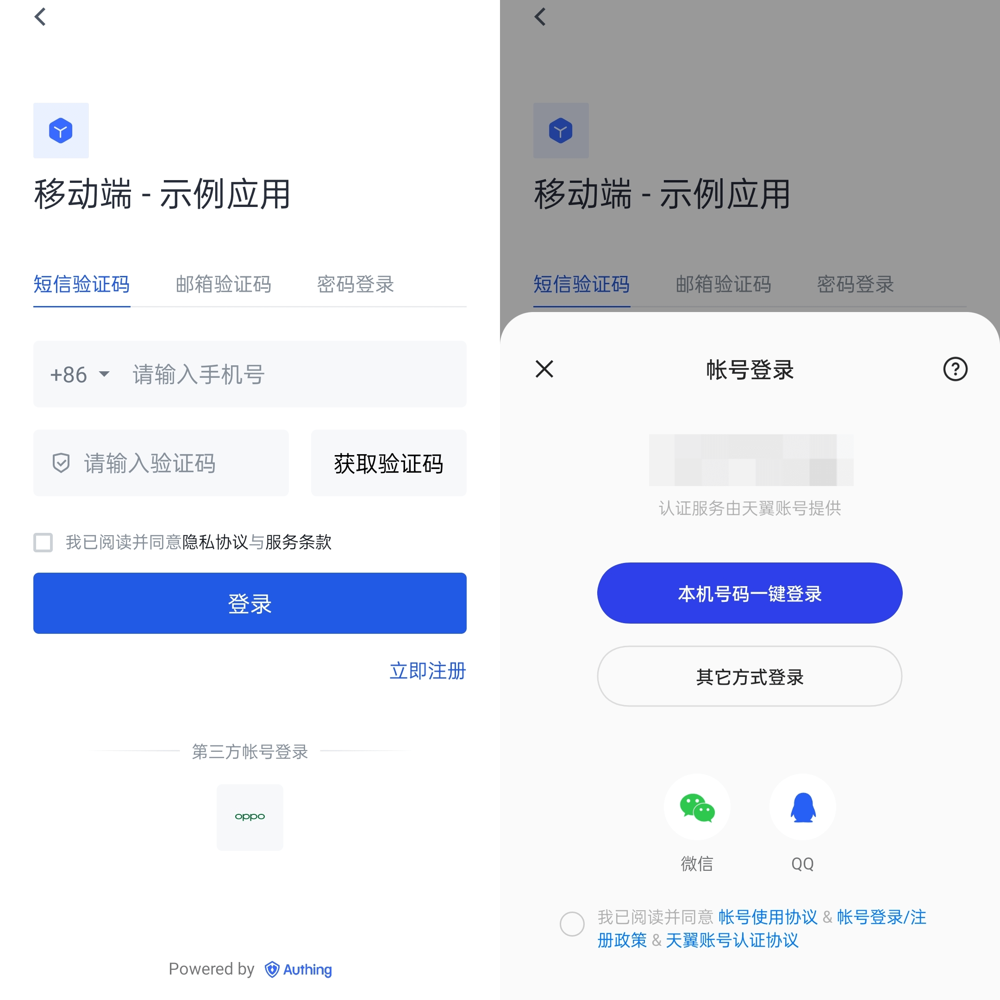
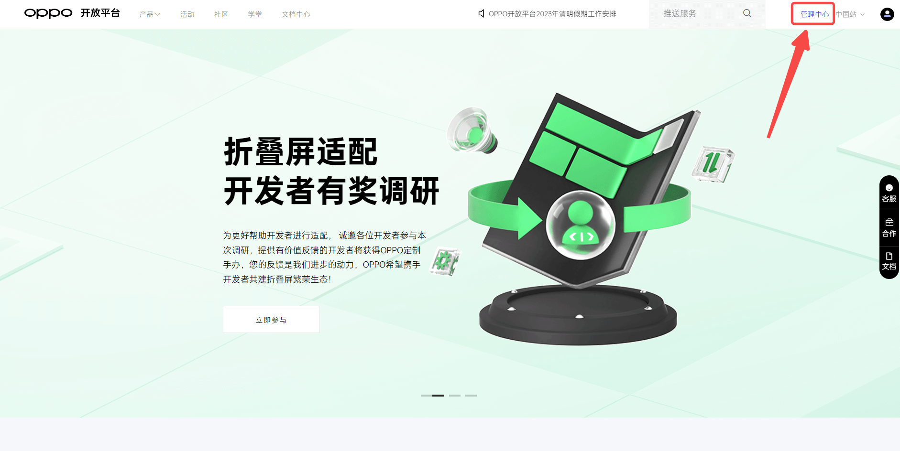
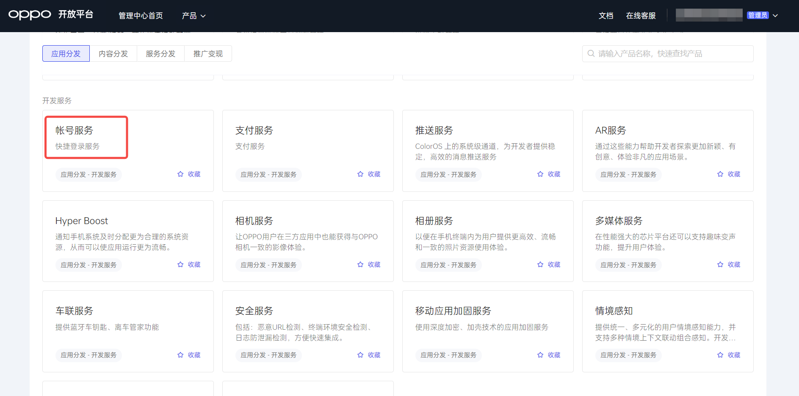
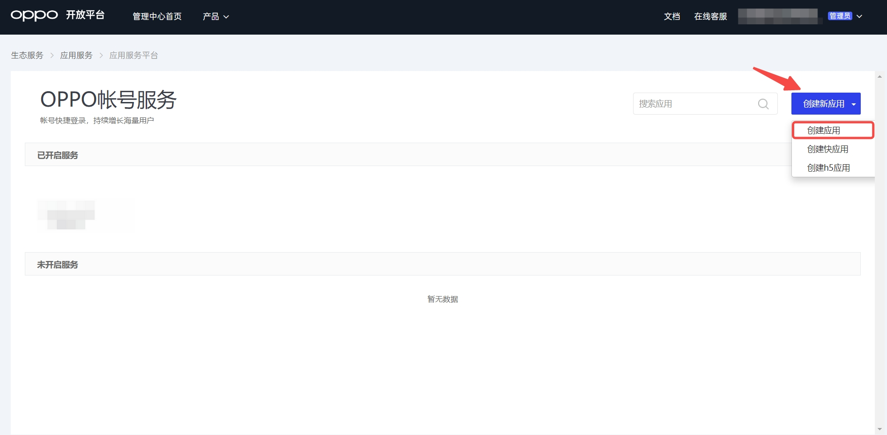
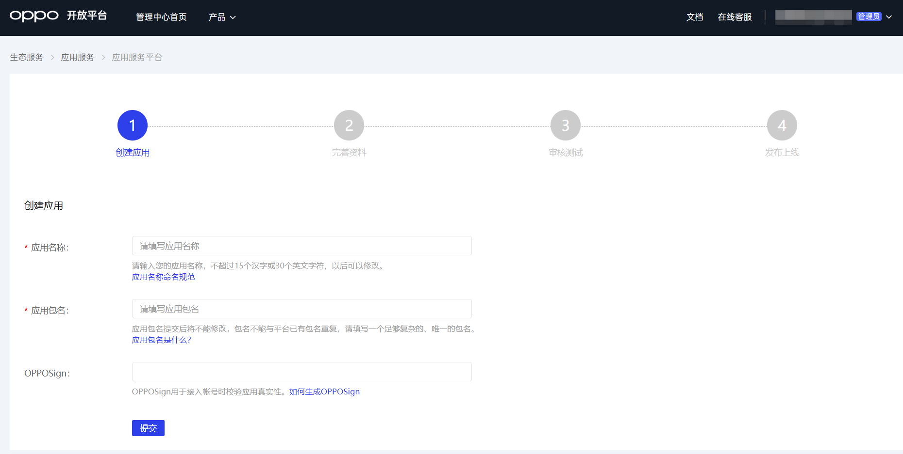
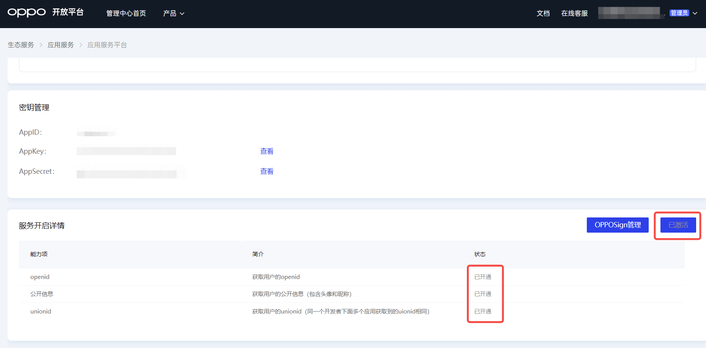
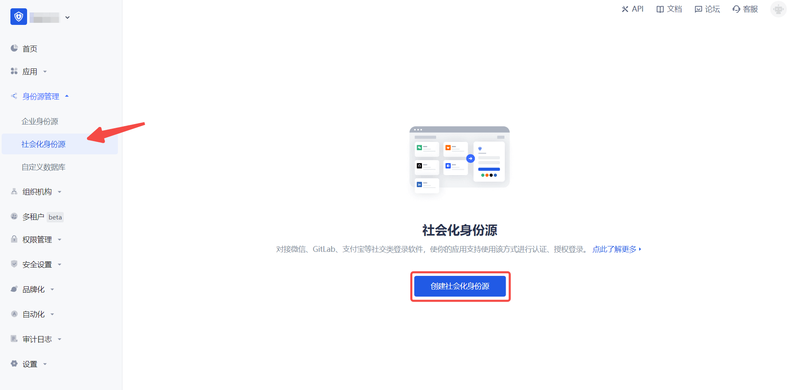
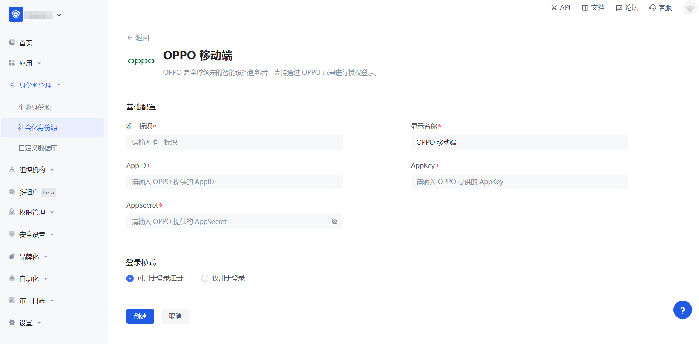
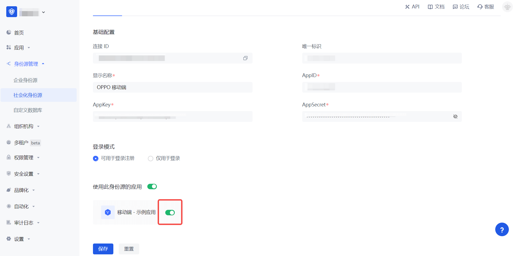

# OPPO 移动端

<LastUpdated />

## 场景介绍

### 概述

OPPO 社会化登录是用户以 OPPO 为身份源安全登录第三方应用或者网站。在 {{$localeConfig.brandName}} 中配置并开启 OPPO 的社会化登录，即可实现通过 {{$localeConfig.brandName}} 快速获取 OPPO 基本开放的信息和帮助用户实现免密登录功能。

### 应用场景

移动端

### 终端用户预览图

## 注意事项

- 如果你还没有 OPPO 账号，请先前往 [OPPO 开放平台](https://open.oppomobile.com/)上注册成为开发者。
- 如果你未开通 {{$localeConfig.brandName}} 控制台账号，请先前往 [{{$localeConfig.brandName}} 控制台](https://authing.cn/) 注册开发者账号

## 第一步：在 OPPO 创建一个应用

登录[OPPO 开放平台](https://open.oppomobile.com/)，点击 **管理中心**：

在**管理中心**页面，点击**帐号服务**:

在**帐号服务**页面，点击**创建新应用** 并选择 **创建应用**:

在**创建新应用**页面，填写应用信息，并点击提交:

为刚创建的应用接入「帐号服务」，激活账号并开通能力:

创建完成之后，查看应用详情，记录下 `AppID`, `AppKey` 和 `AppSecret`，下一步需要用到。

## 第二步：在 {{$localeConfig.brandName}} 控制台配置 OPPO 应用配置

2.1 请在 {{$localeConfig.brandName}} 控制台的「社会化身份源」页面，点击「创建社会化身份源」按钮，进入「选择社会化身份源」页面。

2.2 请在  {{$localeConfig.brandName}}  控制台 的「社会化身份源」-「选择社会化身份源」页面，点击「OPPO」身份源按钮，进入 「OPPO 移动端登录模式」页面。

2.3 请在  {{$localeConfig.brandName}}  控制台 的「社会化身份源」-「OPPO 移动端」页面，配置相关的字段信息。

| 字段        | 描述                                                            |
|-----------|---------------------------------------------------------------|
| 唯一标识      | a. 唯一标识由小写字母、数字、- 组成，且长度小于 32 位。 b. 这是此连接的唯一标识，设置之后不能修改。 |
| 显示名称      | 这个名称会显示在终端用户的登录界面的按钮上。                                        |
| AppID     | 上一步获取的 OPPO 应用 ID。                                            |
| AppKey    | 上一步获取的 OPPO 应用 Key。                                           |
| AppSecret | 上一步获取的 OPPO 应用 Secret。                                        |
| 登录模式      | 开启「仅登录模式」后，只能登录既有账号，不能创建新账号，请谨慎选择。                            |

2.4 配置完成后，点击「创建」或者「保存」按钮完成创建。

## 第三步：开发接入

- **推荐开发接入方式**：SDK
- **优劣势描述**：运维简单，由 {{$localeConfig.brandName}} 负责运维。每个用户池有一个独立的二级域名；如果需要嵌入到你的应用，需要使用弹窗模式登录，即：点击登录按钮后，会弹出一个窗口，内容是 {{$localeConfig.brandName}} 托管的登录页面，或者将浏览器重定向到 {{$localeConfig.brandName}} 托管的登录页。
- **详细接入方法**：

3.1 在 {{$localeConfig.brandName}} 控制台创建一个应用，详情查看：[如何在 {{$localeConfig.brandName}} 创建一个应用](/guides/app-new/create-app/create-app.md)

3.2 在已创建好的「OPPO 移动端」身份源连接详情页面，开启并关联一个在 {{$localeConfig.brandName}} 控制台创建的应用

3.3 在登录页面体验 OPPO 第三方登录（如 [终端用户预览图](#终端用户预览图) 所示）。

