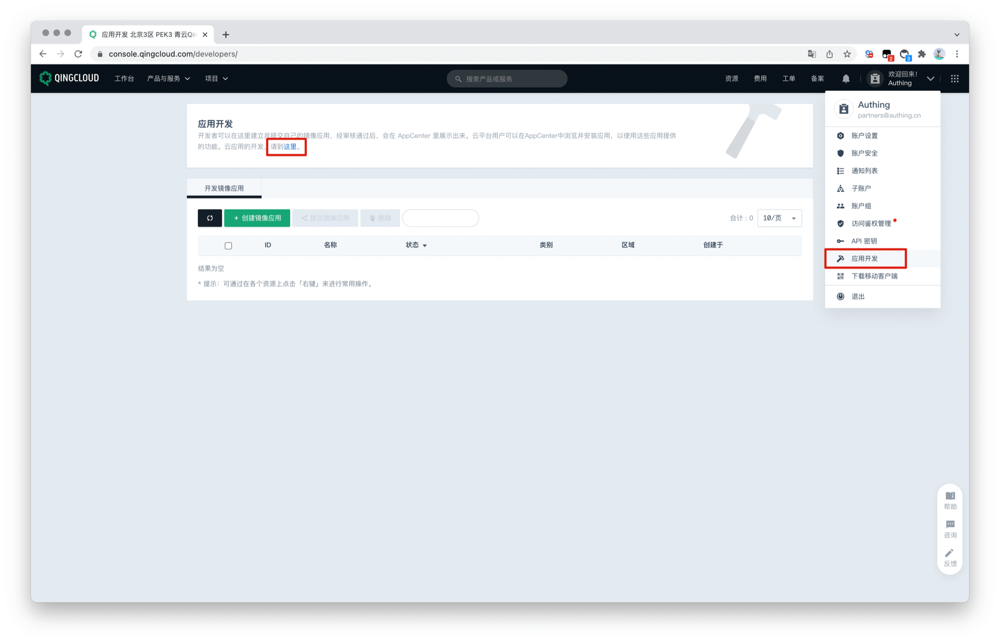
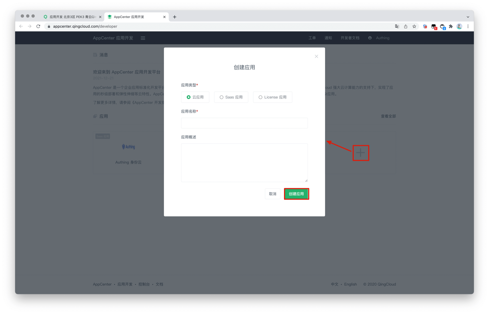
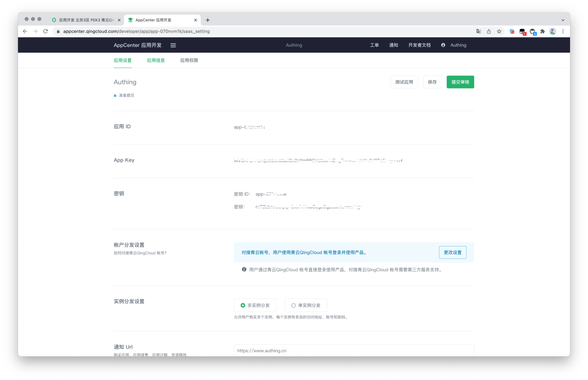
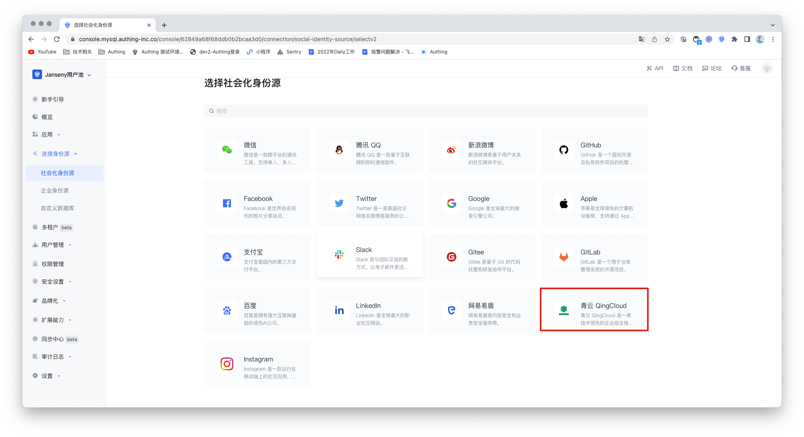
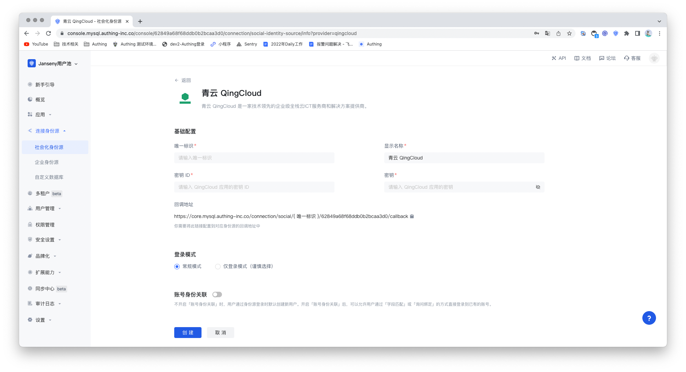
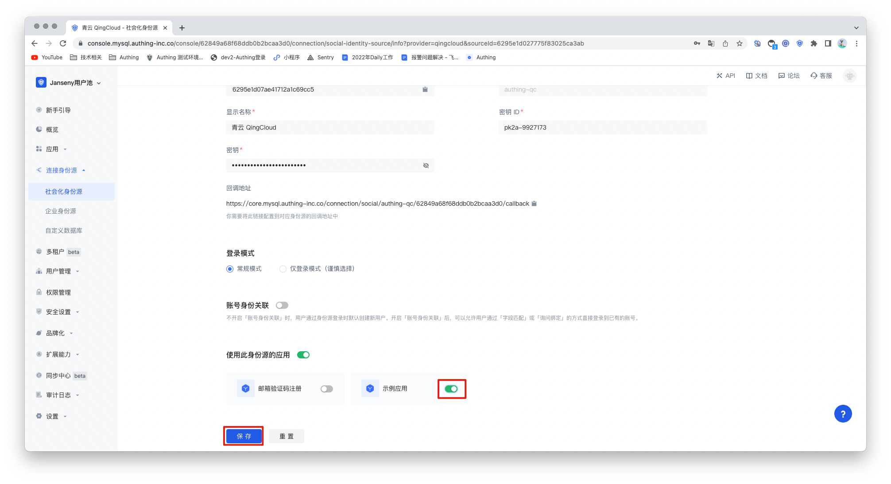
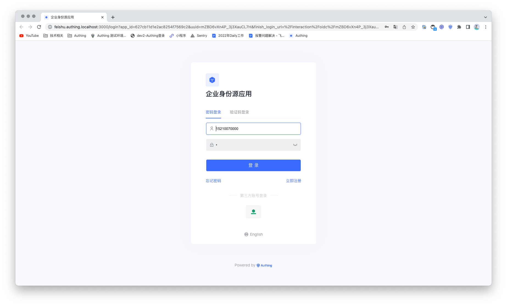

# 青云 QingCloud 

<LastUpdated/>

## 场景介绍

- **概述**：青云 QingCloud 是一家技术领先的企业级全栈云 ICT 服务商和解决方案提供商。 QingCloud  社会化登录是用户以 QingCloud 为身份源安全登录到第三方应用或者网站。在 Authing 中配置并开启 QingCloud 的社会化登录，即可实现通过 Authing 快速获取 QingCloud 基本开放的信息和帮助用户实现免密登录功能。
- **应用场景**：PC 网站
- **终端用户预览图**：

## 注意事项

- 如果你未开通 QingCloud 账号，请先前往 [QingCloud](https://www.qingcloud.com/) 平台注册一个账号。
- 需在 QingCloud 上的[应用开发](https://appcenter.qingcloud.com/developer/)中创建一个可支持协议认证应用。
- 如果你未开通 Authing 控制台账号，请先前往 [Authing Console 控制台](https://authing.cn/) 注册开发者账号。

## 第一步：创建 QingCloud 应用

前往 QingCloud 的 [AppCenter 应用开发平台](https://appcenter.qingcloud.com/developer/ ) 。如果找不到，可以按照 [QingCloud 文档 (opens new window)](https://docsv3.qingcloud.com/appcenter/dev-platform/saas-developer-guide/release/#创建应用)指引创建一个应用，你需要记录下该应用的 **App ID** 和 **App Secret**，后面需要用到。

进入控制台，点击右上角的头像，点击应用开发，在应用开发下点击这「这里」进入应用列表。

在应用列表内点击「+」 号即可进行创建应用。选择应用类型，填入应用名称，点击「创建应用」。

记录下 QingCloud 应用的 密钥 ID （即应用 ID）和 密钥。

## 步骤 2: 在 Authing 控制台配置 QingCloud

2.1 请在 [Authing 控制台](https://console.authing.cn/)中，进入「社会化身份源」配置页面，点击「创建社会化身份源」开始选择与创建。

2.2 在所有社交身份源图标中，找到并进入 **QingCloud** 社会化登录。

2.3 请在 Authing Console 控制台 的「社会化身份源」-「QingCloud」页面，配置相关的字段信息。

- `App ID`: QingCloud 密钥 ID；
- `App Secret`: QingCloud 密钥；

| 字段/功能    | 描述                                                         |
| ------------ | ------------------------------------------------------------ |
| 唯一标识     | a.唯一标识由小写字母、数字、- 组成，且长度小于 32 位。b.这是此连接的唯一标识，设置之后不能修改。 |
| 显示名称     | 这个名称会显示在终端用户的登录界面的按钮上。                 |
| 密钥 ID      | 密钥 ID，需要在 QingCloud 开放平台所创建的应用中获取。       |
| 密钥         | 密钥，需要在 QingCloud 开放平台所创建的应用中获取。          |
| 回调地址     | QingCloud 有效 OAuth 跳转 URI。需要将此 URL 配置到 QingCloud 开放平台上。 |
| 登录模式     | 开启「仅登录模式」后，只能登录既有账号，不能创建新账号，请谨慎选择。 |
| 账号身份关联 | 不开启「账号身份关联」时，用户通过身份源登录时默认创建新用户。开启「账号身份关联」后，可以允许用户通过「字段匹配」或「询问绑定」的方式直接登录到已有的账号。 |

2.4 配置完成后，点击「创建」按钮完成创建。

## 第三步：开发接入

- **推荐开发接入方式**：使用托管登录页

- **优劣势描述**：运维简单，由 Authing 负责运维。每个用户池有一个独立的二级域名;如果需要嵌入到你的应用，需要使用弹窗模式登录，即：点击登录按钮后，会弹出一个窗口，内容是 Authing 托管的登录页面，或者将浏览器重定向到 Authing 托管的登录页。

- **详细接入方法**：

3.1 在 Authing 控制台创建一个应用，详情查看：[如何在 Authing 创建一个应用](/guides/app-new/create-app/create-app.md)

3.2 在已创建好的 QingCloud 身份源连接详情页面，开启并关联一个在 Authing 控制台创建的应用

3.3 在登录页面体验 QingCloud 第三方登录

