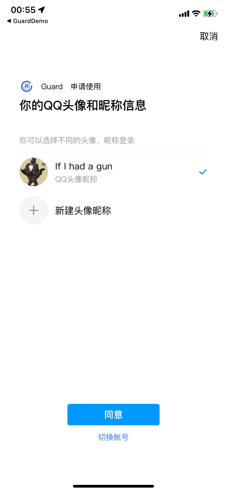
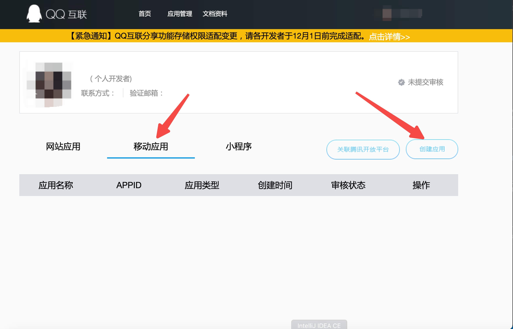
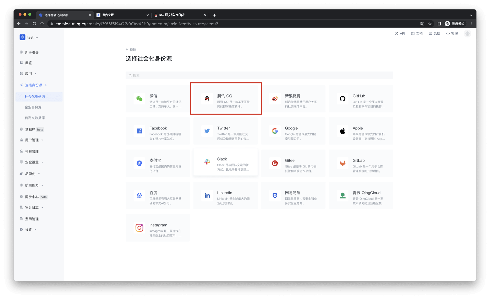
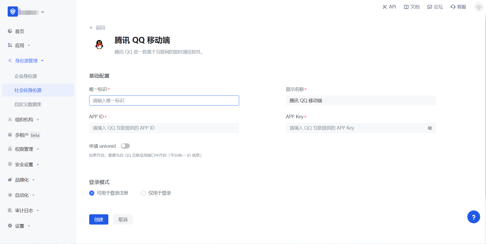
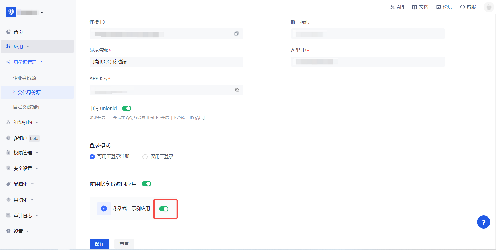

# 腾讯 QQ 移动端

<LastUpdated/>

## 场景介绍

### 概述

腾讯 QQ 社会化登录是用户以腾讯 QQ 为身份源安全登录第三方应用或者网站。在 {{$localeConfig.brandName}} 中配置并开启腾讯 QQ 的社会化登录，即可实现通过 {{$localeConfig.brandName}} 快速获取腾讯 QQ 基本开放的信息和帮助用户实现免密登录功能。

### 应用场景

移动端

### 终端用户预览图

## 注意事项

- 如果你未开通 QQ 互联平台账号，请先前往 [QQ 互联中心](https://connect.qq.com/manage.html#/) 注册开发者账号。
- 需要审核通过后，才可创建应用。
- 如果你未开通 {{$localeConfig.brandName}} 控制台账号，请先前往 [{{$localeConfig.brandName}} 控制台](https://authing.cn/) 注册开发者账号。

## 第一步：在 QQ 开放平台创建一个移动应用

前往 [QQ 互联中心](https://connect.qq.com/manage.html#/)，创建一个移动应用。

点击页面左上方的个人 QQ 头像完成注册并发起审核，然后依次点击「移动应用」和「创建应用」来创建一个使用 QQ 登录的移动应用。过程中如遇到任何问题，请参考页面上方的 QQ 官方「文档资料」。

## 第二步：在 {{$localeConfig.brandName}} 控制台配置腾讯 QQ

2.1 请在 {{$localeConfig.brandName}}  控制台 的「社会化身份源」页面，点击「创建社会化身份源」按钮，进入「选择社会化身份源」页面。

2.2 请在  {{$localeConfig.brandName}}  控制台 的「社会化身份源」-「选择社会化身份也」页面，点击「腾讯 QQ」身份源按钮，进入 「腾讯 QQ 登录模式」页面。

2.3 请在  {{$localeConfig.brandName}}  控制台 的「社会化身份源」-「腾讯 QQ 移动端」页面，配置相关的字段信息。

| 字段/功能    | 描述                                                         |
| ------------ | ------------------------------------------------------------ |
| 唯一标识     | a.唯一标识由小写字母、数字、- 组成，且长度小于 32 位。b.这是此连接的唯一标识，设置之后不能修改。 |
| 显示名称     | 这个名称会显示在终端用户的登录界面的按钮上。                 |
| APP ID      | QQ 应用编号，需要在 QQ 开放平台上获取。                  |
| APP Key     | QQ 应用密钥，需要在 QQ 开放平台上获取。                   |
| 申请 unionid | 如果开启，需要先在 QQ 互联应用接口中开启「平台统一 ID 信息」。 |
| 登录模式     | 开启「仅登录模式」后，只能登录既有账号，不能创建新账号，请谨慎选择。 |

配置完成后，点击「创建」或者「保存」按钮完成创建。

## 第三步：开发接入

- **推荐开发接入方式**：SDK

- **优劣势描述**：运维简单，由 {{$localeConfig.brandName}} 负责运维。每个用户池有一个独立的二级域名;如果需要嵌入到你的应用，需要使用弹窗模式登录，即：点击登录按钮后，会弹出一个窗口，内容是 {{$localeConfig.brandName}} 托管的登录页面，或者将浏览器重定向到 {{$localeConfig.brandName}} 托管的登录页。

- **详细接入方法**：
  
3.1 在 {{$localeConfig.brandName}} 控制台创建一个应用，详情查看：[如何在 {{$localeConfig.brandName}} 创建一个应用](/guides/app-new/create-app/create-app.md)

3.2 在已创建好的 QQ 身份源连接详情页面，开启并关联一个在 {{$localeConfig.brandName}} 控制台创建的应用

3.3 在登录页面体验 QQ 第三方登录（如 [终端用户预览图](#终端用户预览图) 所示）。
