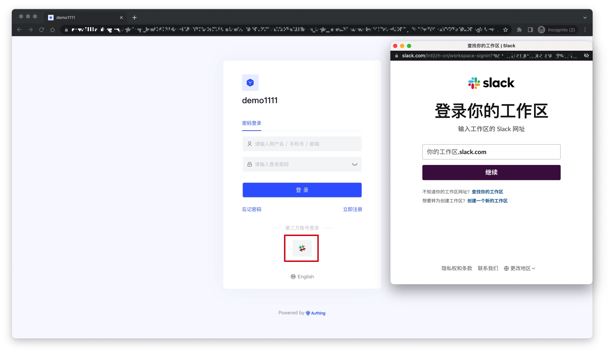
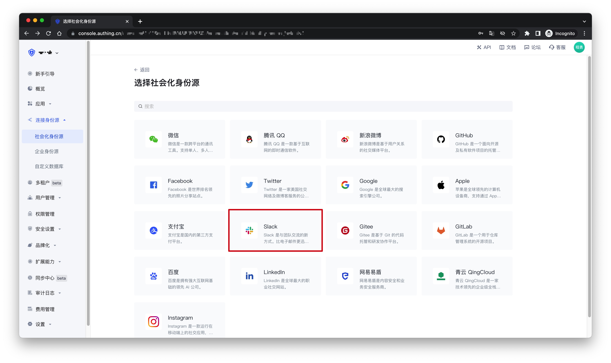
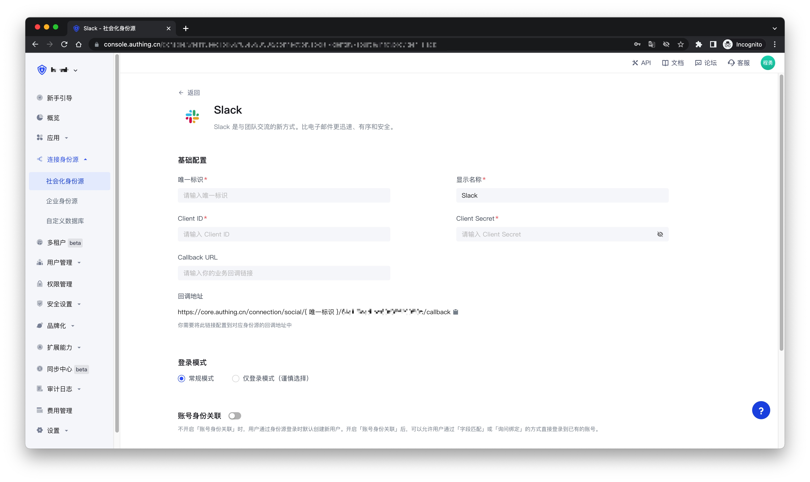
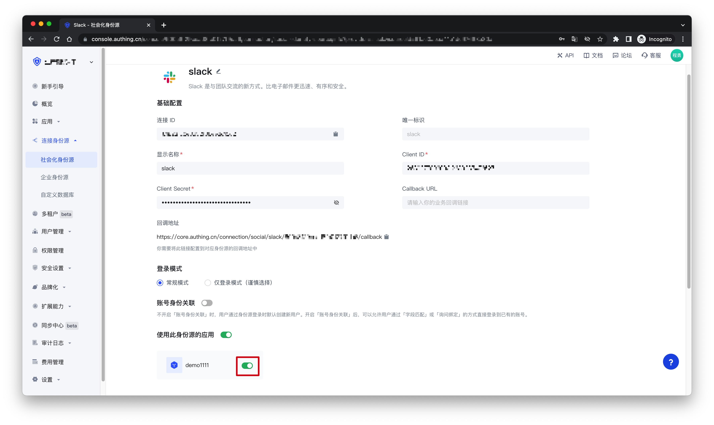
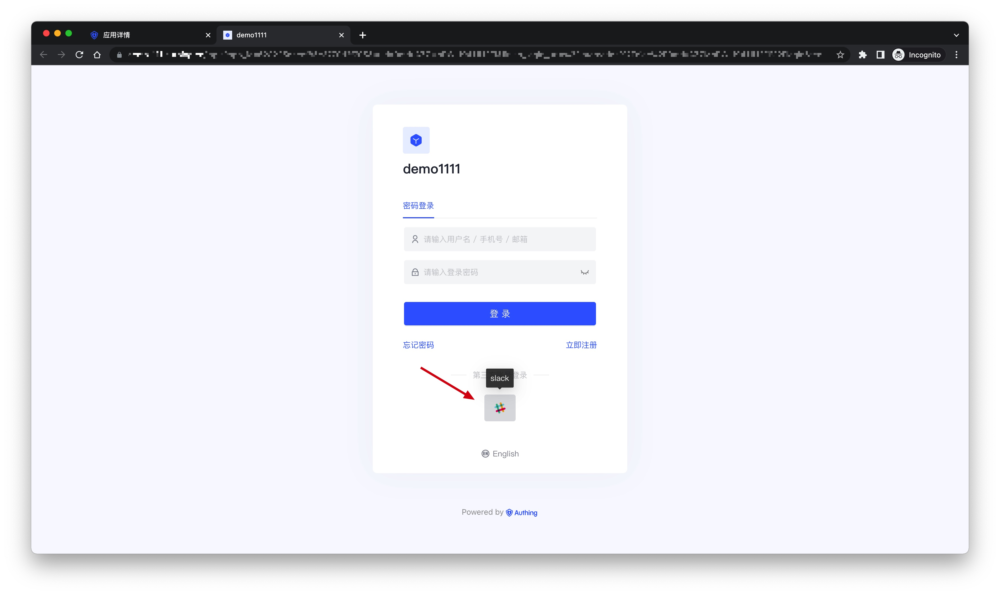

# Slack 社会化登录

<LastUpdated />

## 场景介绍

- **概述**：Slack 社会化登录是用户以 Slack 为身份源安全登录第三方应用或者网站。在 {{$localeConfig.brandName}} 中配置并开启 Slack 的社会化登录，即可实现通过 {{$localeConfig.brandName}} 快速获取 Slack 基本开放的信息和帮助用户实现免密登录功能。
- **应用场景**：PC 网站
- **终端用户预览图**：

## 注意事项

- 如果您还没有 Slack 账号，请先前往 [slack.com](https://slack.com/get-started#/createnew)注册账号
- 如果您未开通 {{$localeConfig.brandName}} 控制台账号，请先前往 [{{$localeConfig.brandName}} 控制台](https://authing.cn/) 注册开发者账号

## 步骤 1：在 Slack API 平台创建一个应用

请按照 [Slack API 文档](https://api.slack.com/authentication/sign-in-with-slack#implementation)指引创建一个应用，你需要记录下该应用的 `App ID`、`Client ID`、`Client Secret`、`Signing Secret`，后面需要用到。也可以参考以下流程。

首先，通过 [Slack API: Your Apps](https://api.slack.com/apps)，点击「Create New App」创建 App。

如果你之前从未使用过 Slack，你可能需要先创建一个 Workspace：点击「Create Another Workplace」并完成创建。

拥有 Workspace 之后，返回至 [Slack API: Your Apps](https://api.slack.com/apps)，并点击「Create New App」继续 App 的创建。若被提示选择创建方式，请选择 From scratch。输入 App Name 并选择 Workspace 之后，点击「Create App」完成创建。

完成创建后，你会看到关于这个 App 的基本信息（Basic Information）。向下滑动到 App Credentials，这里记录着 `App ID`、`Client ID`、`Client Secret`、`Signing Secret`，你后续可能会用到它们。

最后，在侧边栏点击「OAuth & Permissions」，找到页面中的「Redirect URLs」设置区域，点击「Add New Redirect URL」添加如下回调地址：`https://core.authing.cn/connection/social/{ 唯一标识 }/{ 用户池 ID }/callback`，你需要将其中的 `{ 唯一标识 }` 替换为你正在 Authing 创建的身份源所填写的`唯一标识`， `{ 用户池 ID }` 替换为你的[用户池 ID](/guides/faqs/get-userpool-id-and-secret.md)。添加完成后，点击「Save URLs」保存设置。

## 步骤 2：在 {{$localeConfig.brandName}} 控制台配置 Slack API 应用

2.1 请在 {{$localeConfig.brandName}} 控制台的「社会化身份源」页面，点击「创建社会化身份源」按钮，进入「选择社会化身份源」页面。

2.2 在「选择社会化身份源」页面，点击「Slack」卡片。

2.3 在「Slack」配置页面，填写相关的字段信息。

| 字段          | 描述                                                                                                                                                         |
| ------------- | ------------------------------------------------------------------------------------------------------------------------------------------------------------ |
| 唯一标识      | a. 唯一标识由小写字母、数字、- 组成，且长度小于 32 位。 b. 这是此连接的唯一标识，设置之后不能修改。                                                     |
| 显示名称      | 这个名称会显示在终端用户的登录界面的按钮上。                                                                                                                 |
| Client ID     | 上一步获取的 Slack API 应用 ID。                                                                                                                             |
| Client Secret | 上一步获取的 Slack API 应用 Secret。                                                                                                                         |
| Callback URL  | 可以填写你的业务回调地址，用户完成登录后，浏览器将会跳转到该地址。                                                                                           |
| 登录模式      | 开启「仅登录模式」后，只能登录既有账号，不能创建新账号，请谨慎选择。                                                                                         |
| 账号身份关联  | 不开启「账号身份关联」时，用户通过身份源登录时默认创建新用户。开启「账号身份关联」后，可以允许用户通过「字段匹配」或「询问绑定」的方式直接登录到已有的账号。 |

2.4 配置完成后，点击「创建」或者「保存」按钮完成创建。

## 步骤 3：开发接入

- **推荐开发接入方式**：使用托管登录页
- **优劣势描述**：运维简单，由 {{$localeConfig.brandName}} 负责运维。每个用户池有一个独立的二级域名；如果需要嵌入到你的应用，需要使用弹窗模式登录，即：点击登录按钮后，会弹出一个窗口，内容是 {{$localeConfig.brandName}} 托管的登录页面，或者将浏览器重定向到 {{$localeConfig.brandName}} 托管的登录页。
- **详细接入方法**：

  3.1 在 {{$localeConfig.brandName}} 控制台创建一个应用，详情查看：[如何在 {{$localeConfig.brandName}} 创建一个应用](/guides/app/create-app.md)

  3.2 在已创建好的「Slack」身份源连接详情页面，开启并关联一个在 {{$localeConfig.brandName}} 控制台创建的应用
  

  3.3 点击 {{$localeConfig.brandName}} 控制台的应用「体验登录」按钮，在弹出的登录窗口体验「Slack」登录
  

