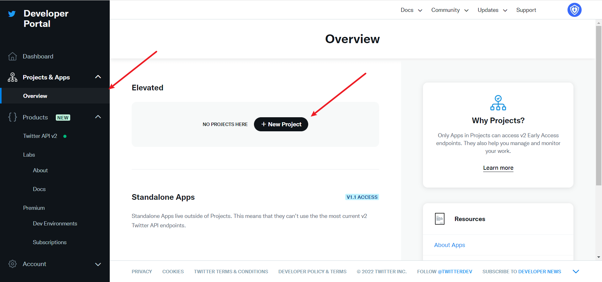
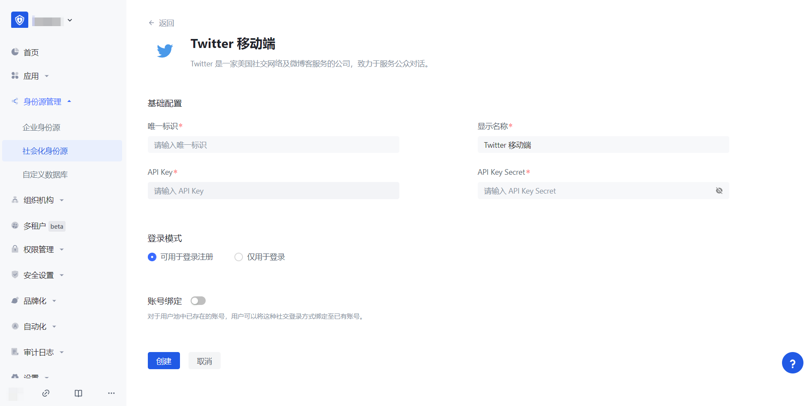

# Twitter 移动端

<LastUpdated/>

## 场景介绍

### 概述

Authing 为开发者提供了一种在移动端（iOS 或安卓）应用中快速跳转 Twitter 登录获取用户信息的方式，通过简单地调用 Authing 移动端 SDK 可以完成 Twitter 账号接入。

### 应用场景

移动 APP

### 终端用户预览图

## 注意事项

- 如果你还没有 Twitter 账号，请先前往 [Twitter 平台](https://twitter.com/) 进行账号注册。
- 前往 [Twitter 开发者平台](https://developer.twitter.com/en/portal/)完善账号信息， 并为账号[申请 Elevated access 权限](https://developer.twitter.com/en/portal/petition/standard/basic-info)。
- 如果你未开通 {{$localeConfig.brandName}} 控制台账号，请先前往 [{{$localeConfig.brandName}} Console 控制台](https://authing.cn/) 注册开发者账号；

## 第一步：创建 Twitter 应用

1.1 创建一个项目，在侧边栏 **Projects & Apps**，选择 **Overview**，在 **Elevated** 目录下，点击 **+New Project**。

依次填写好**项目名称**、**使用场景**、**项目描述**后，开始应用的创建。

在开发阶段，应用环境先选择 **Development**，调试完成后切换到 **Production**

填写完名称后会看到 **APP Key** 和 **APP Key Secret** ，先记录下来，在 {{$localeConfig.brandName}} 控制台配置时会用到

## 第二步：在 {{$localeConfig.brandName}} 控制台配置 Twitter 移动端登录

2.1 请在 {{$localeConfig.brandName}} Console 控制台 的「社会化身份源」页面，点击「创建社会化身份源」按钮，进入「选择社会化身份源」页面，选择「Twitter」身份源按钮，进入 「Twitter 移动端登录模式」页面。

2.3 请在 {{$localeConfig.brandName}} Console 控制台 的「社会化身份源」-「Twitter 移动端」页面，配置相关的字段信息。

| 字段/功能      | 描述 |
| ------------ | -----------|
| 唯一标识       | a.唯一标识由小写字母、数字、- 组成，且长度小于 32 位。b.这是此连接的唯一标识，设置之后不能修改。                                                                                                                                                                                                                                                      |
| 显示名称       | 这个名称会显示在终端用户的登录界面的按钮上。                                                                                                                                                                                                                                                                                                          |
| API Key        | 应用编号，需要在 Twitter 平台上获取                                                                                                                                                                                                                                                                                                                   |
| API Key Secret | 应用密钥，需要在 Twitter 平台上获取                                                                                                                                                                                                                                                                                                                   |
| 登录模式       | 开启「仅登录模式」后，只能登录既有账号，不能创建新账号，请谨慎选择。                                                                                                                                                                                                                                                                                  |

配置完成后，点击「创建」或者「保存」按钮完成创建。

在 Twitter 创建的项目，选择刚刚创建的应用，滑动到下方，在 **User authentication settings** 栏目下，点击 **Set Up** 按钮，进入认证设置页

根据需要选择 App 的权限，默认选择 **Read**，就可以满足认证功能

如果忘记了应用的 Key，可以在应用页点击 **Keys and tokens**，选择 **Regenerate** 重新生成。

完成配置后回到应用设置页面，点击**Edit**，把应用环境切换到 **Production**。

## 第三步：开发接入

- **推荐开发接入方式**：SDK

- **优劣势描述**：运维简单，由 {{$localeConfig.brandName}} 负责运维。每个用户池有一个独立的二级域名;如果需要嵌入到你的应用，需要使用弹窗模式登录，即：点击登录按钮后，会弹出一个窗口，内容是 {{$localeConfig.brandName}} 托管的登录页面，或者将浏览器重定向到 {{$localeConfig.brandName}} 托管的登录页。

- **详细接入方法**：

3.1 在 {{$localeConfig.brandName}} 控制台创建一个应用，详情查看：[如何在 {{$localeConfig.brandName}} 创建一个应用](/guides/app-new/create-app/create-app.md)

3.2 在已创建好的 Twitter 移动端身份源连接详情页面，开启并关联一个在 {{$localeConfig.brandName}} 控制台创建的应用

3.3 在登录页面体验 Twitter 第三方登录（如 
](#终端用户预览图) 所示）。