# Twitter 社会化登录

<LastUpdated/>

## 场景介绍

- **概述** Twitter 社会化登录是用户以 Twitter 为身份源安全登录第三方应用或者网站。在 Authing 中配置并开启 Twitter 的社会化登录，即可实现通过 Authing 快速获取 Twitter 基本开放的信息和帮助用户实现免密登录功能。
- **应用场景**：PC 网站
- **终端用户预览图**：

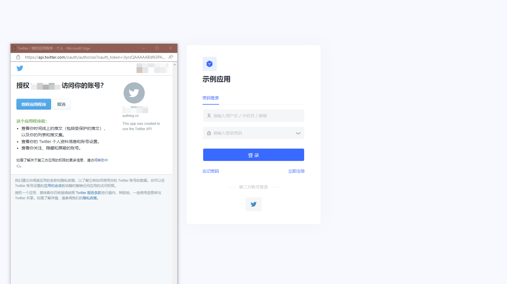

## 注意事项：

- 如果您还没有 Twitter 账号，请先前往 [Twitter 平台](https://twitter.com/) 进行账号注册。
- 前往 [Twitter 开发者平台](https://developer.twitter.com/en/portal/)完善账号信息， 并为账号[申请 Elevated access 权限](https://developer.twitter.com/en/portal/petition/standard/basic-info)。
- 如果您未开通 Authing 控制台账号，请先前往 [Authing Console 控制台](https://authing.cn/) 注册开发者账号；

## 步骤 1：创建 Twitter 应用

1.1 创建一个项目，在侧边栏 **Projects & Apps**，选择 **Overview**，在 **Elevated** 目录下，点击 **+New Project**。

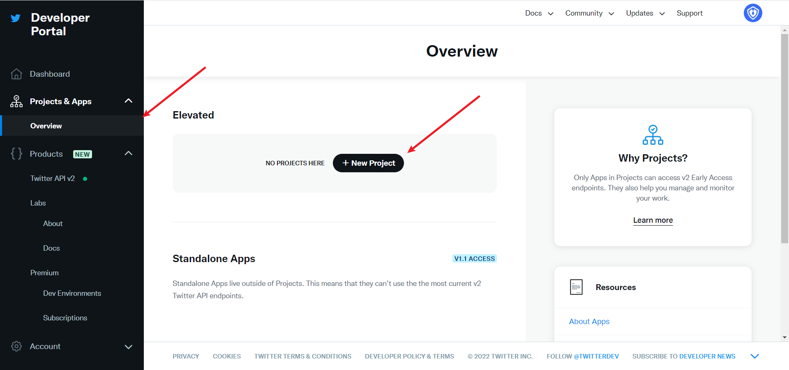

依次填写好**项目名称**、**使用场景**、**项目描述**后，开始应用的创建。

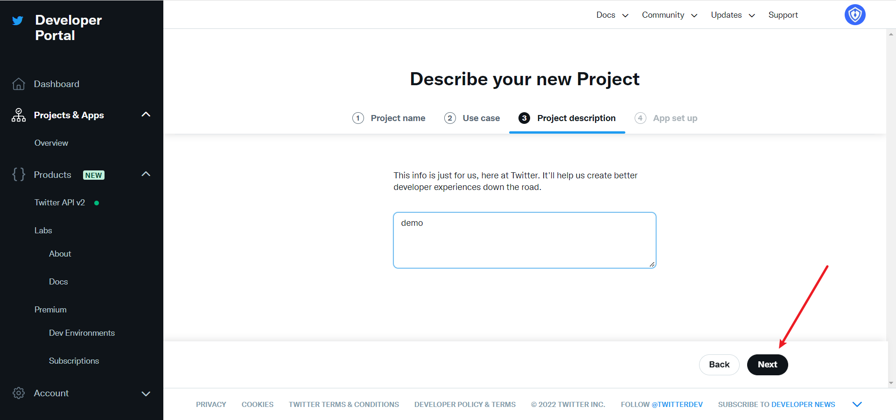

在开发阶段，应用环境先选择 **Development**，调试完成后切换到 **Production**

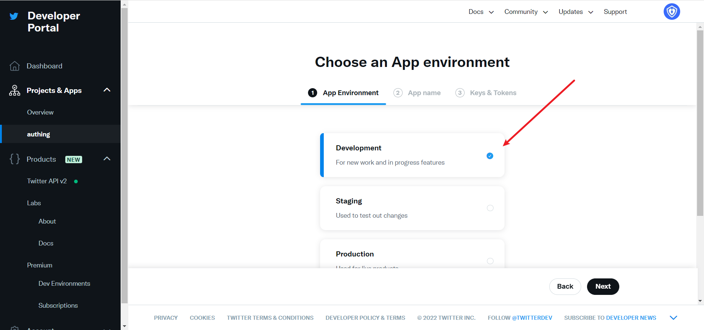

填写完名称后会看到 **APP Key** 和 **APP Key Secret** ，先记录下来，在 Authing 控制台配置时会用到

## 步骤 2：在 Authing 控制台配置 Twitter

2.1 请在 Authing Console 控制台 的「社会化身份源」页面，点击「创建社会化身份源」按钮，进入「选择社会化身份源」页面，选择「Twitter」身份源按钮，进入 「Twitter 登录模式」页面。

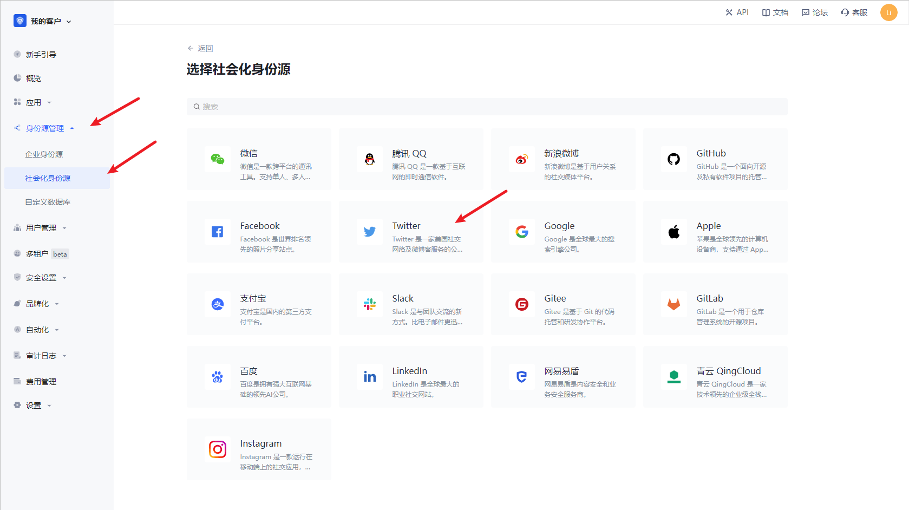

2.3 请在 Authing Console 控制台 的「社会化身份源」-「Twitter」页面，配置相关的字段信息。

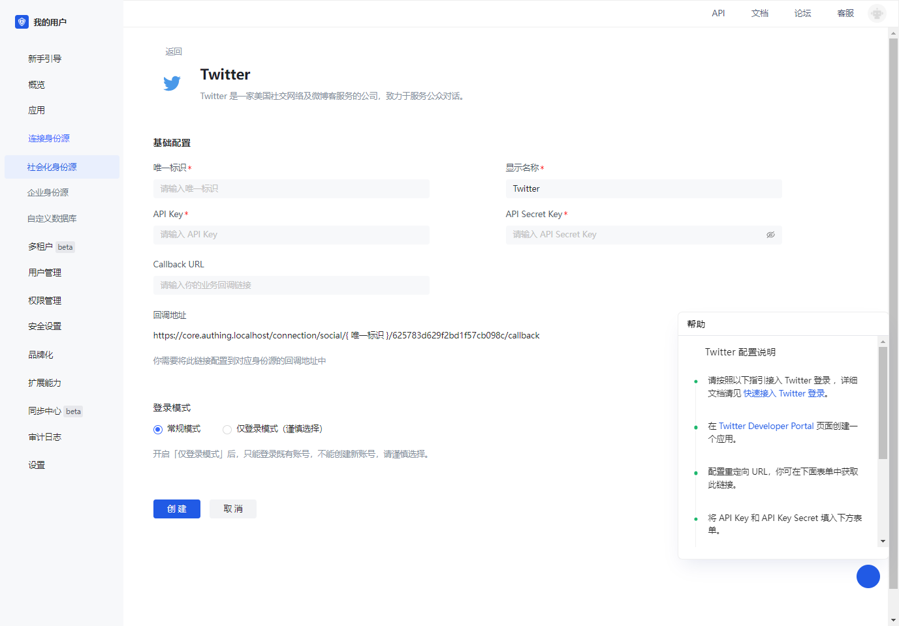

| 编号  | 字段/功能      | 描述                                                                                             |
| ----- | -------------- | ------------------------------------------------------------------------------------------------ |
| 2.3.1 | 唯一标识       | a.唯一标识由小写字母、数字、- 组成，且长度小于 32 位。b.这是此连接的唯一标识，设置之后不能修改。 |
| 2.3.2 | 显示名称       | 这个名称会显示在终端用户的登录界面的按钮上。                                                     |
| 2.3.3 | API Key        | 应用编号，需要在 Twitter 平台上获取                |
| 2.3.4 | API Secret Key | 应用密钥，需要在 Twitter 平台上获取                                                         |
| 2.3.5 | Callback URL   | 这是你的业务回调域名，和自建应用配置的回调链接不是一个概念，也和第三方社会化登录控制台的回调地址配置无关。比如你的网站域名是 https://example.com ， 处理 Authing 回调请求的 url 为 /auth/callback ， 那么你应该填写为 https://example.com/auth/callback。这个参数已经不推荐使用，建议在应用中单独配置回调链接，此处地址可填入 #。                                  |
| 2.3.6 | 回调地址       | Twitter 的重定向 URI。需要将此 URL 配置到 Twitter 平台所创建应用的回调地址上。                   |
| 2.3.7 | 登录模式       | 开启「仅登录模式」后，只能登录既有账号，不能创建新账号，请谨慎选择。                             |

配置完成后，点击「创建」或者「保存」按钮完成创建。

在 Twitter 创建的项目，选择刚刚创建的应用，滑动到下方，在 **User authentication settings** 栏目下，点击 **Set Up** 按钮，进入认证设置页
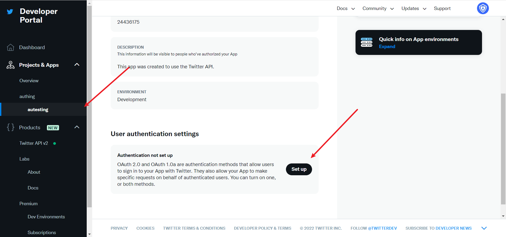

开启 OAuth 1.0a
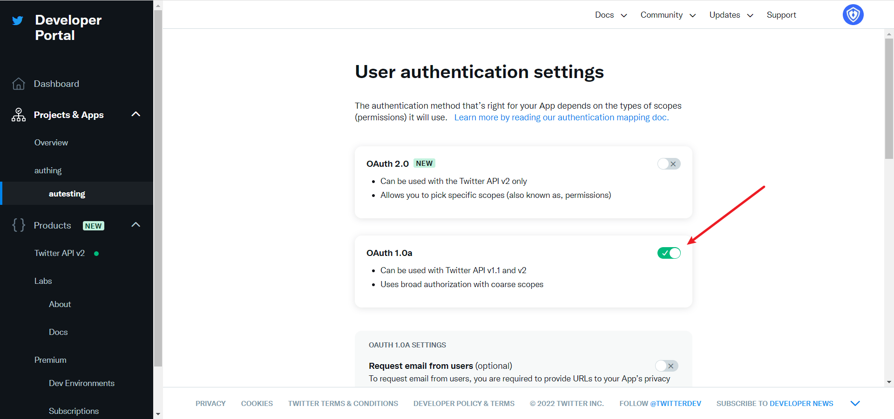

根据需要选择 App 的权限，默认选择 **Read**，就可以满足认证功能，**Callback URI / Redirect URL**填写在 Authing 控制台上创建 Twitter 身份源后，所展示的回调地址。
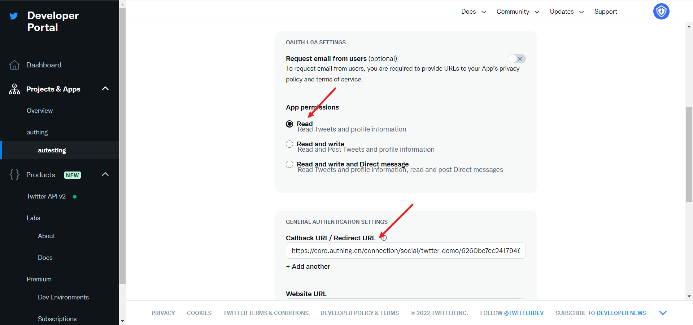

**Website URL**填写您的站点主页即可，然后点击保存
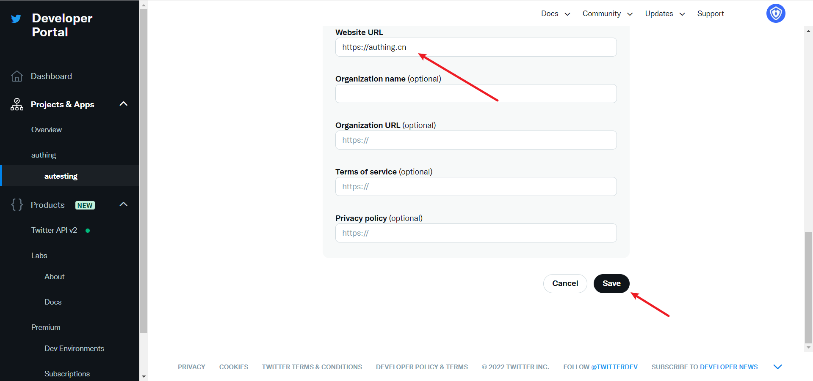

如果忘记了应用的 Key，可以在应用页点击 **Keys and tokens**，选择 **Regenerate** 重新生成。
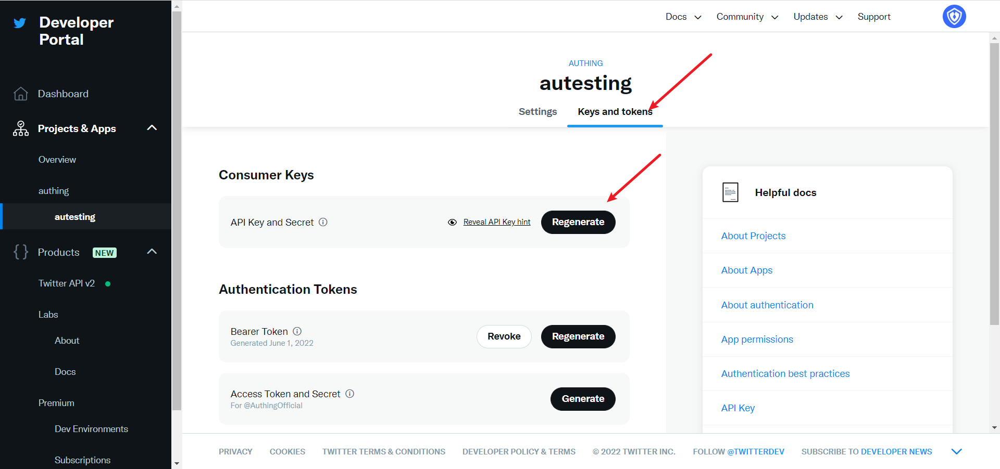

完成配置后回到应用设置页面，点击**Edit**，把应用环境切换到 **Production**。
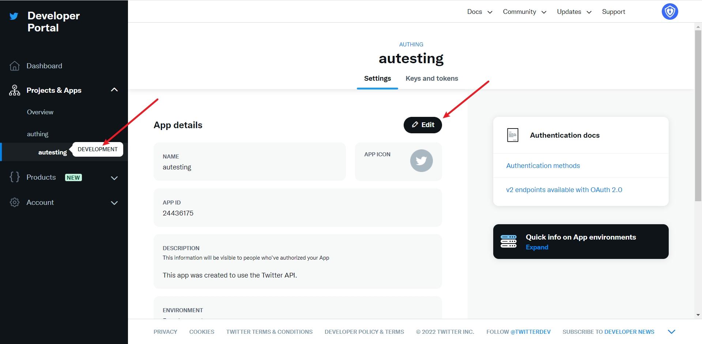

## 步骤 3：开发接入

- **推荐开发接入方式**：使用托管登录页

- **优劣势描述**：运维简单，由 Authing 负责运维。每个用户池有一个独立的二级域名;如果需要嵌入到你的应用，需要使用弹窗模式登录，即：点击登录按钮后，会弹出一个窗口，内容是 Authing 托管的登录页面，或者将浏览器重定向到 Authing 托管的登录页。

- **详细接入方法**：

  3.1 在 Authing 控制台创建一个应用，详情查看：[如何在 Authing 创建一个应用](./guides/app/create-app.md)

  3.2 在已创建好的 Twitter 身份源连接详情页面，开启并关联一个在 Authing 控制台创建的应用

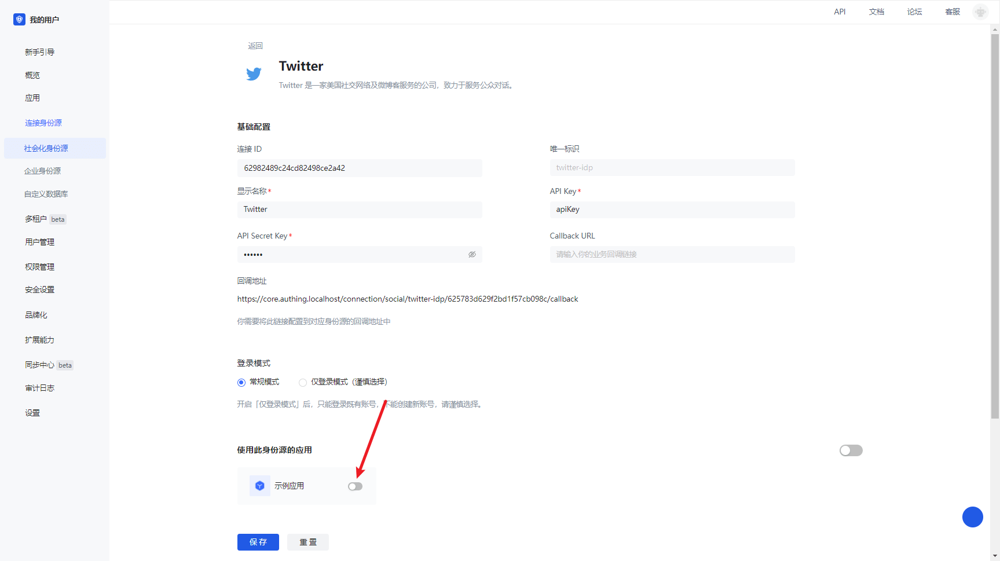

3.3 在登录页面体验 Twitter 第三方登录

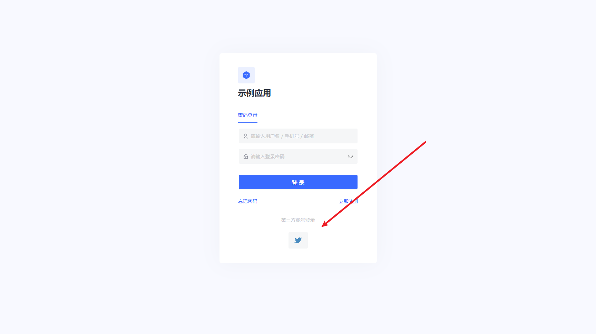
