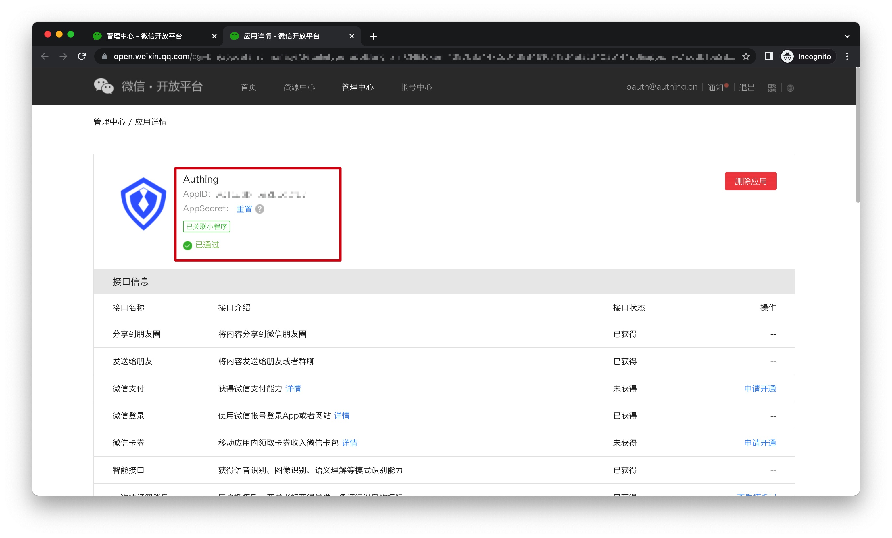
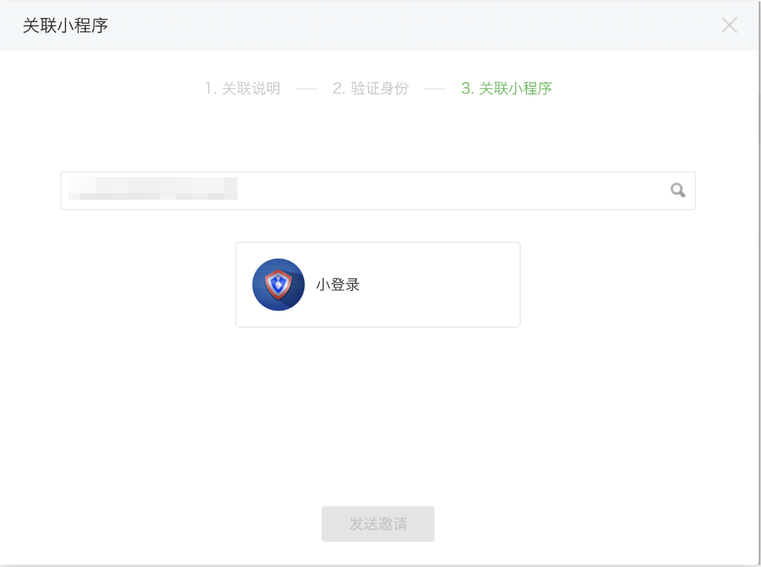
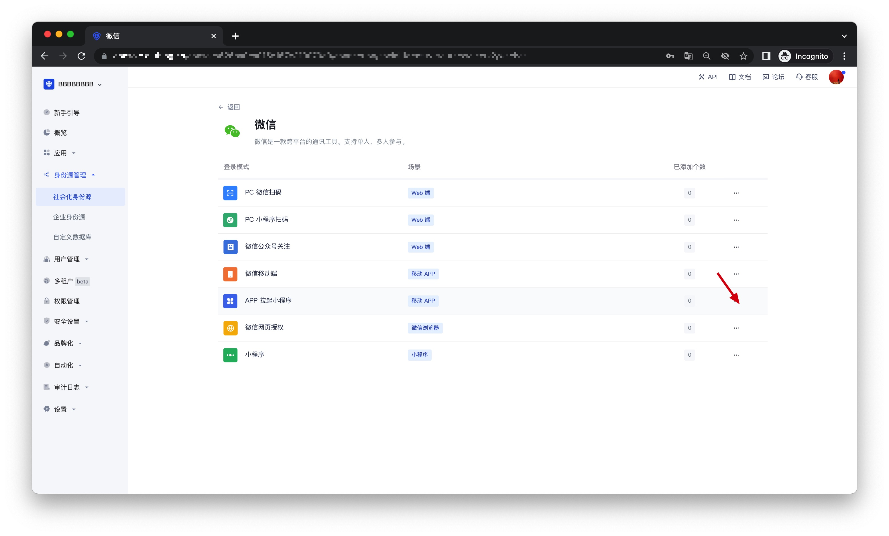
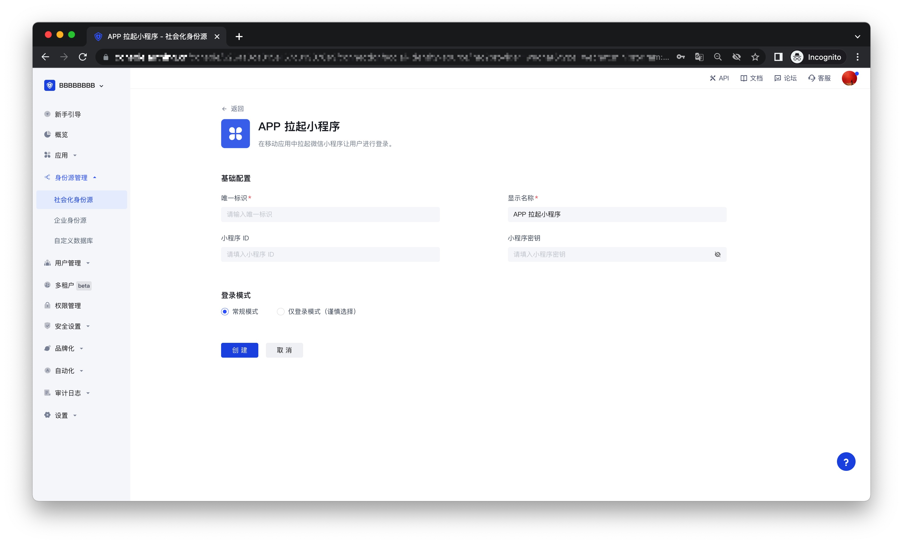
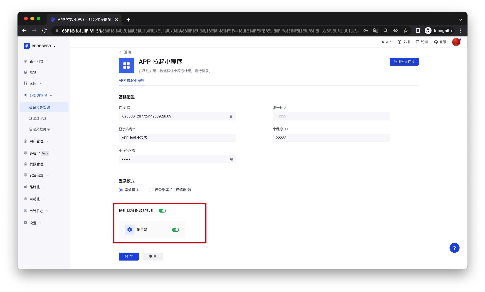

# APP 拉起微信小程序

<LastUpdated />

## 场景介绍

- **概述**：{{$localeConfig.brandName}} 通过 SDK 为开发者提供了一种 移动应用快速调起微信小程序并获取用户信息及完成登录的方法。通过 Authing 的 SDK 可以方便地获取微信提供的用户身份标识，快速建立以手机号码为基础的账号体系。
- **应用场景**：移动 APP
- **终端用户预览图**：

## 注意事项

- 如果您未开通 {{$localeConfig.brandName}} 控制台账号，请先前往 [{{$localeConfig.brandName}} 控制台](https://authing.cn/) 注册开发者账号；

## 步骤 1：在微信开放平台创建一个微信移动应用
前往 [微信开放平台](https://open.weixin.qq.com/cgi-bin/index?t=home/index&lang=zh_CN)创建一个 **微信移动应用**。

创建完成之后，你需要记录下该应用的 `AppID` 和 `AppSecret`，后面需要用到。

## 步骤 2：在微信开放平台关联小程序
前往 [微信开放平台](https://open.weixin.qq.com/cgi-bin/index?t=home/index&lang=zh_CN)的 **管理中心-移动应用-应用详情-关联小程序信息页面**关联小程序。需要关联的小程序 AppID 为 wxa0435021fd7a3af2.

## 步骤 3：在微信开放平台创建一个微信小程序（可选）
默认情况下，APP 拉起小程序登录会使用 Authing 提供的默认小程序，如果你需要有更强的品牌定制能力，或者想让通过小程序扫码登录的用户微信账号和自己的其他微信公众平台打通，你需要申请自己的小程序。如果你属于这两种场景的一种：
请按照微信公众平台指引创建一个微信小程序，你需要记录下该应用的 **App ID** 和 **App Secret**，后面需要用到。同时你需要联系我们获取小登录的源码，详情请咨询：**176-0250-2507**。

## 步骤 4：在 {{$localeConfig.brandName}} 控制台配置 APP 拉起小程序登录
4.1 请在 {{$localeConfig.brandName}} 控制台的「社会化身份源」页面，点击「创建社会化身份源」按钮，进入「选择社会化身份源」页面。

4.2 在「选择社会化身份源」页面，点击「微信」卡片，进入「微信登录模式」页面。

4.3 点击「APP 拉起小程序」登录模式，或者点击 **… 添加** 打开「APP 拉起小程序」配置页面。

4.4 在「APP 拉起小程序」配置页面，填写相关的字段信息。

| 字段         | 描述                                                                                                    |
| ------------ | ------------------------------------------------------------------------------------------------------- |
| 唯一标识     | a. 唯一标识由小写字母、数字、- 组成，且长度小于 32 位。 b. 这是此连接的唯一标识，设置之后不能修改  |
| 显示名称     | 这个名称会显示在终端用户的登录界面的按钮上                                                              |
| 小程序 ID    | 选择私有化小程序的用户填写                                                                    |
| 小程序 secret  | 选择私有化小程序的用户填写                                                                                     |
| 登录模式     | 开启「仅登录模式」后，只能登录既有账号，不能创建新账号，请谨慎选择                                      |

4.5 配置完成后，点击「创建」或者「保存」按钮完成创建。

## 步骤 5：开发接入

- **推荐开发接入方式**：SDK 
- **优劣势描述**：接入简单，只需要几行代码。可自定义程度最高。
- **详细接入方法**：
 
 5.1 SDK 开发者接入文档:暂无；

 5.2 在已创建好的「APP 拉起小程序」身份源连接详情页面，开启并关联一个在 {{$localeConfig.brandName}} 控制台创建的移动端应用；
 
 

 5.3 前往相关联的移动端 APP，体验 APP 登录功能。

  
  
