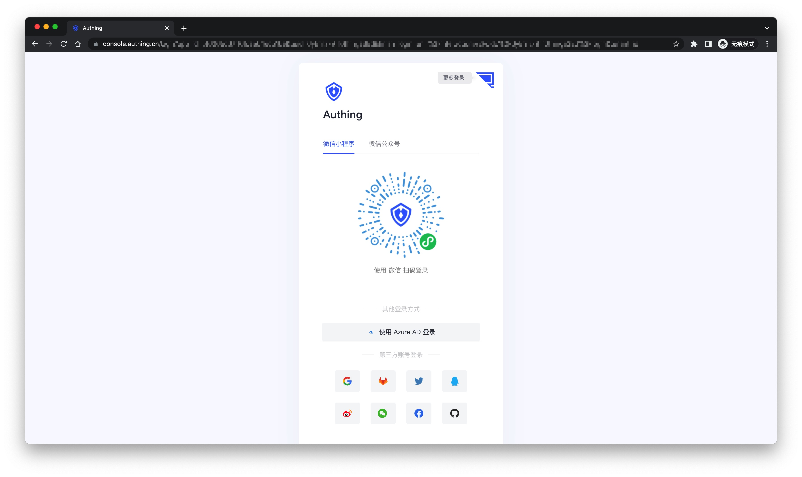
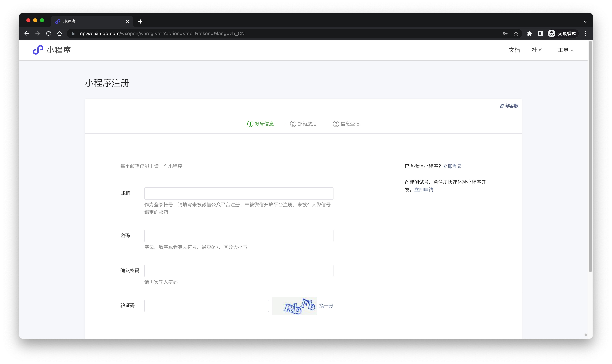
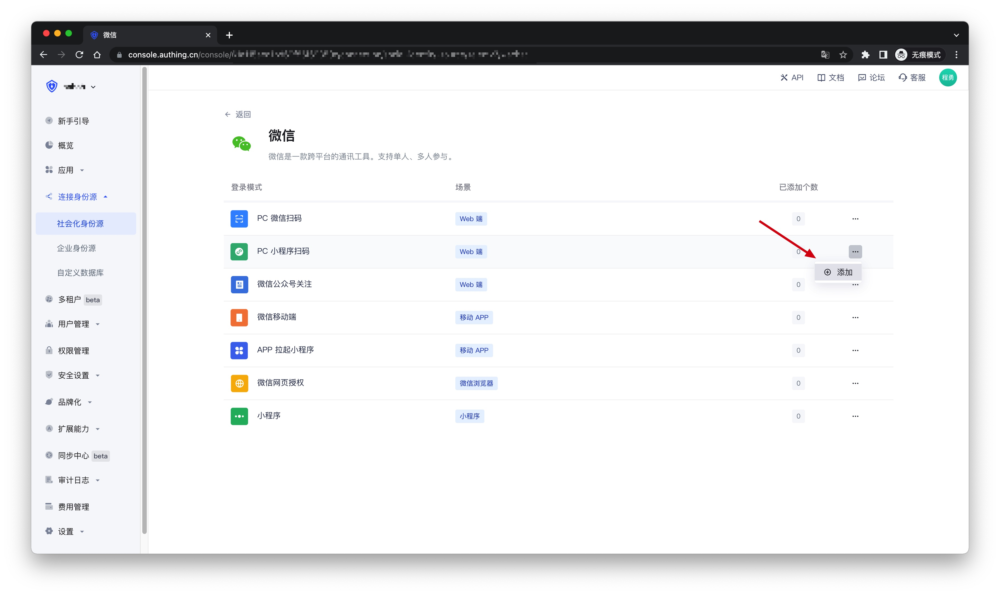
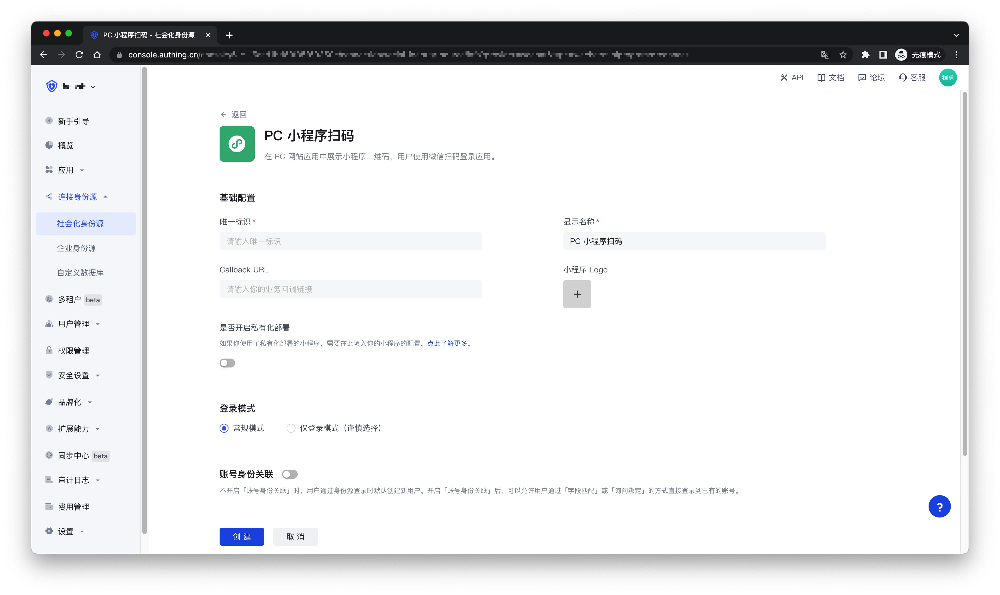
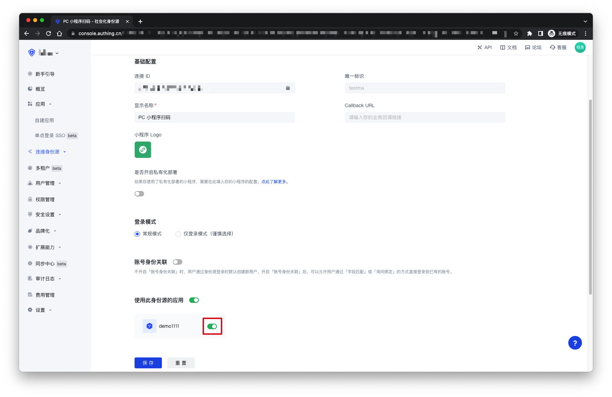
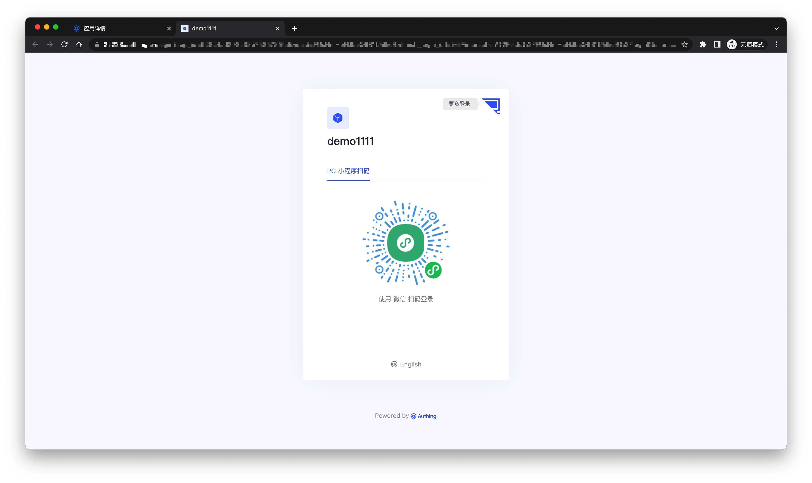

# 微信 PC 小程序扫码

<LastUpdated />

## 场景介绍

- **概述**：这是 {{$localeConfig.brandName}} 的一个开创性的设计，在 {{$localeConfig.brandName}} 中开启扫描小登录二维码登录后可以获得微信官方的实名用户信息， 用户一键授权即可以真实号码完成注册或者登录，为开发者建立以手机号码为基础的账号体系。
- **应用场景**：PC 网站
- **终端用户预览图**：

## 注意事项

- 如果你未开通微信公众平台账号，请先前往 [微信公众平台](https://mp.weixin.qq.com/wxopen/waregister?action=step1&token=&lang=zh_CN)注册并登录。
- 如果你未开通 {{$localeConfig.brandName}} 控制台账号，请先前往 [{{$localeConfig.brandName}} 控制台](https://authing.cn/) 注册开发者账号。

## 步骤 1：在微信公众平台创建一个小程序（可选）

默认情况下，小程序扫码登录会使用 {{$localeConfig.brandName}} 提供的默认小程序，如果你需要有更强的品牌定制能力，或者想让通过小程序扫码登录的用户微信账号和自己的其他微信公众平台打通，你需要申请自己的小程序。

如果你属于这两种场景的一种，请前往 [微信公众平台](https://mp.weixin.qq.com/wxopen/waregister?action=step1&token=&lang=zh_CN)指引创建一个微信小程序，你需要记录下该应用的 `App ID` 和 `App Secret`，后面需要用到。

同时你需要联系我们获取小登录的源码，详情请咨询 <a href="mailto:csm@authing.cn">Authing 售后服务人员</a>。

## 步骤 2：在 {{$localeConfig.brandName}} 控制台配置微信小程序

2.1 请在 {{$localeConfig.brandName}} 控制台的 **社会化身份源** 页面，点击 **创建社会化身份源** 按钮，进入 **选择社会化身份源** 页面。

2.2 在 **选择社会化身份源** 页面，点击 **微信** 卡片，进入 **微信登录模式** 页面。

2.3 继续点击 **PC 小程序扫码** 登录模式，或者点击 **添加** 打开 **PC 小程序扫码** 配置页面。

2.4 在 **PC 小程序扫码** 配置页面，填写相关的字段信息。

| 字段               | 描述  |
| ------------------ | ------------------------ |
| 唯一标识           | a. 唯一标识由小写字母、数字、- 组成，且长度小于 32 位。 b. 这是此连接的唯一标识，设置之后不能修改。                                                                                    |
| 显示名称           | 这个名称会显示在终端用户的登录界面的按钮上。                                                                                                                                                |
| Callback URL       | 身份源完成认证后的业务回调地址                                                                                                                                                              |
| 小程序 Logo        | 上传后的 Logo，将作为小程序二维码中央的 Logo。                                                                                                                                              |
| 是否开启私有化部署 | 如果你想使用自己主体的微信或自定义小登录小程序页面样式，可以联系我们获取小登录小程序的源码。如果开启这个选项，你必须部署一份自己的小登录小程序，并填写微信小程序的 `AppID` 和 `AppSecret`。 |
| 小程序 ID          | 小程序的 AppID，选择私有化小程序的用户填。                                                                                                                                                  |
| 小程序密钥         | 小程序的 AppSecret，选择私有化小程序的用户填。                                                                                                                                              |
| 登录模式           | 开启 **仅登录模式** 后，只能登录既有账号，不能创建新账号，请谨慎选择。                                                                                                                        |
| 账号身份关联       | 不开启 **账号身份关联** 时，用户通过身份源登录时默认创建新用户。开启 **账号身份关联** 后，可以允许用户通过 **字段匹配** 或 **询问绑定** 的方式直接登录到已有的账号。                                |

2.5 配置完成后，点击 **创建** 或者 **保存** 按钮完成创建。

## 步骤 3：开发接入

- **推荐开发接入方式**：使用托管登录页
- **优劣势描述**：运维简单，由 {{$localeConfig.brandName}} 负责运维。每个用户池有一个独立的二级域名；如果需要嵌入到你的应用，需要使用弹窗模式登录，即：点击登录按钮后，会弹出一个窗口，内容是 {{$localeConfig.brandName}} 托管的登录页面，或者将浏览器重定向到 {{$localeConfig.brandName}} 托管的登录页。
- **详细接入方法**：

3.1 在 {{$localeConfig.brandName}} 控制台创建一个应用，详情查看：[如何在 {{$localeConfig.brandName}} 创建一个应用](/guides/app-new/create-app/create-app.md)

3.2 在已创建好的 **PC 小程序扫码** 身份源连接详情页面，开启并关联一个在 {{$localeConfig.brandName}} 控制台创建的应用

3.3 点击 {{$localeConfig.brandName}} 控制台的应用 **体验登录** 按钮，在弹出的登录窗口体验 **PC 小程序扫码** 登录

