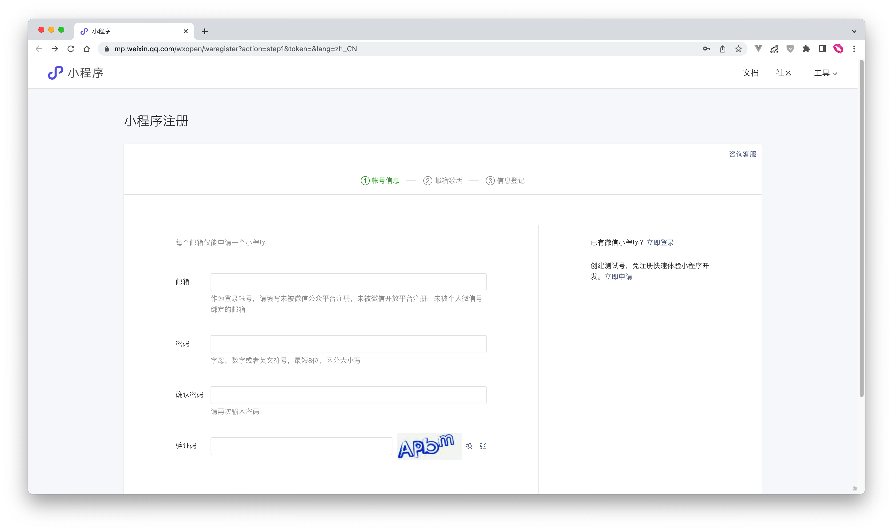
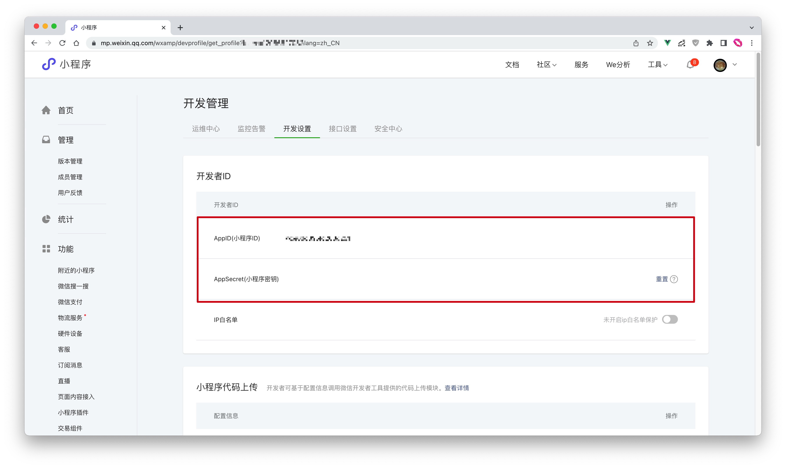
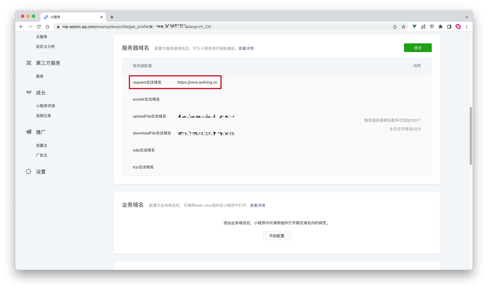
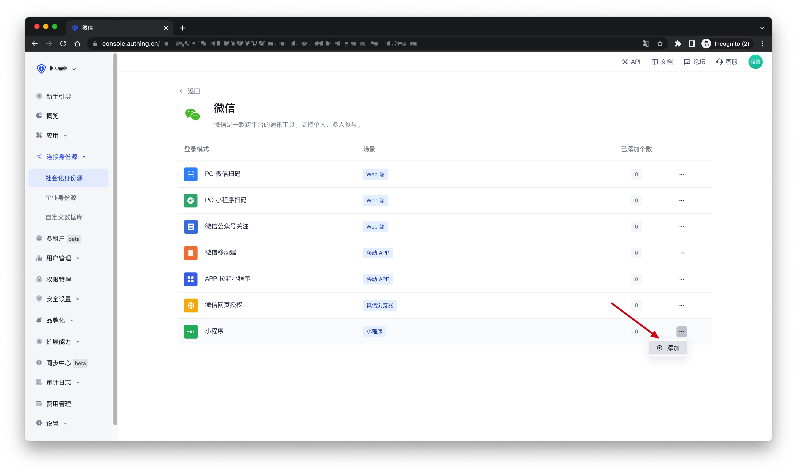
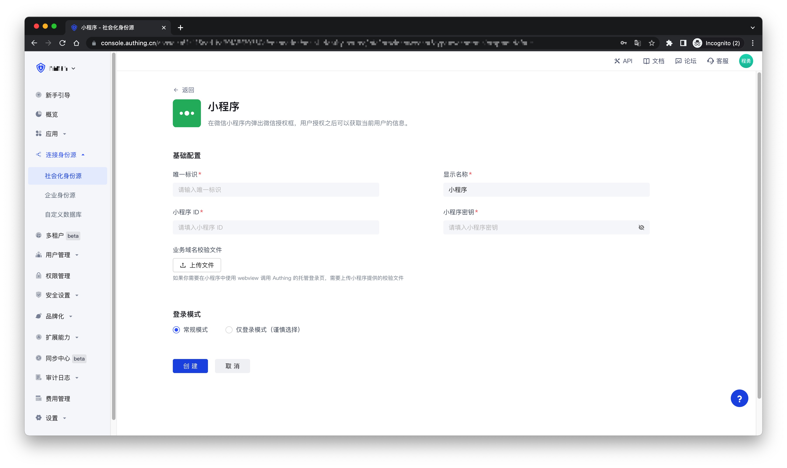

# 微信小程序

<LastUpdated />

## 场景介绍

- **概述**：{{$localeConfig.brandName}} 通过 SDK 为开发者提供了一种快速在小程序中获取用户信息并完成登录的方法。通过 Authing 的 SDK 可以方便地获取微信提供的用户身份标识，快速建立以手机号码为基础的账号体系。
- **应用场景**：小程序
- **终端用户预览图**：


## 注意事项

- 如果你未开通 {{$localeConfig.brandName}} 控制台账号，请先前往 [{{$localeConfig.brandName}} 控制台](https://authing.cn/) 注册开发者账号；

## 步骤 1：在微信公众平台创建一个小程序

### 创建微信小程序

前往 [微信公众平台](https://mp.weixin.qq.com/wxopen/waregister?action=step1&token=&lang=zh_CN)创建一个 **微信小程序**。


创建完成之后，你需要记录下该应用的 `AppID` 和 `AppSecret`，后面需要用到。


### 配置服务器域名

之后需在微信小程序管理后台的 **开发 -> 开发管理 -> 开发设置** 页面中，设置 **服务器域名** 中的 **request 合法域名** 为`core.authing.cn`。



### 配置业务域名（可选）

:::hint-info
若你需要在微信小程序中使用 webview 调用 {{$localeConfig.brandName}} 托管登录页，需要配置业务域名。
:::

在微信小程序管理后台的 **开发 -> 开发管理 -> 开发设置** 页面中，找到「**业务域名**」配置，点击「**开始配置**」


扫码登录后，在业务域名配置中填入你的应用认证地址，并且下载校验文件备用


## 步骤 2：在 {{$localeConfig.brandName}} 控制台配置微信小程序应用

2.1 请在 {{$localeConfig.brandName}} 控制台的「社会化身份源」页面，点击「创建社会化身份源」按钮，进入「选择社会化身份源」页面。


2.2 在「选择社会化身份源」页面，点击「微信」卡片，进入「微信登录模式」页面。


2.3 继续点击「小程序」登录模式，或者点击 **… 添加** 打开「小程序」配置页面。


2.4 在「小程序」配置页面，填写相关的字段信息。


| 字段         | 描述                                                                                                    |
| ------------ | ------------------------------------------------------------------------------------------------------- |
| 唯一标识     | a. 唯一标识由小写字母、数字、- 组成，且长度小于 32 位。<br />b. 这是此连接的唯一标识，设置之后不能修改  |
| 显示名称     | 这个名称会显示在终端用户的登录界面的按钮上                                                              |
| 小程序 ID    | 步骤 1 中获得的 AppID                                                                                   |
| 小程序密码   | 步骤 1 中获得的 AppSecret                                                                               |
| 域名校验文件 | 如果你需要在小程序中使用 webview 调用 Authing 的托管登录页，需要上传步骤 1 中下载的小程序提供的校验文件 |
| 登录模式     | 开启「仅登录模式」后，只能登录既有账号，不能创建新账号，请谨慎选择                                      |

2.5 配置完成后，点击「创建」或者「保存」按钮完成创建。

## 步骤 3：开发接入

从小程序基础库版本 2.2.1 或以上、及开发者工具 1.02.1808300 或以上开始，小程序支持使用 npm 安装第三方包，详情请见: [npm 支持 | 微信开放文档](https://developers.weixin.qq.com/miniprogram/dev/devtools/npm.html)。

### 安装 npm 包

```bash
$ yarn add authing-wxapp-sdk --save

# OR

$ npm install authing-wxapp-sdk --save
```

点击微信开发者工具中的菜单栏：**工具 --> 构建 npm**:


勾选 `使用 npm 模块` 选项（如果有这个选项，Stable 1.05.2204250 for MacOS 就没有这个选项）：


### 初始化 SDK

初始化`AuthenticationClient`需要传入`AppId（应用 ID）`：

> 你可以在控制台的 **应用** 中查看自己的应用列表。


```javascript
const { AuthenticationClient } = require("authing-wxapp-sdk")

const authing = new AuthenticationClient({
  userPoolId: "YOUR_USERPOOL_ID",
})
```

### 调用登录方法

`AuthenticationClient` 提供了 `loginByCode` 方法，可以通过微信的授权完成静默登录：

```javascript
const { code } = await wx.login()
// 无需用户授权
const user = await authing.loginByCode(code); // 成功登录，将 token 写入微信 Storage

// 登录之后可以进行此操作
await authing.updateProfile({
  nickname: 'Bob'
})
```

在用户完成登录之后，SDK 会将用户的 token 写入到微信的 Storage 中，后续请求会自动携带 token 访问。


后续用户再次打开小程序，如果小程序的 Storage 中保存有用户的 token，访问 authing 的请求将会自动带上该 token。

```javascript
// 该请求可以成功，因为该用户出于登录状态。
await authing.updateProfile(
  nickname: 'Mick'
)
```

详细请查看文档：[小程序 SDK](/reference/sdk-for-wxapp.md)。

### 接下来

!!!include(common/what-to-do-when-you-get-userinfo.md)!!!
