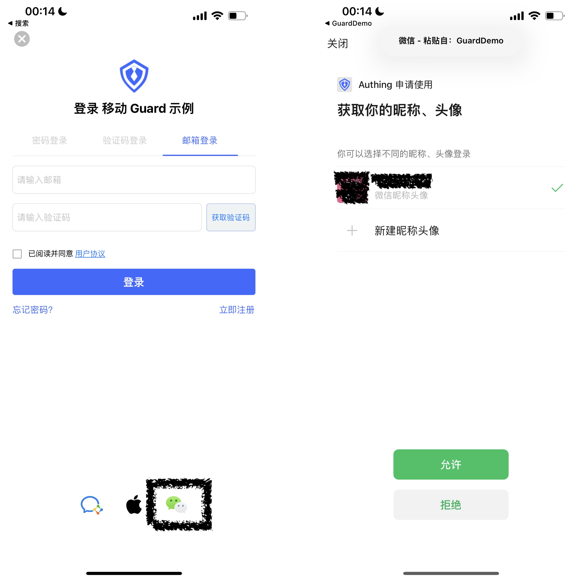
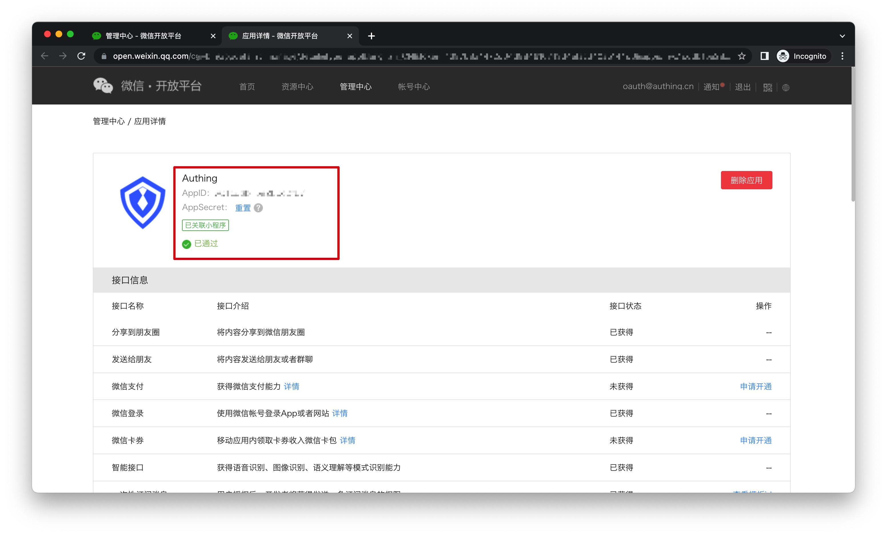
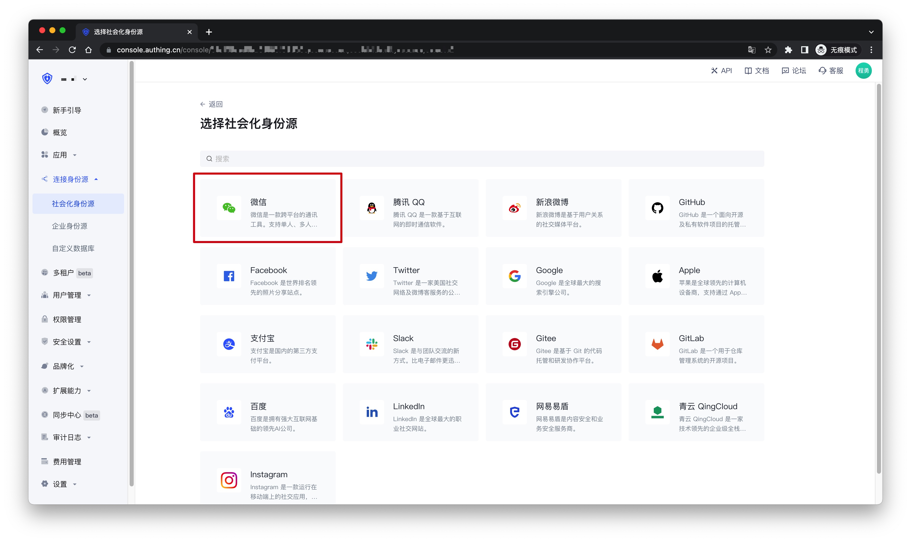
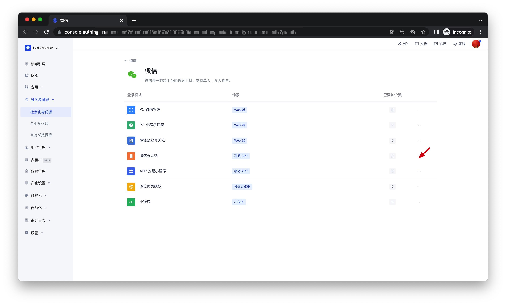
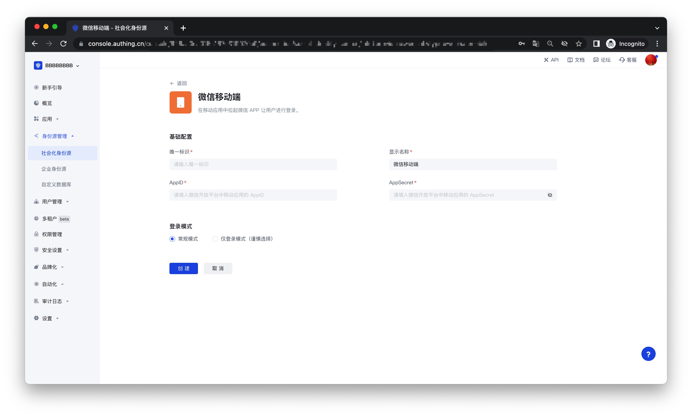

# 微信移动端

<LastUpdated />

## 场景介绍

- **概述**：Authing 为开发者提供了一种在移动端（iOS or 安卓）应用中快速跳转微信登录获取用户信息的方式，通过简单的调用 Authing 移动端 SDK 可以完成微信账号接入。
- **应用场景**：移动 APP
- **终端用户预览图**：在移动应用中拉起微信 APP 进行登录；

## 注意事项
- 如果您未开通微信开放平台账号，请前往[微信开放台](https://open.weixin.qq.com/cgi-bin/index?t=home/index&lang=zh_CN) 注册开发者账号；
- 如果您未开通 {{$localeConfig.brandName}} 控制台账号，请先前往 [{{$localeConfig.brandName}} 控制台](https://authing.cn/) 注册开发者账号；

## 步骤 1：在微信开放平台创建一个微信移动应用
前往 [微信开放平台](https://open.weixin.qq.com/cgi-bin/index?t=home/index&lang=zh_CN)创建一个 **微信移动应用**。

创建完成之后，你需要记录下该应用的 `AppID` 和 `AppSecret`，后面需要用到。

## 步骤 2：在 {{$localeConfig.brandName}} 控制台配置微信移动端登录
2.1 请在 {{$localeConfig.brandName}} 控制台的「社会化身份源」页面，点击「创建社会化身份源」按钮，进入「选择社会化身份源」页面。

2.2 在「选择社会化身份源」页面，点击「微信」卡片，进入「微信登录模式」页面。

2.3  点击「微信移动端」登录模式，或者点击 **… 添加** 打开「微信移动端」配置页面。

2.4 在「微信移动端」配置页面，填写相关的字段信息。

| 字段         | 描述                                                                                                    |
| ------------ | ------------------------------------------------------------------------------------------------------- |
| 唯一标识     | a. 唯一标识由小写字母、数字、- 组成，且长度小于 32 位。 b. 这是此连接的唯一标识，设置之后不能修改  |
| 显示名称     | 这个名称会显示在终端用户的登录界面的按钮上                                                              |
| AppID    | 步骤 1 中获得的 AppID                                                                                  |
| App secret  | 步骤 1 中获得的 AppSecret                                                                               |
| 登录模式     | 开启「仅登录模式」后，只能登录既有账号，不能创建新账号，请谨慎选择                                      |

2.5 配置完成后，点击「创建」或者「保存」按钮完成创建。

## 步骤 3：开发接入

- **推荐开发接入方式**：SDK 
- **优劣势描述**：接入简单，只需要几行代码。可自定义程度最高。
- **详细接入方法**：
 
 3.1 请根据[微信登录 SDK 接入文档（安卓）](https://docs.authing.cn/v2/reference/sdk-for-android/social/wechat.html)，接入您的安卓应用；请根据[微信登录 SDK 接入文档（iOS）](https://docs.authing.cn/v2/reference/sdk-for-ios/social/wechat.html)，接入您的 IOS 应用；
 
 3.2 在 {{$localeConfig.brandName}} 控制台创建一个移动应用，详情查看：[如何在 {{$localeConfig.brandName}} 创建一个应用](/guides/app-new/create-app/create-app.md)

 3.3 在已创建好的「微信移动」身份源连接详情页面，开启并关联一个在 {{ $localeConfig.brandName}} 控制台创建的移动端应用；
 

 3.4 前往相关联的移动端 APP，体验 APP 登录功能。

  
  
