# 微信公众号关注

<LastUpdated />

## 场景介绍

- **概述**：**关注公众号登录** 指的是在 PC 网站上生成微信公众号的二维码，用户使用微信 APP 扫码，关注公众号之后实现自动登录的过程。使用 **关注公众号登录** 可以快速为公众号引流，提升品牌粘性。借助 {{$localeConfig.brandName}} 的 **关注公众号登录**，你几乎不需要开发任何代码，只需简单的配置，几分钟就能完成。
- **应用场景**：PC 网站
- **终端用户预览图**：

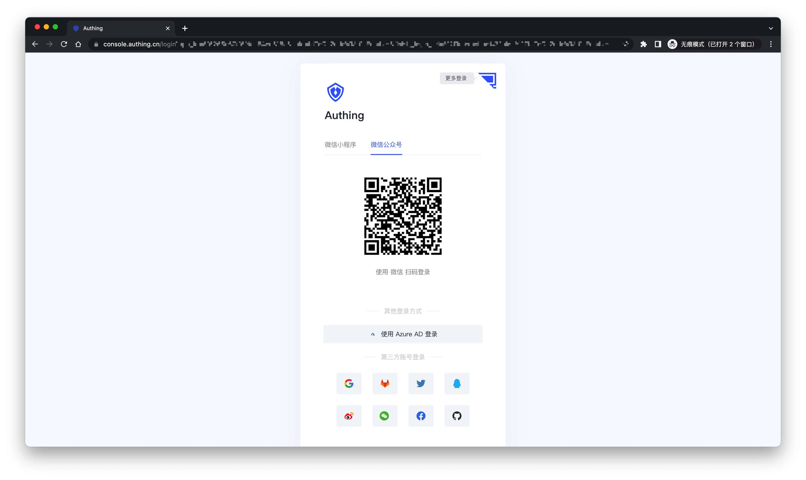

## 注意事项

- 受微信平台要求限制，只有服务号具备[生成带参数的二维码](https://developers.weixin.qq.com/doc/offiaccount/Account_Management/Generating_a_Parametric_QR_Code.html)API 能力，请确保你的公众号是服务号类型。
- 如果你未开通 {{$localeConfig.brandName}} 控制台账号，请先前往 [{{$localeConfig.brandName}} 控制台](https://authing.cn/) 注册开发者账号。

## 第一步：开启服务器配置

### 获取公众号开发信息

你可以在微信公众平台后台的 **设置与开发 -> 基本配置** 页面获取 **开发者 ID(AppID)** 和 **开发者密码(AppSecret)**，后面步骤2会用到。
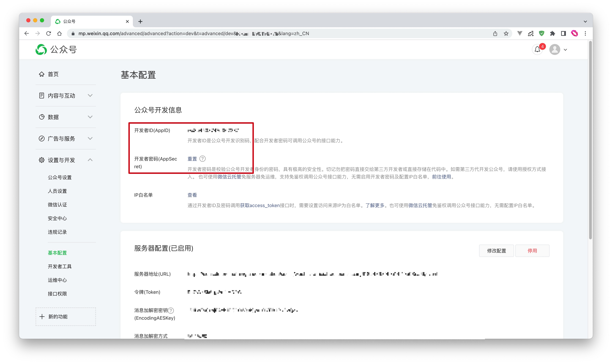

### 设置 IP 白名单

你需要将 {{$localeConfig.brandName}} 服务器的 IP 加入到微信公众号的 IP 白名单中，你可以[点击此处](https://core.authing.cn/api/v2/system/public-ips)获取 {{$localeConfig.brandName}} 服务器对外的 IP 列表。
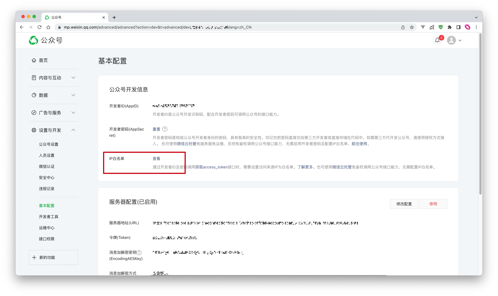

### 添加 API 权限

你需要在微信公众号平台的设置与开发-接口权限页面添加[生成带参数的二维码](https://developers.weixin.qq.com/doc/offiaccount/Account_Management/Generating_a_Parametric_QR_Code.html)接口权限：
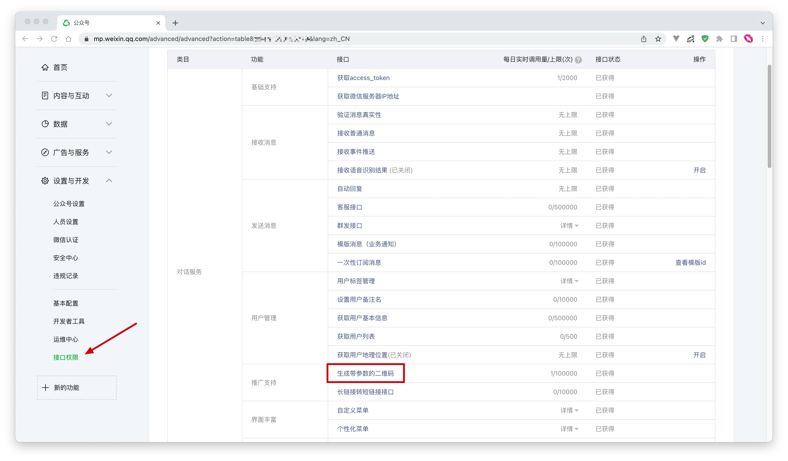

### 选择服务器配置模式

你可以在微信公众平台后台的 **设置与开发 -> 基本配置** 页面，开启服务器配置，当用户扫描公众号二维码、关注公众号之后，{{$localeConfig.brandName}} 就可以接收到用户扫码和关注事件，从而完成登录。

由于微信服务器配置只能设置一个，所以你需要根据自己的具体场景选择两种不同模式：

- **模式一**：设置服务器地址为 {{$localeConfig.brandName}} 服务器端点，这种模式最为简单，但是微信公众号的所有事件都会推送到 {{$localeConfig.brandName}} 服务器，你会丢失掉除扫码和关注之外的其他事件。
- **模式二**：设置服务器地址为自己的服务器，然后将扫码和关注事件转发至 {{$localeConfig.brandName}} 服务器端点，这种模式需要进行一定开发工作，但是不会丢失事件，且利于之后基于公众号事件做更多扩展。

#### 模式一

- **URL**：设置为 `https://core.authing.cn/connections/social/{Identifier}/{USERPOOL_ID}/events`，将其中的`{Identifier}`替换为你在 {{$localeConfig.brandName}} 控制台配置区输入的 **唯一标识**，并将其中的`{USERPOOL_ID}`替换为你的[用户池 ID](/guides/faqs/get-userpool-id-and-secret)。
> 如果还没有 `Identifier`，可以之后创建好身份源再回这里修改。
- **Token**：你可以在微信公众号内设置 Token 为任意字符串，必须为英文或数字，长度为 3-32 字符，并确保你在 {{$localeConfig.brandName}} 控制台配置的 token 和所需接入的公众号提供的 token 一致。
- **EncodingAESKey**：消息加密密钥由 43 位字符组成，可随机修改，字符范围为 A-Z，a-z，0-9。
- **消息加解密方式**：请根据业务需要选择，推荐使用安全模式。

<!--
暂时先不要点击保存，你需要将上述配置及`AppID`和`AppSecret`填入 {{$localeConfig.brandName}} 控制台中。在 **连接身份源 - 社会化登录** 中选择 **微信**，连接方式选择 **微信公众号关注**，填入上述配置：

-->

点击提交保存，最后别忘了启用此服务器配置：
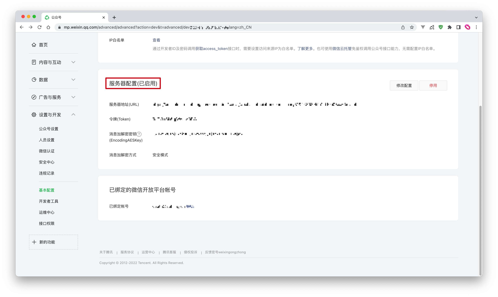

#### 模式二

配置流程和模式一完全一致，只需要将 `URL` 设置为你自己的服务器地址即可。你需要在自己配置的服务器端点完成接口验证、消息转发操作。

具体流程和示例代码，请见此 [Demo](https://github.com/Authing/authing-wechat-official-account)。

## 第二步：在 {{$localeConfig.brandName}} 控制台配置微信公众号关注

2.1 请在 {{$localeConfig.brandName}} 控制台的 **社会化身份源** 页面，点击 **创建社会化身份源** 按钮，进入 **选择社会化身份源** 页面。

2.2 在 **选择社会化身份源** 页面，点击 **微信** 卡片，进入 **微信登录模式** 页面。

2.3 继续点击 **微信公众号关注** 登录模式，或者点击 **添加** 打开 **微信公众号关注** 配置页面。
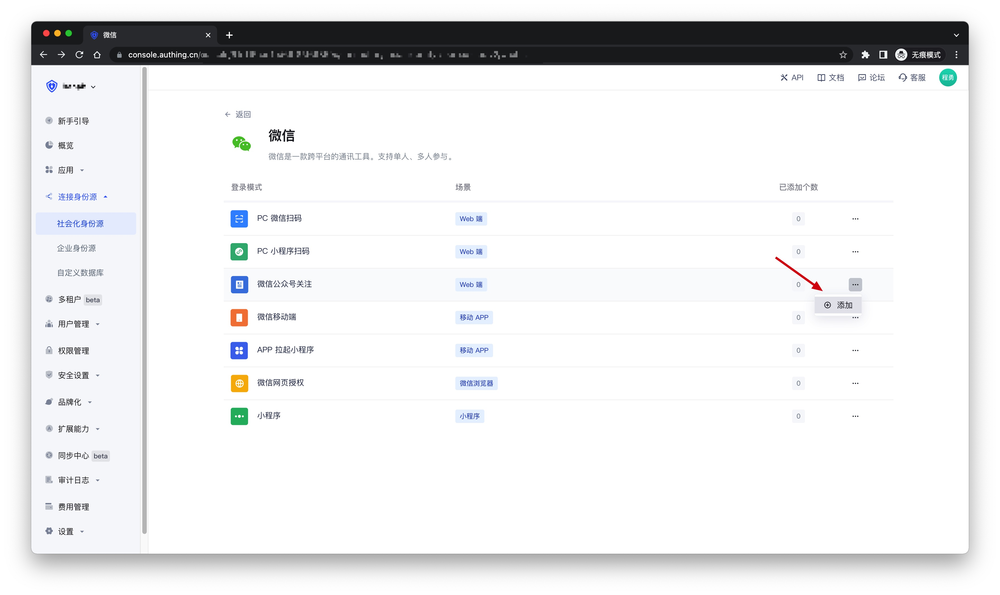

2.4 在 **微信公众号关注** 配置页面，填入从步骤一中获取的相关字段信息。
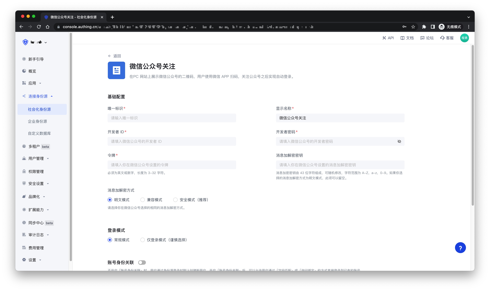

| 字段           | 描述                                                                                                                                                         |
| -------------- | ------------------------------------------------------------------------------------ |
| 唯一标识       | a. 唯一标识由小写字母、数字、- 组成，且长度小于 32 位。 b. 这是此连接的唯一标识，设置之后不能修改。                                                     |
| 显示名称       | 这个名称会显示在终端用户的登录界面的按钮上。                                                                                                                 |
| 开发者 ID      | 开发者 ID 是公众号开发识别码，配合开发者密码可调用公众号的接口能力。                                                                                         |
| 开发者密码     | 开发者密码是校验公众号开发者身份的密码。                                                                                                                     |
| 令牌          | 必须为英文或数字，长度为 3-32 字符。                                                                                                                         |
| 消息加解密密钥 | 消息加密密钥由 43 位字符组成，可随机修改，字符范围为 A-Z，a-z，0-9。如果你选择的消息加解密方式为明文模式，此项可以留空。                                     |
| 消息加解密方式 | 请选择你在微信公众号选择的相同的消息加解密方式。                                                                                                             |
| 登录模式       | 开启 **仅登录模式** 后，只能登录既有账号，不能创建新账号，请谨慎选择。                                                                                         |
| 账号身份关联   | 不开启 **账号身份关联** 时，用户通过身份源登录时默认创建新用户。开启 **账号身份关联** 后，可以允许用户通过 **字段匹配** 或 **询问绑定** 的方式直接登录到已有的账号。 |

2.5 配置完成后，点击 **创建** 或者 **保存** 按钮完成创建。

## 第三步：开发接入

- **推荐开发接入方式**：使用托管登录页
- **优劣势描述**：运维简单，由 {{$localeConfig.brandName}} 负责运维。每个用户池有一个独立的二级域名；如果需要嵌入到你的应用，需要使用弹窗模式登录，即：点击登录按钮后，会弹出一个窗口，内容是 {{$localeConfig.brandName}} 托管的登录页面，或者将浏览器重定向到 {{$localeConfig.brandName}} 托管的登录页。
- **详细接入方法**：

3.1 在 {{$localeConfig.brandName}} 控制台创建一个应用，详情查看：[如何在 {{$localeConfig.brandName}} 创建一个应用](/guides/app-new/create-app/create-app.md)

3.2 在已创建好的 **微信公众号关注** 身份源连接详情页面，开启并关联一个在 {{$localeConfig.brandName}} 控制台创建的应用
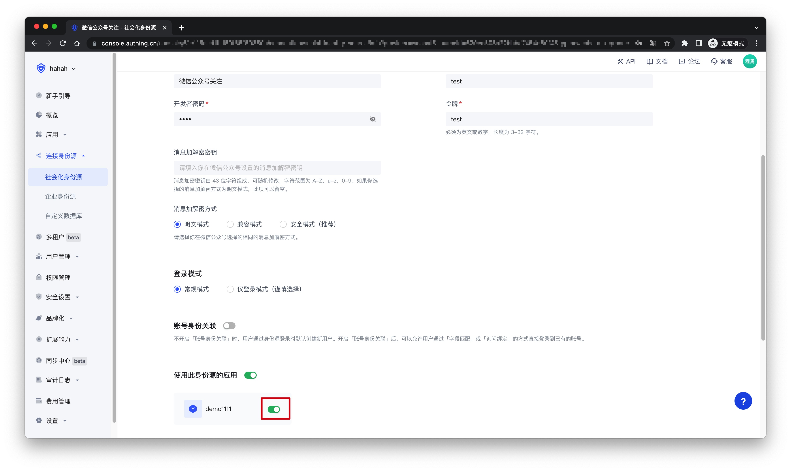

3.3 点击 {{$localeConfig.brandName}} 控制台的应用 **体验登录** 按钮，在弹出的登录窗口体验 **微信公众号关注** 登录

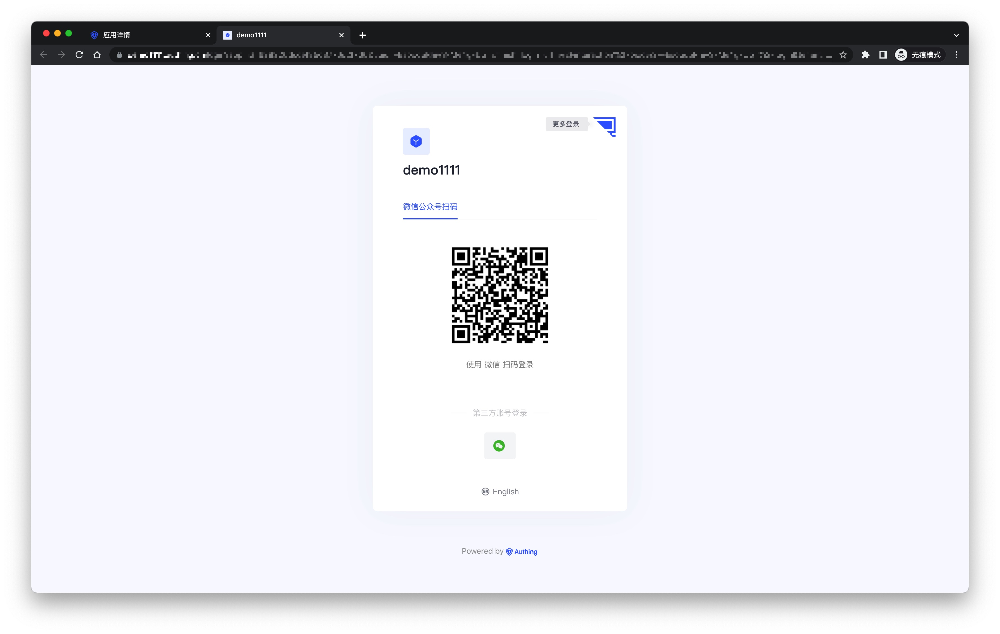

## 如何取消公众号对 Authing 作为第三方平台的授权？
1. 登录微信公众号平台；
2. 进入「设置与开发 - 公众号设置 - 授权管理」页面；
3. 如下图所示，点击「查看平台详情」；
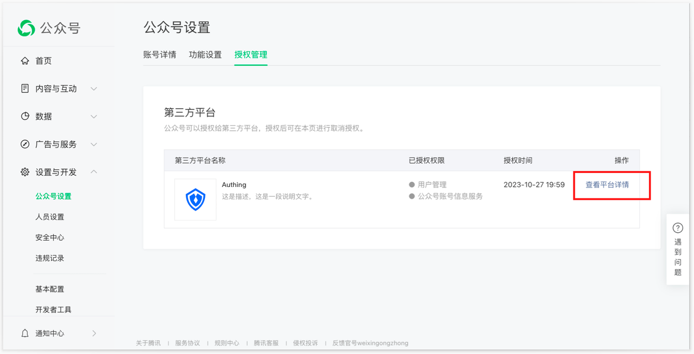
1. 进入「授权管理」页面，确认信息后，点击下方「取消授权」按钮，即可取消当前公众号对 Authing 作为第三方平台的授权；
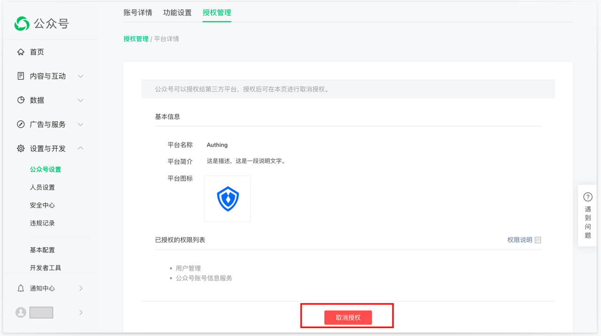
1. 上图中取消授权后，Authing 将自动解绑。可返回 Authing 控制台页面查看，页面将返回授权前的状态。
