# 小米移动端

<LastUpdated />

## 场景介绍

### 概述

小米 社会化登录是用户以 小米 为身份源安全登录第三方应用或者网站。在 {{$localeConfig.brandName}} 中配置并开启 小米 的社会化登录，即可实现通过 {{$localeConfig.brandName}} 快速获取 小米 基本开放的信息和帮助用户实现免密登录功能。

### 应用场景

移动端

### 终端用户预览图

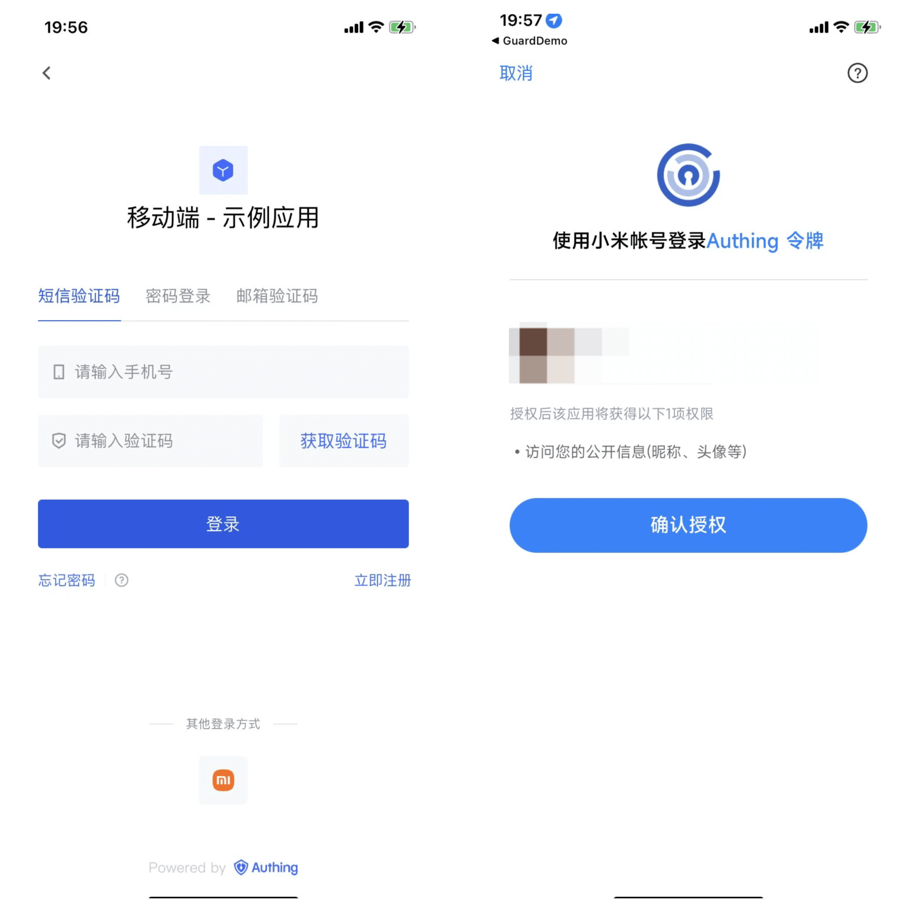

## 注意事项

- 如果你还没有 小米 账号，请先前往 [小米开放平台](https://dev.mi.com/platform)上注册成为开发者。
- 如果你未开通 {{$localeConfig.brandName}} 控制台账号，请先前往 [{{$localeConfig.brandName}} 控制台](https://authing.cn/) 注册开发者账号

## 第一步：在 小米 创建一个手机/平板应用

登录[小米开放平台](https://dev.mi.com/platform)，点击 **管理中心**：
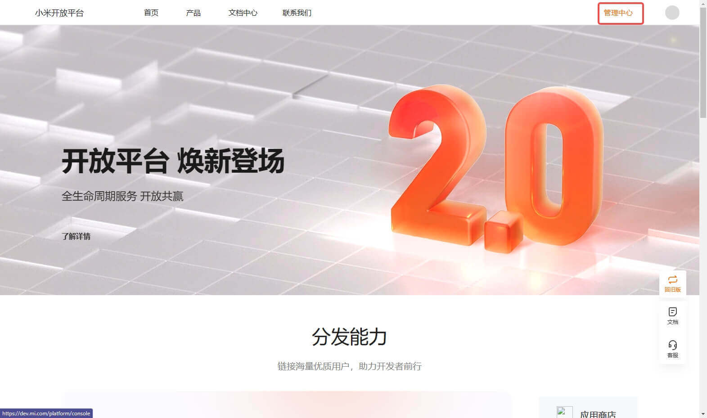

在**管理中心**页面，点击**帐号服务**:
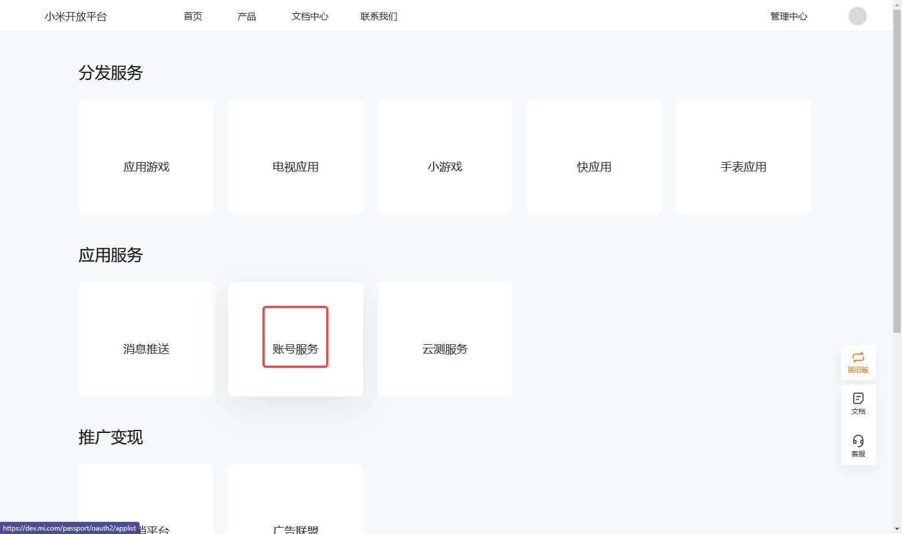

在**帐号服务**页面，点击**创建新应用** 并选择 **手机/平板应用**:
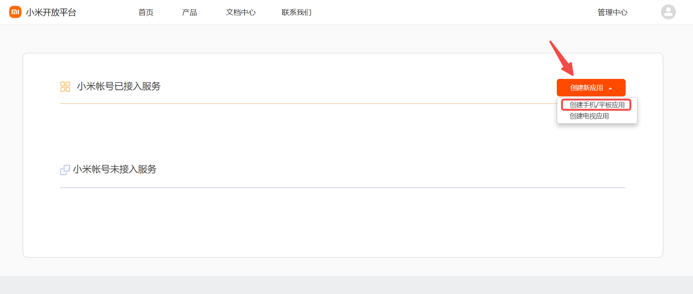

在**创建新应用**页面，填写应用信息，并点击创建:
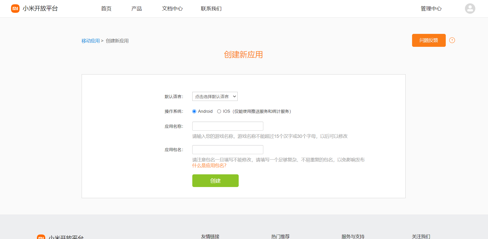

为刚创建的应用接入「帐号接入服务」:

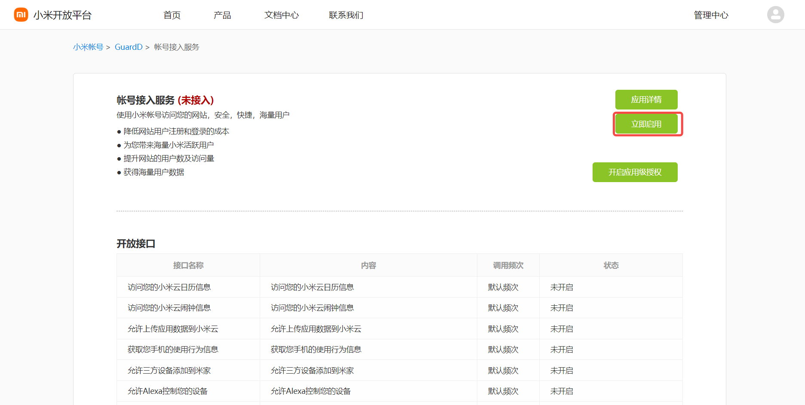

在弹出窗口配置**应用的回调地址**

- 应用回调地址：填写`https://core.authing.cn/connection/social/{唯一标识}/{用户池ID}/callback`，你需要将其中的 `{唯一标识}` 替换为你正在 {{$localeConfig.brandName}} 创建的身份源所填写的`唯一标识`，`{用户池ID}` 替换成你的 [用户池 ID](/guides/faqs/get-userpool-id-and-secret.md)

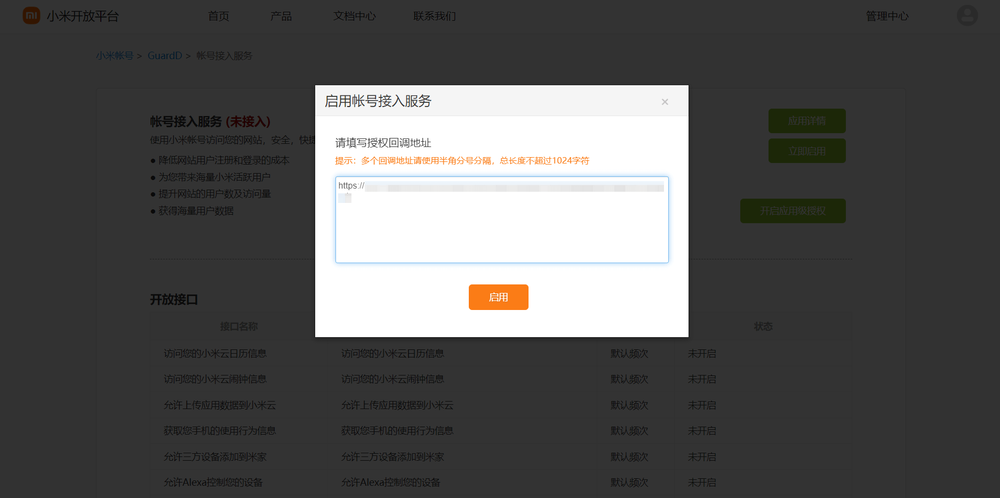

创建完成之后，查看应用详情，记录下 `AppID` 和 `AppSecret`，下一步需要用到。
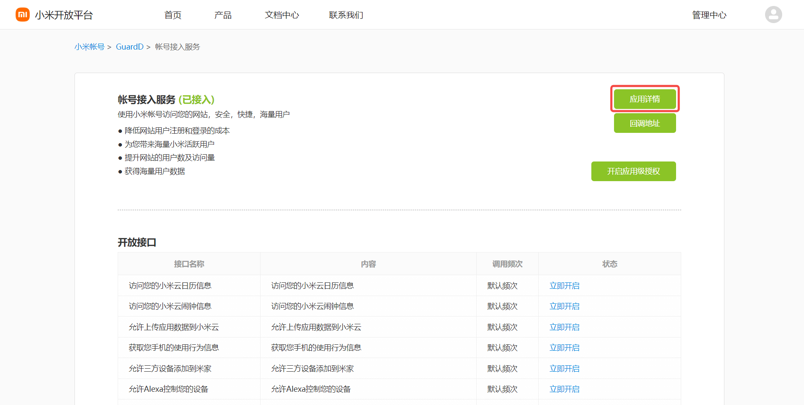
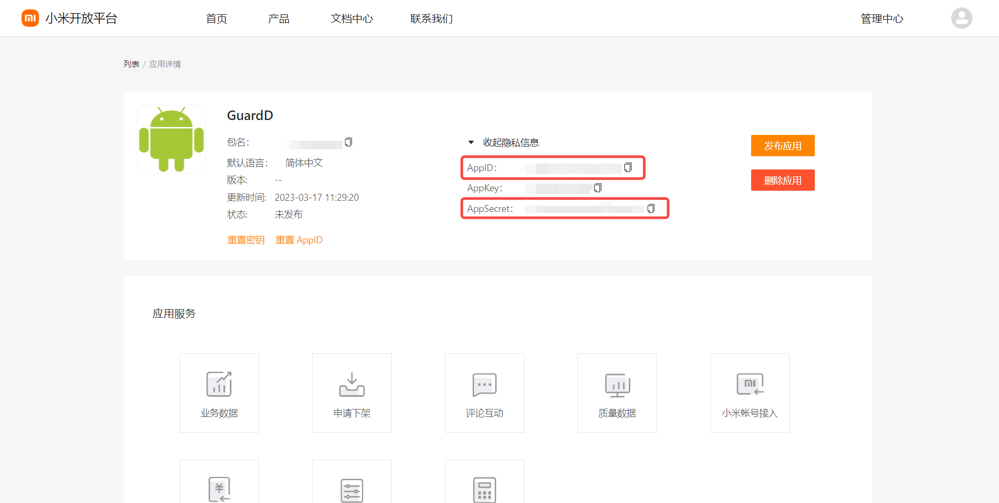

## 第二步：在 {{$localeConfig.brandName}} 控制台配置 小米 应用配置

2.1 请在 {{$localeConfig.brandName}} 控制台的「社会化身份源」页面，点击「创建社会化身份源」按钮，进入「选择社会化身份源」页面。

2.2 请在  {{$localeConfig.brandName}}  控制台 的「社会化身份源」-「选择社会化身份源」页面，点击「小米」身份源按钮，进入 「小米移动端登录模式」页面。

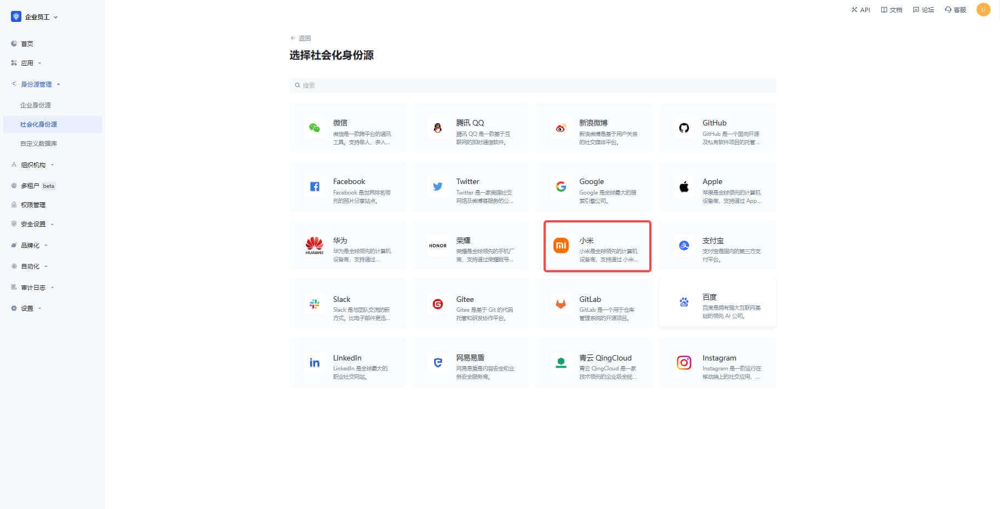

2.3 请在  {{$localeConfig.brandName}}  控制台 的「社会化身份源」-「小米移动端」页面，配置相关的字段信息。
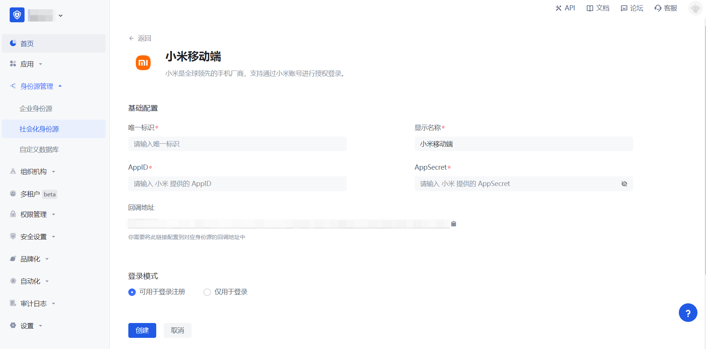

| 字段         | 描述                                                                      |
| ------------ |-------------------------------------------------------------------------|
| 唯一标识     | a. 唯一标识由小写字母、数字、- 组成，且长度小于 32 位。 b. 这是此连接的唯一标识，设置之后不能修改。           |
| 显示名称     | 这个名称会显示在终端用户的登录界面的按钮上。                                                  |
| AppID      | 上一步获取的 小米 应用 ID。                                                        |
| AppSecret   | 上一步获取的 小米 应用 Secret。                                                    |
| 回调地址     | 小米有效跳转 URI。需要将此 URL 配置到小米开放平台移动应用的授权回调页上。                               |
| 登录模式     | 开启「仅登录模式」后，只能登录既有账号，不能创建新账号，请谨慎选择。                                      |

2.4 配置完成后，点击「创建」或者「保存」按钮完成创建。

在 {{$localeConfig.brandName}} 控制台上创建完小米移动端身份源后，需要将回调地址配置到小米开放平台上的移动应用信息里面的授权回调地址。

## 第三步：开发接入

- **推荐开发接入方式**：SDK
- **优劣势描述**：运维简单，由 {{$localeConfig.brandName}} 负责运维。每个用户池有一个独立的二级域名；如果需要嵌入到你的应用，需要使用弹窗模式登录，即：点击登录按钮后，会弹出一个窗口，内容是 {{$localeConfig.brandName}} 托管的登录页面，或者将浏览器重定向到 {{$localeConfig.brandName}} 托管的登录页。
- **详细接入方法**：

3.1 在 {{$localeConfig.brandName}} 控制台创建一个应用，详情查看：[如何在 {{$localeConfig.brandName}} 创建一个应用](/guides/app-new/create-app/create-app.md)

3.2 在已创建好的「小米移动端」身份源连接详情页面，开启并关联一个在 {{$localeConfig.brandName}} 控制台创建的应用

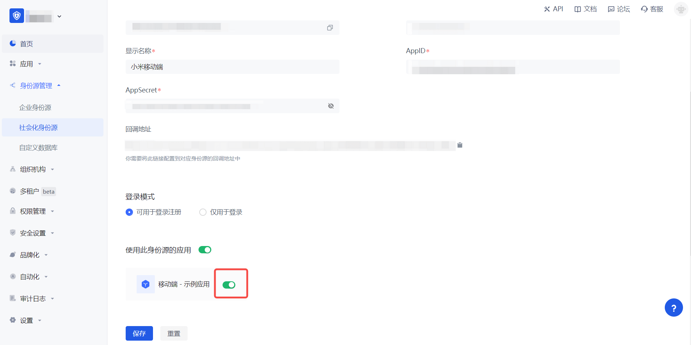

3.3 在登录页面体验 小米 第三方登录（如 [终端用户预览图](#终端用户预览图) 所示）。

