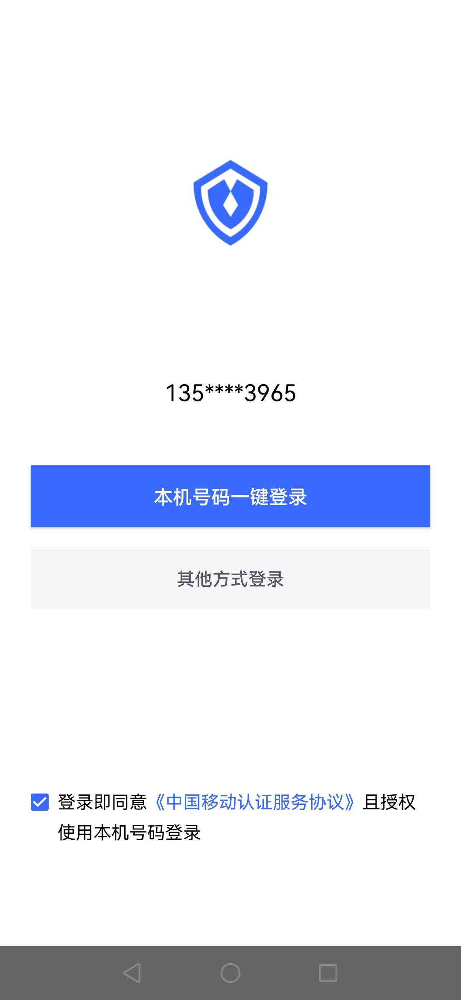
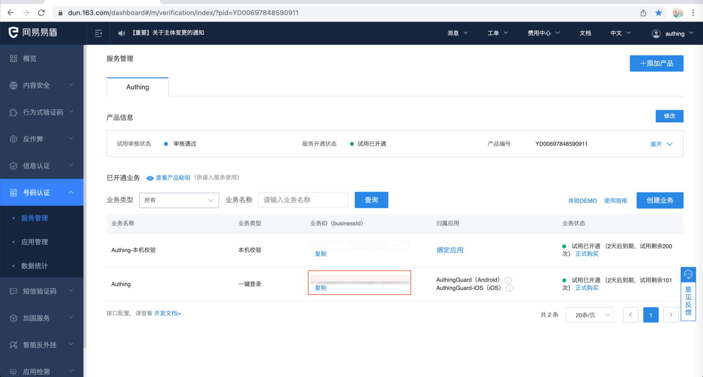
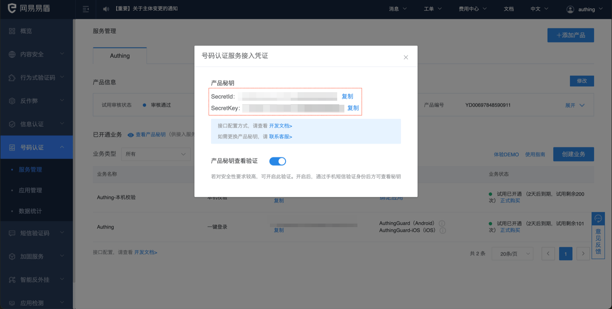
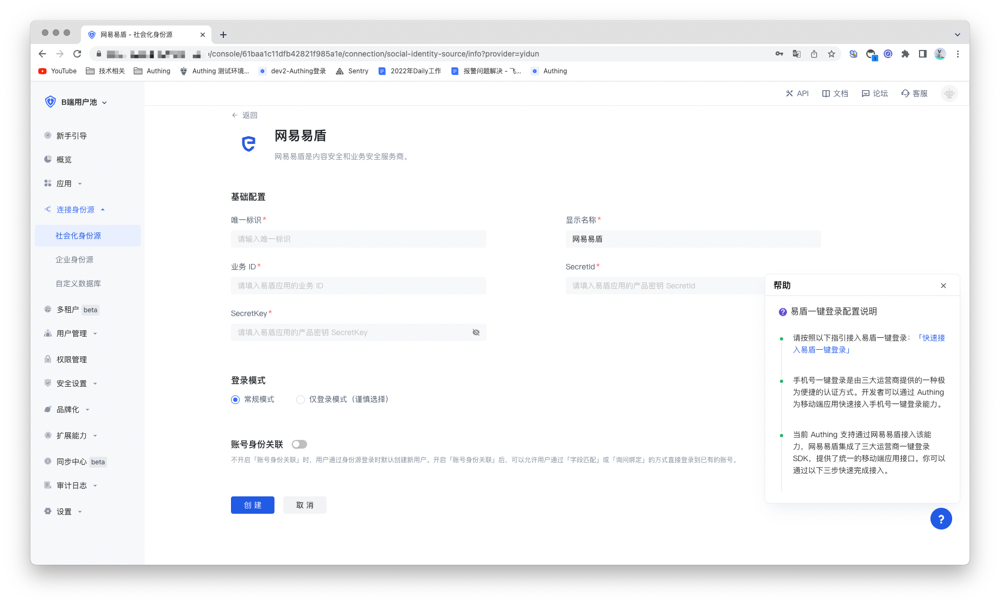
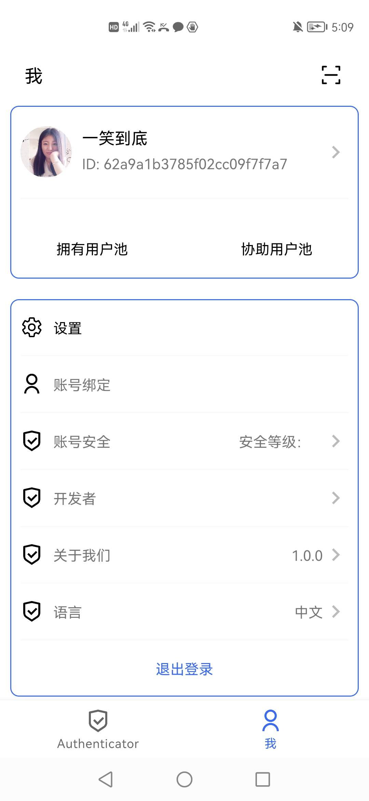

# 网易易盾（一键登录）

<LastUpdated/>

## 场景介绍

- **概述**：手机号一键登录是由三大运营商提供的一种极为便捷的认证方式。当前 Authing 支持通过网易易盾接入该能力，网易易盾集成了三大运营商一键登录 SDK，提供了统一的移动端应用接口。你可以在 Authing 控制台上配置易盾身份源，即可在手机端上实现通过 Authing 快速完成免密登录功能。
- **应用场景**：移动端
- **终端用户预览图**：

## 注意事项

1. 前往[网易易盾](https://dun.163.com/dashboard?v=0116&locale=zh-CN#/login/?referrer=%2F)注册一个支付宝开放账号；
2. 前往[易盾服务管理后台](https://dun.163.com/dashboard#/m/verification/index)按照指引创建一个**网站应用**。
3. 如果您未开通 Authing 控制台账号，请先前往 [Authing 控制台](https://authing.cn/)注册开发者账号；

## 步骤 1：创建应用

登录易盾服务管理后台，创建业务；再登录应用管理后台，创建应用；最后进行业务绑定。具体详细的易盾操作可以查看[易盾号码认证控制台使用指南](https://support.dun.163.com/documents/287305921855672320?docId=424413790996844544)。

创建完应用，设置包名，上传签名等操作完成后，需要记录下业务 ID (business Id) 和号码认证服务接入凭证的产品密钥 SecretId、SecretKey。后续在 Authing 控制台配置易盾身份源时需要该数据。

## 步骤 2：在 Authing 控制台配置易盾

2.1 请在 Authing Console 控制台 的「社会化身份源」页面，点击「创建社会化身份源」按钮，进入「选择社会化身份源」页面。

2.2 请在 Authing Console 控制台 的「社会化身份源」-「选择社会化身份源」页面，点击「易盾」身份源按钮，进入 「易盾登录模式」页面。

2.3 请在 Authing  控制台 的「社会化身份源」-「易盾」页面，配置相关的字段信息。

| 编号  | 字段/功能    | 描述                                                         |
| ----- | ------------ | ------------------------------------------------------------ |
| 2.3.1 | 唯一标识     | a.唯一标识由小写字母、数字、- 组成，且长度小于 32 位。b.这是此连接的唯一标识，设置之后不能修改。 |
| 2.3.2 | 显示名称     | 这个名称会显示在终端用户的登录界面的按钮上。                 |
| 2.3.3 | 业务 ID      | 业务 ID，易盾上创建的业务 ID（bussinessId）。                |
| 2.3.4 | SecretId     | SecretId，号码认证服务接入凭证的产品密钥 SecretId。          |
| 2.3.5 | SecretKey    | SecretKey，号码认证服务接入凭证的产品密钥 SecretKey。        |
| 2.3.6 | 登录模式     | 开启「仅登录模式」后，只能登录既有账号，不能创建新账号，请谨慎选择。 |
| 2.3.7 | 账号身份关联 | 不开启「账号身份关联」时，用户通过身份源登录时默认创建新用户。开启「账号身份关联」后，可以允许用户通过「字段匹配」或「询问绑定」的方式直接登录到已有的账号。 |

配置完成后，点击「创建」或者「保存」按钮完成创建。

## 步骤 3：开发接入

- **推荐开发接入方式**：SDK 集成
- **优劣势描述**：接入简单，只需要几行代码。可自定义程度最高。
- **详细接入方法**：

3.1 在 Authing 控制台创建一个应用，详情查看：[如何在 Authing 创建一个应用](/guides/app-new/create-app/create-app.md)。

3.2 在已创建好的易盾身份源连接详情页面，开启并关联一个在 Authing 控制台创建的应用。

3.3 参考 Authing 提供的集成指导，完成集成工作，然后在移动端上体验手机号一键登录。

- [Android 集成指导](https://github.com/Authing/guard-android/blob/master/doc/topics/oneauth.md)

- [iOS 集成指导](https://github.com/Authing/guard-ios/blob/main/doc/topics/oneauth.md)

