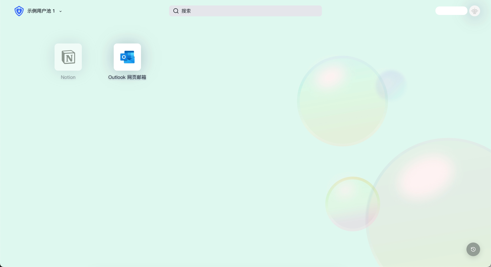

# 应用面板配置

路径：**品牌化->应用面板**

[应用面板](https://docs.authing.cn/v2/guides/dashboard/#%E5%BA%94%E7%94%A8%E9%9D%A2%E6%9D%BF)，是展示和访问用户池内部可使用 [单点登录 SSO](https://docs.authing.cn/v2/guides/app-new/sso/) 的各类应用的载体，企业管理员可将员工、或目标终端用户所需的各类应用加入到应用面板，实现员工 / 终端用户对各应用的单点登录（SSO），提高工作效率、保证信息安全。

应用面板配置支持修改应用面板的面板名称、Logo、地址、样式和背景等信息，你也可以通过自定义 css 搭建一个美观的、贴合品牌形象的应用面板。对应用面板进行更细粒度的品牌化配置可以深化组织内部终端使用者对品牌的认知；或在作为外部业务系统使用时提升可信度，并进一步拓展单点登录面板的适用场景。

::: hint-info
要使用 **品牌化->应用面板** 功能，用户池须已开通 [单点登录 SSO](https://docs.authing.cn/v2/guides/app-new/sso/#%E5%8D%95%E7%82%B9%E7%99%BB%E5%BD%95-sso-%E7%BB%BC%E8%BF%B0) 增值功能
:::

## 基础设置 ##

企业管理员或具有 Authing 控制台权限的管理员可以进入控制台 **品牌化->应用面板->基础设置** 修改应用面板基本信息：


| 序号  | 名称           | 功能说明                                     |
| :-- | :----------- | :--------------------------------------- |
| 1   | 应用面板名称       | 自定义终端用户登录应用面板后所见的应用面板名称。初始状态下名称位于应用面板左上角 |
| 2   | 应用面板地址       | 自定义应用面板访问地址，在此编辑后，终端用户凭借该地址登录应用面板        |
| 3   | 应用面板 Logo    | 可自行上传图片作为应用面板 Logo。初始状态下 Logo 位于应用面板左上角  |
| 4   | 应用面板 Favicon | 可自行上传图片作为应用面板的浏览器标签页 Favicon。            |
| 5   | 预览           | 在此预览 1 - 4 自定义的内容                        |

## 样式配置 ##

应用面板的样式配置分为桌面设备样式和移动设备样式，桌面设备支持自定义主题、自定义背景、自定义 css；移动设备支持自定义背景和自定义 css。

### 自定义应用面板主题 ###

管理员可以为应用面板选择 **亮色模式**、**暗色模式** 两种主题，两种主题皆为应用面板预置了一套颜色和背景样式配置；也可以在此基础上编辑自定义的颜色和背景样式。默认主题为暗色模式。


### 自定义背景

管理员可以将应用面板背景设置为任意纯色；或者上传图片作为应用面板背景，此处可自定义贴合企业品牌形象 / 营销需求的背景图。以桌面设备为例，操作步骤如下：

1. 准备一张桌面设备尺寸背景图
2. 打开 **品牌化->应用面板->样式配置**，选择 **桌面设备->自定义背景->图片背景**
3. 鼠标悬停于图像框，点击【重传】，从本地上传图片，查看预览效果
  

<br>
<br>

4. 点击页头右侧按钮【保存配置】，保存成功后即可登录应用面板体验。
   

<br>
<br>

::: hint-info
上传图片时，确保图片大小不超过 2M。
:::

### 自定义 css

要通过自定义 css 配置个性化应用面板框，需要在 **样式配置** 标签页打开 **自定义 css** 开关。


<br>
自定义 css 可以对托管应用面板页实现更加细致的外观控制，以符合你的企业员工或终端用户对于应用面板的预期。通过自定义 css 可以对应用面板框进行一些高级自定义样式定制，例如背景、特定元素的位置。

1. 以修改背景颜色为例：

```css
.authing-launchpad-container {
  background: #F5F7FA !important;
}
```

实现效果如下图：

<br>

2. 以修改页面元素位置为例：

```css
.authing-launchpad-header { 
  position: absolute; bottom: 0px; 
}
```

实现效果如下图：

<br>
#### 自定义 css 有以下注意事项：####

* 尽量控制指定 css 生效范围​，其生成规则是依赖最后一级路由。</br>如只针对应用面板页面样式，可在所有 css 选择器前添加 `.launchpad`，如 `/login` 页面 则添加 `.launchpad`。


<br>
* 尽量指定要修改的 控制面板 渲染节点，PC 端常见渲染节点如：
  * .authing-launchpad-container
  * .authing-launchpad-header
  * .authing-launchpad-main

* 尽量指定要修改的 控制面板 渲染节点，移动端常见渲染节点如：
  * .authing-launchpad-m-content
  * .authing-launchpad-m-content
  * .authing-launchpad-m-content-container
  * ...

</br>如下图`.authing-launchpad-container` 这个类名表明 launchpad 处于应用面板节点。携带这个类名作为前置的选择器，其样式只会在应用面板节点生效​。


<br>
* 具体的 css 类名可以在 {{$localeConfig.brandName}} 的应用面板界面通过 Chrome 控制台查看，需要自定义样式的 dom 标签都提供了固定的类名，不能使用带有 hash 的类名，因为会经常变化。

* 尽量精确选择元素。如果 dom 层级很深，建议使用 **复制 selector** 并配合前面第一、二条的前置选择器使用。


::: hint-info
**应用面板** 为更好地服务用户一直在保持迭代以及功能的扩展。在这一发展过程中可能会存在 dom 结构调整以及类名弃用等情况。如果影响了用户自定义 css 相关样式，可联系我们开发人员进行 css 调整。
:::

