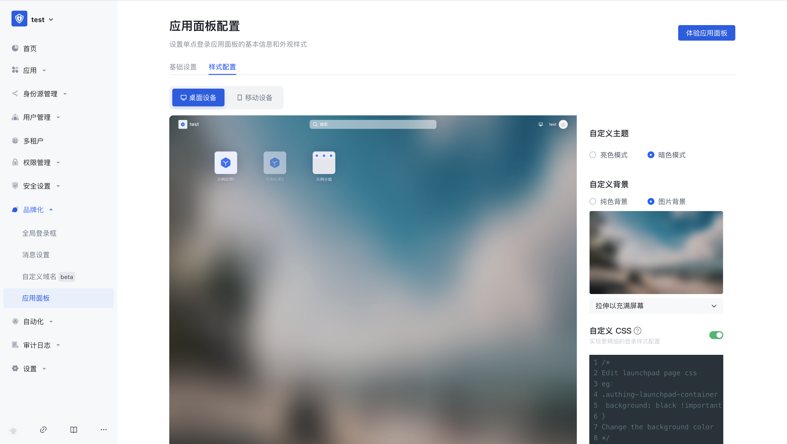

# 应用面板配置

路径：**品牌化->应用面板配**

## 样式配置

### 应用面板主题

管理员可以选择 **亮色模式**、**深色模式** 两种主题配置页面，默认深色模式。<br>
管理员可以在 **整体样式** 页面自定义应用面板模式、背景、CSS 等。

### 自定义背景

管理员可以将应用面板框展示背景设置为纯色，或者上传图片，以图片为背景。

::: hint-info
上传图片时，确保图片大小不超过 2M。
:::

### 自定义 css

自定义 css 可以对托管应用面板页实现更加细致的控制，以便符合用户对于应用面板页的预期。通过自定义 css 可以对应用面板框进行一些高级自定义样式定制，如修改背景颜色：

```css
.authing-launchpad-container {
  background: gray;
}
```
要通过自定义 css 配置个性化应用面板框，需要在 **样式配置** 标签页打开 **自定义 css** 开关。



自定义 css 有以下注意事项：

* 尽量控制指定 css 生效范围​，其生成规则是依赖最后一级路由。</br>如只针对应用面板页面样式，可在所有 css 选择器前添加 `.launchpad`，如 `/login` 页面 则添加 `.launchpad`。


* 尽量指定要修改的 控制面板 渲染节点，PC 端常见渲染节点如：
  * .authing-launchpad-container
  * .authing-launchpad-header
  * .authing-launchpad-main

* 尽量指定要修改的 控制面板 渲染节点，移动端常见渲染节点如：
  * .authing-launchpad-m-content
  * .authing-launchpad-m-content
  * .authing-launchpad-m-content-container
  * ...

</br>如下图`.authing-launchpad-container` 这个类名表明 launchpad 处于应用面板节点。携带这个类名作为前置的选择器，其样式只会在应用面板节点生效​。


* 具体的 css 类名可以在 {{$localeConfig.brandName}} 的应用面板界面通过 Chrome 控制台查看，需要自定义样式的 dom 标签都提供了固定的类名，不能使用带有 hash 的类名，因为会经常变化。

* 尽量精确选择元素。如果 dom 层级很深，建议使用 **复制 selector** 并配合前面第一、二条的前置选择器使用。


::: hint-info
应用面板 为更好的服务用户一直在保持迭代以及功能的扩展。在这一发展过程中可能会存在 dom 结构调整以及类名弃用等情况。如果影响了用户自定义 css 相关，可联系我们开发人员进行 css 调整。
:::

