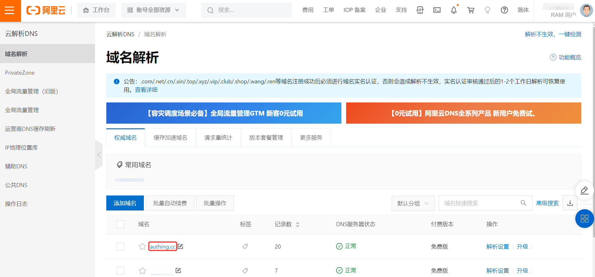
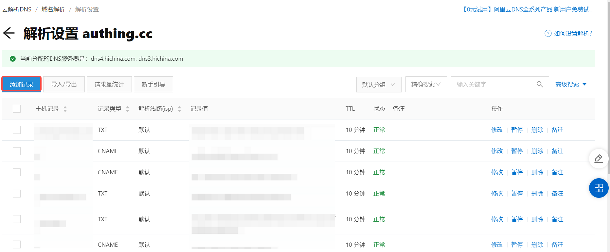
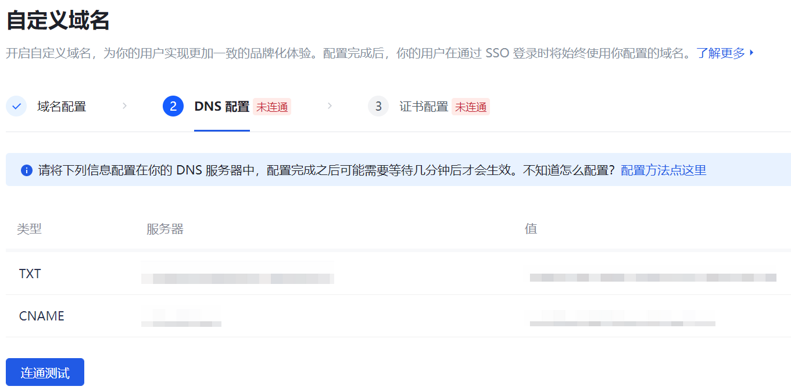
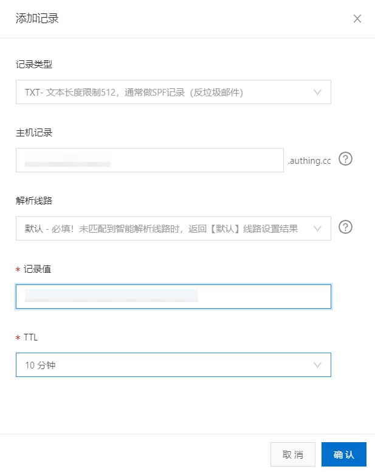

# 在阿里云创建一条新的 CNAME 指向 Authing

## 第一步：选择要创建解析的域名

1. 在拥有生效域名的前提下，在阿里云控制台的 **云解析 DNS->域名解析** 功能区，选中您想要添加 **CNAME** 的域名。

2. 进入域名解析列表，点击记录列表左上角 **添加记录** 按钮。 打开 **添加记录** 侧拉框。

## 第二步：添加域名解析记录​

::: hint-info
需要为 **TXT** 和 **CNAME** 分别添加一条记录。
:::

1. 在侧拉框如下表所述添加 **TXT** 记录。

|字段|说明|
|----|----|
|记录类型|选择 **TXT**。|
|主机记录|填写 {{$localeConfig.brandName}} 生成的 **TXT**​。|
|解析线路|选择默认路径。|
|记录值|填写 {{$localeConfig.brandName}} 生成的 **TXT** 对应的值​。|
|TTL|缓存时间；数值越小，修改记录各地生效时间越快，默认为10分钟。|

::: img-description
Authing 自定义域名 DNS 配置页
:::

::: img-description
阿里云控制台 DNS 配置页 - TXT 记录
:::

2. 在侧拉框添加 **CNAME** 记录。

::: img-description
阿里云控制台 DNS 配置页 - TXT 记录
:::

新生成的两条记录（**TXT** 和 **CNAME**）则出现在域名解析列表顶部。

## 第三步：DNS 连通测试

在阿里云完成 DNS 配置之后，即可在 {{$localeConfig.brandName}} 的 DNS 配置页面进行连通测试，一般来说域名解析配置完成之后需要一段时间生效，如果已经完成配置但没有连通测试成功，可以稍作等待。

连通测试完成之后，您就完成了 {{$localeConfig.brandName}} 和 DNS 服务器之间的域名解析配置。