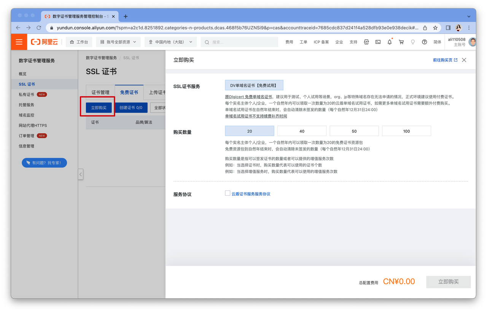
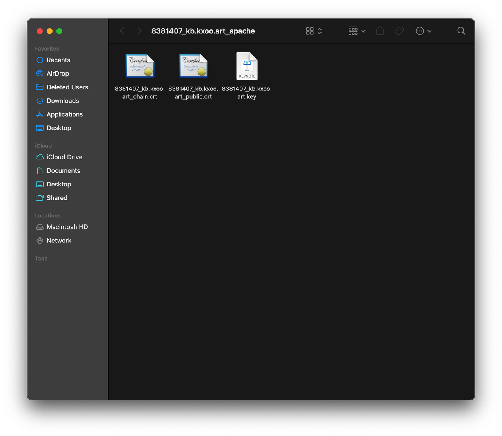
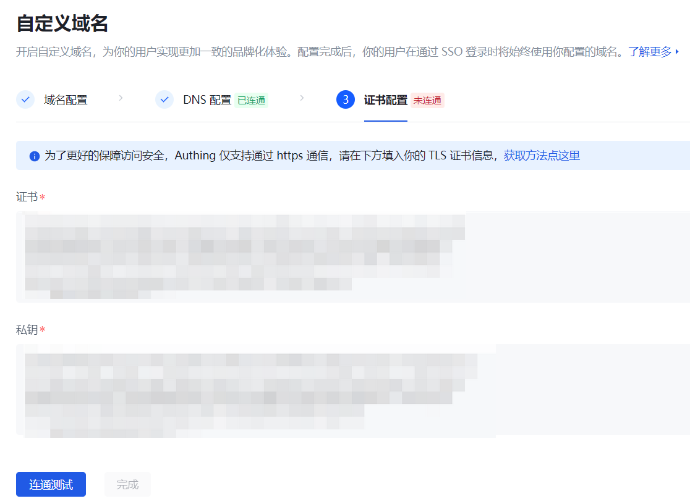

# 使用阿里云的 SSL 证书信息

## 第一步：下载域名对应的证书

在阿里云控制台的 **数字证书管理服务->SSL 证书** 中找到您要使用的证书，并根据您的服务器类型选择对应的证书包进行下载。

如果您还没有证书，可以点击 **立即购买** 生成新的证书。

## 第二步：获取证书关键信息

以 Apache 证书包为例，解压后有三个文件：

打开之后即可获取签名证书、签名私钥和证书链信息。

::: hint-info
您需要确保证书的内容、格式正确。
:::

## 第三步：测试 SSL 证书有效性

将有效的证书信息填入 {{$localeConfig.brandName}} 的 SSL 证书配置区域之后，即可进行连通测试。Authing 会对证书和域名之间的匹配以及证书的有效期进行校验，校验通过后 SSL 证书配置即生效。

如果您的证书即将到期，您可以点击 **编辑** 按钮对证书的相关信息进行替换，重新 **连通测试** 后即可完成证书更新。
