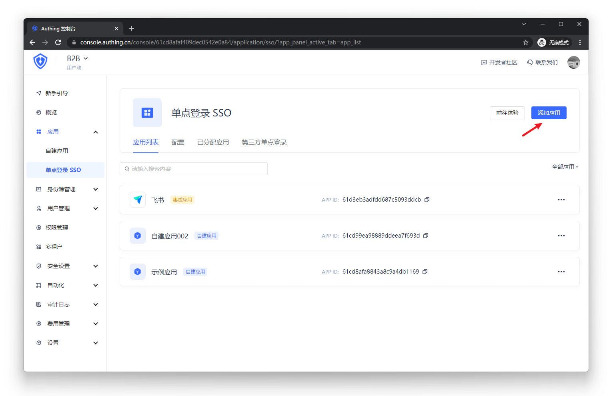

# 应用面板

<LastUpdated/>

{{$localeConfig.brandName}} 应用面板用于展示企业所需的各类应用，是提供员工单点登录、提高工作效率、保证信息安全的好地方。

企业员工对各类应用的单点登录（SSO）是基于安全断言标记语言 (SAML) 或 {{$localeConfig.brandName}}  自研的安全身份验证 ({{$localeConfig.brandName}}  Secure Authentication) 而实现的。

## 终端用户的操作说明

### 1. 登录应用面板
终端用户在访问应用面板前需要登录 {{$localeConfig.brandName}}  。首先，用户需要在浏览器输入应用面板的登录地址 URL，比如https://org-name.authing.cn （其中 org-name 是公司或组织的名称）。接下来，用户需要输入他的用户名和密码，或者通过第三方账号登录。如果用户不知道自己的用户名或忘记了密码，他需要联系所在企业的 IT 部门，IT 管理员会为他设置 {{$localeConfig.brandName}}  帐户或重置密码。

### 2. 添加或卸载应用
应用面板会默认展示用户可访问的所有应用。用户可以随意卸载或添加自己的常用应用，以便降低不必要应用的干扰。用户可以点击 删除应用 按钮，用户也可以点击 添加应用 按钮，选择弹窗里的常用应用，一键添加到应用面板。

### 3. 更新个人信息
在顶导最右侧，用户可以点击 个人中心 按钮以进入用户个人中心，来编辑个人信息。

## 企业管理员的操作说明

### 1. 为团队成员安装应用
企业管理员或具有 {{$localeConfig.brandName}}  控制台权限的管理员（管理员及添加协作管理员详情可见 添加用户池协作管理员 | {{$localeConfig.brandName}}  文档）登录 {{$localeConfig.brandName}}  > 应用 > 某应用  > 访问授权，点击 添加授权 并填写 授权对象。

### 2. 配置应用面板
企业管理员或具有 {{$localeConfig.brandName}}  控制台权限的管理员可以进入控制台 > 应用 > 应用面板 > 配置 来配置应用面板的登录注册方式、自定义登录框样式、开启多因素认证方式等。

#### 2.1 [配置登录注册方式](https://docs.authing.cn/v2/guides/app/config-login-methods.html)
#### 2.2 [自定义登录框样式](https://docs.authing.cn/v2/guides/app/custom-styles.html)
#### 2.3 [开启多因素认证](https://docs.authing.cn/v2/guides/app/mfa.html) | {{$localeConfig.brandName}}  文档
#### 2.4 [添加注册协议](https://docs.authing.cn/v2/guides/app/agreements.html) | {{$localeConfig.brandName}}  文档

### 3. 查看用户或组织可访问的应用
管理员可以进入控制台 > 应用 > 应用面板 > 已分配应用 来查看用户或组织可访问的应用列表。点击应用会进入应用详情页。

### 4. 配置应用单点登录 SSO

用户进入「单点登录 SSO」页，添加刚刚的自建应用

（注：添加后，单点登录 SSO 列表页内的应用，用户登录一个自建或集成应用，即可单点登录所有应用）

