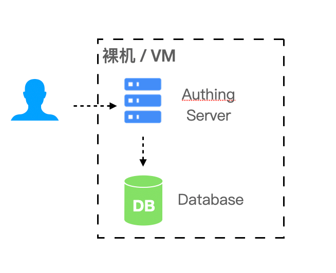
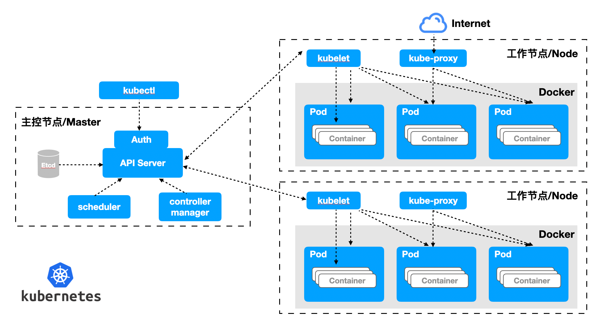

# 私有化部署方案

<LastUpdated/>

::: description
Authing 已经为国内外多家知名企业提供身份认证和用户目录管理方案，可以提供公共云、私有化和混合云的多种云环境部署方案。其中私有化部署方案可以部署在客户的内网服务器，数据加密存储，独享云资源，更安全稳定，速度更快。
:::

### 私有化部署优势

#### 数据私密安全

数据私有化隔离；容灾备份机制；算法、密钥双重保险，数据安全可靠；独享云资源，速度更快，性能更优。

#### 企业自主掌控

企业可完全自主掌控，轻松实现成员管理、认证配置、身份源管理；用户信息和密钥信息本地存储。

#### 高可用性能架构

支持高可用架构，支持横向扩容，可以基于您的业务场景自主伸缩容量。

#### 可定制

您可以为你的 IDaaS 服务配置独立的二级域名、企业 Logo、品牌色等，彰显品牌特色。

### 私有化部署服务内容

1. 了解企业业务场景，定制专属解决方案。
2. 技术专家全程负责，提供完整的部署方案，完成高质量交付。
3. 高效运营团队使用支持，售后服务及时响应。

### 支持平台

#### 裸机或 VM 虚拟机

在简单（非高可用）场景中可以使用裸机或 VM 虚拟机的形式部署。

- 所需环境：Windows 或 Linux 操作系统，Node.js 版本在 12 及以上。
- 推荐操作系统：CentOS 7.2 及以上 Ubuntu 18.04 及以上。

#### Docker Compose

如果您的业务场景有一定规模使用人数在 20 人 - 2000 人，IDaaS 平台需要多个组件来支撑您的业务场景，可以使用 Docker Compose 来简化您的部署流程。

- 所需环境：Linux 操作系统，Docker 17.04 。
- 推荐操作系统：CentOS 7.2 及以上 Ubuntu 18.04 及以上。

#### Kubernetes

如果您的业务场景承载的用户量比较高，规模在 2000 人及以上，在私有化部署的时候需要考虑性能和可靠性，我们建议您采用 Kubernetes 云原生的模式运维您的 IDaaS 平台。

- 所需环境：Kubernetes 1.16 及以上。
- 推荐操作系统：CentOS 7.2 及以上 Ubuntu 18.04 及以上。

### 资源规划

| 支持人数         | 场景             | 服务器             | 数据库        | 缓存 Redis   | ElasticSearch             |
| ---------------- | ---------------- | ------------------ | ------------- | ------------ | ------------------------- |
| 20 人及以下      | 小团队和 POC     | 4 核 8G 内存 \* 1  | -             | -            | -                         |
| 20 人 - 2000 人  | 中小企业场景     | 4 核 16G 内存 \* 1 | 2 核 8G \* 1  | 1 核 2G \* 1 | 4 核 8G \* 1 + 500G 存储  |
| 2000 人-20000 人 | 规模企业场景     | 4 核 16G 内存 \* 1 | 4 核 16G \* 1 | 1 核 4G \* 1 | 4 核 8G \* 1 + 500G 存储  |
| 20000 人以上     | 规模以上企业场景 | 4 核 16G 内存 \* 3 | 8 核 32G \* 1 | 2 核 8G \* 1 | 8 核 16G \* 1 + 500G 存储 |

### 注意事项

1. 服务器间能通过内网互相访问。
2. 提供泛域名（如果是少量的话也可以是单域名）及相应证书。
3. 提供内网域名解析服务器，需要同时解析内外网域名，建议集群部署。
