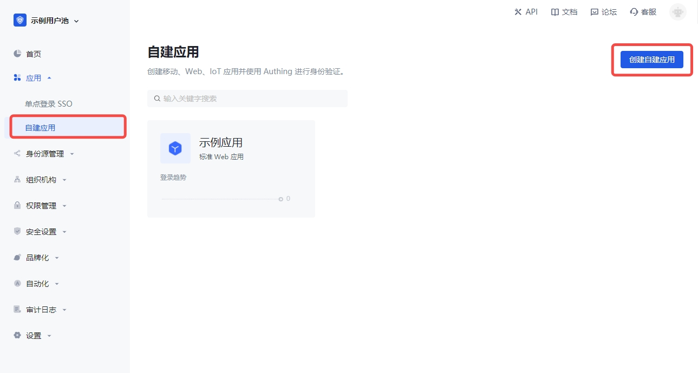
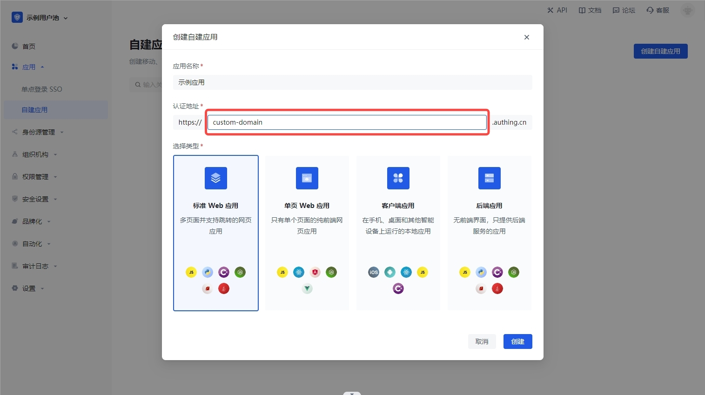
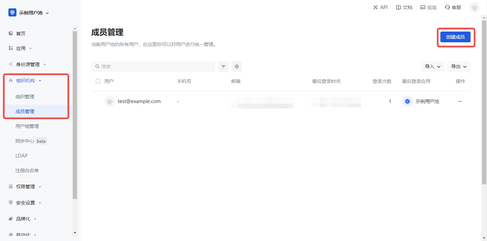
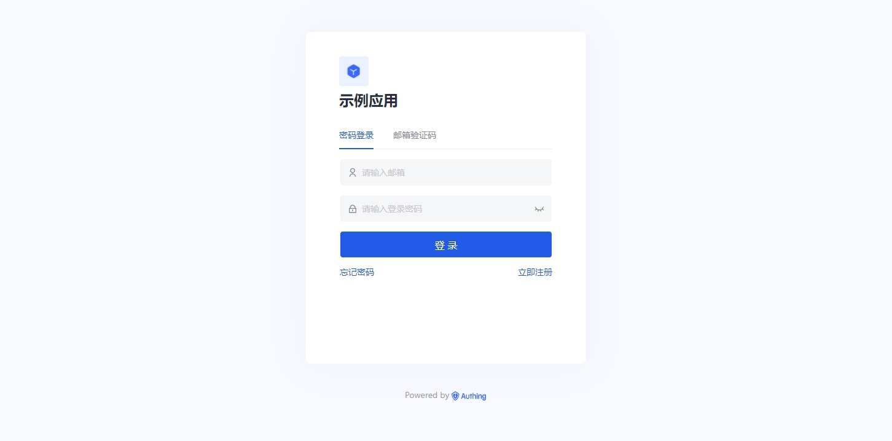
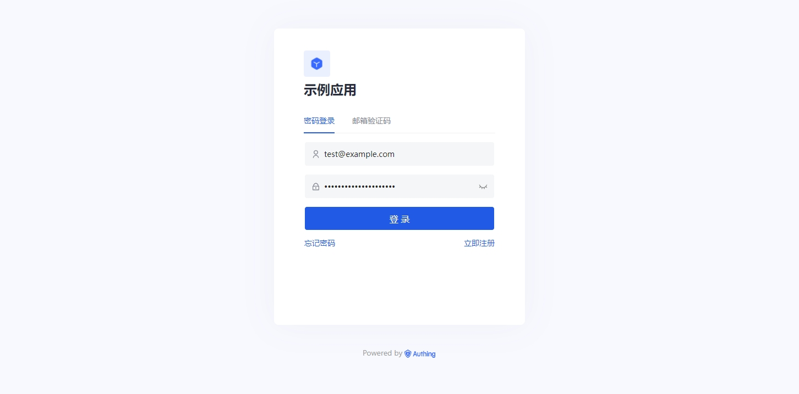

# 自定义域名配置方案

<LastUpdated/>

## 概述

目前 {{$localeConfig.brandName}} 使用的是 **域名托管模式**，使用的是 {{$localeConfig.brandName}} 的二级域名（如：`https://my-app.{{$themeConfig.officeSiteDomain}}`）。

在 **域名托管模式** 下，用户只能通过 {{$localeConfig.brandName}} 的二级域名访问并登录应用，对于想使用自定义域名的用户，{{$localeConfig.brandName}} 提供了基于 Nginx 反向代理模式的自定义域名解决方案。

本文将详细描述用户如何配置自定义域名，从而实现通过自定义域名登录和注册 {{$localeConfig.brandName}}。

## 准备工作

1. 用户需要自行注册自定义所需的域名、HTTPS 证书和 DNS 解析。

2. 将注册好的域名和 HTTPS 证书配置于 Nginx 反向代理服务中。

3. 创建一个 {{$localeConfig.brandName}} 应用，将 {{$localeConfig.brandName}} 应用的域名配置于 Nginx 反向代理服务中。

## 操作流程

:::hint-success
进行此环节之前，请确保你已经完成准备工作中的前两项。
:::

**1. 登录 {{$localeConfig.brandName}} 控制台，创建一个新的应用，并指定应用域名。**





如上所示，我们创建了一个 {{$localeConfig.brandName}} 应用，并配置了应用域名为：**`https://custom-domain.{{$themeConfig.officeSiteDomain}}`**。

接下来我们要将用户的自定义域名反向代理到 **`https://custom-domain.{{$themeConfig.officeSiteDomain}}`**。

此应用和域名仅仅作为示例，你可以创建属于自己的 {{$localeConfig.brandName}} 应用和域名。

**2. 创建一个用户，用于登录 {{$localeConfig.brandName}} 应用。**




**3. 将上述创建的 {{$localeConfig.brandName}} 应用域名配置于 Nginx 反向代理中。**

```nginx
upstream custom_domain {
    # 上述配置的应用域名
    server custom-domain.authing.cn:443;
    keepalive 64;
}

server {
    listen 443;
    # 示例中的自定义域名
    server_name custom-domain.littleimp.cn;

    ssl                         on;
    # 自定义域名的 HTTPS 证书
    ssl_certificate             /etc/nginx/certificate/fullchain.cer;
    # 自定义域名的 HTTPS 私钥
    ssl_certificate_key         /etc/nginx/certificate/littleimp.cn.key;
    ssl_session_cache           shared:SSL:1m;
    ssl_session_timeout         5m;
    ssl_ciphers                 ECDHE-RSA-AES128-GCM-SHA256:ECDHE:ECDH:AES:HIGH:!NULL:!aNULL:!MD5:!ADH:!RC4;
    ssl_protocols               TLSv1 TLSv1.1 TLSv1.2;
    ssl_prefer_server_ciphers   on;
    proxy_ssl_session_reuse     off;

    location / {
        # 将应用域名重定向到自定义域名
        proxy_redirect https://custom-domain.authing.cn https://custom-domain.littleimp.cn;
        # 上述配置的应用域名
        proxy_set_header Host custom-domain.authing.cn;
        proxy_set_header X-Real-IP $remote_addr;
        proxy_set_header User-Agent $http_user_agent;
        proxy_set_header X-Forwarded-For $proxy_add_x_forwarded_for;
        proxy_set_header X-Forwarded-Proto $scheme;
        proxy_set_header X-Forwarded-Host $host;
        proxy_ssl_server_name on;
        # proxy_pass 配置与 upstream 配置保持一直
        proxy_pass https://custom_domain;
        index index.html index.htm;
        client_max_body_size 256m;
        client_body_buffer_size 128k;
        proxy_connect_timeout 7d;
        proxy_send_timeout 7d;
        proxy_read_timeout 7d;
        proxy_buffers 32 4k;
    }
}
```

**4. 通过示例的自定义域名 `https://custom-domain.littleimp.cn` 访问 {{$localeConfig.brandName}} 应用。**



**5. 输入上述创建的用户和密码登录 {{$localeConfig.brandName}} 应用。**



**6. 成功通过自定义域名登录 {{$localeConfig.brandName}} 应用，并访问个人中心。**


