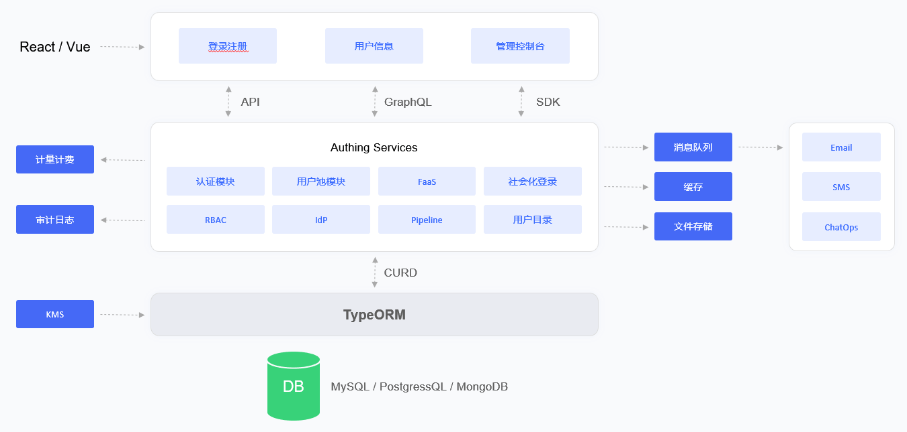

# Docker 部署模式

<LastUpdated/>

## 概述

Docker-Compose 是基于 Docker 引擎的一套编排的工具，你可以使用 Docker-Compose 快速的一键部署 Authing IDaaS 平台。
Docker 部署方案下的 Authing 是单机环境部署，如果你想部署高可用版本的 Authing，请参考：[Kubernetes 部署模式](./kubernetes.md)

本文描述了 Authing IDaaS 平台基于 Docker-Compose 的部署方案以及具体的操作指导。

## 整体架构

Authing IDaaS 平台架构中主要组件包括：对象存储服务、Redis、ElasticSearch、Postgres 及 Authing Server。Authing Server 作为 Authing IDaaS 平台的主服务，接收来自客户端的请求；对象存储作为存储静态资源的服务；Redis 存储 Session 信息、数据缓存等；Postgres 用来存储核心业务数据；ElasticSearch 用作数据统计分析、日志采集分析的工作。

在日志系统方面， Authing IDaaS 平台使用了 ELK 架构，Authing Server 将日志写入 Log File 当中，Logstash 通过读取 Log File 将日志信息写入 ElasticSearch 服务中，这样保证了多个 IDaaS 集群遵循一套统一的收集 -> 传输 -> 存储 -> 分析流程，再由 Kibana 作为图形化 UI 管理界面进行运维管理，极大程度降低了运维工作的复杂度和出错率，提高了运维人员的工作效率。

## 部署方案

**1. 组件规划**

|                         服务器                         |                            组件包                            |                          功能说明                           |
| :----------------------------------------------------: | :----------------------------------------------------------: | :---------------------------------------------------------: |
| ElasticSearch | elasticsearch-7.7.0 | 搜索引擎、日志服务 |
|                     Authing Server                     |                     authing-server-1.2.0                     |                       Authing 主服务                        |
|                         Redis                          |                         redis-4.0.0                          |                          缓存服务                           |
|                       PostgreSQL                       |                        postgres-12.5                         |                         数据库服务                          |
|                        Logstash                        |                        logstash-7.7.0                        |                     日志收集、分析服务                      |
|                       JDBC-River                       |                  jdbc-logstash-river:1.0.0                   |                        后台数据服务                         |
|                      Staticfiles                       |                  authing-staticfiles:1.0.0                   |                        静态资源服务                         |

**2. 系统环境要求**

Docker 版本要求：

| 项目  | 版本  |
| :--------------------------------------------: | :--------------------------------------------: |
|                     Client                     |                19.03.14 及以上                 |
|                     Server                     |                19.03.14 及以上                 |

操作系统环境要求：
| 项目  | 最低配置  | 推荐配置  |
| :----: | :----: | :----: |
| 操作系统平台 | linux/amd64 | - |
| 内核版本 | linux 3.10.0 及以上 | - |

服务器配置：

| 项目  | 最低配置 | 推荐配置  |
| :--------------------------------------------: | :-----------------------------------------------: | :------------------------------------------------: |
|                      CPU                       |                  X86 64 位 8 核                   |                  X86 64 位 16 核                   |
|                      内存                      |                       32 GB                       |                    64 GB 及以上                    |
|                      硬盘                      |                      500 GB                       |                        2 TB                        |
|                    内网带宽                    |                     100 Mbps                      |                       1 Gbps                       |

**3. 相关文档**

| 名称  | 说明  |
| :--------------------------------------------: | :--------------------------------------------: |
|   《Authing IDaaS 平台使用指南 1.2.0 版本》    |        介绍 Authing IDaaS 平台操作指导         |
|   《Authing IDaaS 平台产品文档 1.2.0 版本》    |        介绍 Authing IDaaS 平台产品功能         |

**注：以上资源请联系售前人员获取**

**4. 镜像安装包**

|   名称    | 说明  |
| :------------------------------------------------: | :--------------------------------------------: |
| authing-jdbc-logstash-river-1.0.0-90875fa84d87.tar |           Authing 后端数据服务镜像包           |
|       authing-server-1.2.0-32d8b4130bae.tar        |              Authing 主服务镜像包              |
|     authing-staticfiles-1.0.0-a70a58e3c115.tar     |               静态资源服务镜像包               |
|        elasticsearch-7.7.0-7ec4f35ab452.tar        |            搜索、数据统计服务镜像包            |
|          logstash-7.7.0-30dcca1db5e9.tar           |            日志收集、分析服务镜像包            |
|           postgres-12.5-386fd8c60839.tar           |                数据库服务镜像包                |
|            redis-4.0.0-3189e099eb0f.tar            |                 缓存服务镜像包                 |

**注：以上资源请联系售前人员获取**

**5. 编排文件**

| 名称  | 说明  |
| :--------------------------------------------: | :--------------------------------------------: |
|               `docker-compose.yml`               |      Authing Docker Compose 一键编排文件       |

**注：以上资源请联系售前人员获取**
