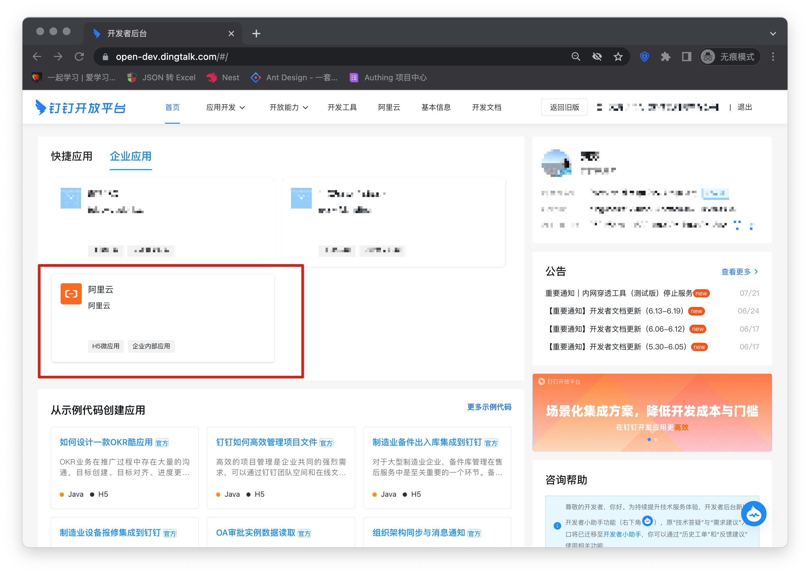
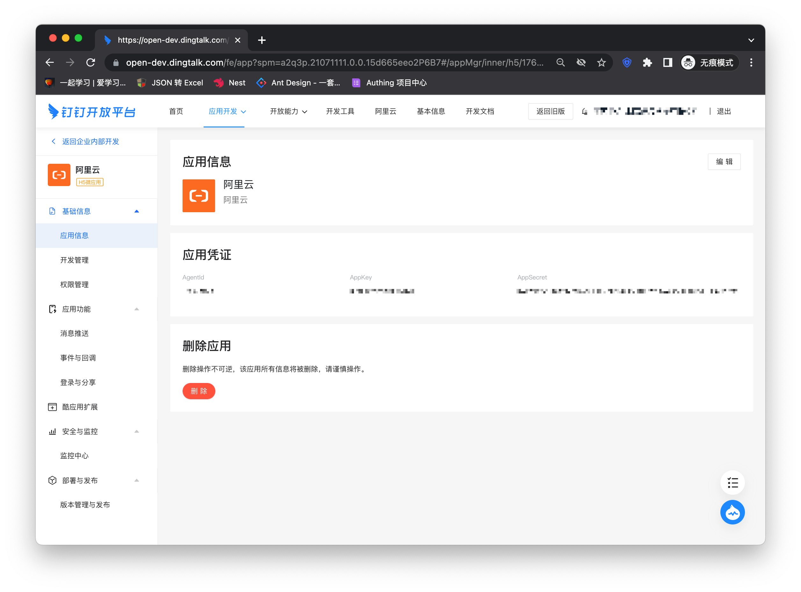
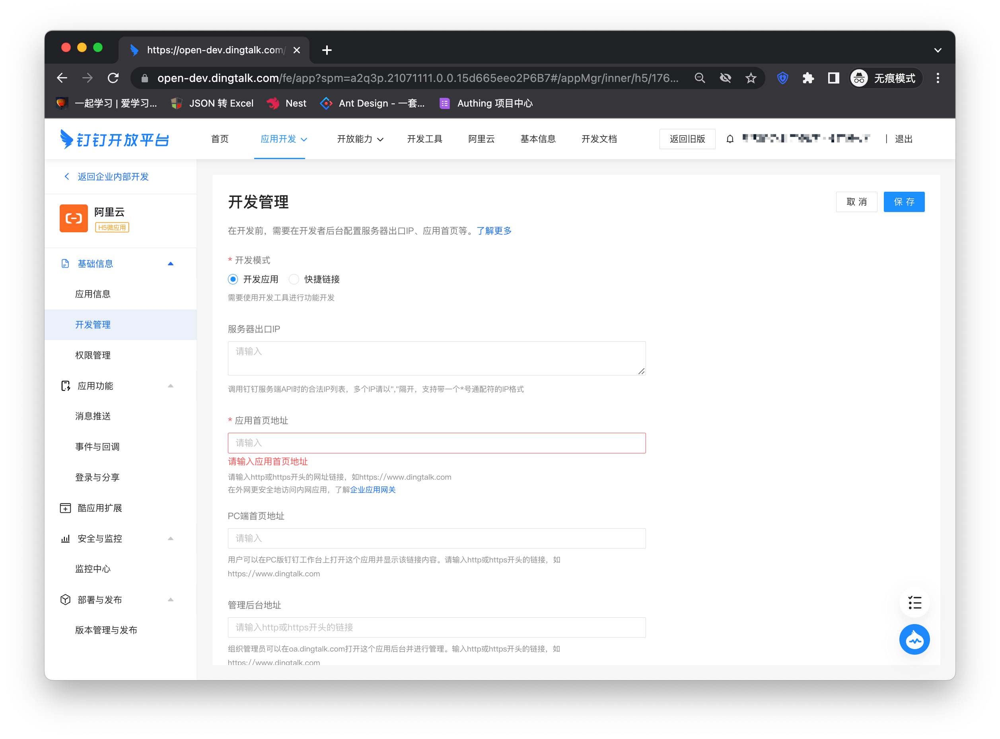
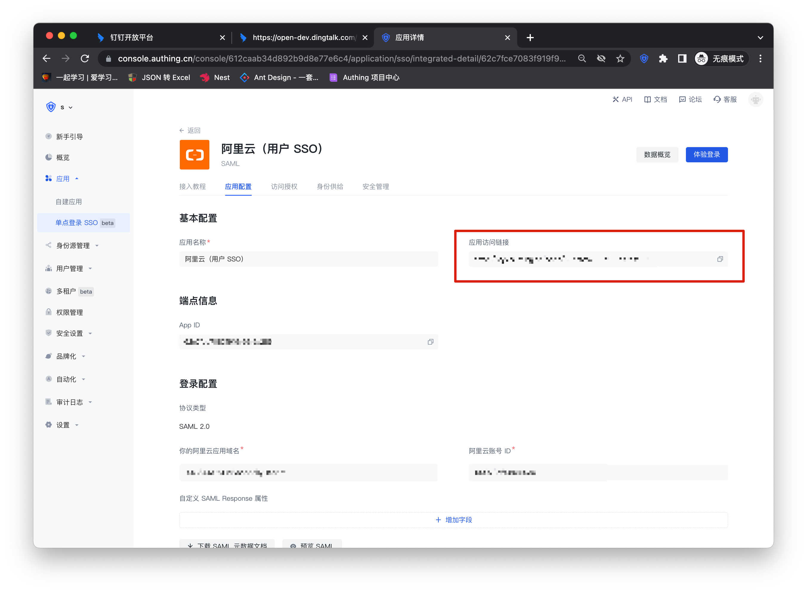
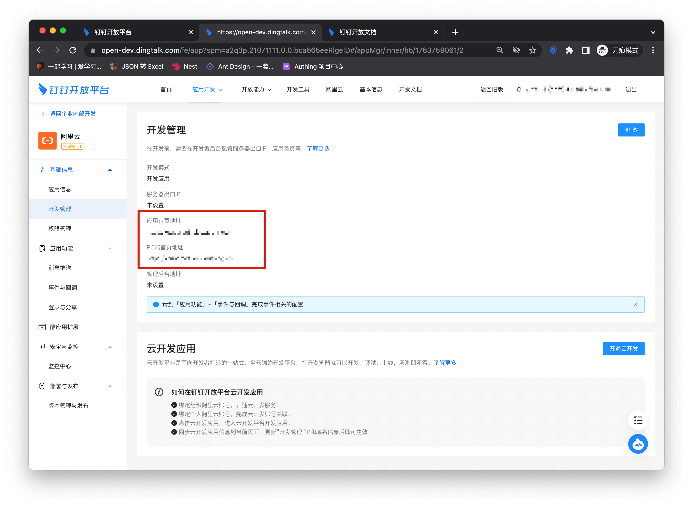
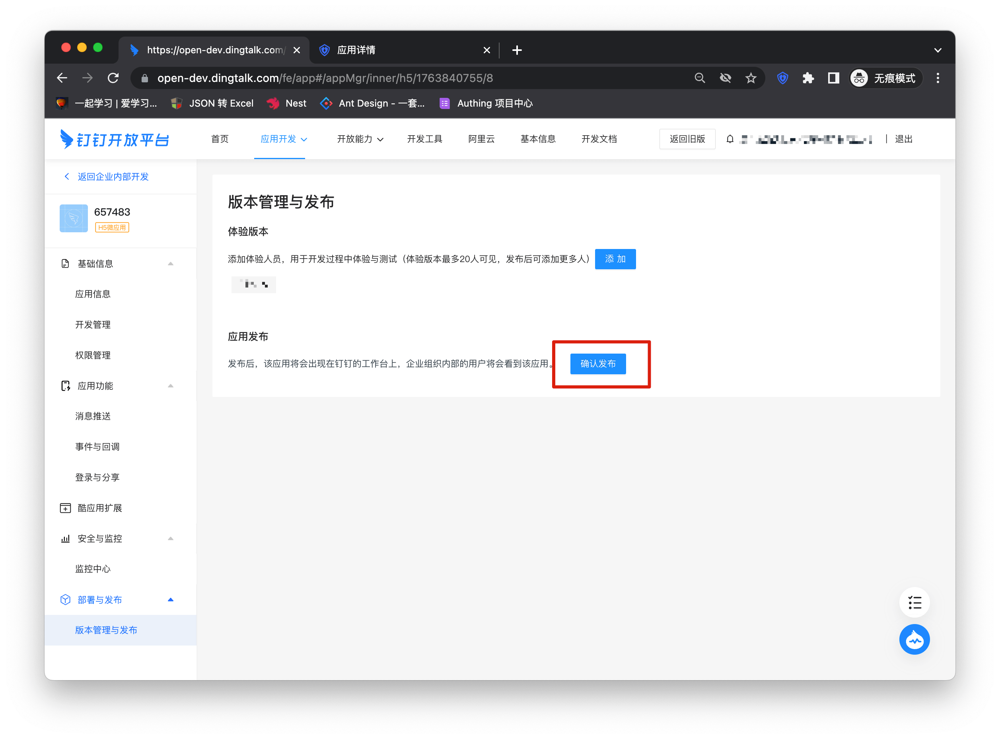
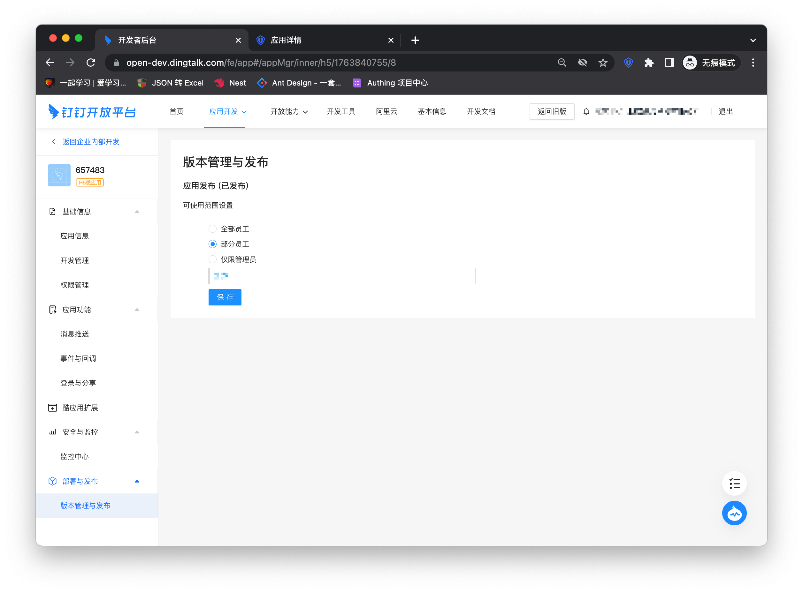
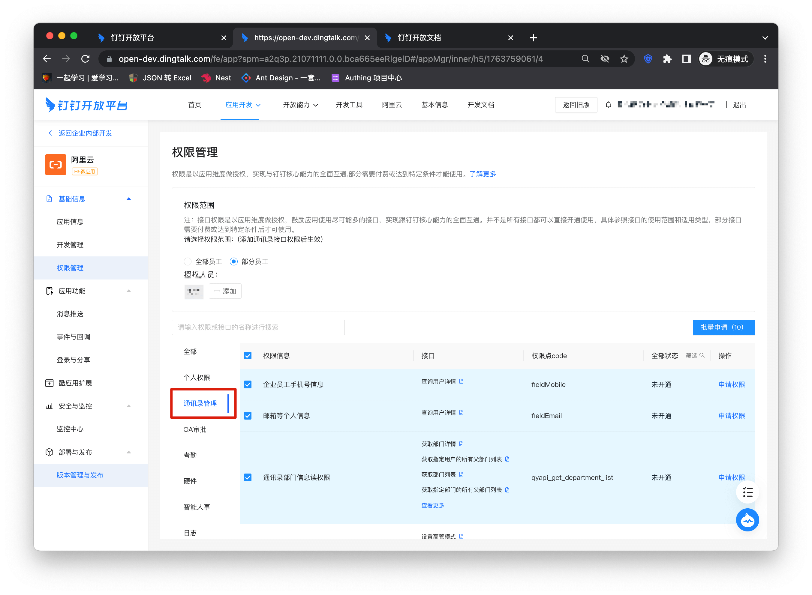
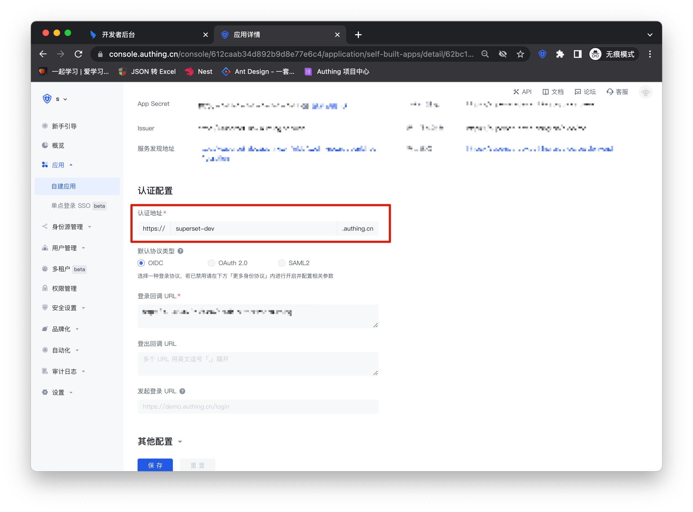

# 钉钉 SSO 方案

<LastUpdated/>

传统的身份系统往往是由各种解决方案拼凑而成的，“身份数据”相互分离。统一账户管理的需求越发频繁且必要，通过使用集中的身份管理平台，可以极大改善用户的登录体验和 IT 办公效率，并有效提升访问安全。

我们经常被开发者问到，如何实现通过单一身份源、同一平台登录所有应用，并统一进行细颗粒度的权限管理。以钉钉作为企业单一身份源快速添加阿里云为例，为大家提供一个极简的统一账户管理的解题思路。

## 设计思路

## 如何实现

### 步骤一：将钉钉配置为 Authing 身份源

具体钉钉的身份源配置操作可见文档，[钉钉 H5 微应用（企业内部开发）](https://docs.authing.cn/v2/guides/connections/enterprise/dingtalk/)

### 步骤二：使用钉钉单点登录阿里云

### 集成应用

1. 进入[钉钉开放平台后台](https://open-dev.dingtalk.com/)，点击顶部 Type 切换到「企业应用」，点击步骤一创建的应用（阿里云）卡片或创建新应用。

2. 进入应用详情信息页，点击左边栏的「开发管理」，点击「修改」按钮

3. 进入阿里云配置详情页，复制应用访问链接

4. 将该链接复制进应用首页地址和 PC 端首页地址
  

5. 点击左边栏的版本管理与发布，选中确认发布
  

6. 选择应用的可使用范围
  

7. 添加通讯录接口权限
  

8. 在工作台中点击完成登录
  

### 自建应用

对于自建应用，你需要进行如下操作：

1. 创建自建应用

> 首先需要创建自建应用并完成配置，创建应用参考 [如何创建自建应用](https://docs.authing.cn/v2/guides/app/create-app.html)

2. 用户需要进入配置好的自建应用详情页，将其认证地址进行复制

3. 进入钉钉中创建的企业应用详情页，点击左边栏的「开发管理」，点击「修改」按钮，填写应用主页网页网址。后续步骤与集成应用一致进行应用发布即可。

