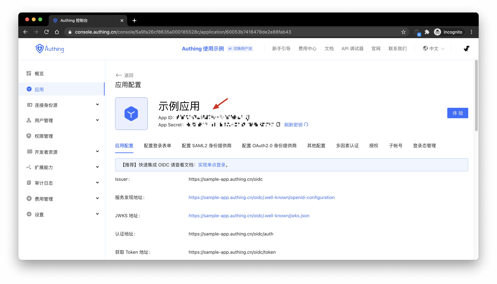

# 如何验证用户身份凭证（token）

<LastUpdated/>

验证 Token 分为两种模式：本地验证与使用 {{$localeConfig.brandName}} 在线验证。我们建议在**本地验证 JWT Token**，因为可以节省你的服务器带宽并加快验证速度。你也可以选择将 Token 发送到 Authing 的验证接口由 Authing 进行验证并返回结果，但这样会造成网络延迟，而且在网络拥塞时可能会有慢速请求。

以下是本地验证和在线验证的优劣对比：

|          | 验证速度 | 代码复杂度 | 可靠程度     |
| -------- | -------- | ---------- | ------------ |
| 在线验证 | 慢 🐢     | 简单       | 单点故障风险 |
| 本地验证 | 快 🐇     | 一般       | 分布式       |

## 本地验证

### 使用应用密钥验证 HS256 算法签名的 Token

如果你**直接调用了**登录方法（loginByEmail、loginByPhone、loginByUsername）或使用了 **OIDC 授权**，且 IdToken 签名算法类型设置为 **HS256** 时请使用此方式验证 Token。‌

可以在**控制台** > **应用** > **应用详情**中获取到密钥，如下图所示：



以下验证合法性的代码以 Node 为例（需要安装 [JSON Web Token](https://www.npmjs.com/package/jsonwebtoken)）。

```javascript
const jwt = require('jsonwebtoken');
try {
  let decoded = jwt.verify('JSON Web Token from client', 'your_secret'),
    expired = Date.parse(new Date()) / 1000 > decoded.exp;
  if (expired) {
    // 过期
  } else {
    // 合法也没过期，正常放行
  }
} catch (error) {
  // 不合法
}
```

为了避免在客户端暴露应用密钥，请在服务端通过应用密钥验证 id_token 的合法性。‌

### 使用应用公钥验证 RS256 算法签名的 IdToken

如果使用 **RS256** 签名算法，需要使用**公钥**验证签名。{{$localeConfig.brandName}} 将使用应用的私钥进行签名，请使用 `https://<应用域名>.authing.cn/oidc/.well-known/jwks.json` 中的公钥来验证签名。{{$localeConfig.brandName}} 颁发的 **access_token** 和 **id_token** 都可以使用上述公钥进行验签。

如果你使用 javascript，可以使用 jose 库来验证 RS256 签名：

> 请使用 v2.x.x 或以下版本的 jose 库，新版 jose 库和本代码示例不兼容。

```javascript
const jose = require('jose');
// 下面的参数内容是将 https://<应用域名>.authing.cn/oidc/.well-known/jwks.json 返回的内容原封不动复制过来
const keystore = jose.JWKS.asKeyStore({
  keys: [
    {
      e: 'AQAB',
      n:
        'o8iCY52uBPOCnBSRCr3YtlZ0UTuQQ4NCeVMzV7JBtH-7Vuv0hwGJTb_hG-BeYOPz8i6YG_o367smV2r2mnXbC1cz_tBfHD4hA5vnJ1eCpKRWX-l6fYuS0UMti-Bmg0Su2IZxXF9T1Cu-AOlpgXFC1LlPABL4E0haHO8OwQ6QyEfiUIs0byAdf5zeEHFHseVHLjsM2pzWOvh5e_xt9NOJY4vB6iLtD5EIak04i1ND_O0Lz0OYbuV0KjluxaxoiexJ8kGo9W1SNza_2TqUAR6hsPkeOwwh-oHnNwZg8OEnwXFmNg-bW4KiBrQEG4yUVdFGENW6vAQaRa2bJX7obn4xCw',
      kty: 'RSA',
      alg: 'RS256',
      use: 'sig',
      kid: 'TfLOt3Lbn8_a8pRMuessamqj-o3DBCs1-owHLQ-VMqQ',
    },
  ],
});
// 选项中 issuer 的内容是 https://<应用域名>.authing.cn/oidc，audience 的内容是 应用 ID
// id_token 很长，请向右滑动 ->
const res = jose.JWT.IdToken.verify(
  'eyJhbGciOiJSUzI1NiIsInR5cCI6IkpXVCIsImtpZCI6IlRmTE90M0xibjhfYThwUk11ZXNzYW1xai1vM0RCQ3MxLW93SExRLVZNcVEifQ.eyJzdWIiOiI1ZjcxOTk0NjUyNGVlMTA5OTIyOTQ5NmIiLCJiaXJ0aGRhdGUiOm51bGwsImZhbWlseV9uYW1lIjpudWxsLCJnZW5kZXIiOiJVIiwiZ2l2ZW5fbmFtZSI6bnVsbCwibG9jYWxlIjpudWxsLCJtaWRkbGVfbmFtZSI6bnVsbCwibmFtZSI6bnVsbCwibmlja25hbWUiOm51bGwsInBpY3R1cmUiOiJodHRwczovL2ZpbGVzLmF1dGhpbmcuY28vdXNlci1jb250ZW50cy9waG90b3MvOWE5ZGM0ZDctZTc1Ni00NWIxLTgxZDgtMDk1YTI4ZTQ3NmM2LmpwZyIsInByZWZlcnJlZF91c2VybmFtZSI6InRlc3QxIiwicHJvZmlsZSI6bnVsbCwidXBkYXRlZF9hdCI6IjIwMjAtMDktMzBUMDc6MTI6MTkuNDAxWiIsIndlYnNpdGUiOm51bGwsInpvbmVpbmZvIjpudWxsLCJlbWFpbCI6InRlc3QxQDEyMy5jb20iLCJlbWFpbF92ZXJpZmllZCI6ZmFsc2UsInBob25lX251bWJlciI6bnVsbCwicGhvbmVfbnVtYmVyX3ZlcmlmaWVkIjpmYWxzZSwibm9uY2UiOiJFNjViMVFvVVl0IiwiYXRfaGFzaCI6IkIzSWdPWUREYTBQejh2MV85cVpyQXciLCJhdWQiOiI1ZjE3YTUyOWY2NGZiMDA5Yjc5NGEyZmYiLCJleHAiOjE2MDE0NTM1NTgsImlhdCI6MTYwMTQ0OTk1OSwiaXNzIjoiaHR0cHM6Ly9vaWRjMS5hdXRoaW5nLmNuL29pZGMifQ.Z0TweYr9bCdYNJREVdvbJYcjXSfSsSNHBMqxTJeW-bnza0IIpBpEEVxlDG0Res6FZbcVzsQZzfJ9pj_nFgLjZxUUxv7Tpd13Sq_Ykg2JKepPf3-uoFqbORym07QEj4Uln0Quuh094MTb7z6bZZBEOYBac46zuj4uVp4vqk5HtCUSB4ASOAxwi7CeB1tKghISHz6PDcf6XJe_btHdzX1dparxtML-KvPxjpcHlt5emN88lpTAOX7Iq0EhsVE3PKrIDfCkG8XlL5y9TIW2Dz2iekcZ5PV17M35G6Dg2Q07Y_Apr18_oowOiQM5m_EbI90ist8CiqO9kBKreCOLMzub4Q',
  keystore,
  {
    issuer: 'https://oidc1.authing.cn/oidc',
    audience: '5f17a529f64fb009b794a2ff',
  }
);
console.log(res);
```

输出结果：

```javascript
{
  sub: '5f719946524ee1099229496b', // subject 的缩写，为用户 ID
  birthdate: null,
  family_name: null,
  gender: 'U',
  given_name: null,
  locale: null,
  middle_name: null,
  name: null,
  nickname: null,
  picture: 'https://files.authing.co/user-contents/photos/9a9dc4d7-e756-45b1-81d8-095a28e476c6.jpg',
  preferred_username: 'test1',
  profile: null,
  updated_at: '2020-09-30T07:12:19.401Z',
  website: null,
  zoneinfo: null,
  email: 'test1@123.com',
  email_verified: false,
  phone_number: null,
  phone_number_verified: false,
  nonce: 'E65b1QoUYt',
  at_hash: 'B3IgOYDDa0Pz8v1_9qZrAw',
  aud: '5f17a529f64fb009b794a2ff',
  exp: 1601453558,
  iat: 1601449959,
  iss: 'https://oidc1.authing.cn/oidc'
}
```

## 在线验证

### 在线验证 OIDC AccessToken

只有 `access_token` 和 `refresh_token` 可以检测状态，`id_token` 无法检测。

- 接口说明：检查签发的 `access_token` 或 `refresh_token` 有效状态。
- 接口地址：`POST` `https://<你的应用域名>.authing.cn/oidc/token/introspection`
- 请求头：

| 参数         | 类型   | <span style="white-space:nowrap">是否必填</span> | 描述                              |
| ------------ | ------ | ---------------------------------------------- | --------------------------------- |
| Content-Type | string | 是                                             | application/x-www-form-urlencoded |

- 请求参数：

| 参数            | 类型   | <span style="white-space:nowrap">是否必填</span> | 描述                                                                               |
| --------------- | ------ | ---------------------------------------------- | ---------------------------------------------------------------------------------- |
| token           | string | 是                                             | 要检验的 token 值。                                                                |
| token_type_hint | string | 是                                             | 要检验的 token 类型，可选值为 access_token、refresh_token。                        |
| client_id       | string | 否                                             | 应用 ID，在控制台配置检验 token 身份验证方式为 client_secret_post 和 none 时必填。 |
| client_secret   | string | 否                                             | 应用 Secret，在控制台配置检验 token 身份验证方式为 client_secret_post 时必填。     |

- 返回数据：

当 token 有效时返回以下格式内容

```json
{
  "active": true,
  "sub": "5f623f30d85f84c58f141777", // subject 的缩写，为用户 ID
  "client_id": "5d01e389985f81c6c1dd31de",
  "exp": 1600634105,
  "iat": 1600274405,
  "iss": "https://oidc1.authing.cn",
  "jti": "hoV44FPNR-_EfxTP7s7vw",
  "scope": "openid profile email phone offline_access",
  "token_type": "Bearer"
}
```

当 token 无效时（过期，错误，被撤回）返回以下格式内容

```json
{
  "active": false
}
```

### 在线验证 OIDC IdToken

本接口可以检测 `access_token` 和 `id_token` 的有效性，`refresh_token` 无法检测。

- 接口说明：检查签发的 `access_token` 或 `id_token` 有效状态。
- 接口地址：`GET` `https://<你的应用域名>.authing.cn/api/v2/oidc/validate_token`
- 请求参数：

| 参数         | 类型   | 是否必填 | 描述                 |
| ------------ | ------ | -------- | -------------------- |
| access_token | string | 否       | AccessToken 的内容。 |
| id_token     | string | 否       | IdToken 的内容。     |

- 返回数据：

`access_token` 或 `id_token` 合法时，返回 `access_token` / `id_token` 解码后的的内容

```json
// access_token 检验后的返回结果：
{
    "jti": "K5TYewNhvdGBdHiRifMyW",
    "sub": "5f64afd1ad501364e3b43c1e", // subject 的缩写，为用户 ID
    "iat": 1601456894,
    "exp": 1601460494,
    "scope": "openid profile email phone",
    "iss": "https://oidc1.authing.cn/oidc",
    "aud": "5f17a529f64fb009b794a2ff"
}

// id_token 检验后的返回结果：
{
    "sub": "5f64afd1ad501364e3b43c1e", // subject 的缩写，为用户 ID
    "birthdate": null,
    "family_name": null,
    "gender": "U",
    "given_name": null,
    "locale": null,
    "middle_name": null,
    "name": null,
    "nickname": null,
    "picture": "https://usercontents.authing.cn/authing-avatar.png",
    "preferred_username": "test1",
    "profile": null,
    "updated_at": "2020-09-27T06:06:29.853Z",
    "website": null,
    "zoneinfo": null,
    "email": "test1@123.com",
    "email_verified": false,
    "phone_number": null,
    "phone_number_verified": false,
    "nonce": "CQsguqUdl7",
    "at_hash": "10iOtwuTNtyQLzlNYXAHeg",
    "aud": "5f17a529f64fb009b794a2ff",
    "exp": 1601460494,
    "iat": 1601456894,
    "iss": "https://oidc1.authing.cn/oidc",
}
```

`access_token` 或 `id_token` 非法时，返回以下错误信息

```javascript
{
  code: 400,
  message: 'id_token 不合法',
}

{
  code: 400,
  message: 'access_token 不合法',
}
```

### 在线验证 OAuth2 AccessToken

- 接口说明：可以检验 `access_token` 和 `refresh_token`
- 接口地址：`POST` `https://<你的应用域名>.authing.cn/oauth/token/introspection`
- 请求头：

| 参数          | 类型   | <span style="white-space:nowrap">是否必填</span> | 描述                                                                                                                                                                      |
| ------------- | ------ | ---------------------------------------------- | ------------------------------------------------------------------------------------------------------------------------------------------------------------------------- |
| Content-Type  | string | 是                                             | application/x-www-form-urlencoded                                                                                                                                         |
| Authorization | string | 否                                             | 在控制台应用配置详情，「配置 OAuth2.0 身份提供商」选项卡中，配置检验 token 身份验证方式为 `client_secret_basic` 时必填，形式为：Basic base64(应用 ID + ':' + 应用 Secret) |

- 请求参数：

| 参数            | 类型   | <span style="white-space:nowrap">是否必填</span> | 描述                                                                                                                                         |
| --------------- | ------ | ---------------------------------------------- | -------------------------------------------------------------------------------------------------------------------------------------------- |
| token           | string | 是                                             | 要检验的 token 值。                                                                                                                          |
| token_type_hint | string | 是                                             | 要检验的 token 类型，可选值为 `access_token`                                                                                                 |
| client_id       | string | 否                                             | 应用 ID，在控制台应用配置详情，「配置 OAuth2.0 身份提供商」选项卡中，配置检验 token 身份验证方式为 **client_secret_post** 和 **none** 时必填 |
| client_secret   | string | 否                                             | 应用 Secret，在控制台应用配置详情，「配置 OAuth2.0 身份提供商」选项卡中，配置撤回 token 身份验证方式为 **client_secret_post** 时必填。       |

- 返回数据：

当 token 有效时返回以下格式内容

```json
{
  "active": true,
  "sub": "5dc10851ebafee30ce3fd5e9", // subject 的缩写，为用户 ID
  "client_id": "5cded22b4efab31716fa665f",
  "exp": 1602423020,
  "iat": 1602419420,
  "iss": "https://core.authing.cn/oauth",
  "jti": "SaPg48dbO66T77xkT8wy0",
  "scope": "user",
  "token_type": "Bearer"
}
```

当 token 无效时（过期，错误，被撤回）返回以下格式内容

```json
{
  "active": false
}
```

