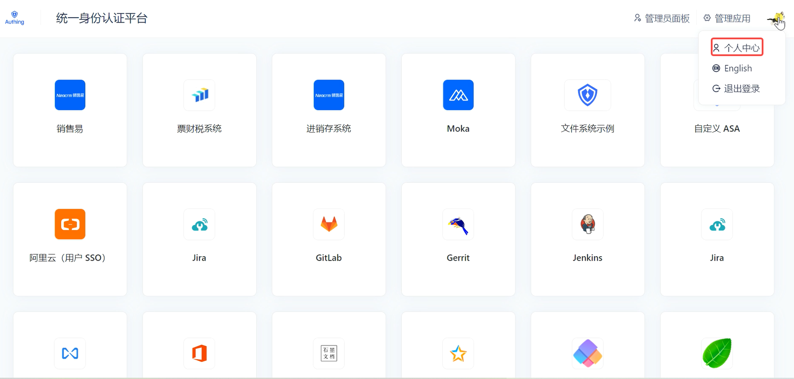
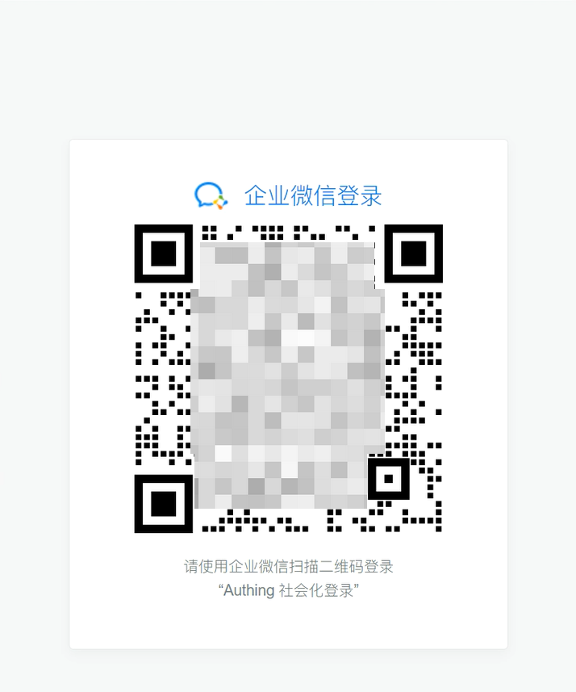
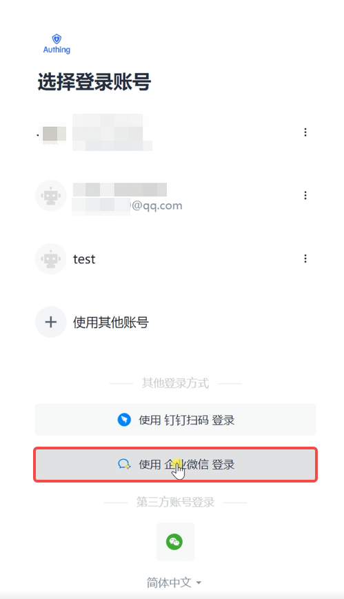

# 企业微信扫码登录常见问题

<LastUpdated/>

#### Q: 为什么企业员工扫码之后创建了新的用户？

A: 对于企业内部场景，我们建议将 **禁止注册** 功能打开，避免产生新的用户。对于没有进行自动关联的原因，请参考教程中 [身份源连接的账号关联](/guides/connections/account-association.md)。

#### Q: 在开启 **禁止注册** 后，员工扫码显示 “登录失败，应用已禁止注册”，是为什么呢？

A: 如果已经确认 {{$localeConfig.brandName}} 后台配置无误的话，这种情况是由于员工没有进行手机号信息的授权，详细授权方法请参照 [用户操作](/guides/connections/enterprise/wecom-agency-qrconnect/README.md#用户操作)。

#### Q: 在个人第一次授权后忘记授权手机号或者中断了怎么办呢？还能再次授权吗？

A:  如果在授权过程中忘记勾选个人手机号，则无法实现企业微信和自建应用的绑定，继而以企业微信账号登录自建应用。此时，需要在 PC 端登录 {{$localeConfig.brandName}} SSO 应用面板，进入 **个人中心** 绑定企业微信，具体操作如下：

1. 登录 SSO 应用面板。

2. 点击右上角头像，进入 **个人中心**。

3. 点击左侧导航栏 **账号绑定**，在右侧页面 **第三方账号** 模块找到 **企业微信**，点击行尾 **绑定** 按钮。 弹出企业微信扫码登录窗口。

4. 使用手机扫码登录，完成绑定。

::: hint-info
要确保已在后台完成企业微信的配置（有关详情，请参阅 [企业微信自建应用扫码（代开发模式）](/guides/connections/enterprise/wecom-agency-qrconnect/README.md#配置步骤)）。
:::

成功绑定自建应用及企业微信后，用户即可使用企业微信账号登录自建应用。

