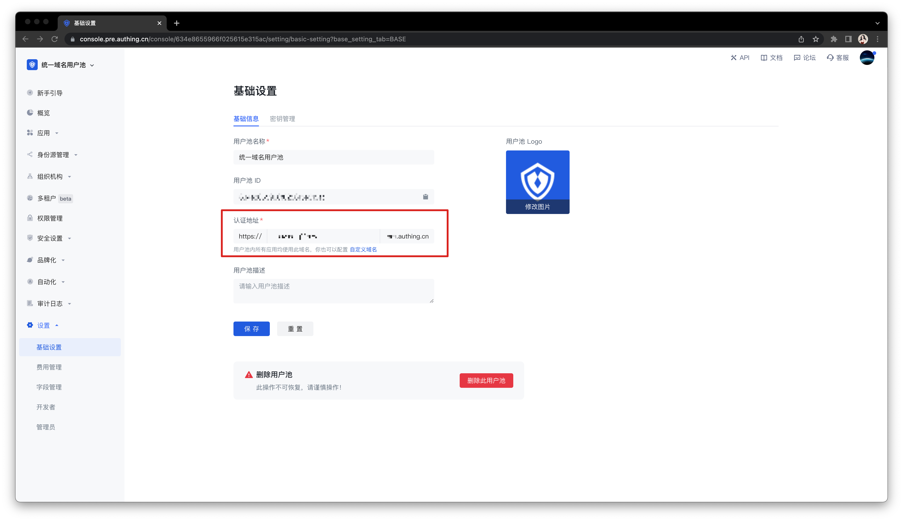
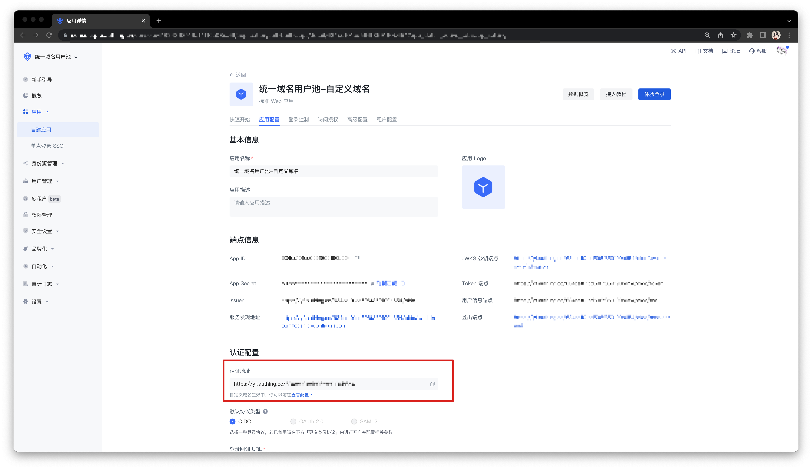
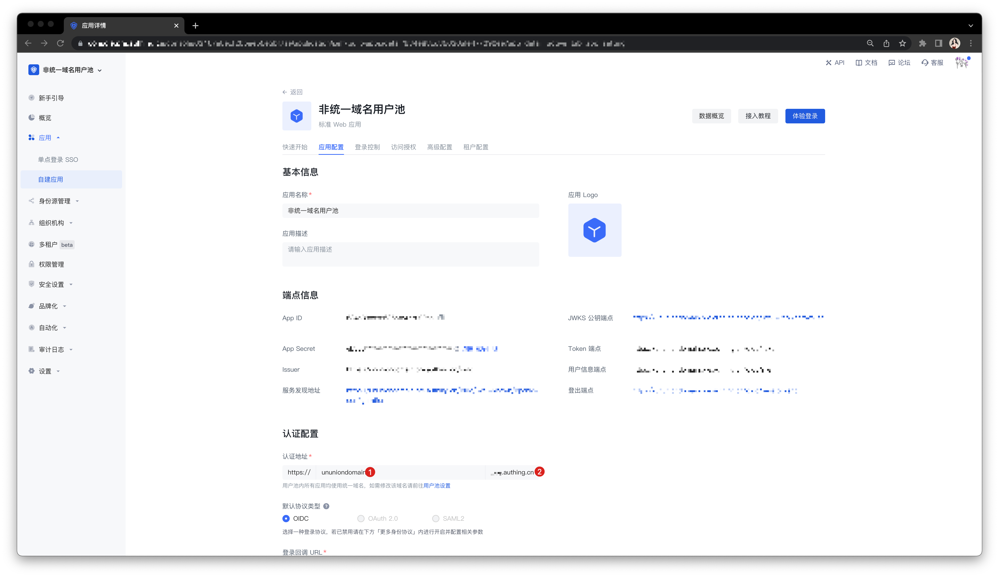
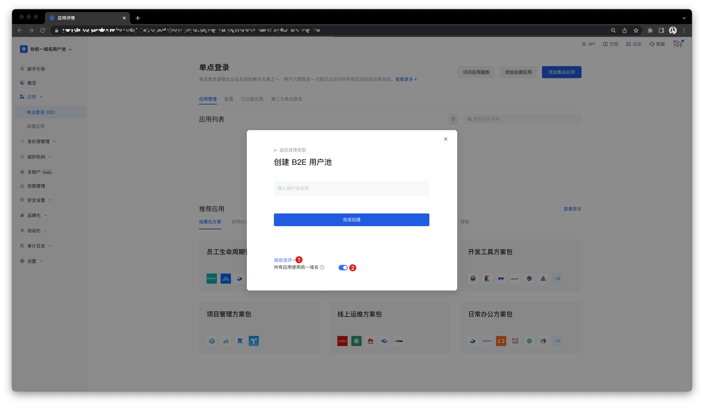

# 使用统一域名的用户池

<LastUpdated/>

默认情况下，在 {{$localeConfig.brandName}} 创建的用户池不使用统一的三级域名。但在某些特殊场景下，你可能会需要在整个用户池中使用统一的域名（即用户池中的所有应用均使用统一的、用户池级别的域名）。

要明确对此功能的实际需求，请按照以下步骤比对你的使用场景进行选择：

## 第一步：了解什么是统一域名

{{$localeConfig.brandName}} 的用户池中存在多种类型的应用，包括：自建应用、集成应用，以及可以收纳这两种应用进行 [单点登录（SSO）](/guides/app-new/sso/README.md) 的应用面板。默认状态下， {{$localeConfig.brandName}} 用户池中以上各种类型的应用使用独立的三级域名（`xxx.authig.cn`），你可以独立地修改任何一个自建应用以及应用面板的认证地址。

与此对比，统一域名指的是同一个用户池中各种类型的应用均使用同样的三级域名。创建此类用户池之后，你可以在用户池 **设置->基础设置->基础信息** 标签页对此用户池统一的三级域名进行修改。你的修改将会对该用户池中的所有应用同时生效，不同应用之间将会通过在认证地址后拼接 **App ID** 的方式进行区分（`xxx.authing.cn/APP_ID`）。

## 第二步：判断你是否需要使用统一域名

### 什么情况下需要使用统一域名？

* 你希望用户池中所有应用的三级域名能够被统一修改。

* 你希望在整个用户池中使用自定义域名功能。

  * 应用面板使用自定义域名。
    
  
    
  * 自建应用使用自定义域名。
    

    

### 什么情况不建议使用统一域名？

* 你希望每个应用的三级域名能够被自定义。

* 你接受使用 Authing 默认的二级域名（即 `.authing.cn`）。

## 第三步：创建一个统一域名的用户池

1. 在创建用户池时打开 **高级选项**。

2. 打开 **所有应用使用统一域名** 开关。

## 第四步：统一域名用户池的常见操作

* 在新建的统一域名的用户池中配置自定义域名：
  
  * 配置方法：按照 [自定义域名](/guides/customize/domain/customized-domain.md) 中的引导完成配置。

  * 实现效果：应用面板、用户池中的所有自建应用和集成应用均使用统一的自定义域名。

* 将已有用户池切换为使用统一域名：

  * 新建统一域名的用户池，迁移已有数据。

  * 联系你的客户经理寻求技术支持，或 [提交工单](https://app.treelab.com/share/view/shr3wyakgz14SQDnZof781JGj/0x128330/viwddWVILK0EbeJ?)。