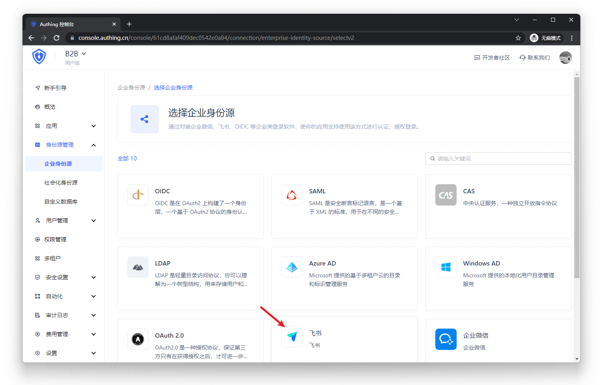
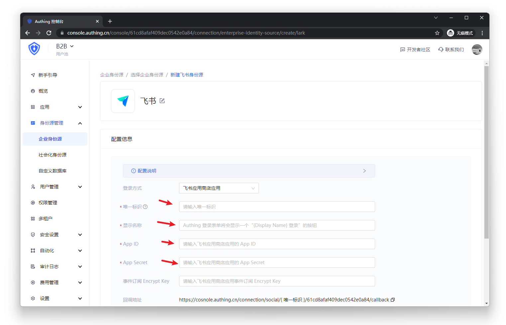
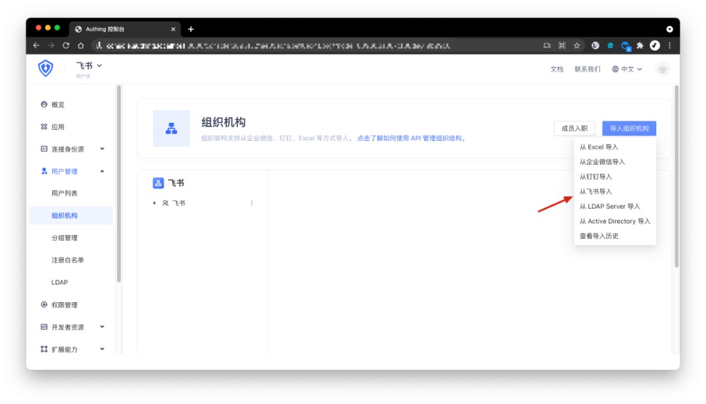
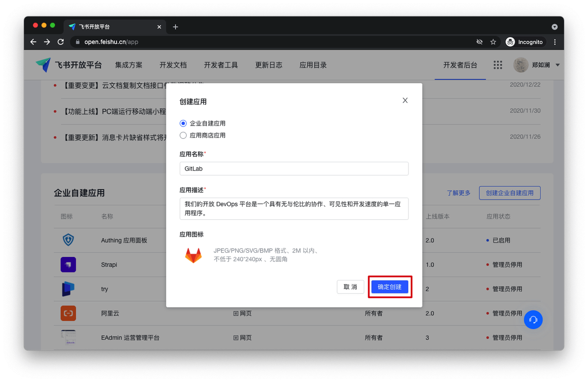
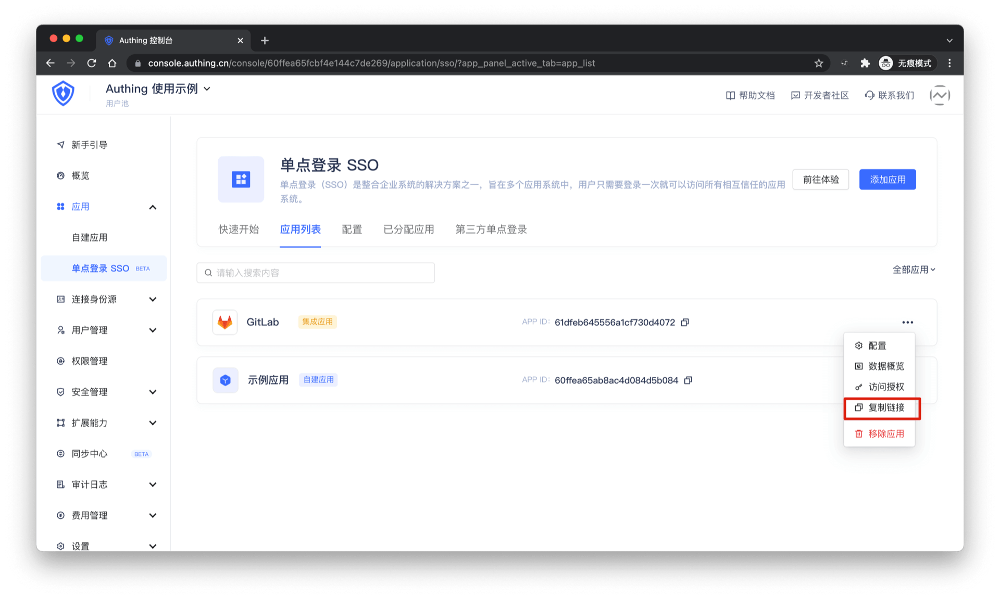
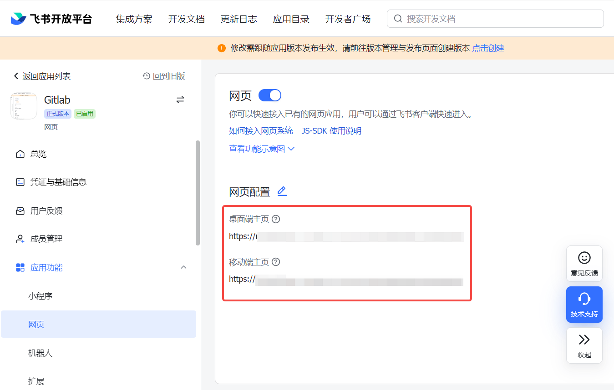
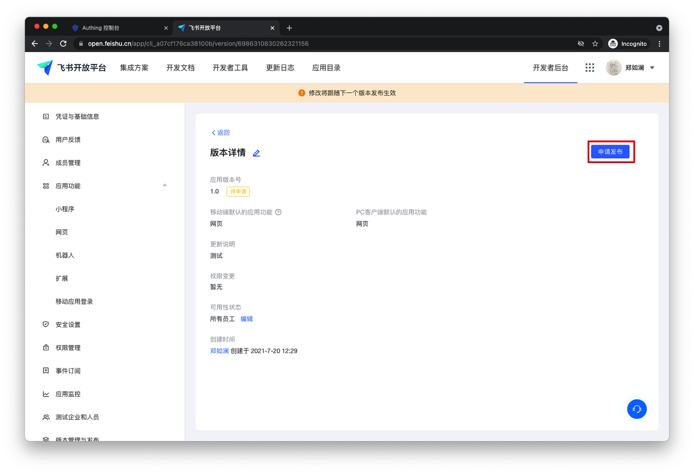
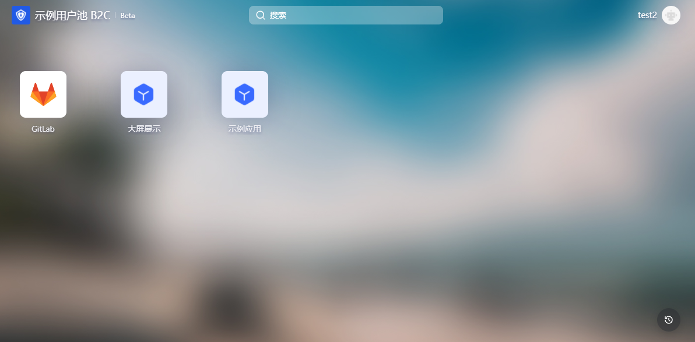
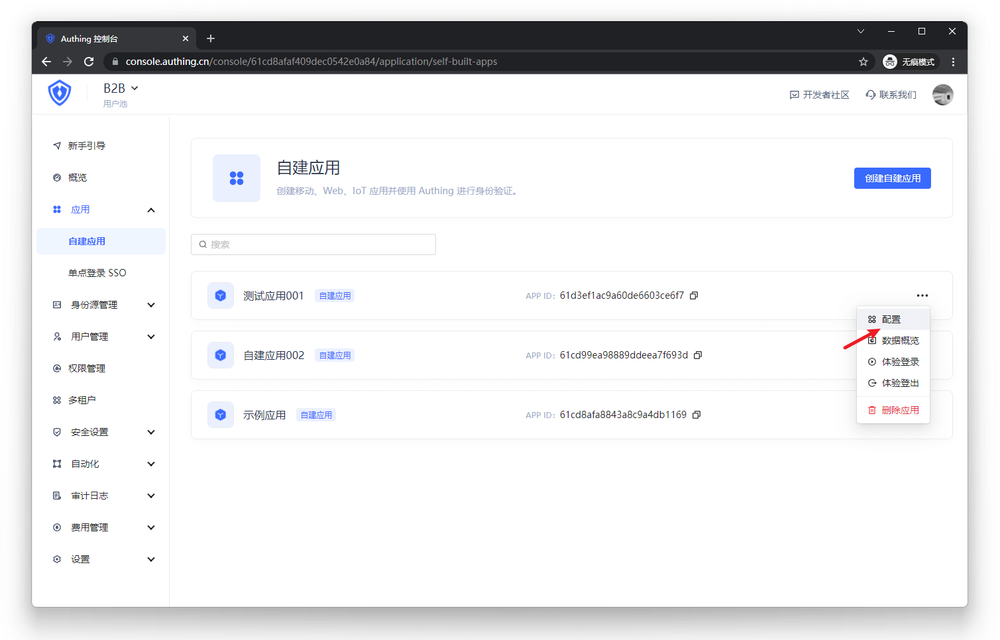
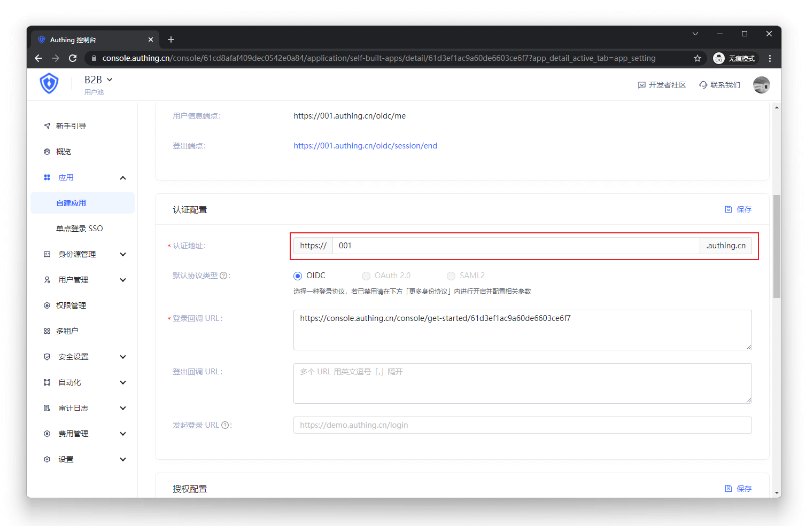

# 飞书工作台 SSO 方案

<LastUpdated/>

传统的身份系统往往是由各种解决方案拼凑而成的，“身份数据”相互分离。统一账户管理的需求越发频繁且必要，通过使用集中的身份管理平台，可以极大改善用户的登录体验和 IT 办公效率，并有效提升访问安全。

我们经常被开发者问到，如何实现通过单一身份源、同一平台登录所有应用，并统一进行细颗粒度的权限管理。今天，我们以飞书作为企业单一身份源快速添加 Gitlab 为例，为大家提供一个极简的统一账户管理的解题思路。

## 设计思路

## 如何实现

### 步骤一：以飞书为例，将飞书配置为单一身份源

1. 在 Authing 中配置飞书通讯录，并按要求填入以下信息。

- 飞书应用的 App ID
- 飞书应用的 App Secret；
- 事件订阅的 Encrypt Key（可选），如果你不需要和飞书组织机构保持实时同步，可以不填写；
- 事件订阅的 Verification Token（可选），如果你不需要和飞书组织机构保持实时同步，可以不填写。

2. 从飞书通讯录中同步组织机构到 Authing。

在 Authing 控制台用户管理 - 组织架构页面点击右上角 - 导入组织机构 - 从飞书导入。此后，飞书的增删减改操作将实时同步到控制台的组织机构变动。

### 步骤二：以 GitLab 为例，使用飞书账号单点登录 GitLab

### 集成应用

1. 进入[飞书开放平台](https://open.feishu.cn/app)，点击「创建企业自建应用」

2. 填写弹窗信息，并点击「确定创建」

3. 进入 Authing 控制台应用列表，在你想添加的应用右侧点击「...」，点击「复制链接」

4. 进入飞书开放平台「应用功能 - 网页」，启用网页，并粘贴链接至「网页配置」，点击「保存」

5. 进入「版本管理与发布」，并点击「创建版本」

6. 填写版本详情并保存

7. 填写详情后点击「申请发布」

8. 所有有权访问这个应用的用户都可以在飞书工作台看到刚刚添加好的应用，只要用户登录一个应用，便可以单点登录所有的应用。

### 自建应用

对于自建应用，你需要进行如下操作：

1. 创建自建应用

> 也可以使用现有应用，创建应用参考 [如何创建自建应用](../app/create-app.md)

2. 用户进入「单点登录 SSO」页，添加刚刚的自建应用

（注：添加后，单点登录 SSO 列表页内的应用，用户登录一个自建或集成应用，即可单点登录所有应用）

3. 用户返回应用列表，在自建应用右侧点击「...」，点击「复制链接」

4. 用户将地址粘贴在网页配置并重复以上「集成应用」的方案即可

