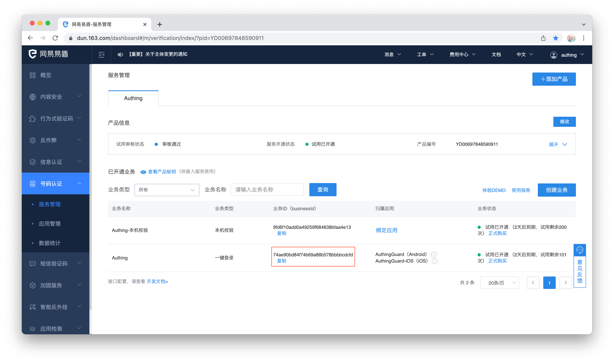
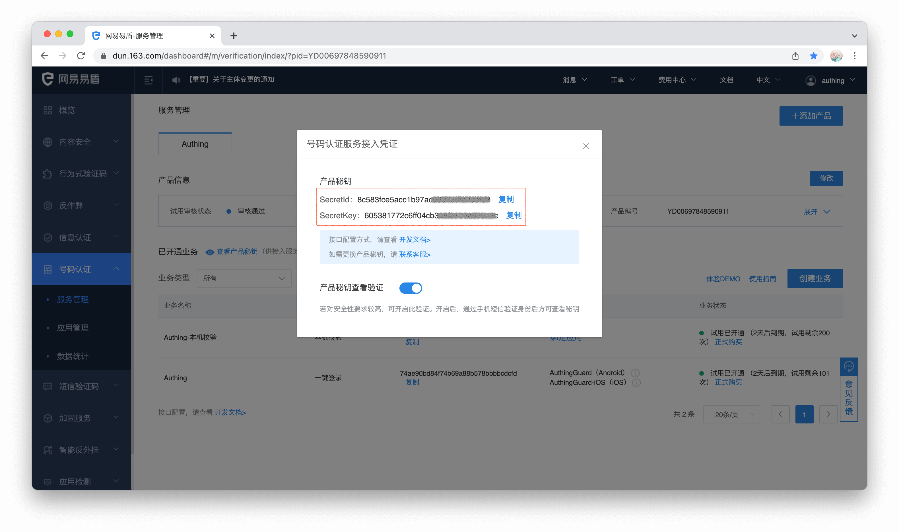
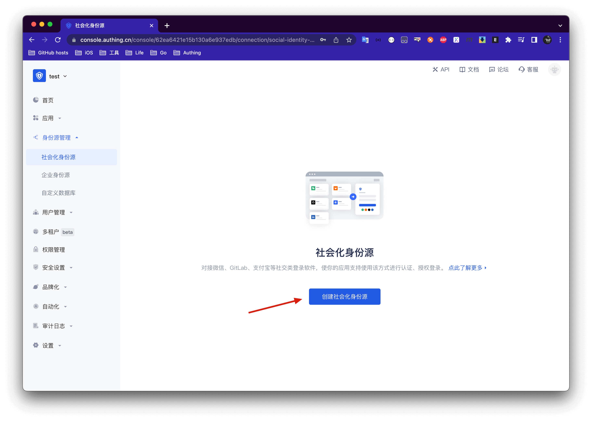
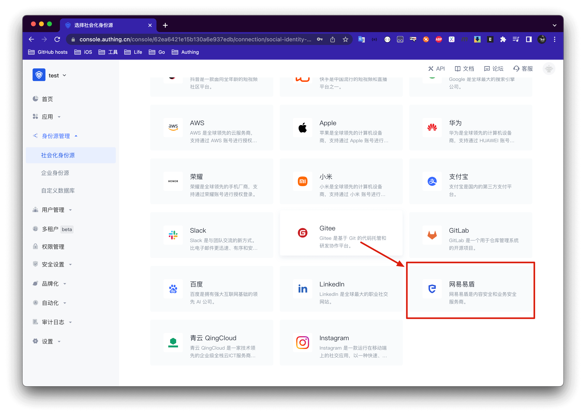
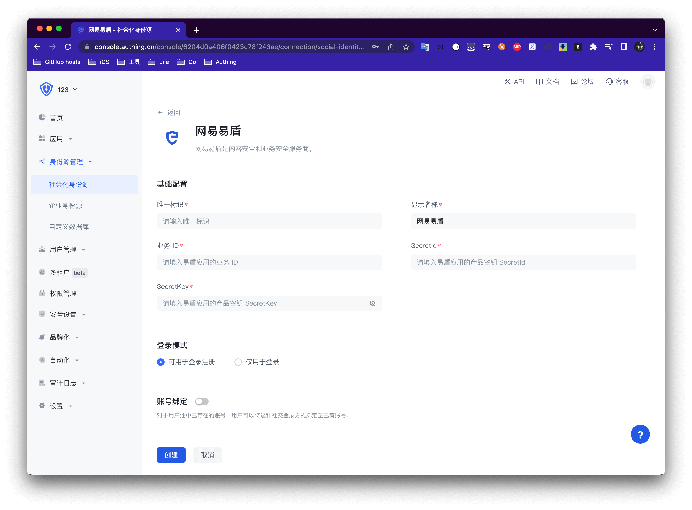

# 手机号一键登录

<LastUpdated/>

手机号一键登录是由三大运营商提供的一种极为便捷的认证方式。

当前 Authing 支持通过网易易盾接入该能力，网易易盾集成了三大运营商一键登录 SDK，提供了统一的移动端应用接口。你可以通过以下三步快速完成接入。

 

## STEP1：易盾后台配置

参考 [易盾文档](https://support.dun.163.com/documents/287305921855672320?docId=424413790996844544) 创建应用，设置包名、上传签名

拷贝 business Id、SecretId、SecretKey

## STEP2：Authing 后台配置

创建社会化身份源

选择网易易盾

将易盾后台信息填入 Authing 控制台

## STEP3：移动端集成

通过我们提供的 SDK，开发者只需要一行代码就能集成一键登录功能，请参考：

[Android 集成指导](/reference/sdk-for-android/social/oneauth.md)

[iOS 集成指导](/reference/sdk-for-ios/social/oneauth.md)

成功集成后效果如下

