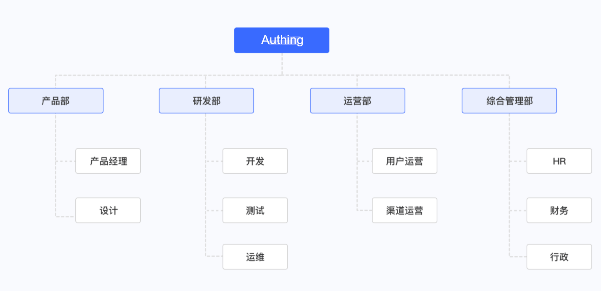

# 组织机构概览

<LastUpdated/>

::: hint-info
有关支持「组织机构」功能各项权益的 {{$localeConfig.brandName}} 用户池版本信息，请查看 [官网「价格」页](https://authing.cn/pricing)。如你的版本不支持此权益，且想试用，可开通体验期。有关体验期介绍及开通方式，请查看 [体验期](/guides/basics/trial/README.md)。
::: 

借助 {{$localeConfig.brandName}}, 可以快速 [实现基于角色的访问控制（RBAC）](/guides/access-control/rbac.md)。简单来说，RBAC 指的是通过用户的角色授权其相关权限，这相比直接授予用户权限，要更加灵活、高效、可扩展。 

而在现实生活中，组、角色往往是分层嵌套的，呈树状结构，最常见的就是组织机构，如公司、学校等等。

一个常见的的组织机构架构如下：

* 一级部门有产品部、研发部、运营部、综合管理部
* 一级部门下面又有二级部门，如产品部中包含产品经理和设计等。

上图是一个典型的树状结构，其中有且仅有一个根节点，一般而言，根节点就是一家公司、一个组织。每个节点对应一个分层的部门。

在 {{$localeConfig.brandName}}中, 你可以 [从企业微信、钉钉、LDAP、Active Directory 等第三方用户目录导入组织机构](./create-or-import-org/README.md), 我们还提供了 [控制台、SDK 两种管理组织机构的方式](./manage-org/README.md)，你可以很方便地[管理成员生命周期](./staff-life-cycle-management/README.md)，还可以 [使用 LDAP 协议对外开放组织机构数据](./ldap-user-directory/README.md)。
