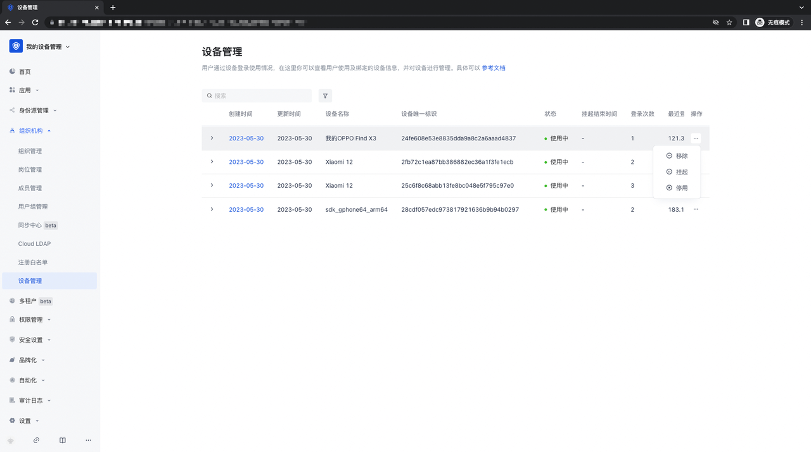
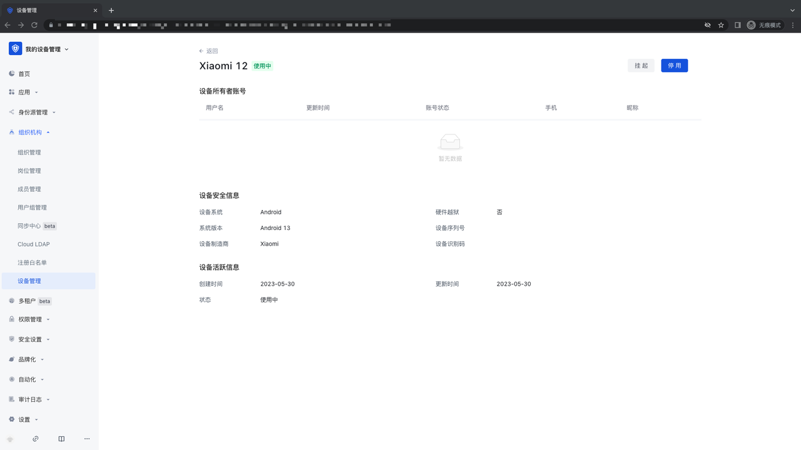
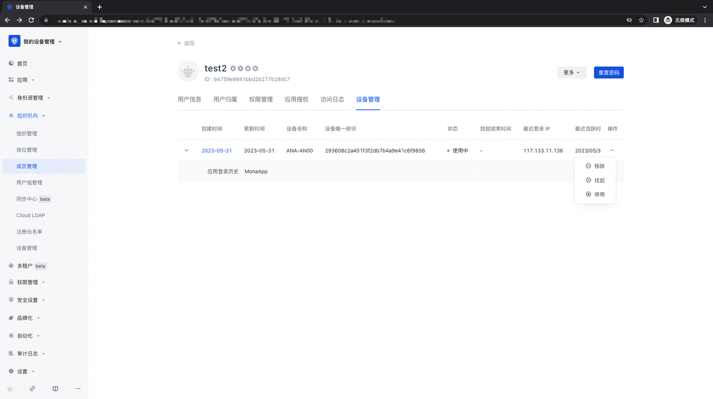
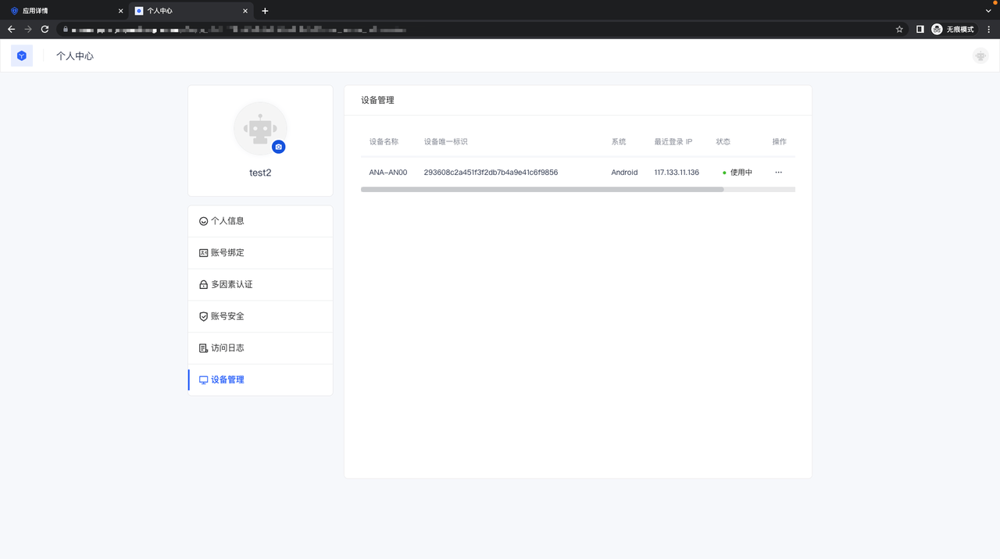
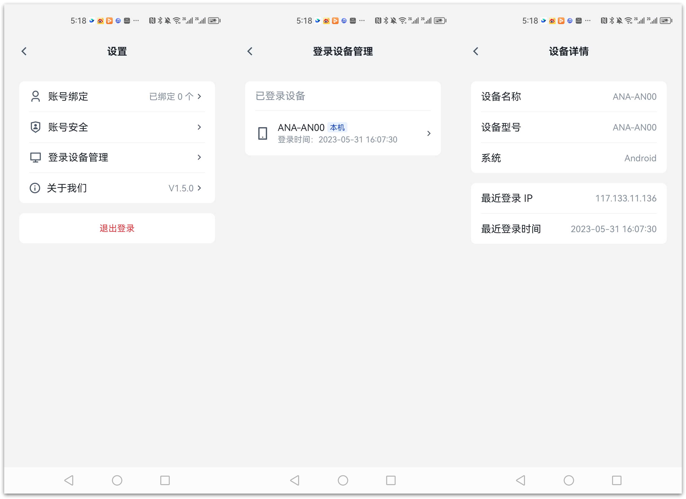
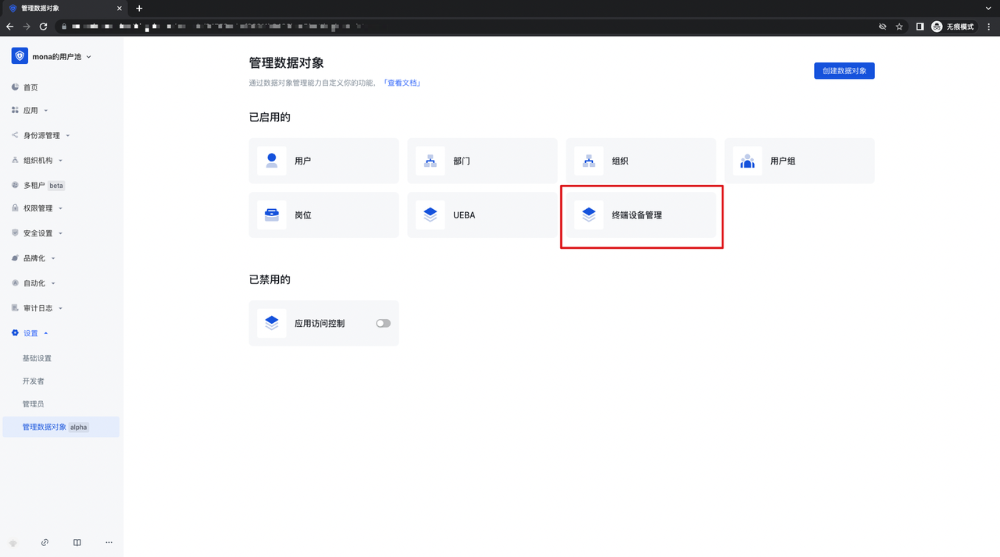
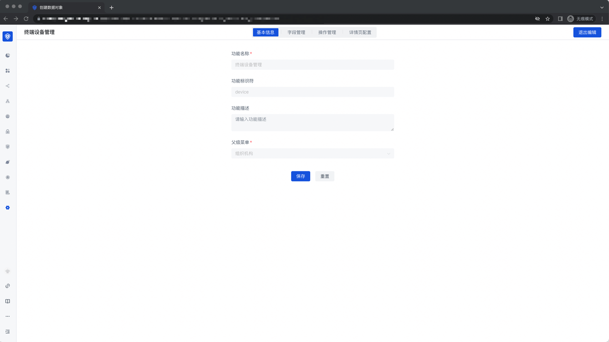
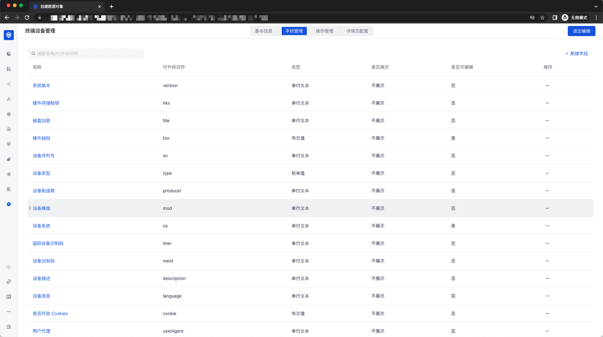
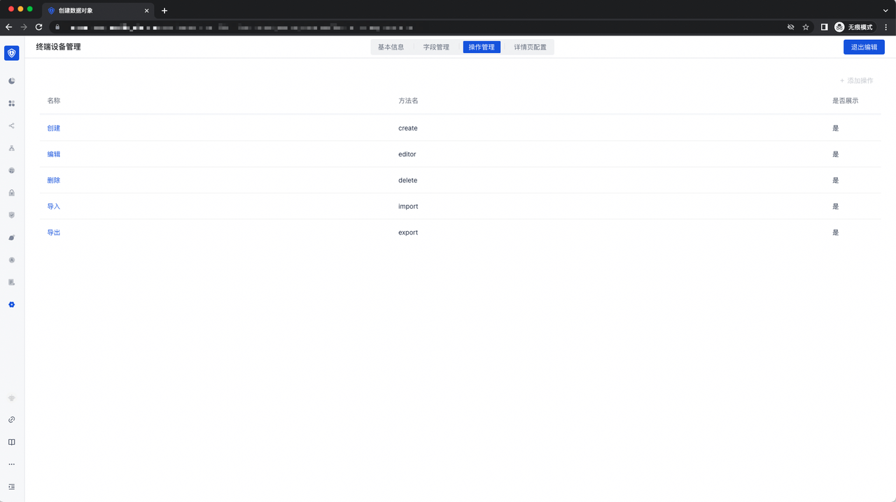
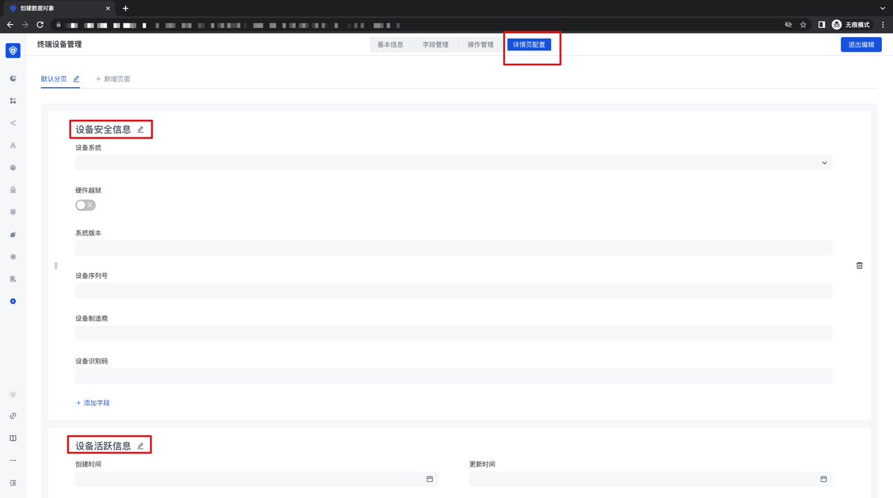

# 管理终端设备

<LastUpdated/>

### 设备管理
设备管理功能旨在管理登录用户池应用的所有网页端、移动端、 PC 端设备；通过登录用户池应用，终端设备主动上报该设备信息到用户池，通过对该设备的移除、挂起、停用等操作，来实现对设备的终极管理能力。

### 管理员侧设备管理
1. 点击「组织机构」-「设备管理」模块，进入设备列表，在这里可以看到所有的设备的基础及使用信息，并且可以对设备进行移除/挂起/停用。启用的操作；

2. 在设备管理列表，点击某一条设备信息，进入到该设备的信息详情页面，可以看到所有使用该设备的账号信息、设备的安全信息及活跃信息；

3. 点击「组织机构」-「成员管理」-「成员详情」页面，用户可以看到使用该账户登录的所有设备信息，并且可以进行移除、挂起、停用操作；

### 用户侧设备管理

1. Web 端应用个人中心：在 Web 端应用的个人中心，可以看到该用户下，所有登录了该应用的设备；

2. Authing 令牌移动端 App:  打开 Authing 令牌 APP， 输入用户池相应的移动端应用，并进行登录，登录后，可以在个人中心看到「设备管理」模块，点击进入后，可以对该账号在该应用下登录的设备进行管理操作：

### 通过「管理数据对象」对设备进行管理

1. 首先，在一个开启「管理数据对象」功能的用户池里，打开「设置」-「管理数据对象」页面，点击「终端设备管理」模块，进入终端设备管理模块：

2. 「终端设备管理」功能的基本信息里，展示定义好的功能名称、功能标识符、功能描述及父级菜单，且无法修改：

3. 字段管理 : 展示所有的和设备管理功能相关的字段，可以选择是否展示、是否可编辑：

4. 操作管理：展示的是针对设备管理的常规表单操作能力，包含 「创建」、「编辑」、「删除」、「导入」、「导出」的能力；

5. 详情页配置：展示了某个设备详情页面的配置，可以对详情页的 Tab 及相应的字段进行配置；

### 设备管理 API 调用

设备管理 API 调用，需要使用业务侧提供的 API，具体的 API 位置为：[管理终端设备 API](https://console.authing.cn/openapi/v3/management/#tag/%E7%AE%A1%E7%90%86%E7%BB%88%E7%AB%AF%E8%AE%BE%E5%A4%87/API%20%E5%88%97%E8%A1%A8)