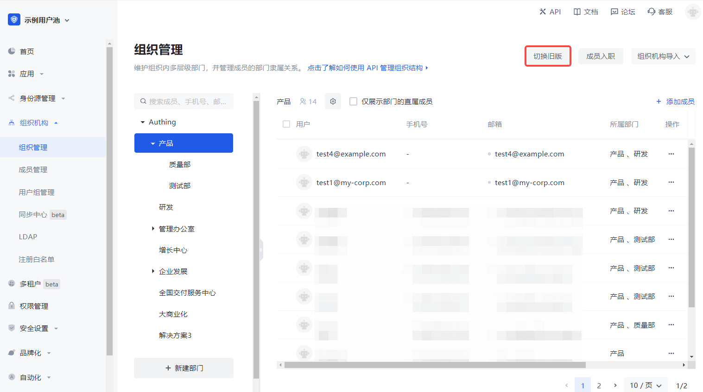

# 管理组织机构

<LastUpdated/>

组织机构的管理包含添加子部门、修改部门、删除子部门、移动子部门、获取子部门列表、添加成员、删除成员、获取成员列表等操作，Authing 支持控制台和 API & SDK 两种操作方式。

::: hint-info
* 对于 B2E 场景，在控制台左侧导航栏可以看到 **组织机构->组织管理** 菜单，在此可以管理组织架构及相应层级组织下的成员。对于 B2B 和 B2C 场景，可以在 **用户管理->组织机构** 中进行管理。
* 当前新旧版本组织机构功能并行，你可以根据需要选用。要切换新旧版本，可以在 **组织机构->组织管理** 页面点击页面右上角 **切换旧版 / 切换新版** 按钮。
::: 

## 添加子部门

<StackSelector snippet="add-node" selectLabel="选择方式" :order="['dashboard', 'java', 'javascript']"/>

## 修改部门

<StackSelector snippet="update-node" selectLabel="选择方式" :order="['dashboard', 'java', 'javascript']"/>

## 删除子部门

<StackSelector snippet="delete-node" selectLabel="选择方式" :order="['dashboard', 'java', 'javascript']"/>

## 移动子部门

<StackSelector snippet="move-node" selectLabel="选择方式" :order="['dashboard', 'java', 'javascript']"/>

## 获取子部门列表

<StackSelector snippet="list-children" selectLabel="选择方式" :order="['dashboard', 'java', 'javascript']"/>

## 添加成员

<StackSelector snippet="add-member" selectLabel="选择方式" :order="['dashboard', 'java', 'javascript']"/>

## 删除成员

<StackSelector snippet="remove-member" selectLabel="选择方式" :order="['dashboard', 'java', 'javascript']"/>

## 获取成员列表

<StackSelector snippet="list-members" selectLabel="选择方式" :order="['dashboard', 'java', 'javascript']"/>
