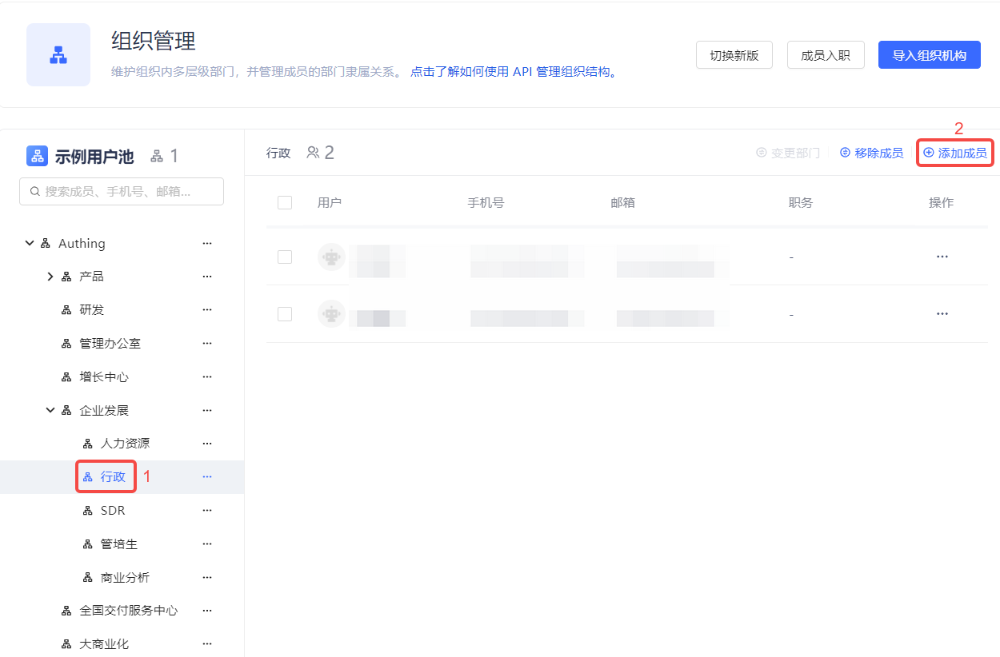
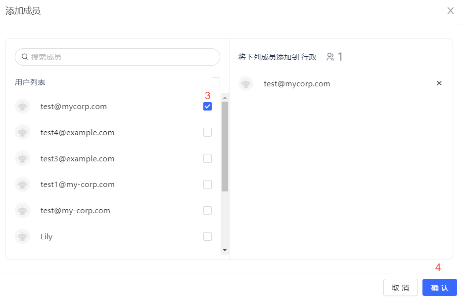
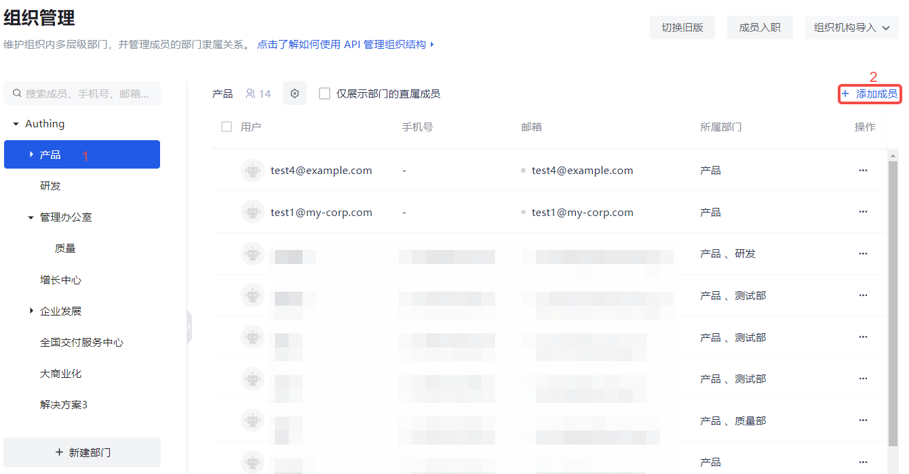
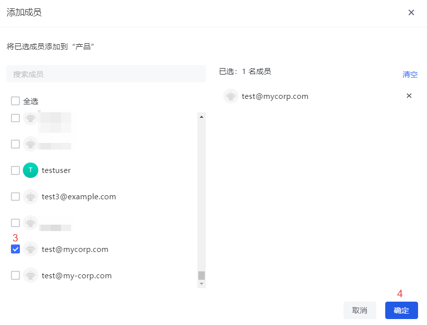

该功能旨在在当前组织 / 部门下增加新的成员。

::: hint-info
只能增加 **成员管理**（对于 B2B 和 B2C 场景是 **用户列表**）中现有成员。
:::

#### 旧版

要增加新成员，执行以下步骤：

1. 在左侧组织机构列表中选定组织 / 部门。

2. 点击用户列表上方 **添加成员** 按钮。

3. 在弹出窗口左侧 **用户列表** 中勾选目标用户（也可通过关键字搜索）。 所选用户自动添加到右侧列表中。

4. 点击 **确认** 按钮。

#### 新版

要增加新成员，执行以下步骤：

1. 在左侧组织机构列表中选定组织 / 部门。

2. 点击用户列表上方 **添加成员** 按钮。

3. 在弹出窗口左侧 **用户列表** 中勾选目标用户（也可通过关键字搜索）。 所选用户自动添加到右侧列表中。

4. 点击 **确定** 按钮。

