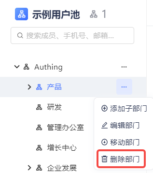
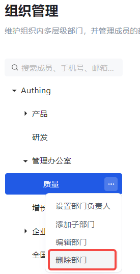

::: hint-info
* 需要注意的是，如果待删除部门下有子部门或者该部门 / 子部门下存在成员，不可直接删除部门，需要先清空所有成员，删除所有子部门。
* 清除成员时需要注意，仅可移除直属多个部门同时直属当前部门的成员。如果成员仅属于当前部门，不可移除；此时，只能通过办理离职将该成员从当前部门移除。
* 根节点不可删除。
::: 

选中需要删除的部门，点击 **删除部门** 按钮即可。

::: img-description
删除部门-旧版
:::

::: img-description
删除部门-新版
:::