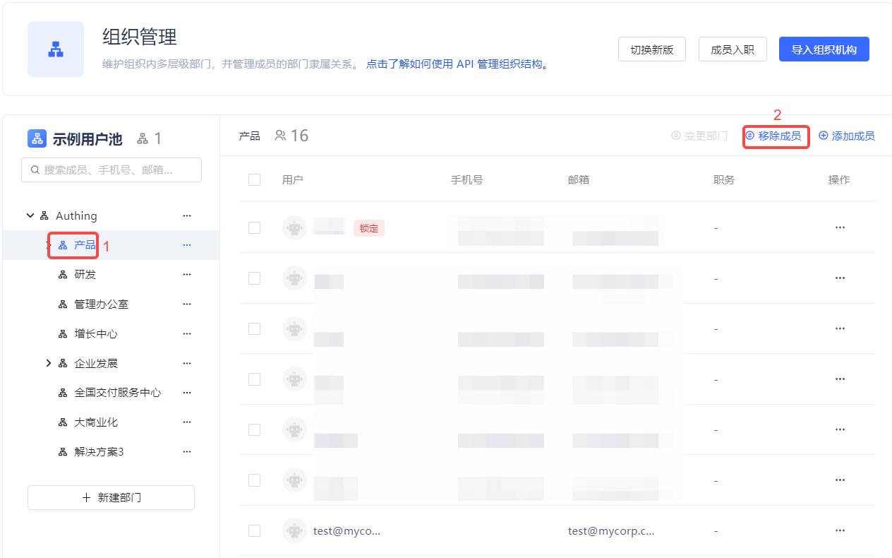
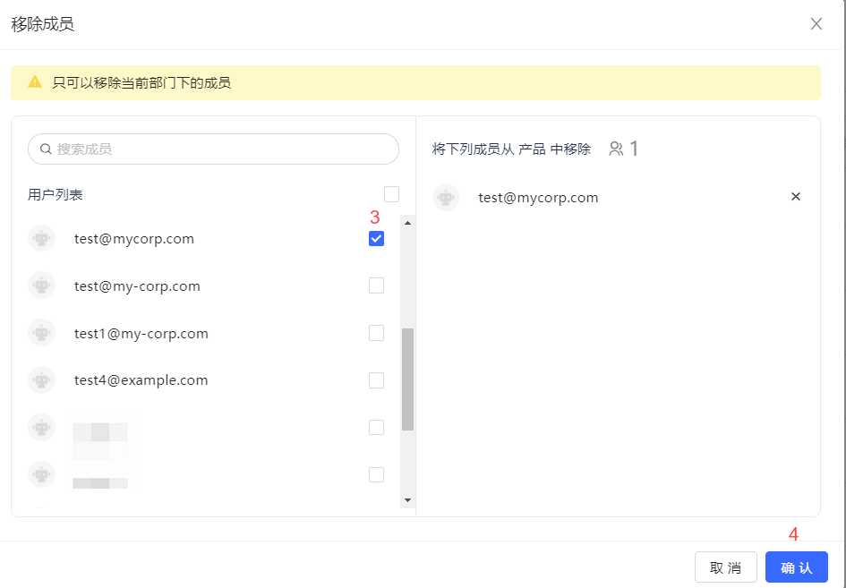
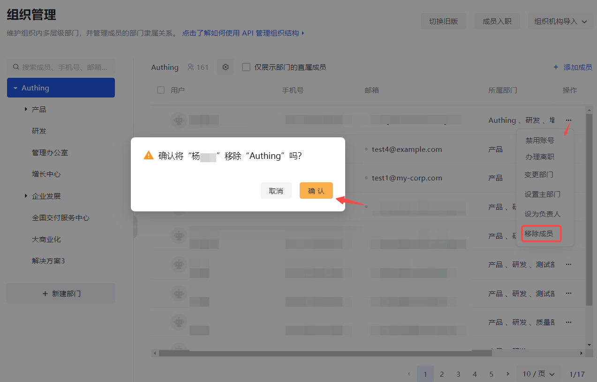

::: hint-info
* 仅可移除直属多个部门且直属当前部门的成员。如待移除成员仅属于一个部门，不可移除。

* 可通过先勾选用户，再点击 **移除成员** 进行批量移除。
:::

#### 旧版

若要将某成员从当前组织 / 部门下移除，执行以下步骤：

1. 在左侧组织机构列表中选定组织 / 部门。

2. 点击用户列表上方 **移除成员** 按钮。

3. 在 **移除成员** 弹窗勾选待移除成员（也可通过关键字搜索）。

4. 点击 **确认** 按钮。

#### 新版

若要将某成员从当前组织 / 部门中移除，执行以下步骤：

1. 在左侧组织机构列表中选定组织 / 部门。

2. 在右侧当前组织 / 部门的用户列表中点击相应成员所在行 **移除成员**。